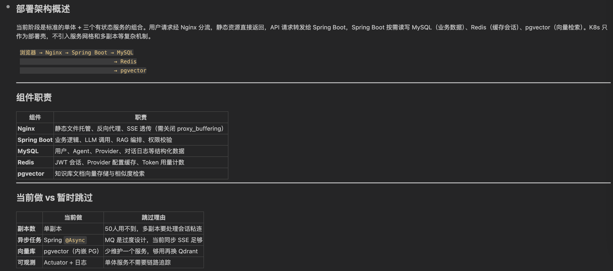
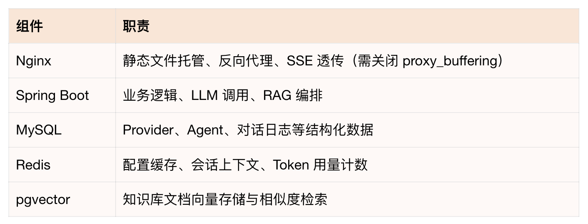
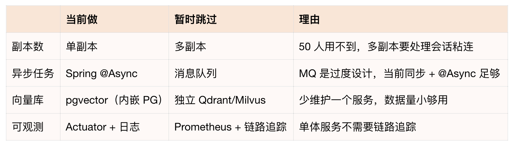
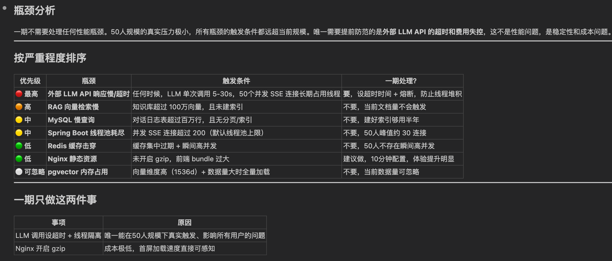
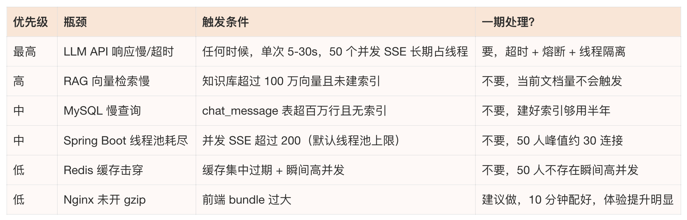
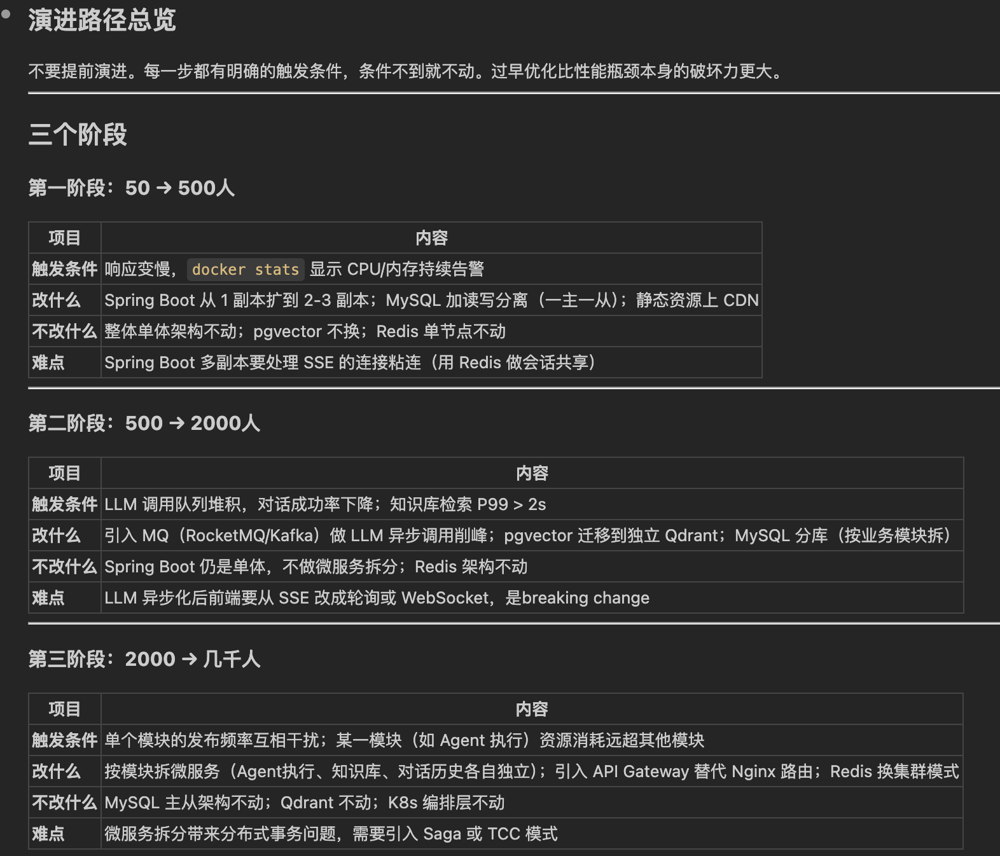
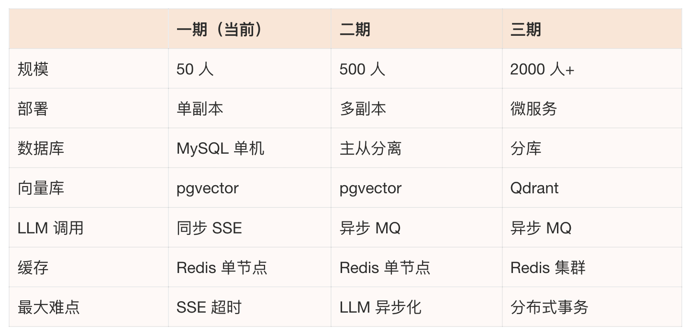
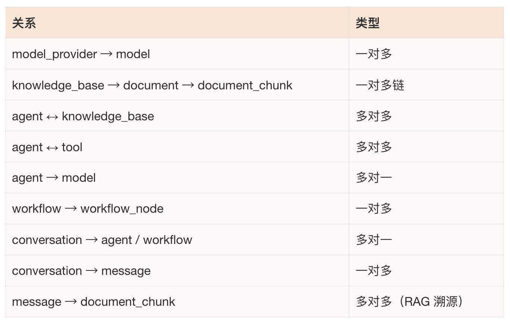
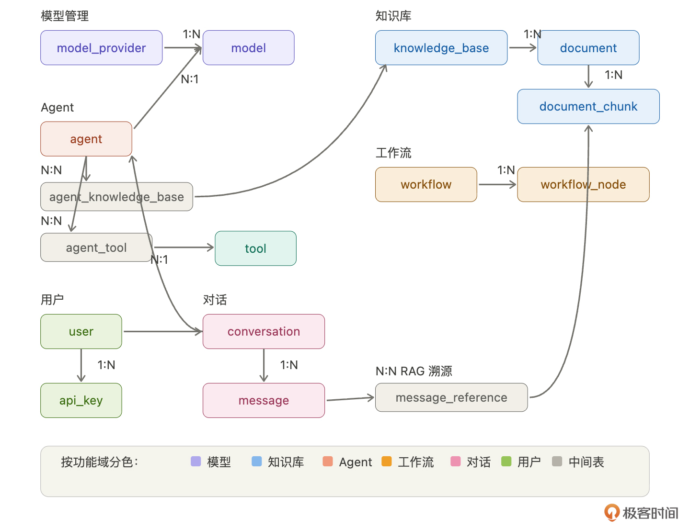

# 05｜架构设计（下）：部署架构、性能预判与数据设计
你好，我是Robert。

上一讲我们定了代码层面的架构，包括模块怎么分、代码怎么组织、外部调用怎么处理。这一讲进入系统层面：当前怎么部署、瓶颈在哪、未来怎么扩展、数据怎么存。

很多工程师觉得部署是上线前的事。但部署架构从第一天就在影响你的设计决策—— **缓存放哪、数据库怎么连、服务之间怎么通信，全都取决于你的部署形态。提前想清楚，后面不返工**。

## 当前部署架构：50 人规模

先把当前的部署全貌画出来。我让Claude Code帮我梳理：

> Hify是模块化单体，技术栈Spring Boot + Vue + MySQL + Redis + pgvector。目标50人内部使用，生产环境用Docker + K8s部署。帮我设计当前阶段的部署架构：有哪些组件、请求怎么流转、每个组件的职责是什么。

Claude Code给的架构总结很清晰:



Claude Code回答是标准的单体 + 三个有状态服务的组合。用户请求经Nginx分流，静态资源直接返回，API请求转发给Spring Boot，Spring Boot按需读写MySQL（业务数据）、Redis（缓存会话）、pgvector（向量检索）。K8s只作为部署壳，不引入服务网格和多副本等复杂机制。

请求流转链路：


各组件职责：



Claude Code还给了一个很有价值的对比——当前阶段该做什么、暂时跳过什么：



第二张表是我觉得Claude Code这次分析最有价值的部分——它不只告诉你“现在长什么样”，还帮你划了一条“现在做”和“以后做”的线。每个“暂时跳过”都有明确理由，不是偷懒，是一期确实不需要。等触发条件到了（用户量上来、数据量变大），再逐步加。

在这一步，Claude Code给了一个挺不错的架构，没什么大问题，基本就是我们要的。


但是其实还是需要你的积累和判断，因为这个部署架构较为简单，如果是更复杂的架构，就需要我们去调整，也就是需要积累。无脑让AI完全实现一个应用，我认为当前阶段还是达不到的。

这里扩展一个点： **我觉得以后程序员的价值在于思考、拆解、边界判断等架构层面的能力。说实话，这个要求比之前高多了。也就呼应了 [第 01 讲](https://time.geekbang.org/column/article/963290)，我们需要是一个架构师，不应该是一个写代码的程序员。**

## 性能瓶颈预判

大部分工程师不会提前想性能瓶颈，等出了问题再救。但你作为架构师，应该在设计阶段就知道瓶颈可能在哪。即使一期不处理，也要做到心里有数。

这一步特别适合让Claude Code帮你分析：

> 基于Hify当前的部署架构（Nginx + Spring Boot + MySQL + Redis + pgvector + 外部LLM API），帮我分析：这个系统的性能瓶颈可能在哪？按严重程度排序，每个瓶颈给出触发条件和一期是否需要处理。

Claude Code 的输出如下：



Claude Code的结论很直接： **一期不需要处理任何性能瓶颈。50 人规模的真实压力极小，所有瓶颈的触发条件都远超当前规模**。 **唯一需要提前防范的是外部 LLM API 的超时和费用失控**——这不是性能问题，是稳定性和成本问题。

它按严重程度排了序：



看这张表你会发现，真正在50人规模下能触发的只有第一行——LLM调用慢且占线程。其他瓶颈的触发条件都是百万级数据或几百人并发，离我们很远。

所以一期只做两件事：

1. **LLM 调用设超时 + 线程隔离 + 熔断**。这是唯一能在50人规模下真实触发、影响所有用户的问题。 [第 04 讲](https://time.geekbang.org/column/article/964066) 已经设计好了方案（独立线程池、Resilience4j、超时控制），后面实现时落地就行。

2. **Nginx 开启 gzip**。成本极低（一行配置），首屏加载速度直接可感知。


其他瓶颈全部标记“已知但暂不处理”。不是忽略，是时机未到。等触发条件到了（数据量上来、用户量上来），你第一时间知道该动哪里——因为这张表就是你的地图。

**这一节的价值不在于解决了什么问题，在于你脑子里有了一张系统“软肋”地图。后面出了性能问题，你不用猜，查表就行。** 而这张表不需要你自己从零分析，给Claude Code你的架构图，它几分钟就能帮你画出来。

## 扩展架构：几千人规模

一期50人，但如果Hify做得好，可能要推广到更大范围。架构上不能堵死这条路。但也不能提前演进，过早优化比性能瓶颈本身的破坏力更大。

我让Claude Code设计演进路径：

> 如果Hify要从50人扩展到几千人，当前架构需要怎么演进？帮我设计一个分阶段的扩展路径，每一步的触发条件是什么、改什么、不改什么。

Claude Code给了三个阶段：



如上图所示：每个阶段有明确的触发条件，条件不到就不动。我们来总结下：

- **第一阶段：50 → 500 人**

触发条件：响应变慢，docker stats显示 CPU / 内存持续告警。

改什么：Spring Boot从1副本扩到2-3副本；MySQL加读写分离（一主一从）；静态资源上CDN。

不改什么：整体单体架构不动，pgvector不换，Redis单节点不动。

难点：Spring Boot多副本要处理SSE的连接粘连——用户的流式对话不能被负载均衡随机分发到不同实例。解决方案是用Redis做会话共享。

- **第二阶段：500 → 2000 人**

触发条件：LLM调用队列堆积，对话成功率下降；知识库检索 P99 > 2s。

改什么：引入消息队列（RocketMQ/Kafka）做LLM异步调用削峰；pgvector迁移到独立Qdrant；MySQL按业务模块分库。

不改什么：Spring Boot仍是单体不做微服务拆分，Redis架构不动。

难点：LLM异步化后，前端要从SSE改成轮询或WebSocket，是breaking change。这个改动成本不低，所以不到触发条件不做。

- **第三阶段：2000 → 几千人**

触发条件：单个模块的发布频率互相干扰；某一模块（如Agent执行）资源消耗远超其他模块。

改什么：按模块拆微服务（Agent执行、知识库、对话历史各自独立）；引入API Gateway替代Nginx路由；Redis换集群模式。

不改什么：MySQL主从架构不动，Qdrant不动，K8s编排层不动。

难点：微服务拆分带来分布式事务问题，需要引入Saga或TCC模式。第04讲定的“跨模块走Service接口”在这里发挥作用——拆分时只改调用方式，接口签名不变。

三个阶段的对比总览：



我们用一张图来总结下：


这张表就是你的扩展路线图。现在不做任何一步，但每一步的触发条件、改什么、难点在哪，全部清楚。而且你应该注意到了，第04讲的每个设计决策都在为这条路径留口子： **模块化单体让第三阶段的微服务拆分成本可控，接口隔离让调用方式可以平滑切换，会话存Redis让第一阶段的多副本不需要改代码**。

架构设计的功力不在于现在做多复杂，在于现在做的每个决策都不堵未来的路。

## 数据模型概览

核心表有哪些、关系怎么样，先列出来。具体字段设计等后面每个模块开发时再定，现在定太细了后面一定会改。

> 基于Hify的功能范围（模型管理、Agent、对话、工作流、知识库、MCP工具），帮我梳理核心数据表和它们之间的关系。只要表名和关系，不展开字段。

Claude Code给了一份完整的梳理，我确认后定稿。按功能域分组：

- 模型管理：model\_provider（提供商）→ model（具体模型），一对多。一个OpenAI下有GPT-4o、GPT-3.5多个模型。

- 知识库：knowledge\_base → document → document\_chunk，一对多链。document\_chunk 是向量化的最小单位，存在pgvector里。

- 工具：tool，独立表，存MCP工具定义。

- Agent：agent是关联最多的表，agent → model（多对一，选一个模型），agent ↔ knowledge\_base（多对多，通过agent\_knowledge\_base），agent ↔ tool（多对多，通过agent\_tool）。

- 工作流：workflow → workflow\_node，一对多。workflow\_node里的LLM节点也关联 model。

- 对话：conversation → message，一对多。conversation关联agent或workflow（对话绑定的执行对象）。message → document\_chunk 多对多（通过message\_reference，做RAG溯源——回答引用了哪些知识库片段）。

- 用户：user和api\_key。user发起conversation，api\_key用于API发布调用。


关系汇总：



总共约16张表。看着多，但按功能域分组后每组就两三张，结构清晰。



说实话，Claude Code设计的这个表结构比我想的完整得多，比我设计的好，设计的快。AI很适合这种模板化的任务。

这里想说，你要学会的一个点是： **你要清晰地知道 AI 能干什么，干什么干的好，而你要做什么。我们跟 AI 不是敌人，不是竞争者，而是合作伙伴。我们要学会的是和它一起协作，释放我们自己最大的效率，从而给我们自己带来更大的现实收益。**

有一个设计决策值得说明：message\_reference这张表，它记录的是“这条AI回复引用了知识库的哪些片段”。很多人做RAG不存这个关系，回复完就丢掉了检索结果。但存下来有两个好处：一是用户可以看到“AI的回答依据是什么”，增加可信度；二是后续优化RAG效果时，可以回溯分析检索质量。一张中间表，成本很低，价值不小。

## 数据库性能规范

表结构后面再定，但数据库层面的规范现在就要定，后面Claude Code每次建表、写查询都要遵守。

> Hify用MySQL 8.x + pgvector。帮我定义数据库层面的性能规范，覆盖：索引设计原则、大表预判和应对策略、分页查询注意事项、通用字段约定。要求具体到AI建表时能直接执行。

Claude Code给了一份非常详细的规范，包含了具体的建表示例。我逐块确认后定稿。

### 通用字段约定

所有表必须包含四个公共字段：

```sql
id          BIGINT          NOT NULL AUTO_INCREMENT PRIMARY KEY,
created_at  DATETIME(3)     NOT NULL DEFAULT CURRENT_TIMESTAMP(3),
updated_at  DATETIME(3)     NOT NULL DEFAULT CURRENT_TIMESTAMP(3) ON UPDATE CURRENT_TIMESTAMP(3),
deleted     TINYINT(1)      NOT NULL DEFAULT 0

```

几条硬规矩：主键用自增BIGINT，禁止UUID（索引性能差）。禁止用NULL，业务空值用空字符串或0代替。金额和Token用量用BIGINT存最小精度，不用DECIMAL。枚举字段用VARCHAR(32)，不用MySQL ENUM类型（ENUM加值要改表结构）。你看，这是不是就是我们进入团队要学习的团队规范。

### 索引设计原则

Claude Code给了五条具体规则，每条带示例。

**第一，逻辑删除字段必须加进索引。** 几乎所有查询都带 `deleted = 0`，不加进索引等于索引白建。

```sql
-- ✅ 正确
INDEX idx_agent_user (user_id, deleted)
-- ❌ 不够
INDEX idx_agent_user (user_id)

```

**第二，组合索引等值列在前，范围列在后。** 这是MySQL索引的基本原则，但不提醒Claude Code，它自己写查询时经常不遵守。

```sql
INDEX idx_message_conv_time (conversation_id, created_at)

```

**第三，多对多关联表两个方向都要索引。** agent\_tool表按agent\_id查和按tool\_id查都是高频操作，只建一个方向的索引，另一个方向就全表扫描。

```sql
PRIMARY KEY (agent_id, knowledge_base_id),
INDEX idx_kb_agent (knowledge_base_id)    -- 反向查询索引

```

**第四，唯一约束用UNIQUE INDEX，不要只在代码层校验。** 并发场景下代码校验有竞态问题，数据库约束才是最后防线。

**第五，禁止在大文本字段建索引。** content、prompt这类TEXT字段不能建索引，需要全文搜索的场景后续引入ES。

### 大表预判

Hify中增长最快的两张表：

**message 表**：每次对话产生2-N条记录，50人每天几百到上千条。

应对：建好时间范围索引（conversation\_id + created\_at），预留按时间归档的能力。一期建好索引够用半年。

**document\_chunk 表**：知识库分块数据，100篇文档可能产生5000+行。

应对：向量数据存pgvector，MySQL只存元数据和vector\_id（指向pgvector的记录），不在MySQL里存向量本身。

其他表（provider、agent、workflow）都是配置数据，增长慢，不需要特别关注。

### 分页查询规范

```sql
-- ❌ 禁止 OFFSET 深分页，百万行时极慢
SELECT * FROM message ORDER BY id DESC LIMIT 20 OFFSET 100000;

-- ✅ 用游标分页
SELECT * FROM message
WHERE conversation_id = ?
  AND id &lt; #{lastId}
  AND deleted = 0
ORDER BY id DESC
LIMIT 20;

```

一期数据量小，OFFSET够用。但规范先定好，Claude Code知道用游标分页，后面数据量上来了不用改代码。管理后台必须用OFFSET的场景，限制最大页数（超过10000条直接提示缩小查询范围）。

还有一条：COUNT查询单独处理，列表页只在第一页返回total，翻页不重复查。这个细节Claude Code不说你很容易忽略，但它对大表的查询性能影响很大。

### pgvector 规范

向量数据单独存PostgreSQL，和MySQL业务数据分离：

```sql
CREATE TABLE vector_chunk (
    id          BIGSERIAL PRIMARY KEY,
    chunk_id    BIGINT       NOT NULL,    -- 对应 MySQL document_chunk.id
    embedding   vector(1536) NOT NULL,
    created_at  TIMESTAMPTZ  NOT NULL DEFAULT NOW()
);

-- 必须建 HNSW 索引，否则全表扫描
CREATE INDEX idx_embedding_hnsw
ON vector_chunk
USING hnsw (embedding vector_cosine_ops)
WITH (m = 16, ef_construction = 64);

```

两条硬规矩：必须建HNSW索引（一期数据量小感知不到差异，但数据量上来后，没索引检索会从毫秒级变成秒级）。检索时必须加LIMIT，禁止不加LIMIT的向量查询（全量排序会拖垮数据库）。

这些规范看起来是数据库基础知识，但你不写进CLAUDE.md，Claude Code建表时就不会自动加deleted进索引、不会考虑分页性能、不会预判大表问题、不会给pgvector建HNSW索引。写了，后面每一次建表、每一次写查询都自动遵守。

如果有心，你可以从上面的这个问题以及它的答案中，知道设计数据库表应该注意什么。我觉得这就是我们这节课的价值。 **问了问题，辨别答案，学习答案**——这才是把AI融入工作的核心思路。

## 写进 CLAUDE.md

这一讲的所有决策写进 CLAUDE.md：

```plaintext
### 部署架构
生产环境：Docker + K8s
- 前端：Nginx 托管静态文件 + API 反向代理（proxy_buffering off）
- 后端：Spring Boot，K8s Deployment（一期单副本）
- 数据库：MySQL 8.x（外部服务）
- 缓存：Redis 7.x（外部服务）
- 向量库：PostgreSQL + pgvector（外部服务）
- 本地开发：java -jar + npm run dev，start.sh 一键启动

### 缓存策略
- Provider/Agent 配置：Redis Cache-Aside，TTL 30min
- 对话上下文：Redis，TTL 2h
- 对话消息、知识库文档：不缓存，走数据库
- LLM 响应：不缓存

### 数据库规范
通用字段：
- 主键 id BIGINT 自增，禁止 UUID
- 时间字段 created_at / updated_at，DATETIME(3)
- 逻辑删除 deleted TINYINT(1)
- 禁止 NULL，空值用空字符串或 0
- 枚举用 VARCHAR(32)，不用 MySQL ENUM

索引规则：
- 命名 idx_{表名}_{字段名}
- 逻辑删除字段必须加进组合索引
- 组合索引等值列在前，范围列在后
- 多对多关联表两个方向都要索引
- 唯一约束用 UNIQUE INDEX，不只在代码层校验
- 禁止在 TEXT/BLOB 字段建索引
- 不建数据库级外键约束，应用层维护

分页规则：
- 默认用游标分页（WHERE id &lt; lastId ORDER BY id DESC LIMIT N）
- OFFSET 分页限制最大 10000 条
- COUNT 只在第一页查，翻页不重复查

大表预判：
- message：增长最快，必须建 (conversation_id, created_at) 索引
- document_chunk：MySQL 只存元数据，向量存 pgvector

pgvector 规范：
- 向量表建在 PostgreSQL，维度固定 1536
- 必须建 HNSW 索引
- 检索必须加 LIMIT，禁止全量排序

### 扩展路径
一期单副本 → 多副本 + 主从分离（500人）
→ MQ 异步 + Qdrant（2000人）→ 微服务拆分 + Redis 集群（几千人）
触发条件驱动，条件不到不动。

```

到这里，CLAUDE.md包含了项目概述（第03讲）、应用架构与代码组织（第04讲）、部署架构与数据库规范（本讲）。Claude Code对Hify从代码怎么写到系统怎么跑都有了完整的认知。

## 总结

这一讲做了四件事：设计了当前部署架构，预判了性能瓶颈，规划了扩展路径，定义了数据模型和数据库规范。

最有价值的是 **性能瓶颈预判**。大部分工程师不会提前想这个，觉得一期先跑起来再说。但你作为架构师，脑子里要有一张地图：瓶颈在哪、什么时候会触发、到时候改什么。有了这张地图，你对系统的掌控力完全不一样。而且这张地图不需要你自己从零画，让Claude Code基于你的架构分析，你判断它说得对不对就行。

另一个值得强调的点是 **数据库规范**。这些内容（索引原则、分页注意事项、大表预判）对有经验的工程师来说是常识，但对Claude Code来说不是。你不写，它不会自动遵守。这些规范现在花10分钟定好，后面每一次建表、每一次写查询都受益。

上一讲解决了代码怎么组织，这一讲解决了系统怎么跑。两讲合起来就是Hify的完整架构设计——从模块划分到部署形态到扩展路径到数据规范，一条线拉通。下一讲我们将进入规范体系搭建，手把手带你写完整的CLAUDE.md，把前面所有决策结构化地沉淀下来。

## 思考题

让Claude Code帮你分析你当前项目的性能瓶颈。把你的部署架构描述给它，用了什么数据库、什么缓存、多大用户量、主要压力在哪，然后问“这个架构的性能瓶颈可能在哪”，看看它指出的问题里有没有你之前没想到的。最后记得把它的分析和你的判断写在留言区。

期待你的分享。如果今天的课程让你有所收获，也欢迎转发给有需要的朋友，邀请他来一起学习，我们下节课再见！