# 08｜工程初始化（上）：后端骨架与公共基础设施
你好，我是Robert。

从这节课开始，我们正式进入工程部分。先来展示下Hify的本地工作界面吧，让你知道我们即将完成的软件系统是什么样子的。

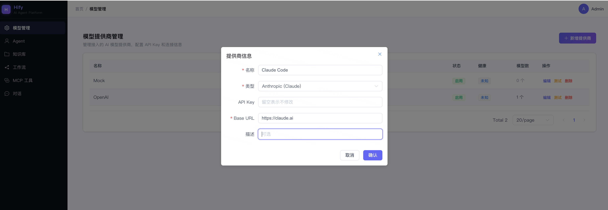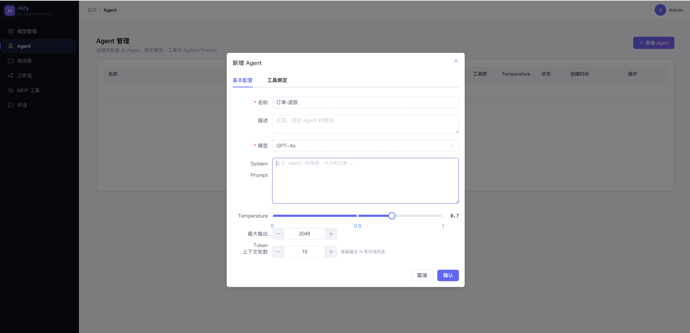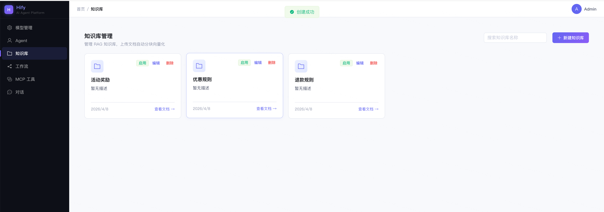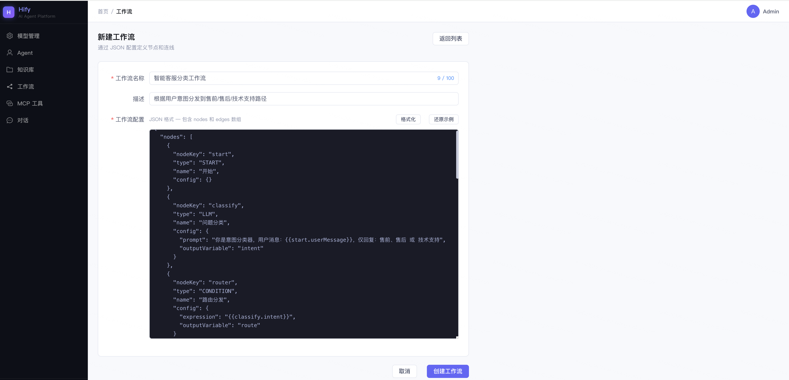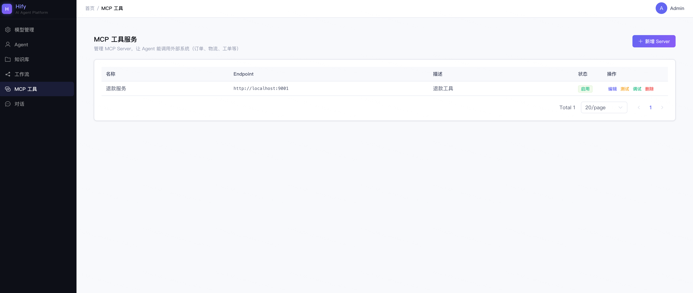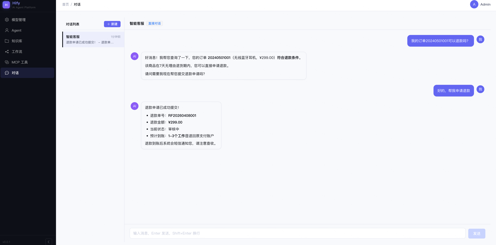

好，看完了效果，我们开始今天的课程内容。先回顾一下，04讲我们定了模块化单体、Maven 9个模块的应用架构，05讲定了单机部署、线程池隔离、熔断策略的运行架构，06讲把这一切写进了CLAUDE.md。蓝图画完了，现在按图施工。

这一讲要做的事： **让 Claude Code 搭建 Hify 后端的工程骨架**。Maven多模块结构、公共基础设施（统一响应、全局异常处理、MyBatis-Plus配置、Redis配置）、业务模块的空壳，全部就位。搭完之后， `java -jar` 能跑起来，访问健康检查接口返回200。

前端工程和启动脚本放到下一讲。这一讲先把后端的地基打扎实。

## 先想清楚怎么拆

你可能会想：工程初始化不就是模板性工作吗？把CLAUDE.md喂给Claude Code，说一句“帮我初始化Hify后端项目”不就完了？

我试过，效果不好。

Claude Code一次性生成了几十个文件，看起来很完整。但仔细一看：父pom里的模块声明和实际目录不一致，hify-common的依赖被写进了hify-chat的pom里，MyBatis-Plus的版本和Spring Boot的版本有冲突，全局异常处理器和Result类用了两种不同的错误码格式。

问题不在Claude Code能力不够，是一次性生成的东西太多了，它没法保证所有细节都自洽。几十个文件之间有大量的依赖和关联，一个地方错了会连锁影响其他地方。而且生成量太大，你review起来也吃力，容易漏掉问题。

当然随着模型能力越来越强，这个问题也会慢慢解决甚至不存在。但是即使有那一天，我也是希望你能把后面的内容看完。 **因为我们要做的是一个可持续迭代的系统，而不是挑战 Claude Code 的能力**。我希望你学到是“道”而不只是“术”。

所以第一个方法论在这里出场： **面对体量大的任务，要拆**。

怎么判断该不该拆？两个标准：

1. 标准一：生成的代码量是否超出你一次能review的范围。十几行代码，肉眼扫一遍就行，不用拆。几十个文件、几百行配置，一次看不过来，必须拆。

2. 标准二：步骤之间是否有依赖关系。如果第二步依赖第一步的结果（比如业务模块的pom依赖公共模块的pom），那就应该先完成第一步、验证正确，再做第二步。否则第一步错了，第二步会错得更离谱。


工程初始化两个条件都满足。所以我把它拆成四步：

1. Maven多模块骨架（父pom + 子模块pom + 目录结构）
2. hify-common公共基础设施（Result、BizException、全局异常处理、配置类）
3. 业务模块空壳（每个模块的package结构和启动验证）
4. 验收，启动项目，确认一切正常

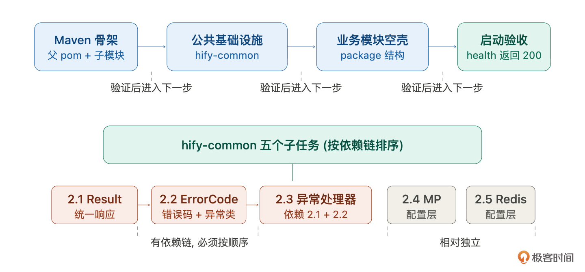

为什么是这个顺序？依赖关系决定了顺序。Maven骨架是所有东西的容器，必须先有。hify-common被所有业务模块依赖，排第二。业务模块依赖common，排第三。最后验收确认整体能跑。

**先地基，后框架，最后验收。这个顺序不只适用于工程初始化，后面做任何模块都是这个思路**。

## 分步搭建

### 第一步：Maven多模块骨架

目标很明确：创建父pom和所有子模块的pom，把目录结构搭出来，依赖关系配对。

给Claude Code的指令思路：

> 按照CLAUDE.md中的项目结构和技术栈，创建Hify的Maven多模块工程骨架。父pom声明所有子模块，统一管理Spring Boot、MyBatis-Plus、Redis等版本号。子模块之间的依赖关系按CLAUDE.md中定义的架构来。只创建pom和目录结构，不需要写Java代码。

注意最后一句，“只创建pom和目录结构，不需要写Java代码”。这是控制范围的关键。不说这句，Claude Code会顺手给你生成Application类、配置文件、甚至示例代码，和后面步骤冲突。

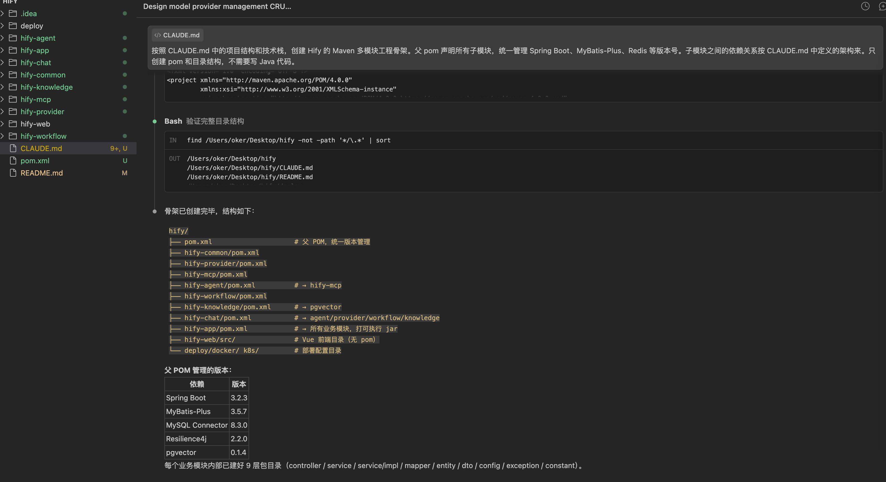

拿到输出后，重点检查三件事：

1. 模块声明和目录结构是否一致。父pom里声明的 `&lt;modules>` 列表和实际创建的目录要完全对应，一个不多一个不少。

2. 依赖关系是否正确。hify-chat的pom里应该有对hify-agent和hify-provider的依赖，hify-agent的pom里应该有对hify-mcp的依赖。交叉检查，不要有多余的依赖，也不要有遗漏。

3. 版本管理是否统一。Spring Boot、MyBatis-Plus、Redis的版本号应该只出现在父pom的 `&lt;dependencyManagement>` 里，子模块不重复声明版本。


这些都没问题，第一步完成。有问题让Claude Code改，不要手动改，让它按规范输出。

### 第二步：hify-common 公共基础设施

这一步是重中之重。hify-common里的东西会被所有业务模块依赖——Result类、异常处理、MyBatis-Plus配置。这里出了问题，后面每个模块都会跟着错。

我把这一步进一步拆成五个小任务。前三个有依赖链（异常处理器依赖Result和BizException），后两个相对独立。顺序还是按依赖关系排。

**任务一：统一响应 Result 和分页 PageResult**

Cluade 的指令是：

> 在hify-common中创建统一响应类。按照CLAUDE.md接口规范：Result&lt;T> 包含 code、message、data三个字段，提供ok()和fail()静态方法。PageResult&lt;T>继承Result，额外包含total、page、size。

输出是：

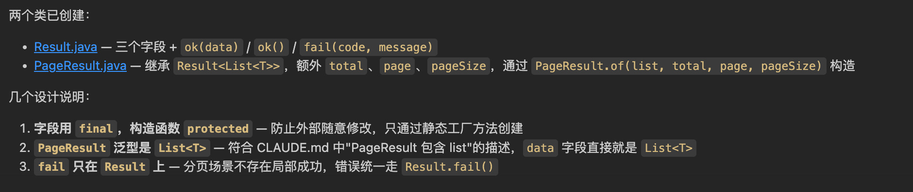

这个任务简单、边界清晰，Claude Code基本不会出错。

**任务二：错误码枚举和业务异常**

Cluade的指令是：

> 在hify-common中创建错误码枚举ErrorCode和业务异常类BizException。ErrorCode包含code和message，覆盖通用错误（参数错误、未授权、系统内部错误等）。BizException持有ErrorCode，支持自定义message覆盖。

输出是：

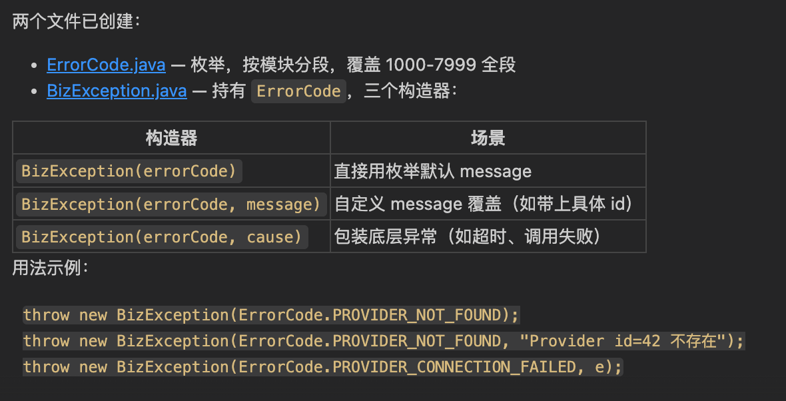

**任务三：全局异常处理器**

Cluade 的指令是：

> 在hify-common中创建全局异常处理器GlobalExceptionHandler，使用@RestControllerAdvice。捕获BizException返回对应错误码，捕获MethodArgumentNotValidException返回参数校验错误，兜底捕获Exception返回系统内部错误。所有异常响应必须使用Result.fail()和ErrorCode枚举。

输出是：

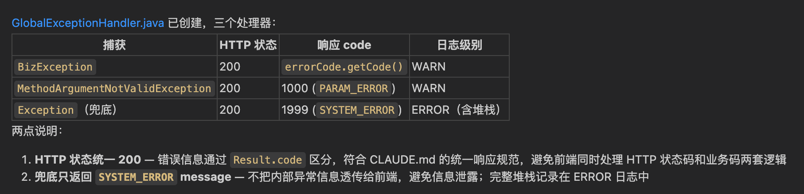

这个任务值得多说一点。我第一次让Claude Code生成这个处理器的时候，它在兜底的Exception处理里硬编码了 `code: 500, message: "系统繁忙"`，没有用ErrorCode枚举。功能上没问题，但违反了CLAUDE.md里定义的规范——所有错误响应必须走ErrorCode。

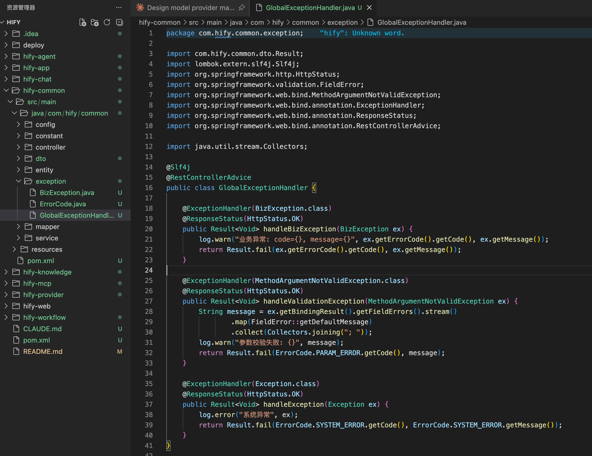

这就是 SDD 闭环在起作用的时刻。我让它改成 `Result.fail(ErrorCode.INTERNAL_ERROR)`，然后在CLAUDE.md的行为指令里补了一条：“异常处理必须使用ErrorCode枚举，禁止硬编码错误码和错误信息。” 下次再让它写类似代码，这个问题就不会重复出现。

**每次 AI 跑偏，不只是改掉当前的错，更要把规范补上，堵住同类问题的口子**。这就是SDD闭环的日常运转——定规范、AI执行、发现偏差、迭代规范。不是什么宏大的流程，就是写代码过程中随手做的事。

**任务四：MyBatis-Plus 配置**

Cluade 的指令是：

> 在hify-common中创建MyBatis-Plus配置类。包含：分页插件、自动填充（createTime、updateTime）、逻辑删除配置。

输出是：

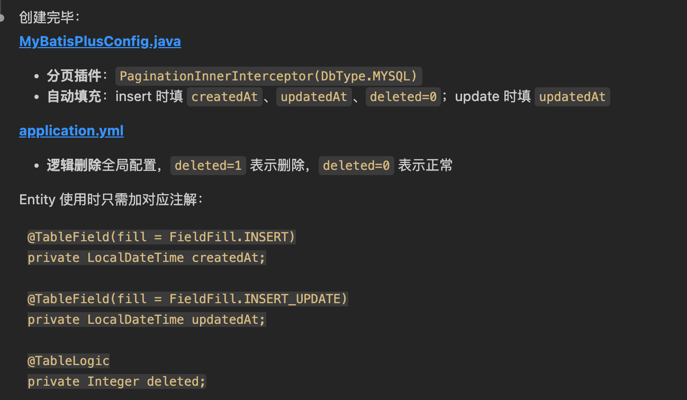

这里只做配置层面的基础搭建。具体的业务封装——BaseEntity基类、分页查询工具类——在基础组件篇展开。这里想说一下，Claude生成这种模板代码非常快，基本不会出错，因为这些代码是非常标准的。

**任务五：Redis 配置**

Cluade的指令是：

> 在hify-common中创建Redis配置类。包含：RedisTemplate序列化配置（key用String，value用JSON）、基础的RedisUtil工具类（get/set/delete/expire）。

输出是：

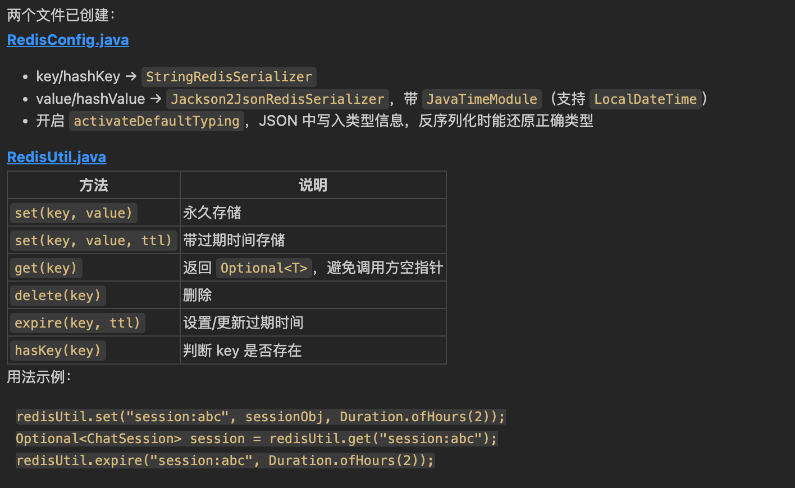

同样，这里只做配置。Cache-Aside模式的业务封装在基础组件篇再做。

你可能注意到了，我把hify-common拆成了五个小任务，而不是一条指令“帮我把hify-common全部搭好”。原因和前面讲的一样：拆开做， **每个任务的上下文更小、更聚焦，Claude Code的输出质量更高。** 而且出了问题容易定位，混在一起生成，一个地方有问题可能要在几百行代码里找。

### 第三步：业务模块空壳

前两步搞定后，后端的地基就打好了。现在给每个业务模块创建基础的package结构。

> 为hify-provider、hify-agent、hify-chat、hify-mcp等业务模块创建标准的package结构。按照CLAUDE.md代码组织规范，每个模块包含controller/service/service-impl/mapper/entity/dto/config目录。每个模块只创建package和一个空的占位类，不需要写业务代码。

这一步生成的东西很简单，review也快——检查package路径对不对、各模块结构是否一致就行。

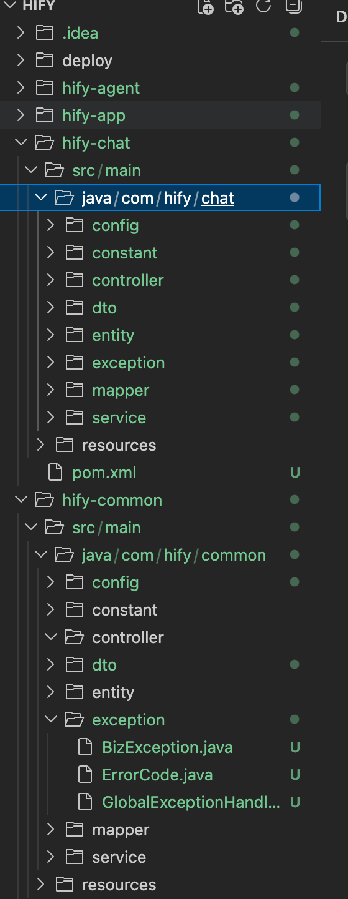

然后在hify-app模块里创建Spring Boot启动类和application.yml：

> 在hify-app中创建Spring Boot启动类HifyApplication，以及application.yml配置文件。配置项包括：数据库连接、Redis连接、MyBatis-Plus配置、服务端口8080。

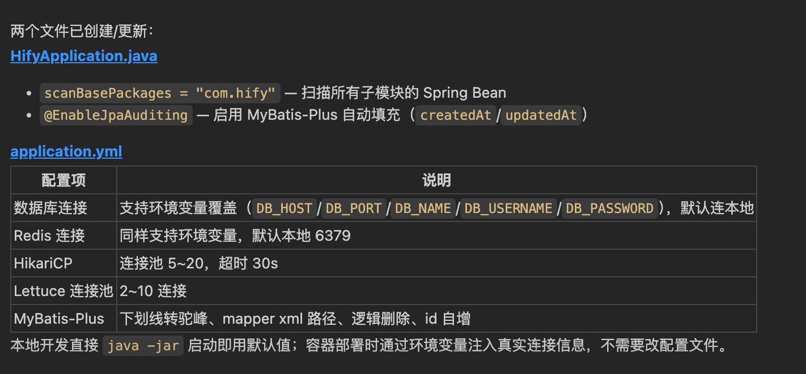

### 第四步：验收

后端骨架应该搭好了。启动验证一下。

先确保MySQL和Redis在本地跑着（如果本地没有，用Docker临时起一个，这不是项目的Docker化，只是本地开发环境）。

```bash
cd hify
mvn clean install -DskipTests
cd hify-app
mvn spring-boot:run

```

然后，我mvn clean install就报错了：

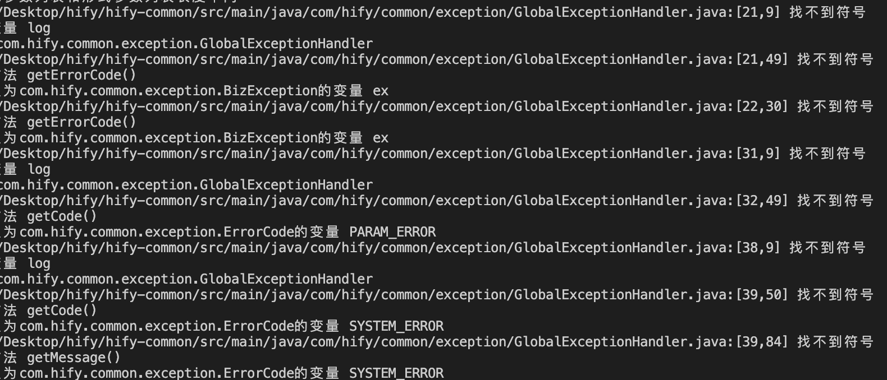

然后我继续输入：

> mvn clean install -DskipTests 失败了，修复下

输出是：

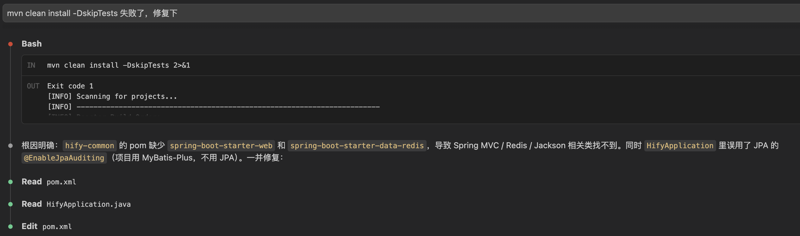

然后修复这个问题又失败了。

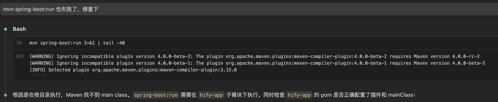

那就继续让Claude Code继续修复。这个过程重复，就可以得到一个可以启动的应用了。

这里一直起不来，后来Claude Code发现前面给的启动命令错了（哈哈），应该是下面这个命令：

```plaintext
mvn spring-boot:run -pl hify-app

```

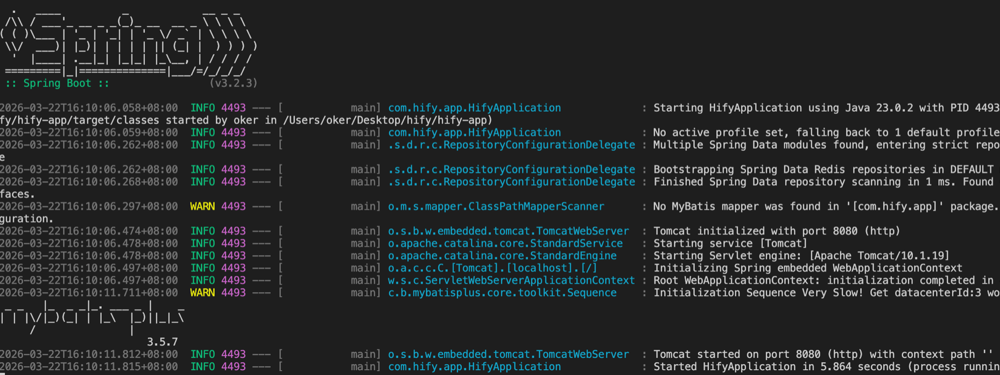

Spring Boot启动日志的最后一行应该显示 `Started HifyApplication in X seconds`。

为了有一个可验证的端点，让Claude Code加一个健康检查接口：

在hify-app中创建HealthController，路径 GET /api/v1/health，返回 Result.ok(“Hify is running”)。

启动后访问 `http://localhost:8080/api/v1/health`，应该可以看到：

```json
{
  "code": 200,
  "message": "success",
  "data": "Hify is running"
}

```

看到这个返回，说明后端骨架搭建成功。Maven多模块结构正常、依赖关系正确、公共模块的Result和全局异常处理在工作、Spring Boot配置没问题。

但是输出却是：

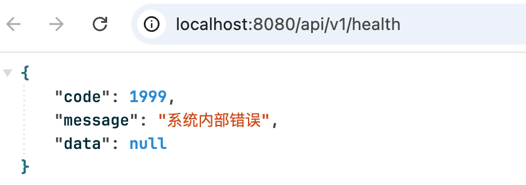

接下来就交给你了。

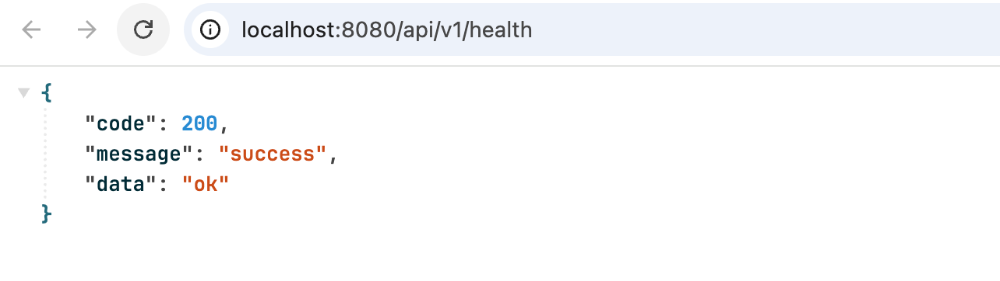

## 大批量代码怎么 review

这一讲Claude Code生成了不少代码，几十个文件、几百行配置和基础代码。逐行看不现实，也没必要。关键是按优先级看。

1. 第一优先级：结构性问题。模块依赖关系对不对？pom里的依赖声明和CLAUDE.md里定义的架构一致吗？package路径对不对？这些如果错了，后面所有东西都建在错误的地基上。

2. 第二优先级：公共模块的核心代码。Result类的字段和方法对不对？全局异常处理器的捕获优先级对不对？MyBatis-Plus的自动填充逻辑对不对？这些代码所有业务模块都会依赖，错了影响范围最大。

3. 第三优先级：配置文件。application.yml里的配置项对不对？有没有遗漏？有没有硬编码不该硬编码的东西？影响范围相对小，后面随时可以调整。

4. 最后才看：业务模块空壳。只是package结构和占位类，几乎没什么可出错的，扫一眼确认结构一致就行。


这个优先级背后的逻辑很简单： **影响范围越大的问题越先查**。结构错了全盘皆输，公共模块错了所有业务模块跟着错，配置错了这个服务有问题，空壳错了只影响一个文件。把review时间花在影响范围最大的地方。

这个思路不只适用于工程初始化。后面每一讲Claude Code生成大量代码时，都可以用同样的方式。先找影响范围最大的问题，再逐步往下。

## 总结

这一讲做了两件事：用Claude Code搭建了Hify的后端骨架，以及总结了3个后面会反复使用的方法论。

**任务拆解标准**。生成量是否超出一次review的范围？步骤之间是否有依赖关系？满足其一就拆。拆的顺序按依赖关系来，先地基后框架。

**影响范围 review**。大批量代码不需要逐行看。按影响范围排优先级——结构 > 公共模块 > 配置 > 空壳，时间花在影响范围最大的地方。

**每步验收**。不是搭完全部才验收，而是每一步做完就验证。Maven骨架搭好了 `mvn install` 能通过吗？公共模块写好了编译没问题吗？全部搭完 `spring-boot:run` 能启动吗？每一步的验收给你信心：“到这里为止是对的。”不验证就往前冲，错误会累积，到最后都不知道问题出在哪一步。

到了这里我们依然 **0 代码**，就完成了一个Web Service的初始化。中间基本没遇到问题，很顺。一方面有模型厉害的原因，一方面是我们前面基础搭建的好，一方面是我们把一个大任务拆解为多个小任务了。在后面的课程，你会越来越感受到这个模式的优势。

你可以思考下，如果我们自己来做这些事情，是不是至少要一天。而有了AI辅助后，可以又快又好的实现。节省下来的时间，就可以用来做其他事情，这就是生产力的提升。

后端能跑了。下一讲补前端Vue工程、写启动脚本，让Hify的前后端一键跑起来。

## 思考题

回想一下你之前做项目时的工程初始化过程。你是手动一个个文件创建，用脚手架工具，还是从别的项目复制？如果现在让你用Claude Code来做，你会怎么拆解？试着列出你的步骤和每步的验收标准。

期待你与我分享自己的使用体验。如果今天的课程让你有所收获，也欢迎转发给有需要的朋友，邀请他来一起学习，我们下节课再见！