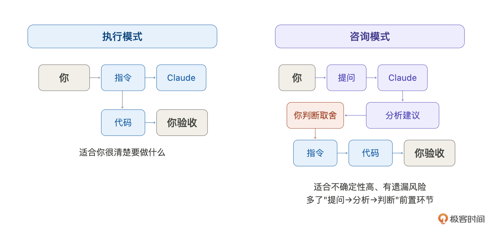
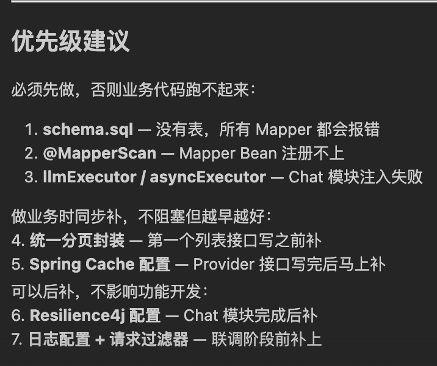
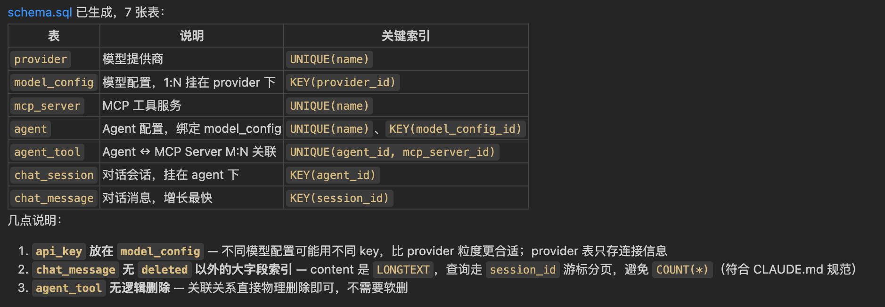
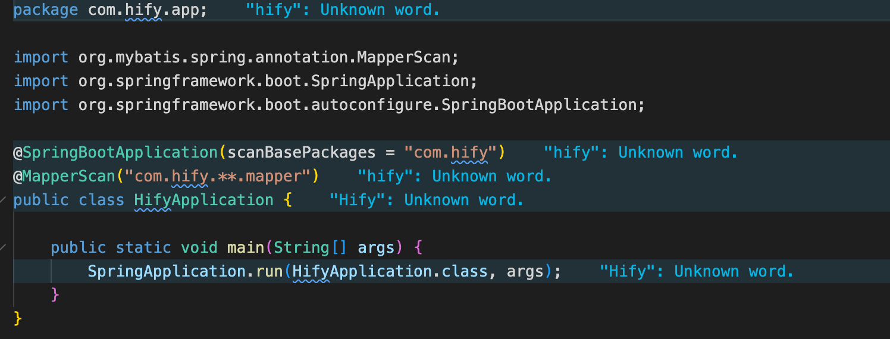
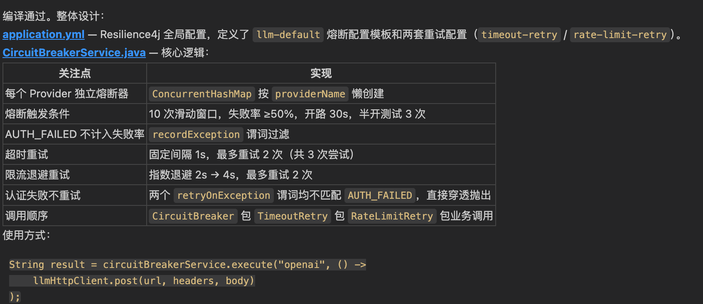
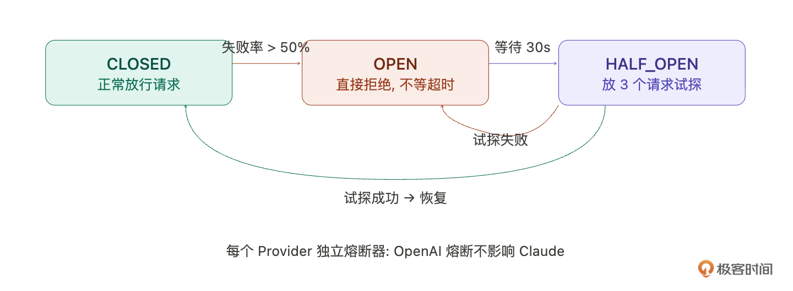

# 10｜基础组件（上）：后端业务基础设施
你好，我是Robert。

工程初始化完成了，Hify前后端都能跑， `make start` 一键启动。但现在还不能直接写业务，“空项目”还缺一层东西： **基础组件**。

08讲搭hify-common的时候，我们做了配置层面的基础，MyBatis-Plus的分页插件和自动填充、Redis的RedisTemplate 和序列化配置。但业务封装层还没做，比如：

1. BaseEntity基类怎么定
2. 分页查询怎么从前端参数转成PageResult
3. 接口入参怎么校验
4. 调外部LLM API的HTTP客户端怎么封装
5. 线程池怎么隔离
6. 熔断怎么配

这些是所有业务模块都会用到的底层能力，不先搭好，后面每个模块都要重复处理一遍。但问题来了： **具体需要准备哪些基础组件？你可能有经验能列出一部分，但难免有遗漏**。这一讲引入一个新的协作模式来解决这个问题。

## 新的协作模式：先问再做

回顾前面几讲，我们和Claude Code的协作基本都是一个模式： **你想清楚了，让它做**。“按照规范实现这个接口”，“帮我生成Maven骨架”……你知道要做什么，它负责执行。

但现在的情况不一样，“业务开发前需要准备哪些基础组件”这个问题，你有大致想法，但不确定有没有遗漏、先后顺序对不对。

这时候换一种模式： **先让 Claude Code 帮你想，再让它做**。不是让它替你做决策，而是 **把它当成一个资深架构师来咨询**，你问“这一步应该考虑什么”，它帮你梳理全景，你判断哪些要做、哪些不做，然后再进入执行。

我把这两种模式叫 **执行模式** 和 **咨询模式**：

- 执行模式：你想清楚了 → 给指令 → Claude Code做 → 你验收。适合你对任务很清楚的时候。

- 咨询模式：你知道大方向但不确定细节 → 先问Claude Code → 它帮你梳理 → 你判断取舍 → 再给指令执行。适合不确定性高的时候。




这个方法论后面会反复用到。每次进入新阶段（新模块、测试、部署），都可以先用咨询模式问一句“这个阶段我应该考虑什么”，确保不遗漏。

## 让 Claude Code 梳理基础组件清单

直接用。我问Claude Code：

> Hify项目工程骨架已经搭好（Maven多模块、hify-common的Result / 异常处理 / MyBatis-Plus配置 / Redis配置、前端Vue工程）。现在要开始做业务功能了。在写业务代码之前，还需要准备哪些基础组件？从数据库层、接口层、外部调用、缓存、可观测性几个角度帮我梳理，每个组件说明它解决什么问题。

它给了一份很详细的清单。我就不放细节了，就放一个总结：



有些是我预期到的（线程池、熔断），但有几个是我自己列清单时会漏掉的。我按优先级做了分档，不是所有东西都要现在做，有些不做业务就跑不起来，有些可以写业务时同步补。

**第一档：必须先做，否则业务代码跑不起来**

1. 数据库初始化脚本（schema.sql）。这是我差点忽略的，现在还没有建表DDL。Spring Boot启动时需要库和表已存在，否则Mapper跑不起来。需要创建所有业务表的DDL文件。

2. @MapperScan扫描路径。目前启动类的扫描路径只覆盖了 `com.hify.app`，但业务Mapper在各子模块里（ `com.hify.provider.mapper` 等），Bean注册不上。不改这个，所有Mapper注入都会报错。

3. llmExecutor / asyncExecutor线程池。CLAUDE.md要求LLM调用必须用 `@Qualifier("llmExecutor")`，Chat模块注入时这个Bean必须存在。


**第二档：做业务时同步补，第一个列表接口之前搞定**

1. BaseEntity（公共字段封装）。每个实体都有id、created\_at、updated\_at、deleted，不封装就每个实体重复写。

2. 统一分页参数封装。几乎每个列表接口都要分页，把前端参数转成MyBatis-Plus的Page对象，封装一次全部复用。

3. 入参校验（@Valid）。每个创建/更新接口都需要参数校验，和08讲的全局异常处理器串起来。

4. 统一时间序列化。不配的话Jackson序列化LocalDateTime默认输出数组格式 `[2025,3,16,10,30,0]`，前端解析不了。

5. Spring Cache集成。CLAUDE.md规定 Provider / Agent 配置走Redis Cache-Aside，TTL 30min。现在只有裸RedisUtil，没有启用 `@EnableCaching` + `RedisCacheManager`， `@Cacheable` 注解用不了。


**第三档：可以后补，不影响功能开发**

1. HTTP客户端封装。调LLM API的基础，但Chat模块开发时再做也来得及。

2. Resilience4j熔断配置。04讲定了每个提供商独立熔断器，但Chat模块完成后补也不迟。

3. 结构化日志配置。logback-spring.xml区分开发/生产环境，请求日志过滤器记录method、path、耗时。联调阶段前补上。


Claude Code帮我发现了两个我自己会漏掉的： **schema.sql 和 @MapperScan**。不是什么高深的东西，但你在列基础组件清单时很容易忽略。脑子里想的都是BaseEntity、线程池这些有设计感的东西，反而忘了最基础的东西，比如表还没建、扫描路径不对。等到启动报错才发现，浪费的是排查时间。

**这就是咨询模式的核心价值，用它做遗漏检查。Claude Code 见过的项目比你多，它的建议不能直接照搬，但用来查漏补缺非常好。**

我的决定是：这一讲把三档全做了。 虽然第三档可以后补，但提前搭好，后面就不用回头。按依赖关系排序：先做第一档（跑起来），再做第二档（业务能写），最后补第三档（健壮性），DemoItem验收放在第二档做完之后。

## 第一档：让业务代码能跑起来

**1\. 数据库初始化脚本**

Claude Code提示词是：

> 按照CLAUDE.md的数据库规范和数据模型，生成所有业务表的建表DDL。放在hify-app/src/main/resources/db/schema.sql。表名小写下划线、主键id bigint自增、时间字段created\_at/updated\_at datetime、逻辑删除deleted tinyint默认 0、字符集utf8mb4。包含：provider、model\_config、agent、agent\_tool、mcp\_server、chat\_session、chat\_message。

效果是：



这个就不展开说明了，大家可以自己琢磨一下细节。

**2\. @MapperScan 扫描路径**

这个改动就一行代码，但不改所有Mapper都注入不了：

> 在HifyApplication启动类上加 @MapperScan(“com.hify.\*\*.mapper”)，扫描所有子模块的Mapper包。

效果是：



**3\. 线程池配置**

场景：用户在对话（调LLM，卡了30秒），同时另一个用户打开管理页面看Agent配置。如果共用线程池，对话请求占满了所有线程，管理页面一直转圈。

> 在hify-common中创建ThreadPoolConfig（com.hify.common.config）。定义两个线程池：llmExecutor（核心10，最大50，队列100，线程名前缀llm-，拒绝策略CallerRunsPolicy）用于LLM调用；asyncExecutor（核心5，最大20，队列200，线程名前缀async-）用于日志异步写入等非关键任务。用@Bean + @Qualifier注册。

参数依据：目标20-50人同时在线，一半的人同时对话就是10-25个并发LLM调用，核心线程10够用，最大50留余量。一期先这样，后面根据监控调整。

线程名前缀很重要，后面看日志时， `llm-3` 立刻知道是LLM调用线程， `async-1` 是异步任务线程。不设前缀全是 `pool-1-thread-3`，排查时分不清。

```plaintext
package com.hify.common.config;

import org.springframework.beans.factory.annotation.Qualifier;
import org.springframework.context.annotation.Bean;
import org.springframework.context.annotation.Configuration;

import java.util.concurrent.Executor;
import java.util.concurrent.LinkedBlockingQueue;
import java.util.concurrent.ThreadPoolExecutor;
import java.util.concurrent.TimeUnit;

&#64;Configuration
public class ThreadPoolConfig {

    &#64;Bean
    &#64;Qualifier("llmExecutor")
    public Executor llmExecutor() {
        return new ThreadPoolExecutor(
                10, 50,
                60L, TimeUnit.SECONDS,
                new LinkedBlockingQueue&lt;&gt;(100),
                new NamedThreadFactory("llm-"),
                new ThreadPoolExecutor.CallerRunsPolicy()
        );
    }

    &#64;Bean
    &#64;Qualifier("asyncExecutor")
    public Executor asyncExecutor() {
        return new ThreadPoolExecutor(
                5, 20,
                60L, TimeUnit.SECONDS,
                new LinkedBlockingQueue&lt;&gt;(200),
                new NamedThreadFactory("async-"),
                new ThreadPoolExecutor.AbortPolicy()
        );
    }
}

```

到这里， `mvn spring-boot:run` 应该能正常启动、Mapper能注入、线程池Bean就绪。跑一下确认没有启动报错，再进入第二档。

## 第二档：业务开发的基础能力

接下来，我就不展示每个指令的执行效果了，比较复杂的我会展开说明。

**1\. BaseEntity**

每个数据库实体都有公共字段。不封装的话，每个Entity都要重复写id、created\_at、updated\_at、deleted和对应的注解。

> 在hify-common中创建BaseEntity类。字段：id（Long，@TableId自增）、createdAt（LocalDateTime，插入时自动填充）、updatedAt（LocalDateTime，插入和更新时自动填充）、deleted（Integer，@TableLogic，默认0）。后面所有业务实体继承这个类。

**2\. 统一分页封装**

08 讲定义了分页的请求参数（page、pageSize）和响应格式（PageResult），也配好了分页插件，但还没有把它们串起来。

> 在hify-common中创建PageHelper工具类。提供两个静态方法：toPage(page, pageSize)把前端参数转成MyBatis-Plus的Page对象（page从1开始，pageSize默认20最大100）；toPageResult(IPage)把查询结果转成我们的PageResult。

**3\. 入参校验**

每个创建和更新接口都需要校验入参。Spring Boot的 `@Valid` + JSR 303注解就够用，关键是和08讲的GlobalExceptionHandler配合好。它已经捕获了MethodArgumentNotValidException，会转成 `Result.fail(ErrorCode.PARAM_ERROR, 具体校验信息)`。

**4\. 统一时间序列化**

> 在hify-common中配置Jackson的全局时间序列化。LocalDateTime统一用ISO 8601格式（yyyy-MM-dd’T’HH:mm:ss），LocalDate用yyyy-MM-dd。配置JavaTimeModule，关掉WRITE\_DATES\_AS\_TIMESTAMPS。

一个配置类，十几行代码，但省掉后面无数前端时间解析的坑。

**5\. Spring Cache 集成**

08讲配好了RedisTemplate和RedisUtil，但只是裸的get/set操作。业务层需要 `@Cacheable`、 `@CacheEvict` 这些声明式缓存。Provider配置读多写少，加个注解就自动缓存，不需要手动写if-else。

> 在hify-common中启用Spring Cache。@EnableCaching，配置RedisCacheManager，默认TTL 30分钟，key前缀hify:。配置不同缓存名的TTL：provider-cache 30分钟、agent-cache 30分钟、session-cache 2小时。

这样后面业务Service直接加 `@Cacheable(cacheNames = "provider-cache")` 就行，缓存的读写、过期、序列化全自动处理。写入时加 `@CacheEvict` 失效缓存，标准的Cache-Aside模式。

**6\. CRUD 标准流程验证**

第二档的所有组件搭好了，用一个DemoItem跑通完整CRUD，验证它们协同工作。

> 实现一个最简单的CRUD演示。实体：DemoItem，只有name（String）和status（Integer）两个字段，继承BaseEntity。完整实现Controller → Service → ServiceImpl → Mapper → Entity → CreateReq/UpdateReq/Resp DTO。Controller使用RESTful路径 /api/v1/demo-items，返回统一Result，列表接口返回PageResult，创建和更新接口使用@Valid校验，Service层处理业务逻辑，Mapper继承BaseMapper。

验收：

```bash
# 入参校验生效吗？
curl -X POST http://localhost:8080/api/v1/demo-items \
  -H "Content-Type: application/json" \
  -d '{"name": "", "status": 1}'
# 期望：Result.fail，提示 name 不能为空

# 正常创建
curl -X POST http://localhost:8080/api/v1/demo-items \
  -H "Content-Type: application/json" \
  -d '{"name": "测试项", "status": 1}'
# 期望：Result.ok(id)，数据库 created_at 自动填充

# 分页列表
curl "http://localhost:8080/api/v1/demo-items?page=1&pageSize=10"
# 期望：PageResult，时间字段是 ISO 8601 格式

# 逻辑删除
curl -X DELETE http://localhost:8080/api/v1/demo-items/1
# 期望：数据库 deleted=1，再查列表看不到了

```

每一个请求验证一个基础组件：

- 空name → 入参校验 + 全局异常处理器
- 创建成功 → BaseEntity自动填充
- 列表 → PageHelper + 分页插件
- 时间格式 → Jackson配置
- 逻辑删除 → MyBatis-Plus配置

全部通过，说明第二档组件就绪。DemoItem留着不删，后面做Provider模块时，它是最好的参考模板。

## 第三档：健壮性补齐

这些不做也能写业务，但从架构和实现的角度，最好提前搭好，后面不用回头。这也是培养咱们设计和实现系统的好习惯。

**1\. HTTP 客户端封装**

Hify需要调用各种外部LLM API。先用咨询模式确认方案：

> 帮我分析普通请求用RestTemplate、流式SSE请求用OkHttp EventSource这个方案，有没有问题？

Claude Code确认方案合理，提醒了连接池要分开配、超时参数要区分。进入执行模式：

> 在hify-common中创建LlmHttpClient 类（com.hify.common.http）。内部持有RestTemplate（连接超时5s，读超时60s）和 OkHttpClient（连接超时5s，读超时120s）。提供 post(url, headers, body) 方法返回String，提供stream(url, headers, body, callback) 方法通过回调逐行返回。所有请求记录日志（URL、耗时、状态码），异常统一转为LlmApiException（区分 TIMEOUT、AUTH\_FAILED、RATE\_LIMITED）。

输出是：


上面是生成的局部代码。是不是很完整，比我写的都好。

这里有个点，为什么超时设这么长？ **LLM API不是普通HTTP调用，GPT-4一次响应可能10-20秒，流式可能持续一两分钟。60秒和120秒是实际经验的平衡**。这也是我们作为程序员的价值所在，我们会去理解需求，从宏观去思考超时时间是多久。因为AI不知道GPT-4一次响应可能10-20秒，这是物理世界的表现。

**2\. Resilience4j 熔断与重试**

线程池解决了“一个LLM卡了不影响其他功能”的问题。熔断解决另一个问题：某个提供商整个挂了，系统还在不停发请求，每次等60秒超时——挂了就是挂了，等也白等。

> 在hify-common中配置Resilience4j熔断器（com.hify.common.resilience）。application.yml配置：slidingWindowSize 10，failureRateThreshold 50%，waitDurationInOpenState 30s，permittedNumberOfCallsInHalfOpenState 3。创建CircuitBreakerService，按providerName获取或创建独立熔断器实例。重试逻辑：网络超时重试2次（间隔1s），限流退避重试（2s、4s），认证失败不重试。

输出是：



下图是熔断器状态流转图，你可以看看，理解一下代码的底层设计。



为什么每个Provider独立熔断器？OpenAI挂了不代表Claude也挂了。共用的话一家失败会把其他正常的也拦住。

重试按异常类型区分，认证失败重试一百次也不会成功，只有“暂时性”的失败才值得重试。

**3\. 结构化日志与请求追踪**

> 在hify-common中配置统一日志（com.hify.common.log）。logback-spring.xml区分环境：开发环境控制台彩色输出，生产环境JSON格式输出到文件（按天滚动，保留30天）。创建RequestLogInterceptor（HandlerInterceptor），记录每个请求的method、path、status、耗时，慢请求（>1s）标WARN。请求进入时生成traceId放入MDC，请求结束时清理。日志格式： `%d{HH:mm:ss} [%thread] [%X{traceId}] %-5level %logger{20} - %msg%n`。

输出是：

```plaintext
&lt;?xml version="1.0" encoding="UTF-8"?&gt;
&lt;configuration&gt;

    &lt;property name="LOG_DIR" value="${LOG_DIR:-logs}"/&gt;
    &lt;property name="APP_NAME" value="hify"/&gt;
    &lt;property name="LOG_PATTERN" value="%d{HH:mm:ss} [%thread] [%X{traceId}] %-5level %logger{20} - %msg%n"/&gt;

    &lt;!-- ── 开发环境：控制台彩色输出 ─────────────────────────── --&gt;
    &lt;springProfile name="default,dev"&gt;
        &lt;appender name="CONSOLE" class="ch.qos.logback.core.ConsoleAppender"&gt;
            &lt;encoder class="ch.qos.logback.classic.encoder.PatternLayoutEncoder"&gt;
                &lt;pattern&gt;%clr(%d{HH:mm:ss}){faint} %clr([%thread]){magenta} %clr([%X{traceId}]){cyan} %clr(%-5level) %clr(%logger{20}){cyan} - %msg%n&lt;/pattern&gt;
                &lt;charset&gt;UTF-8&lt;/charset&gt;
            &lt;/encoder&gt;
        &lt;/appender&gt;

        &lt;root level="INFO"&gt;
            &lt;appender-ref ref="CONSOLE"/&gt;
        &lt;/root&gt;
    &lt;/springProfile&gt;

    &lt;!-- ── 生产环境：JSON 格式滚动文件输出 ───────────────────── --&gt;
    &lt;springProfile name="prod"&gt;
        &lt;appender name="FILE" class="ch.qos.logback.core.rolling.RollingFileAppender"&gt;
            &lt;file&gt;${LOG_DIR}/${APP_NAME}.log&lt;/file&gt;
            &lt;rollingPolicy class="ch.qos.logback.core.rolling.TimeBasedRollingPolicy"&gt;
                &lt;fileNamePattern&gt;${LOG_DIR}/${APP_NAME}.%d{yyyy-MM-dd}.log&lt;/fileNamePattern&gt;
                &lt;maxHistory&gt;30&lt;/maxHistory&gt;
                &lt;totalSizeCap&gt;5GB&lt;/totalSizeCap&gt;
            &lt;/rollingPolicy&gt;
            &lt;encoder class="ch.qos.logback.classic.encoder.PatternLayoutEncoder"&gt;
                &lt;pattern&gt;{"time":"%d{yyyy-MM-dd HH:mm:ss.SSS}","thread":"%thread","traceId":"%X{traceId}","level":"%-5level","logger":"%logger{36}","message":"%replace(%msg){'\"','\\"'}"}%n&lt;/pattern&gt;
                &lt;charset&gt;UTF-8&lt;/charset&gt;
            &lt;/encoder&gt;
        &lt;/appender&gt;

        &lt;appender name="FILE_ASYNC" class="ch.qos.logback.classic.AsyncAppender"&gt;
            &lt;discardingThreshold&gt;0&lt;/discardingThreshold&gt;
            &lt;queueSize&gt;512&lt;/queueSize&gt;
            &lt;appender-ref ref="FILE"/&gt;
        &lt;/appender&gt;

        &lt;root level="INFO"&gt;
            &lt;appender-ref ref="FILE_ASYNC"/&gt;
        &lt;/root&gt;
    &lt;/springProfile&gt;

&lt;/configuration&gt;

```

traceId的价值：一个对话请求从Controller进来，经过Service、调LLM、写数据库，可能产生十几条日志。一个ID串起整条链路，排查时不用大海捞针。

## 最终验收

三档全部搭完，回过头做一个整体检查：

- 启动项目，确认日志格式正确（有traceId、有线程名）。

- 跑一遍DemoItem的CRUD，确认请求日志过滤器在记录每个请求的method、path、耗时。

- 检查日志里线程名是否有 `llm-` 和 `async-` 前缀的线程池就绪。


全部通过，Hify后端基础组件全部就绪。

## 总结

这节课我们把Hify后端的全部基础组件搭完了。

- 第一档（跑起来）：建表DDL、MapperScan扫描路径、LLM / 异步线程池。

- 第二档（能写业务）：BaseEntity、分页封装、入参校验、时间序列化、Spring Cache、CRUD标准流程。

- 第三档（健壮性）： HTTP 客户端（普通 + SSE）、熔断器（每个Provider独立）+ 重试、结构化日志 + 请求追踪。


最重要的方法论是咨询模式。在你还没完全想清楚的时候，先让Claude Code帮你梳理全景，你做判断和取舍，再进入执行。多了一个前置思考环节，但能帮你发现遗漏。后面每次进入新阶段都可以用。

这一讲内容很多，我想多说一句， **为什么要花这么大篇幅讲基础组件**。

这门课教的不只是Claude Code的使用。我还想让你知道，一个标准项目的基础组件应该长什么样，包括线程池隔离、熔断重试、Cache-Aside、traceId串联、入参校验链路、统一时间序列化，这些东西不是课本上的概念，是每个生产级项目都要有的底层能力。很多工程师工作三五年，做的项目里这些东西是别人搭好的，自己从来没从零搭过，知道名字但说不清为什么要这么做。

这节课看完，你不只是用Claude Code搭好了Hify的基础组件，你还积累了一份可复用的基础组件清单，掌握了每个组件的设计理由。以后你开新项目，不管用不用Claude Code，这套东西基本照搬就行。三档优先级、每个组件解决什么问题、参数为什么这么设，你都心里有数。这才是真正的积累，不是只会问AI问题，而是自己也有经验、有判断。

下一讲进入前端。程序员一般没有设计师的审美，没关系，让Claude Code来。我们会让它帮我们做UI设计、定色调、优化布局，把灰蒙蒙的空壳变成有品牌感的界面，同时把前端的基础组件封装好。

## 思考题

试一下咨询模式。打开Claude Code，描述你正在做的一个项目，然后问它：“在开始写业务代码之前，我应该准备哪些基础组件？”看看它的建议里有没有你没想到的，并把它的建议和你的判断（哪些采纳、哪些不需要、为什么）分享在留言区。

期待你与我交流。如果今天的课程让你有所收获，也欢迎转发给有需要的朋友，邀请他来一起学习，我们下节课再见！