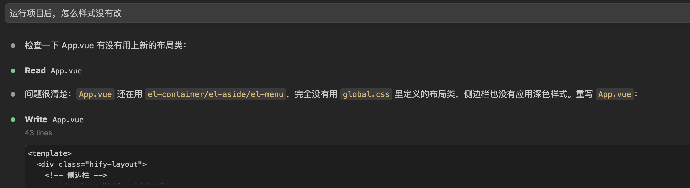
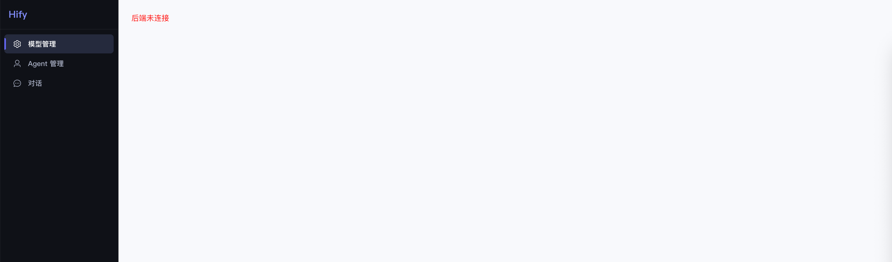
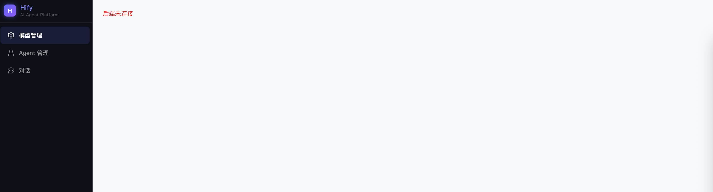
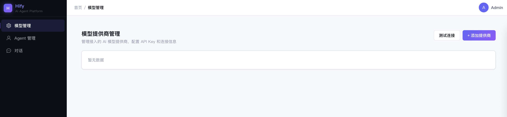
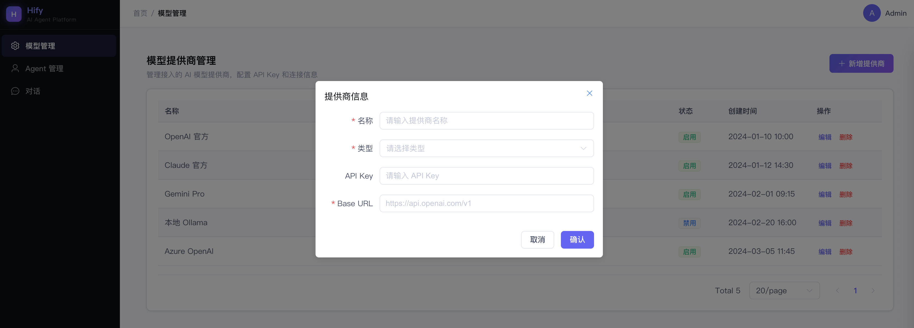

# 11｜基础组件（下）：前端 UI 设计与前端基础组件
你好，我是Robert。

上一讲把后端基础组件全部搭完了，三档就绪。这一讲搭前端。

09讲搭了前端空壳，包括Vue骨架、axios封装、三个菜单页面的占位文字。能跑，但说实话，看起来就是Element Plus的默认灰蓝，像一个课程作业，不像一个产品。

这一讲做两件事：

1. 让Claude Code当设计师，把界面从“能用”变成“好看”；
2. 把前端业务开发需要的公共组件一次性封装好。

做完之后，前端也和后端一样，基础设施就绪，下个章节开始直接往里填业务功能。

## 让 AI 当设计师

大多数后端工程师没有设计师的审美，不知道配色怎么选、间距怎么给、什么风格适合什么产品。以前这事只能找设计师或者产品经理，现在Claude Code能帮你做到80分以上。

但前提和写代码一样：你的输入越具体，它的输出越好。不是说“帮我设计一个好看的界面”，而是要告诉它产品是什么、用户是谁、你想要什么风格。01讲说的“思考质量决定输出质量”，在UI设计这个场景同样适用。

### 第一步：定风格方向

先用咨询模式给Claude Code足够的上下文：

> Hify是一个AI Agent开发平台，面向技术团队内部使用，主要用户是开发者和技术管理者。界面以管理后台为主——大量的表格、表单、配置页面，加上一个对话交互页面。我想要的视觉风格：浅底 + 科技感点缀。整体用浅色背景保持信息可读性（管理后台表格多，深色底长时间看眼睛累）。但不要太素——侧边栏用深色底，按钮和关键交互元素用亮色，制造科技感和品牌感。色调方向：主色用蓝紫系（科技感强），辅色用青色或薄荷绿（数据/状态指示）。参考Linear、Supabase的视觉风格——干净但不无聊，有设计感但不花哨。帮我设计一套完整的设计系统：主色/辅色/背景色阶/文字色阶/圆角/阴影/过渡动效，用CSS变量输出。

注意这条指令的结构：先说产品是什么（上下文），再说用户是谁（约束），再说我要什么风格（方向），再说具体的色调偏好（细节），最后给参考（锚点）。层层递进，Claude Code不需要猜。

命令执行后遇到一个问题：

这说明了Claude Code不是能一下子完成任务的，而是需要不断调整的。经过调整后，效果如下：

拿到这套变量后，快速review一下：颜色搭配刺不刺眼、对比度够不够（文字要能看清）、整体调性对不对。不需要逐个色值较真，大方向对就行，细节后面调。

### 第二步：改造侧边栏

侧边栏是用户打开页面第一眼看到的东西，改造效果最立竿见影。

> 改造Hify的侧边栏。要求：
>
> 1. 背景用深色（接近纯黑但不是纯黑，用 --color-bg-dark），和浅色内容区形成对比
> 2. 顶部Logo区域：显示"Hify"品牌名，用主色渐变文字，下面一行小字 “AI Agent Platform”
> 3. 菜单项：默认白色文字 + 透明背景，hover时背景微亮（rgba白色10%透明度），选中态左边一条3px的主色竖线 + 背景微亮
> 4. 菜单图标：每个菜单项前加Element Plus图标（模型管理用Setting，Agent管理用User，对话用ChatDotRound）
> 5. 底部：折叠/展开按钮，版本号
> 6. 整体要炫酷，有科技感，但不能花哨到影响使用

效果如下：

### 第三步：页面整体布局

> 优化Hify的页面整体布局：
>
> 1. 顶栏：左侧面包屑导航（显示当前页面路径），右侧用户信息区域（头像 + 用户名placeholder）
> 2. 内容区：背景用 --color-bg-secondary（浅灰），内容卡片用白色背景 + 轻阴影 + 圆角，和背景有层次感
> 3. 页面标题区域：每个页面顶部有标题 + 描述文字 + 操作按钮区（右侧）
> 4. 间距统一：页面边距24px，卡片内边距20px，元素间距16px
> 5. 按钮样式：主要操作用主色渐变按钮（蓝紫渐变），次要操作用白色边框按钮，危险操作用红色

效果如下：

### 效果对比

到这里，UI改造基本完成。

同一个页面结构，只是换了设计系统——CSS变量 + 侧边栏 + 布局优化，没有改任何功能代码，但视觉感受完全不同。

这就是让AI当设计师的价值：你不需要懂设计理论，只需要能描述你想要什么。“浅底科技感、侧边栏深色、蓝紫主色、参考Linear”，这些描述任何一个后端工程师都能给出来，Claude Code会把它翻译成具体的CSS。

## 前端基础组件：一条指令搞定

后端工程师做前端，最怕的不是写不出来，是写得慢。每个页面重复处理表格分页、弹窗打开关闭、loading状态、删除确认，把这些封装成公共组件，后面做业务页面就是填配置。

**我们是后端工程师，不需要在前端组件的实现细节上花太多时间**。用一条完整的指令让Claude Code一次性生成所有组件：

> 在hify-web中创建以下前端公共组件，放在src/components/目录下。所有组件使用Vue 3 Composition API + TypeScript + Element Plus：
>
> 1. HifyTable.vue：通用列表页表格组件。Props接收columns配置（label/prop/width/slot）、api方法（返回PageResult格式）、是否显示分页。内部自动管理loading状态、分页参数、数据请求。暴露refresh()方法供外部调用刷新。空状态显Element Plus的el-empty。
> 2. HifyFormDialog.vue：通用表单弹窗组件。Props接收 title、width、表单rules。v-model控制显示隐藏。内部管理提交loading、关闭时自动重置表单。暴露open(data?)方法，传data为编辑模式，不传为新增模式。提交时触发submi事件，由父组件处理API调用。
> 3. src/composables/useConfirm.ts：删除确认composable。接收确认文案和API方法，弹出ElMessageBox确认框，确认后调用API，成功后显示ElMessage成功提示，返回Promise。一行代码完成 “确认删除→调接口→提示成功” 全流程。
> 4. src/composables/useRequest.ts：请求状态管理composable。接收API方法，返回 &#123; data, loading, error, execute &#125;。自动管理三态，避免每个页面写try-catch-finally样板代码。
> 5. src/utils/notify.ts：统一通知封装。导出notifySuccess/notifyError/notifyWarning三个方法，底层调用ElMessage，统一配置duration和样式。
>
>
>    每个组件要有TypeScript类型定义，用泛型支持不同数据类型。组件风格和第一步定的设计系统一致。

一条指令，五个组件。Claude Code生成后，快速过一遍：TypeScript类型对不对、组件接口设计合不合理、和Element Plus的集成有没有问题。前端组件的实现细节不需要逐行review，能用就行，有问题后面调。

这就是01讲说的三层分工里的第二层——AI做，你验收。前端组件封装不是你的核心能力区，让AI高效产出，你把精力放在验证它好不好用上。这块就不展开了。如果有兴趣你可以去深究一下细节。

## 细节打磨：和 Claude Code 来回调

UI设计和组件都有了，但实际用起来一定会有不满意的地方，比如间距不对、对齐有问题、颜色偏了、表格太挤、弹窗太宽。这是最花时间的环节，也是最能体现人机协作价值的环节。

我用ProviderList页面来演示这个过程。先让Claude Code生成一个完整的页面：

> 用HifyTable和HifyFormDialog实现Provider列表页面（src/views/provider/ProviderList.vue）。用mock数据，不调真实API。
>
> 列表展示：名称、类型（OpenAI/Claude/Gemini/Ollama）、Base URL、状态（启用/禁用，用el-tag显示）、创建时间、操作（编辑/删除）。
>
> 页面顶部有标题 “模型提供商管理”、描述文字、右侧 “新增提供商” 按钮。
>
> 点新增弹出HifyFormDialog，表单字段：名称、类型（下拉）、API Key、Base URL。
>
> 删除用useConfirm。
>
> mock数据写5条，类型分布开。

Claude Code生成后，启动前端看效果。大概率第一版有这些问题，这是正常的，不是Claude Code能力不够，是UI细节需要人来判断。

**1\. 调布局**

> ProviderList页面的表格和顶部标题区之间间距太大了，从24px改成16px。表格的行高偏高，把el-table的row-style行高从默认改成52px。操作列的两个按钮间距太小，加8px的margin-left。

这种微调很适合让Claude Code做。你告诉它哪里不对、怎么改，它改得又快又准，不需要你自己去翻CSS。

**2\. 调色调**

> 状态列的el-tag颜色不对。启用状态用绿色（type=“success”），禁用状态用灰色（type=“info”），不要用红色——禁用不是错误，不应该用danger色。

这是一个典型的审美判断：Claude Code第一版可能把“禁用”设成红色（因为它觉得禁用是负面状态），但你知道在管理后台里，禁用是一个正常的状态，用灰色更合适。AI做初稿，你做审美判断，然后让它改。

**3\. 调表单弹窗**

> 新增提供商的弹窗宽度太宽了，600px改成520px。API Key输入框改成password类型，加一个 “显示/隐藏” 切换按钮。Base URL输入框加placeholder示例：“ [https://api.openai.com/v1](https://api.openai.com/v1)”。表单label宽度统一100px，从左对齐改成右对齐。

**4\. 调响应式细节**

> 当浏览器宽度小于1200px时，侧边栏自动折叠成只显示图标的窄模式。表格在窄屏下隐藏Base URL和创建时间两列，只保留关键信息。

**5\. 整体微调**

> 整体看一下ProviderList页面，做以下微调：
>
> 1. 表格头部背景色太深了，换成 --color-bg-secondary（浅灰）
> 2. 分页器居右对齐，上方加一条细分割线
> 3. “新增提供商” 按钮加一个Plus图标
> 4. 鼠标悬停表格行时背景微微变色（hover效果）
> 5. 操作列的 “编辑” 按钮用text类型蓝色，“删除” 用text类型红色，不要默认的primary按钮样式

你看，这一轮来回调了五六次，每次都是具体的、可执行的指令。这就是UI打磨的真实过程，不是一条指令出完美设计，而是先出初稿，然后你用自己的眼睛和判断来指导Claude Code迭代。

关键认知： **你不需要会写 CSS，但你需要能说清楚“哪里不对”和“应该怎样”。间距太大改成 16px、禁用不应该用红色用灰色、弹窗太宽改成 520px，这些描述不需要前端技能，只需要你看着屏幕，说出你的判断，Claude Code 负责把你的判断翻译成代码。**

这个细节打磨的能力，后面做每一个前端页面都会用到。Provider页面练好了手，后面Agent页面、对话页面照着来就行。

## 验收

启动前端，打开浏览器：

- 侧边栏：深色背景，Hify logo带渐变，菜单项有图标和hover效果
- 点“模型管理”：看到Provider列表页，表格展示5条mock数据，分页器在底部
- 点“新增提供商”：弹出表单弹窗，字段完整，校验生效（name为空提交会报错）
- 点某条数据的“删除”：弹出确认框，确认后提示成功，列表刷新
- 整体色调：浅底 + 深色侧边栏 + 蓝紫主色按钮，干净有科技感

虽然数据是mock的，但UI交互已经完整。第13讲做Provider模块时，只需要把mock数据换成真实API调用——界面不用动，只改数据源。

## 总结

这一讲做了三件事：让Claude Code当设计师搞定UI、一条指令封装前端基础组件、来回打磨UI细节。

**让 AI 当设计师的关键：输入要具体**。不是“帮我设计好看的界面”，而是“浅底科技感、侧边栏深色、蓝紫主色、参考 Linear”。产品是什么、用户是谁、你想要什么风格、有什么参考，把这些告诉它，和给它写代码指令一样，层层递进，不让它猜。

**前端组件封装：一条指令搞定**。后端工程师不需要在前端细节上花太多时间。描述清楚每个组件的接口和行为，让Claude Code一次性生成，你验收好不好用就行。

**UI 细节打磨才是真功夫**。第一版永远不完美。真正的价值在于你能看着屏幕说出“哪里不对”，比如间距太大、颜色不对、弹窗太宽、hover效果缺了。你不需要会写CSS，但你需要有判断力。每一轮“看→说→改”都在训练这个判断力，做几个页面下来，你对UI的感觉会好很多。

到这里，Hify的全部基础设施就绪了: **后端的三档组件**、 **前端的设计系统** 和 **公共组件**、一个看起来像产品的Provider列表页。

从下个章节开始，我们正式进入核心功能开发。第一讲是模型提供商管理，把mock数据换成真实的CRUD，对接后端API，这是你用Claude Code交付的第一个完整业务模块。

## 思考题

找一个你觉得丑的管理后台（可以是你自己项目的，也可以是开源项目的），截个图，然后用这一讲的方法——先描述产品定位和目标风格，再让Claude Code给出设计系统，最后一步步改造。看看你能不能用纯文字描述把它改好看。把改造前后的对比截图分享在留言区。

期待你的分享。如果今天的课程让你有所收获，也欢迎转发给有需要的朋友，邀请他来一起学习，我们下节课再见！