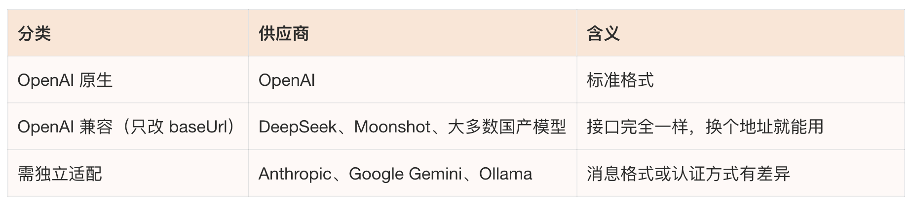
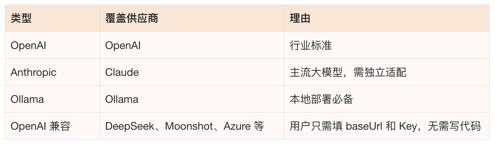
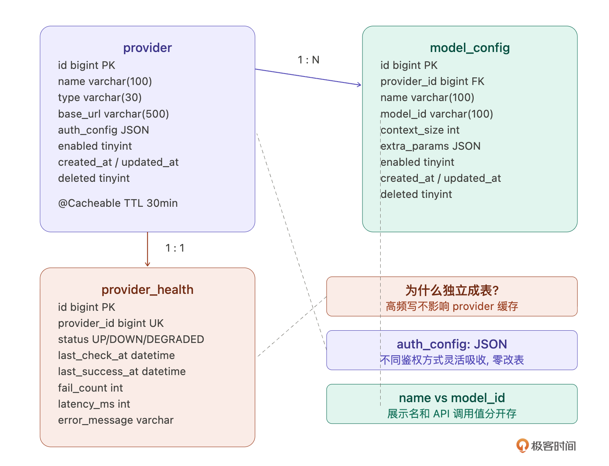
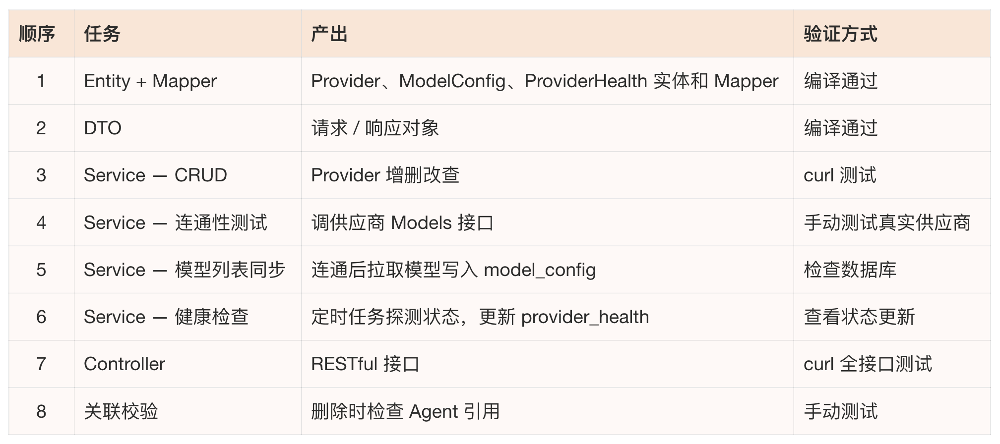
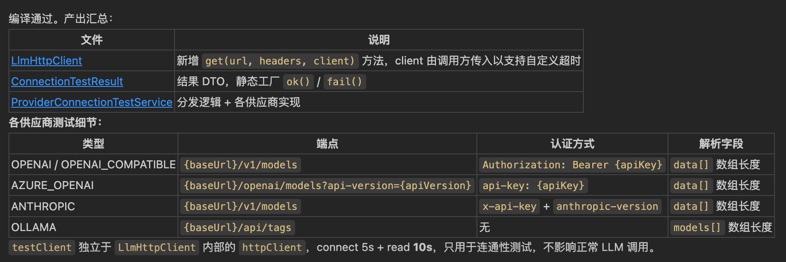
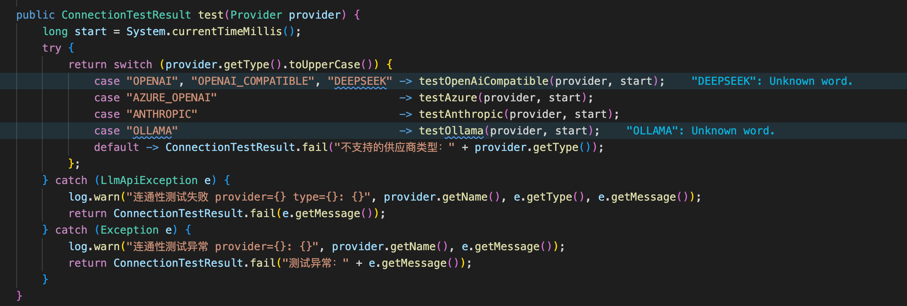
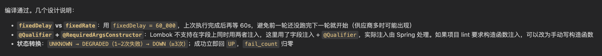
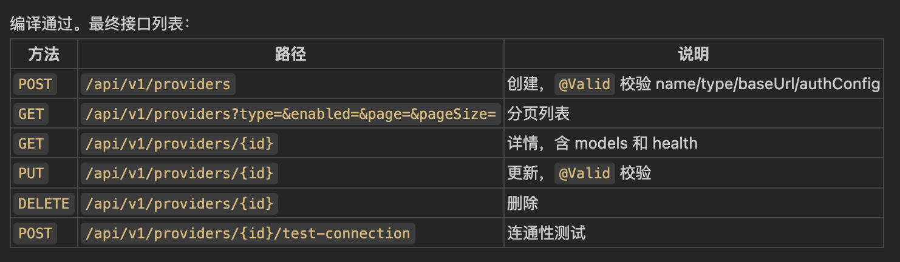
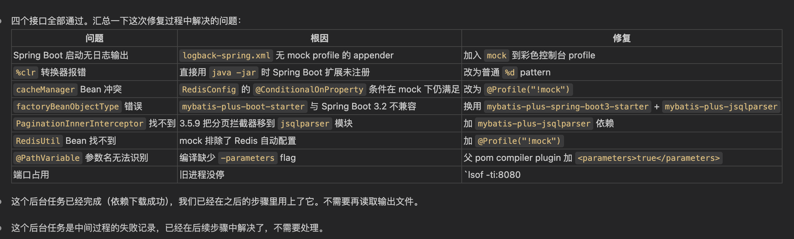
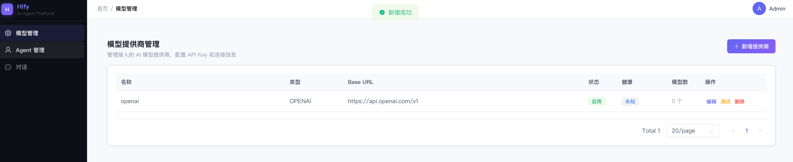

# 13｜模型提供商管理：第一个完整功能的交付闭环
你好，我是Robert。

从这一讲开始，正式进入核心功能开发。

前面12讲都在“准备”——认知框架、产品定义、架构设计、工程骨架、基础组件、前端UI。我们已准备得足够扎实，现在该看看回报了。

第一个模块是模型提供商管理，让用户配置OpenAI、Claude、Gemini、Ollama这些LLM提供商，管理API Key，查看支持的模型，监控健康状态。为什么从这个开始讲起？因为它是Hify整个平台的地基，Agent要选模型、对话要调模型，所有功能都依赖它。而且复杂度刚好，有CRUD、有外部调用、有鉴权处理、有健康检查，足够展示一个完整的交付流程，但不至于让你迷失在业务细节里。

**这一讲最重要的不是 Provider 模块本身，而是它背后的标准交付流程。后面做Agent、对话引擎、MCP接入，每个模块都复用这个流程**。

我会分四个部分展开：先想清楚、后端拆解执行、前端对接、完整验收。

## 先和 Claude Code 想清楚

10讲学了咨询模式， **不确定的时候先问再做**。做一个新的业务模块，正是用这个模式的好时机。 **上来就让Claude Code写代码是最常见的错误**，你连这个模块要考虑哪些东西都没想清楚，它写出来的代码一定有遗漏。

**1\. 支持哪些供应商？**

比如，你知道业界有多少LLM的供应商吗？我敢保证你肯定不知道，或者不知道全。所以你可以问Claude Code：

> Hify要支持LLM模型提供商管理。帮我分析：主流的LLM供应商有哪些？它们的API有什么共性和差异？哪些是一期必须支持的？

Claude Code给了一份非常详细的分析。信息量最大的不是供应商列表本身，而是它按三个维度做的分类，这直接影响了我们后面的架构决策。

按接口兼容性分：



这个分类是关键洞察，“OpenAI兼容”是一个巨大的阵营。DeepSeek、Moonshot、Azure OpenAI这些，接口格式和OpenAI一模一样，只需要改baseUrl和API Key就能接入，不需要写一行适配代码。

**按认证方式分：** Bearer Token（OpenAI、DeepSeek）、自定义Header（Anthropic用x-api-key）、URL参数（Gemini）、无认证（Ollama）、JWT自签名（智谱GLM）。这个差异直接影响了我们auth\_config用JSON存储的决策。

**按消息格式分：** OpenAI格式（大多数）、Anthropic独立system字段、Gemini完全不同格式（contents + parts）。这个差异决定了后面适配层要怎么设计。

基于这个分析，我的判断，一期支持三种类型加一个通用兼容：



四个类型覆盖90%的使用场景。Gemini消息格式差异最大，适配成本高，放二期。“OpenAI兼容”类型是最聪明的设计，不是每接入一个供应商就写一套适配代码，而是让用户自己配置baseUrl，立刻能用。

你会发现，这个小节我写得很详细。这是想告诉你： **经过这个问题下来，你是不是一下子就了解了业界主流的 LLM 供应商，以及供应商提供的接口的形态和内容。而这就是你在 AI 领域知识的积累。所以“会问”很重要，通过问来学习了解一个你不知道的领域。**

最后接口兼容性的分类，后面适配层设计时会直接用到。13讲先用if-else跑通，下一讲用设计模式重构。

**2\. 有没有现成的依赖库？**

> Java生态里有没有封装了多LLM供应商调用的库？Spring AI、LangChain4j等，分析成熟度和优缺点。

Spring AI和我们技术栈最匹配，但API还在快速迭代，LangChain4j功能全但概念太重。

我的判断：一期不引入这些框架，基于10讲封装的LlmHttpClient自己做。大部分供应商兼容OpenAI格式，自己封装工作量不大。引入大框架只为用模型调用部分，性价比不高。

这个决策过程本身值得学习，不是有轮子就一定要用，要看轮子和你场景的匹配度。

**3\. 数据模型设计**

这是最关键的部分，数据怎么存，决定了接口怎么设计，也决定了前端怎么展示。

> 基于上面的分析，设计Provider模块的数据模型。需要考虑：多种供应商鉴权方式的差异怎么统一存储、一个供应商下有多个模型怎么管理、供应商健康状态怎么表示。

Claude Code给了一版很扎实的设计（太细致了，我就先不贴内容了）。总结就是有几个点，比我预期的更好。逐个说。

- **鉴权信息怎么存？**

不同供应商的鉴权差异很大。OpenAI用API Key，Anthropic额外需要anthropicVersion Header，Azure需要resourceName和apiVersion，Ollama完全不需要认证。给每种方式定固定列行不通。

用 `auth_config` JSON字段，按type存不同结构：

```jsonc
// OPENAI / OPENAI_COMPATIBLE
{ "apiKey": "sk-xxx" }

// ANTHROPIC
{ "apiKey": "sk-ant-xxx", "anthropicVersion": "2023-06-01" }

// OLLAMA
{}

```

未来加新供应商零改表，JSON让每种type按自己的schema存。Claude Code一开始建议单独建auth表，我追问“一对一关系建表有什么收益”，它承认没有实际收益。 **这种细节层面的追问就是架构师的价值。**

- **模型列表怎么管理？**

model\_config表有两个容易混淆的字段： `name` 是展示名（比如GPT-4o）， `model_id` 是调用时实际传给API的值（比如gpt-4o）。Azure场景下model\_id就是deployment name，和展示名不一样。另外加了 `context_size` 字段存上下文窗口大小，后面对话引擎做上下文管理时直接用，不需要再去查。 `enabled` 字段让用户选择启用哪些模型开放给 Agent。

- **健康状态为什么独立成表？**

这是Claude Code给的一个我没想到的好设计。健康状态写频繁——定时探测每分钟更新一次，每次LLM调用也可能更新状态。如果放在provider表里，高频写操作会和业务读竞争锁。分离之后，provider表写少读多，可以放心加@Cacheable缓存；provider\_health表不缓存，直接读库。

而且provider\_health表的字段比简单的status丰富得多： `fail_count`（连续失败次数，配合熔断器）、 `latency_ms`（最近延迟）、 `last_success_at`（最后成功时间）、 `error_message`（最近失败原因）。这些信息在管理控制台展示时非常有用。

最终表结构：

```sql
-- 模型提供商
CREATE TABLE provider (
    id BIGINT AUTO_INCREMENT PRIMARY KEY,
    name VARCHAR(100) NOT NULL COMMENT '供应商名称，唯一',
    type VARCHAR(30) NOT NULL COMMENT 'OPENAI/ANTHROPIC/OLLAMA/OPENAI_COMPATIBLE',
    base_url VARCHAR(500) NOT NULL COMMENT 'API 基础地址',
    auth_config JSON COMMENT '鉴权配置，结构按 type 不同',
    enabled TINYINT DEFAULT 1 COMMENT '0=禁用 1=启用',
    created_at DATETIME NOT NULL,
    updated_at DATETIME NOT NULL,
    deleted TINYINT DEFAULT 0
) COMMENT '模型提供商';

-- 模型配置
CREATE TABLE model_config (
    id BIGINT AUTO_INCREMENT PRIMARY KEY,
    provider_id BIGINT NOT NULL COMMENT '所属供应商 ID',
    name VARCHAR(100) NOT NULL COMMENT '展示名，如 GPT-4o',
    model_id VARCHAR(100) NOT NULL COMMENT '调用时传给 API 的值',
    context_size INT COMMENT '上下文窗口大小（token 数）',
    extra_params JSON COMMENT '模型级别扩展参数',
    enabled TINYINT DEFAULT 1 COMMENT '0=禁用 1=启用',
    created_at DATETIME NOT NULL,
    updated_at DATETIME NOT NULL,
    deleted TINYINT DEFAULT 0
) COMMENT '模型配置';

-- 供应商健康状态（独立表，高频写不影响 provider 缓存）
CREATE TABLE provider_health (
    id BIGINT AUTO_INCREMENT PRIMARY KEY,
    provider_id BIGINT NOT NULL COMMENT '供应商 ID，唯一索引',
    status VARCHAR(20) DEFAULT 'UNKNOWN' COMMENT 'UP/DOWN/DEGRADED/UNKNOWN',
    last_check_at DATETIME COMMENT '最后探测时间',
    last_success_at DATETIME COMMENT '最后成功时间',
    fail_count INT DEFAULT 0 COMMENT '连续失败次数',
    latency_ms INT COMMENT '最近一次延迟 ms',
    error_message VARCHAR(500) COMMENT '最近失败原因',
    updated_at DATETIME NOT NULL,
    UNIQUE INDEX idx_provider_health_provider_id (provider_id)
) COMMENT '供应商健康状态';

```

实体关系：

```plaintext
provider (1)
  ├── auth_config: JSON         鉴权，结构随 type 变化
  ├── model_config (N)          该供应商下的所有模型
  │     └── extra_params: JSON  模型级别扩展
  └── provider_health (1)       健康状态，高频更新独立

```



## 后端拆解执行

想清楚了，开始做。08讲的任务拆解方法论直接复用——按MVC分层拆，每个任务只涉及一层，产出物可独立验证，从底层往上层搭。



8个任务，两三个小时全部交付。这就是基础设施搭好之后的速度—— **10 讲的BaseEntity、PageHelper、Spring Cache、入参校验全部直接复用**，每个任务只需要写业务逻辑，不需要重复处理基础设施。

我挑几个有代表性的任务展示。

**任务 1：Entity + Mapper**

> 按照CLAUDE.md规范和上面的表结构，在 hify-provider中创建Provider、ModelConfig、ProviderHealth的Entity和Mapper。Entity继承BaseEntity（ProviderHealth除外，它有自己的字段结构），Mapper继承BaseMapper。auth\_config和extra\_params字段用MyBatis-Plus的JSON TypeHandler。

这个任务很简单，Claude Code的输出基本不用改。review重点：字段类型和表结构一致，包路径正确。

**任务 3：Service — CRUD**

> 在hify-provider中实现ProviderService。CRUD基础逻辑：创建时校验名称不重复，列表支持按type和enabled筛选，详情接口返回关联的modelConfig列表和providerHealth信息。缓存：列表和详情加 @Cacheable(cacheNames = “provider-cache”)，更新和删除加 @CacheEvict。

注意缓存。10讲配好了Spring Cache，这里直接加注解就行。不需要手写if-else查缓存逻辑。provider\_health 不走缓存，直接读库。

**任务 4：连通性测试**

这个稍微复杂，不同供应商的API不一样。

> 在hify-provider中实现连通性测试。根据provider.type分发到不同的测试方法：openai和openai\_compatible调GET /v1/models（Bearer Token），anthropic调GET /v1/models（Header带 x-api-key + anthropic-version），ollama调GET /api/tags（无认证）。统一返回ConnectionTestResult（success、latencyMs、modelCount、errorMessage）。使用10讲封装的LlmHttpClient，超时10秒。

下面是Claude的产出，主要就是完成了Client的封装。



代码很多我们就不一一展开讲了，有兴趣去看我们的源码目录。下面是测试选择的代码实现：展示连通性测试Service的核心逻辑——根据type分发到不同测试方法。



这里不同供应商的差异用if-else处理。先跑通，下一讲我们专门讲怎么用设计模式重构它。

**任务 6：健康检查定时任务**

> 在hify-provider中实现供应商健康检查定时任务。@Scheduled每分钟执行一次，遍历所有enabled的provider，调连通性测试方法。成功则更新provider\_health：status=UP、latency\_ms、last\_success\_at、fail\_count归零。失败则fail\_count+1，连续失败3次标记DOWN。使用asyncExecutor线程池异步执行，不阻塞主线程。

输出的核心逻辑是：



**任务 7：Controller**

> 在hify-provider中创建ProviderController，按照CLAUDE.md接口规范实现所有接口：POST创建、GET列表（分页）、GET详情（含modelConfig和health）、PUT更新、DELETE删除、POST /{id}/test-connection连通性测试。所有接口返回Result&lt;T>，入参加@Valid校验。

输出是：



因为我们10讲跑通的DemoItem标准流程在这里完全复用——Controller只做参数校验和调Service，返回Result，分页用PageHelper。DemoItem就是Provider的模板，模式一模一样，只是字段和业务规则不同。

后端8个任务全部完成后，用curl快速过一遍：

```bash
# 创建 OpenAI 供应商
curl -X POST http://localhost:8080/api/v1/providers \
  -H "Content-Type: application/json" \
  -d '{"name":"OpenAI","type":"OPENAI","baseUrl":"https://api.openai.com","authConfig":{"apiKey":"sk-xxx"}}'

# 连通性测试
curl -X POST http://localhost:8080/api/v1/providers/1/test-connection

# 查看详情（包含模型列表和健康状态）
curl http://localhost:8080/api/v1/providers/1

# 分页列表
curl "http://localhost:8080/api/v1/providers?page=1&pageSize=10"

```

在运行这几个curl命令的过程中，发生了很多个错误。



不过这些问题我都是让Claude Code自己修复。最后后端跑通了。到这里我真的想感叹一句： **时代真的变了，以前我们解决这些问题至少要一两天，现在AI半个小时就搞定了**。挺可怕的，我们研发要怎么应对这个时代呢？我也在探索，后面给我的答案，先一起努力吧。

但这不是交付闭环，用户不是在终端里用curl的，他们在浏览器里操作。

## 前端对接：把 mock 换成真实 API

11讲我们已经做了一个交互完整的ProviderList页面——HifyTable展示列表、HifyFormDialog弹新增/编辑表单、useConfirm做删除确认。数据是mock的，现在换成真实API。

这一步非常快，因为11讲的前端基础组件已经把脏活全封装了。

> 把ProviderList.vue的mock数据换成真实API调用。具体改动：
>
> 1. 在src/api/provider.ts中创建API方法：getProviderList（分页）、createProvider、updateProvider、deleteProvider、testConnection
> 2. HifyTable的api prop从mock函数换成getProviderList
> 3. HifyFormDialog的submit事件处理从console.log换成createProvider/updateProvider
> 4. 删除按钮的useConfirm从mock换成deleteProvider
> 5. 列表加一列“操作”：连通性测试按钮，点击调testConnection，结果用ElMessage提示
> 6. 加一列“健康状态”：从provider\_health关联查询，UP绿色tag、DOWN红色tag、DEGRADED黄色tag、UNKNOWN灰色tag，显示最近延迟ms
> 7. 加一列“模型数”：显示该供应商下已启用的模型数量，点击可展开模型列表

1条指令，7个改动点。Claude Code生成后，前端代码的改动量其实很小，API文件是新增的，ProviderList.vue基本只是把数据源从mock函数换成了API函数，组件结构不变。

这就是11讲封装前端基础组件的回报。HifyTable已经处理了分页、loading、空状态，useRequest已经处理了loading/error三态，useConfirm已经处理了确认弹窗+调接口+成功提示。业务页面只需要关心“调哪个API、显示哪些字段”，不需要重复处理交互逻辑。

## 完整验收

启动后端和前端，打开浏览器 `http://localhost:5173`：

1. 点“模型管理”，看到空列表（还没有数据）。
2. 点“新增提供商”，弹出表单，填入OpenAI的信息（名称、类型选OpenAI、baseUrl、API Key），提交。
3. 列表刷新，出现一条记录，健康状态显示灰色 “UNKNOWN”。
4. 点“连通性测试”，几秒后返回结果：如果API Key有效，提示成功并显示延迟和模型数量；健康状态变成绿色 “UP”，延迟列显示具体毫秒数。
5. 点模型数展开，看到从OpenAI拉取的模型列表（gpt-4o、gpt-3.5-turbo等）。
6. 等一分钟，检查健康状态是否被定时任务自动更新（看provider\_health表的last\_check\_at）。
7. 再添加一个Ollama供应商（类型选Ollama，baseUrl填 [http://localhost:11434](http://localhost:11434)），测试连通。
8. 再添加一个 DeepSeek（类型选 OpenAI 兼容，baseUrl 填 [https://api.deepseek.com](https://api.deepseek.com))，验证“OpenAI兼容”类型开箱即用。
9. 分页、编辑、删除的常规操作验证。



从表结构设计到接口实现到前端展示，一条数据从数据库流转到浏览器，这才是完整的交付闭环。

回头看一下速度：想清楚大概一个小时（供应商分析、数据模型设计），后端8个任务一个小时，前端对接半小时。一个完整的业务模块，从零到前后端全部跑通，半天时间。 这就是基础设施搭好之后的开发节奏——基础组件全部复用，CLAUDE.md规范保证输出质量，你的精力全部集中在业务决策上。

后面做Agent、对话引擎、MCP，每个模块都是这个节奏。

## 总结

这一讲做了两件事： **和 Claude Code 一起想清楚 Provider 模块的设计决策，然后按标准流程从后端到前端完整交付。**

**前半段“想清楚”才是最有价值的部分**。一期支持三种类型加一个通用兼容、不引入大框架自己封装、鉴权信息用JSON灵活存储、模型列表分展示名和调用ID、健康状态独立成表避免锁竞争，每个决策都有分析过程和判断依据。

**后半段“执行”体现了基础设施的回报**。08-11讲搭的所有基础设施在这里全部兑现：BaseEntity省了公共字段、PageHelper省了分页逻辑、@Cacheable一行注解搞定缓存、LlmHttpClient直接调外部API、HifyTable和HifyFormDialog让前端对接只改数据源。半天时间，前后端完整交付。

标准交付流程：咨询模式想清楚（供应商选型、数据模型、设计决策）→ 按层拆解（Entity → DTO → Service → Controller）→ 逐步执行验证 → 前端对接 → 完整验收。后面每个模块都是这个流程，区别只是业务复杂度不同。

你可能注意到，连通性测试里不同供应商的API差异用了if-else处理。这是刻意的，先跑通再优化。下一讲我们回过头来，看看13讲积累了哪些可复用的流程，把它们沉淀下来，同时讲清楚怎么用设计模式重构那些if-else。

## 思考题

这一讲的Provider模块有几个刻意没展开的边界问题，试着用Claude Code思考：

1. 如果用户修改了API Key，@Cacheable的缓存还没过期，对话服务用的还是旧Key，这个缓存一致性问题怎么处理？

2. 健康检查发现供应商DOWN，但有正在进行的对话还在用它，应该中断还是让它继续？

3. API Key明文存在数据库里有安全风险，生产环境怎么做加密存储？


可以把你和Claude Code讨论的过程分享在留言区。如果今天的课程让你有所收获，也欢迎转发给有需要的朋友，邀请他来一起学习，我们下节课再见！