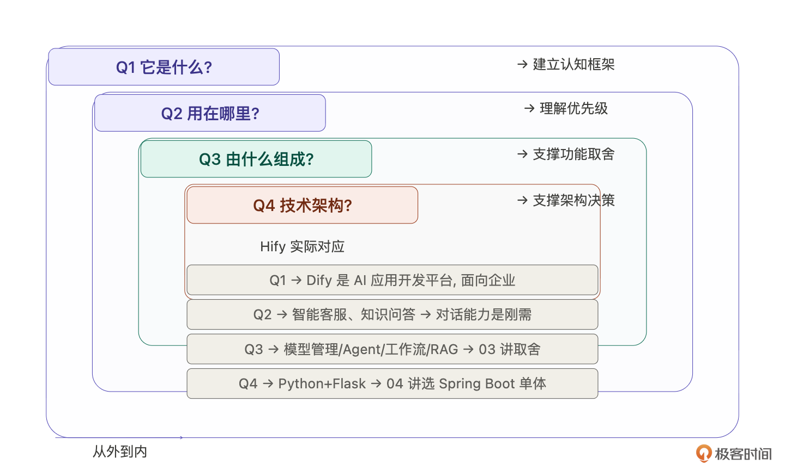
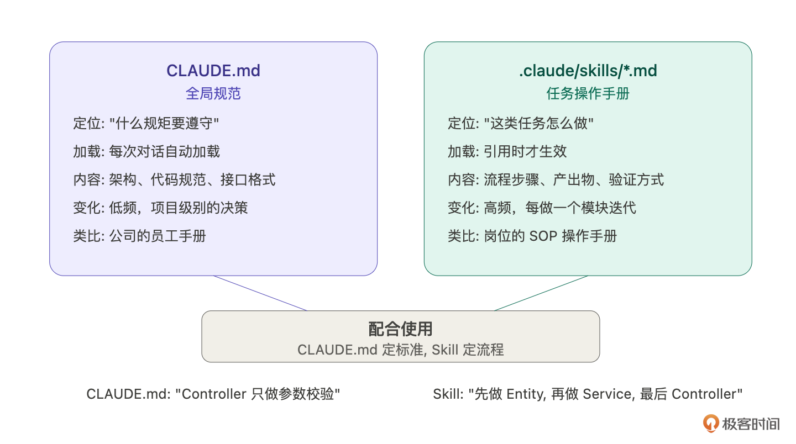
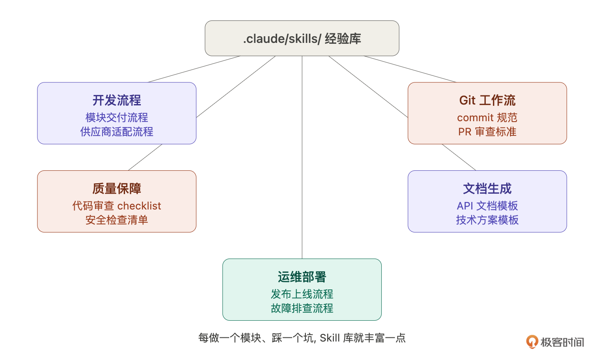
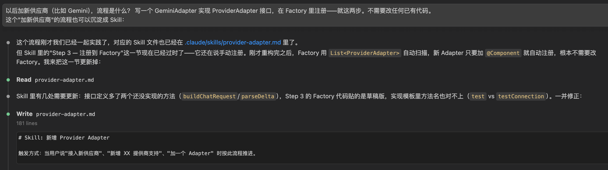

# 14｜把经验变成 Skill：让 Claude Code 自动按流程走
你好，我是Robert。

13讲我们做完了Provider模块，从供应商分析、数据模型设计、后端8个任务到前端对接，半天交付。在继续做下一个模块之前，我们先停下来做两件事。

第一件事：回头看看13讲里真正决定模块质量的是什么。 **不是代码，是代码之前的那些判断——支持哪些供应商、鉴权信息怎么存、健康状态要不要独立成表。这些判断靠的是领域知识**。

第二件事：13讲的交付流程是固定的——咨询→设计→拆解→执行→前端对接→验收。后面做Agent、对话引擎、MCP，每个模块都是这套流程。 **既然固定，为什么不把它告诉Claude Code，让它以后自动按流程走**？

这一讲我们就解决这两个问题。

## 领域理解：被低估的瓶颈

回头看13讲，Claude Code写代码很快，8个任务两三个小时全部交付。但真正决定这个模块做成什么样的，不是代码，而是代码之前的那些判断——一期支持哪些供应商、要不要引入LangChain4j、鉴权信息怎么存、健康检查怎么做。这些判断没有一个是Claude Code替我做的。它给选项，我做取舍。

如果这些判断做反了会怎样？引入LangChain4j，你多了一层重依赖和学习成本。鉴权信息用固定列存，后面加新供应商就得改表。健康状态放在Provider表里，高频探测和业务读竞争锁。每个选择单独看都有道理，合在一起就是一个越来越难维护的系统。

取舍的依据是什么？ **是你对这个领域的理解。Claude Code让执行成本趋近于零之后，领域理解的权重不是降低了，而是大幅提升了**。

好消息是，领域知识不是只能靠经验慢慢积累。 **Claude Code本身就是一个极好的领域学习工具**，关键是你要问对问题。

### 领域快速理解四问

我在动手做Hify之前，用Claude Code跑了一轮系统性的领域梳理。不是漫无目的地问“Dify是什么”，而是按一个固定结构问。



第一问： **它是什么，解决什么问题**？建立认知框架。Dify是AI应用开发平台，让不会写代码的人也能搭建AI应用。这决定了产品定位，它是平台型产品，不是开发者工具。

第二问： **用在哪里，什么场景**？理解优先级。企业用Dify主要做智能客服、内部知识问答、文档处理。这决定了对话能力和工具接入是刚需，工作流编排是进阶需求。13讲从Provider开始做，就是因为理解了场景后知道：没有模型管理，后面所有功能都没有基础。

第三问： **由什么组成，哪些是必要的**？支撑功能取舍。Claude Code列出模型管理、Agent、工作流、RAG、对话、工具接入等模块。追问“哪些是必须有的”，它帮你区分核心和外围，03讲的功能取舍直接基于这一步。

第四问： **技术架构是怎样的**？支撑架构决策。了解到Dify后端是Python + Flask，用Celery做异步任务——不是照抄，而是理解它为什么这么选，然后根据自己的约束做不同选择。04讲选Spring Boot模块化单体，就是在理解了Dify架构复杂度之后的判断。

四个问题从外到内，一两个小时建立70% 的领域认知，剩下30% 靠亲手用一下产品、翻一下文档来补。

这套方法不只适用于Dify。你要做订单系统、监控平台、数据管道，都是同样的路径，先用四问建立全局认知，再进入产品定义和架构设计。拿到任何一个陌生项目，先跑一轮四问，你就知道该做什么、不做什么、先做什么。

## Skill：让Claude Code教你

回到13讲的交付过程。 **你有没有发现，整个流程是固定的**？咨询→设计→拆解→执行→前端对接→验收。后面做Agent、对话引擎、MCP，每个模块都是这五步。既然流程固定，每次都手动给Claude Code描述一遍就是浪费。

Claude Code有一个Skill机制，专门解决这个问题。但与其我来讲概念，不如让Claude Code自己教你。

### 第一步：让Claude Code教你Skill是什么

提示词是：

> Claude Code的Skill机制是什么？怎么创建Skill、怎么使用、Skill文件放在哪里？和CLAUDE.md有什么区别？请详细解释，给我举个例子。

Claude Code会告诉你：

Skill是 `.claude/skills/` 目录下的Markdown文件，定义特定任务的标准操作流程。你可以理解为给Claude Code的“操作手册”。

和CLAUDE.md的区别：



CLAUDE.md是 **全局规范，即“什么规矩要遵守”，每次对话自动加载**。Skill是 **具体任务的操作手册，即“这类任务怎么做”，在你引用时才生效**。CLAUDE.md定义了“Controller只做参数校验”这种通用规矩，Skill定义了“做一个新模块应该先梳理需求再拆解再执行”这种具体流程。

怎么用：给Claude Code指令时提到Skill的名字，它就会按Skill定义的流程执行。比如“按模块交付Skill的流程，帮我做Agent模块”。

看，你不需要去翻文档学Skill的用法，问Claude Code它就教你了。这和10讲的咨询模式一模一样，不懂就问，它见过的项目比你多。所以，把AI当做工具，把AI当作老师。

### 第二步：让Claude Code告诉你别人怎么用Skill提示词是：

> 业界用Claude Code Skill的最佳实践有哪些？大家一般用Skill解决什么问题？给我列举一些常见的Skill类型和使用场景。

Claude Code给的回答会打开你的视野，原来Skill不只能写开发流程。



- 开发流程类：新模块交付流程、API接口开发流程、数据库变更流程。就是我们13讲干的事。

- 质量保障类：代码审查checklist、单元测试编写规范、安全检查清单。比如每次写Service方法都要检查：入参校验了吗？异常处理了吗？缓存失效了吗？日志打了吗？

- 运维部署类：发布上线流程、环境搭建流程、故障排查流程。把运维经验固化，新人也能按流程操作。

- 文档生成类：API文档生成、变更日志生成、技术方案模板。每次写文档不用从零开始，Skill定义了结构和必填项。

- Git工作流类：commit message规范、分支管理流程、PR审查标准。


这些你不需要现在全做，但知道别人怎么用，你对Skill的理解会 **从“一个功能”变成“一种工作方式”**。Skill的本质是 **把经验编码化——你踩过的坑、总结的流程、做过的判断，全部固化成文字，让Claude Code以后自动按你的经验走**。

### 第三步：让Claude Code帮你写Skill知道了Skill是什么、别人怎么用，现在让Claude Code帮你写。

> 我刚完成了Hify项目Provider模块的开发，流程是这样的：
>
> 1. 先用咨询模式梳理了供应商选型、数据模型设计、边界问题
> 2. 数据模型确定后更新了schema.sql
> 3. 后端按MVC分层拆解：Entity+Mapper → DTO → Service（CRUD+连通性测试+模型同步+健康检查）→ Controller
> 4. 每步编译或curl验证通过再进下一步
> 5. 前端对接：创建API文件，把mock数据源换成真实API
> 6. 完整验收：后端curl + 浏览器全流程

> 帮我把这个流程沉淀成一个Skill文件，放在 .claude/skills/module-delivery.md。要求：每一步有明确的产出物和验证方式，关键决策点标注“等待用户确认”，把我踩过的坑写成注意事项。

Claude Code生成第一版，你review。我的review重点：

1. 产出物是否明确？不是“做需求分析”就完了，而是“产出需求分析文档，包含功能范围、数据模型DDL、设计决策及理由”。Claude Code需要知道做到什么程度算完。

2. 决策点是否标注？数据模型设计完、后端做完准备做前端之前——这些是你要拍板的地方，Skill里要写“等待用户确认后再进入下一步”。

3. 踩过的坑有没有写进去？比如，Entity的JSON字段必须用TypeHandler、schema.sql要同步更新、前端对接时要更新路由配置。这些是13讲实际踩过的，写进Skill下次就不会重复踩。


review完让Claude Code改，改完就是你的第一个正式Skill。生成的Skill如下，就不展开说明了，你可以拿着这个Skill内容去问AI是什么意思：

````plaintext
# Skill: 业务模块全流程交付

触发方式：当用户说"开发 XX 模块"、"实现 XX 功能"、"交付 XX" 时，按此流程推进。

---

## 总体原则

- 每步有明确产出物，编译或验证通过再进下一步
- 关键设计决策必须等用户确认，不自行拍板
- 先咨询后实现，先后端后前端

---

## Step 1 — 咨询与设计（不写代码）

**目标**：对齐需求边界和数据模型，避免返工。

**产出物**：
- 候选方案对比表（2-3 个方案，标明取舍）
- 数据模型草稿（表名、核心字段、关联关系）
- 接口清单（Method + Path + 简要说明）

**流程**：
1. 分析业务需求，列出候选技术方案
2. 给出推荐方案及理由
3. 提出需要用户决策的问题（如：是否需要软删除？JSON 字段还是关联表？）

&gt; ⚠️ **等待用户确认**：数据模型和接口设计确认后再进入 Step 2

**注意事项**：
- JSON 字段（如 auth_config）需要用 `&#64;TableName(autoResultMap = true)` + `JacksonTypeHandler`，否则反序列化为 null
- 高频写入的表（如 health 记录）不要继承 BaseEntity（避免逻辑删除和审计字段的写放大）
- 敏感字段（如 api_key）不能出现在任何响应 DTO 中，用 `authConfigured: boolean` 代替

---

## Step 2 — 更新 schema.sql

**目标**：数据库 DDL 与设计对齐。

**产出物**：
- `hify-app/src/main/resources/db/schema.sql` 新增表 DDL
- `hify-app/src/main/resources/db/schema-h2.sql` H2 兼容版本（JSON → CLOB）

**验证**：
```bash
# 用 mock profile 启动，H2 会自动执行 schema-h2.sql
java -jar hify-app/target/hify-app-0.0.1-SNAPSHOT.jar --spring.profiles.active=mock
# 访问 H2 控制台确认表已创建
open http://localhost:8080/h2-console
```

**注意事项**：
- H2 不支持 `JSON` 类型，必须用 `CLOB` 替代，且两个 schema 文件都要维护
- 索引命名规范：`idx_{表名}_{字段名}`
- 所有外键在应用层维护，不建数据库级外键约束

---

## Step 3 — Entity + Mapper

**目标**：ORM 层与数据库表对齐。

**产出物**：
- `entity/XxxEntity.java`（继承 BaseEntity 或独立）
- `mapper/XxxMapper.java`（继承 BaseMapper，复杂查询加 `&#64;Select`）

**验证**：
```bash
mvn clean install -DskipTests -pl hify-{module} -am
```

**注意事项**：
- 有 JSON 字段的 Entity 必须加 `&#64;TableName(autoResultMap = true)`，字段上加 `&#64;TableField(typeHandler = JacksonTypeHandler.class)`
- MyBatis-Plus 3.5.9 分页插件在独立模块 `mybatis-plus-jsqlparser`，缺少会导致 `PaginationInnerInterceptor` 找不到
- 自定义查询方法返回 `Optional&lt;T&gt;` 时用 `&#64;Select` + default 方法封装

---

## Step 4 — DTO

**目标**：定义请求/响应对象，隔离内部实体。

**产出物**：
- `dto/XxxCreateRequest.java`（`&#64;Valid` 校验注解）
- `dto/XxxUpdateRequest.java`
- `dto/XxxQueryRequest.java`（分页参数继承或包含 page/pageSize）
- `dto/XxxDetailResponse.java`（静态工厂方法 `from(entity, ...)`）

**注意事项**：
- 响应 DTO 不能暴露 authConfig / password 等敏感字段
- 分页响应统一用 `PageResult.of(list, total, page, pageSize)`，返回 `Result&lt;PageResult&lt;T&gt;&gt;`
  - ⚠️ 不要让 `PageResult` 继承 `Result`，否则序列化后 `data` 字段是数组，`total` 在外层，前端拦截器解包后丢失 `total`
- `PageResult` 正确结构：`{ "data": { "list": [...], "total": N, "page": 1, "pageSize": 20 } }`

---

## Step 5 — Service（业务逻辑）

**目标**：实现核心业务，接口与实现分离。

**产出物**：
- `service/XxxService.java`（接口）
- `service/impl/XxxServiceImpl.java`（实现）

**流程**：
1. CRUD 基础逻辑（含唯一性校验、级联查询）
2. 特殊业务逻辑（如连通性测试、健康检查）
3. 缓存注解（`&#64;Cacheable` / `&#64;CacheEvict`）

**验证**：
```bash
mvn clean install -DskipTests -pl hify-{module} -am
```

**注意事项**：
- 跨模块调用走 Service 接口，不直接引用其他模块的 Mapper 或 Entity
- 外部 HTTP 调用（如 LLM API 连通性测试）必须设超时，用 `LlmHttpClient` 的 `get(url, headers, testClient)`
- 健康检查定时任务加 `&#64;ConditionalOnProperty(name = "hify.health-check.enabled", havingValue = "true", matchIfMissing = true)`，mock profile 设为 false
- 使用 `&#64;Qualifier("llmExecutor")` 注入线程池，禁止 `new Thread()` 或默认线程池

---

## Step 6 — Controller

**目标**：暴露 REST 接口，只做参数校验和 Service 调用。

**产出物**：
- `controller/XxxController.java`

**验证**：
```bash
mvn clean install -DskipTests
java -jar hify-app/target/hify-app-0.0.1-SNAPSHOT.jar --spring.profiles.active=mock
```

逐条跑 curl：
```bash
# 创建
curl -s -X POST http://localhost:8080/api/v1/{resource} \
  -H 'Content-Type: application/json' \
  -d '{...}' | jq .

# 列表
curl -s 'http://localhost:8080/api/v1/{resource}?page=1&pageSize=10' | jq .

# 详情
curl -s http://localhost:8080/api/v1/{resource}/1 | jq .

# 更新
curl -s -X PUT http://localhost:8080/api/v1/{resource}/1 \
  -H 'Content-Type: application/json' \
  -d '{...}' | jq .

# 删除
curl -s -X DELETE http://localhost:8080/api/v1/{resource}/1 | jq .
```

&gt; ⚠️ **等待用户确认**：所有 curl 返回预期结果后再进入前端对接

**注意事项**：
- Spring Boot 3.2 必须在 `maven-compiler-plugin` 加 `&lt;parameters&gt;true&lt;/parameters&gt;`，否则 `&#64;PathVariable Long id` 参数名无法识别，导致 400 错误
- Controller 只调用 Service，不写业务逻辑，不直接操作 Mapper

---

## Step 7 — 前端 API 文件

**目标**：封装后端接口，定义 TypeScript 类型。

**产出物**：
- `hify-web/src/api/{module}.ts`

**内容**：
- 请求/响应类型定义（与后端 DTO 字段对齐）
- 导出各接口方法（使用 `request.ts` 的 get/post/put/del）

**注意事项**：
- 前端 `request.ts` 拦截器会自动解包 `response.data.data`，API 方法的返回类型直接写业务数据类型，不需要包 `Result&lt;T&gt;`
- 列表接口返回类型写 `PageResult&lt;T&gt;`（包含 list/total/page/pageSize），对应后端解包后的 `data` 字段

---

## Step 8 — 前端页面对接

**目标**：替换 mock 数据，接入真实 API。

**产出物**：
- 更新 `views/{module}/XxxList.vue`

**流程**：
1. 把 HifyTable 的 `api` prop 换成真实 API 方法
2. 表单提交换成 create/update API
3. 删除换成 delete API + useConfirm
4. 按需添加操作按钮（如测试连接）
5. 按需添加状态列（健康状态、关联数量等）

**验证**：
```bash
# 确保后端已启动
java -jar hify-app/target/hify-app-0.0.1-SNAPSHOT.jar --spring.profiles.active=mock

# 启动前端
cd hify-web && npm run dev
```

在浏览器 DevTools → Network 确认：
- 请求打到了后端（状态码 200，非 ERR_CONNECTION_REFUSED）
- 响应 `data.list` 是数组，`data.total` 是数字
- 表格有数据渲染（或显示"暂无数据"而非一直转圈）

&gt; ⚠️ 如果页面一直转圈：先看 Network 标签确认请求状态码，再排查后端是否启动

**注意事项**：
- Vite 代理：`/api` → `http://localhost:8080`，前端 baseURL 设为 `/api`，后端路径 `/api/v1/xxx` 完整保留
- 前端 `env.d.ts` 不要写 `declare module '*.vue' { ... }`，会覆盖 Volar 的真实类型推断，导致组件 ref 的 expose 方法找不到

---

## 常见坑速查

| 现象 | 原因 | 修复 |
|------|------|------|
| 页面一直转圈 | 后端未启动 / 请求 pending | 先看 Network 状态码 |
| 列表有数据但 total=0 不显示分页 | PageResult 继承 Result 导致 data 是数组，total 在外层被拦截器丢弃 | PageResult 改为普通 POJO，data 包含 {list,total} |
| &#64;PathVariable 400 错误 | 缺少 `-parameters` 编译参数 | pom.xml compiler plugin 加 `&lt;parameters&gt;true&lt;/parameters&gt;` |
| JSON 字段反序列化 null | 缺少 autoResultMap=true 或 JacksonTypeHandler | Entity 加注解 |
| mock profile 启动失败 Bean 冲突 | RedisConfig 未排除 | 加 `&#64;Profile("!mock")` |
| H2 启动报 SQL 错误 | schema.sql 用了 MySQL 专属语法（如 JSON 类型） | 维护独立 schema-h2.sql，JSON→CLOB |
| hify-common 改动后运行旧代码 | spring-boot:run 用了旧 jar | 改 hify-common 后必须先 `mvn install` |

````

然后用同样的方式让它写第二个Skill，供应商适配：

> 13讲的连通性测试里，不同供应商的API差异用了if-else，后来我用策略模式重构了。以后加新供应商的流程是固定的：分析API → 实现Adapter → 注册到Factory → 验证。帮我把这个流程也写成Skill，放在 .claude/skills/provider-adapter.md。

provider-adapter.md完整内容如下：

````plaintext
# Skill: 新增 Provider Adapter

触发方式：当用户说"接入新供应商"、"新增 XX 提供商支持"、"加一个 Adapter" 时按此流程推进。

---

## 背景

Provider 的连通性测试、模型同步、调用逻辑按供应商类型有差异。
最初用 switch-case 实现，后来重构为策略模式：

```
ProviderAdapterFactory
  └── Map&lt;ProviderType, ProviderAdapter>
        ├── OpenAiAdapter        (OPENAI / OPENAI_COMPATIBLE / DEEPSEEK)
        ├── AnthropicAdapter     (ANTHROPIC)
        ├── AzureOpenAiAdapter   (AZURE_OPENAI)
        └── OllamaAdapter        (OLLAMA)
```

每个 Adapter 实现统一接口，Factory 按类型路由，新增供应商只需加一个 Adapter 类 + 注册，不改任何已有代码。

---

## Step 1 — 分析目标供应商 API

**目标**：搞清楚接入该供应商需要哪些差异化实现。

需要调研的问题（逐一回答）：

| 问题 | 说明 |
|------|------|
| 认证方式 | Bearer Token / API Key Header / 双 Header / 无认证？ |
| 列模型接口 | URL 路径？返回结构（`data[]` / `models[]` / 其他）？ |
| 必填 authConfig 字段 | 如 `apiKey`、`apiVersion`、`anthropicVersion` |
| baseUrl 默认值 | 官方默认是什么？用户可否自定义？ |
| 特殊请求头 | 如 Anthropic 的 `anthropic-version` |
| Chat 调用路径 | `/v1/chat/completions` 还是其他？ |
| 流式响应格式 | SSE `data: {...}` 标准格式，还是自定义格式？ |

**产出物**：一份简短的 API 特征说明（口头或注释均可）

&gt; ⚠️ **等待用户确认**：API 特征分析结果确认后再写代码

---

## Step 2 — 实现 Adapter

**目标**：新建一个实现 `ProviderAdapter` 接口的类。

**接口定义**（位于 `hify-provider/.../adapter/ProviderAdapter.java`）：

```java
public interface ProviderAdapter {
    /** 该Adapter支持的供应商类型（可多个） */
    List&lt;String> supportedTypes();

    /** 连通性测试，返回延迟和模型数 */
    ConnectionTestResult test(Provider provider, OkHttpClient testClient);

    /** 拉取并返回模型列表（用于同步） */
    List&lt;String> listModels(Provider provider, OkHttpClient client);

    /** 构造chat请求体（流式） */
    RequestBody buildChatRequest(Provider provider, List&lt;ChatMessage> messages);

    /** 解析流式响应的一行delta文本，无内容返回null */
    String parseDelta(String line);
}
```

**文件位置**：`hify-provider/src/main/java/com/hify/provider/adapter/impl/XxxAdapter.java`

**实现模板**：

```java
@Component
public class XxxAdapter implements ProviderAdapter {

    private final ObjectMapper objectMapper;

    @Override
    public List&lt;String> supportedTypes() {
        return List.of("XXX");
    }

    @Override
    public ConnectionTestResult test(Provider provider, OkHttpClient testClient) {
        long start = System.currentTimeMillis();
        try {
            String apiKey = getAuth(provider, "apiKey");
            String url = provider.getBaseUrl().stripTrailing() + "/v1/models";
            Map&lt;String, String> headers = Map.of("Authorization", "Bearer " + apiKey);

            String body = llmHttpClient.get(url, headers, testClient);
            int latency = (int) (System.currentTimeMillis() - start);
            int modelCount = parseDataArraySize(body);
            return ConnectionTestResult.ok(latency, modelCount);
        } catch (LlmApiException e) {
            return ConnectionTestResult.fail(e.getMessage());
        } catch (Exception e) {
            return ConnectionTestResult.fail("测试异常：" + e.getMessage());
        }
    }

    // ... 其他方法
}
```

**注意事项**：
- `getAuth(provider, key)` 找不到字段时抛 `IllegalArgumentException("authConfig 缺少字段：" + key)`，会被上层统一捕获，不要吞掉
- 解析模型列表时不同供应商返回字段不同：OpenAI 是 `data[].id`，Ollama 是 `models[].name`，Anthropic 是 `data[].id`
- 流式解析：OpenAI 格式每行是 `data: {...}`，遇到 `data: [DONE]` 停止；Anthropic 是 `data: {"type":"content_block_delta",...}`
- 有特殊 Header 的（如 Anthropic `anthropic-version`）放在 authConfig 里，不要硬编码版本号

**验证**：
```bash
mvn clean install -DskipTests -pl hify-provider -am
```

---

## Step 3 — 注册到 Factory

**目标**：让 Factory 能路由到新 Adapter。

**Factory 实现**（位于 `hify-provider/.../adapter/ProviderAdapterFactory.java`）：

```java
@Component
public class ProviderAdapterFactory {

    private final Map&lt;String, ProviderAdapter> adapterMap;

    // Spring自动注入所有ProviderAdapter实现
    public ProviderAdapterFactory(List&lt;ProviderAdapter> adapters) {
        this.adapterMap = new HashMap&lt;>();
        for (ProviderAdapter adapter : adapters) {
            for (String type : adapter.supportedTypes()) {
                adapterMap.put(type.toUpperCase(), adapter);
            }
        }
    }

    public ProviderAdapter get(String type) {
        ProviderAdapter adapter = adapterMap.get(type.toUpperCase());
        if (adapter == null) {
            throw new BizException(ErrorCode.PROVIDER_TYPE_NOT_SUPPORTED);
        }
        return adapter;
    }
}
```

**注册方式**：新 Adapter 加 `&#64;Component` 注解，`supportedTypes()` 返回对应的类型字符串，Factory 在启动时自动扫描注册，**无需手动修改 Factory 代码**。

**验证**：启动后在日志里确认 adapterMap 包含新类型（可在 Factory 构造方法加一行 log）。

---

## Step 4 — 更新 ProviderType 枚举（如需要）

如果新供应商需要在前端下拉菜单里出现，同步更新：

- 后端：`hify-provider/.../constant/ProviderType.java`（如果有枚举）
- 前端：`hify-web/src/views/provider/ProviderList.vue` 的 `providerTypes` 数组
- 数据库：`provider.type` 是 varchar，无需迁移，直接用新字符串值

---

## Step 5 — 验证

### 后端 curl 验证
```bash
# 1. 创建新供应商
curl -s -X POST http://localhost:8080/api/v1/providers \
  -H 'Content-Type: application/json' \
  -d '{
    "name": "测试-XXX",
    "type": "XXX",
    "baseUrl": "https://api.xxx.com",
    "authConfig": { "apiKey": "sk-test-xxx" }
  }' | jq .

# 2. 连通性测试（id替换为上一步返回的id）
curl -s -X POST http://localhost:8080/api/v1/providers/1/test-connection | jq .
```

**预期**：
- 真实 key：`success: true`，有 `latencyMs` 和 `modelCount`
- 假 key：`success: false`，`errorMessage` 包含"无效"或"认证失败"，**不能是 500**

### 浏览器验证
1. 前端下拉能选到新类型
2. 创建后列表显示正常
3. 点"测试"按钮有结果提示

---

## 常见坑

| 现象 | 原因 | 修复 |
|------|------|------|
| Factory 找不到新 Adapter | 忘加 `&#64;Component` 或 `supportedTypes()` 返回值大小写不一致 | Factory 用 `toUpperCase()` 统一，Adapter 返回值也大写 |
| authConfig 字段缺失导致 500 | 前端创建时没传必填的 auth 字段 | `getAuth()` 的异常信息要明确说缺哪个字段 |
| 连通性测试超时 | 用了默认 OkHttpClient（无超时限制） | 必须用注入的 `testClient`（10s 超时），不要 new |
| 模型数量永远是 0 | 响应结构解析错误（字段名不是 `data`） | 用 `objectMapper.readTree(body)` 打印原始结构再解析 |
| 流式响应乱码/截断 | Anthropic 等有自己的 SSE 事件类型，直接用 OpenAI 解析逻辑会漏掉 | `parseDelta()` 按各供应商格式单独实现 |

````

在我们写了两个Skill后，你就会发现：

1. **原来Skill就是写MarkDown文档**。

2. **Skill就是按格式定规范，在MarkDown里面写好规范，让Claude Code去识别执行**。


接下来我们实际跑一遍Skill，看一下它的用途。

### 实际跑一遍：用Skill启动Agent模块Skill写好了，当场验证。给Claude Code：

> 按模块交付Skill的流程，帮我做Agent管理模块。先从第一步开始，梳理Agent模块的需求和数据模型。

Claude Code读到Skill后，自动按流程走。它会问你Agent模块的核心功能是什么、涉及哪些关联（绑定模型、绑定工具）、数据模型怎么设计，然后给出需求分析文档，标注“等待用户确认”。

对比没有Skill时：你要手写一大段指令描述整个流程，先帮我分析需求，然后设计数据模型，然后按Entity、DTO、Service、Controller的顺序拆解……现在一句话就够了。

而且Skill保证了流程一致性，不管是你自己做还是团队里其他人做，引用同一个Skill，产出的代码结构和质量标准是一样的。

我不会在这一讲展开Agent模块的具体实现（那是下一讲的内容），但你已经看到了Skill驱动开发的效果：你的经验在Skill里积累，Claude Code按你的经验走，你只需要在关键决策点拍板。

### Skill也需要迭代

最后提一点：第一版Skill不会完美。

你用模块交付Skill做了Agent模块，可能发现Skill里没提“跨模块依赖怎么处理”——Agent依赖Provider和MCP，这在13讲做Provider时没遇到。把这个补进Skill。

做了对话引擎，可能发现Skill里的后端拆解不适用于流式响应场景，需要加一条“如果涉及SSE流式响应，Service层用SseEmitter + llmExecutor”。补进去。

Skill和CLAUDE.md一样是活文档。02讲说的SDD闭环——定规范→AI执行→发现问题→迭代规范——在Skill上同样适用。每做一个模块，Skill就更完善一点。做到第四五个模块的时候，你的Skill已经覆盖了绝大多数场景，Claude Code几乎不需要额外指导就能按你的标准交付。

## 用Skill思维重构if-else

13讲连通性测试里，不同供应商的API差异用了if-else处理。当时说“先跑通，下一讲重构”。现在来做。

重构本身不复杂，用策略模式替代if-else：

> 重构Provider模块的连通性测试。当前是if-else按type分发，改成策略模式：
>
> 1. 定义ProviderAdapter接口：testConnection(provider)、listModels(provider)
> 2. 实现四个适配器：OpenAiAdapter、AnthropicAdapter、OllamaAdapter、OpenAiCompatibleAdapter（和OpenAiAdapter共用逻辑）
> 3. 创建ProviderAdapterFactory：根据provider.type返回对应的Adapter实例
> 4. ProviderService里的if-else替换为factory.getAdapter(provider.getType()).testConnection(provider)
> 5. OpenAiCompatibleAdapter直接继承OpenAiAdapter，不需要额外代码

这个指令我就不分析输出了，因为重要的是这个问题和指令本身。

重构完之后，思考一个问题：以后加新供应商（比如Gemini），流程是什么？ 写一个GeminiAdapter实现ProviderAdapter接口，在Factory里注册——就这两步。不需要改任何已有代码。

这个“加新供应商”的流程也可以沉淀成Skill：



如上图所示，我们不用去写一行代码，这个Skill也沉淀下来了。所以你看，Skill不只是大流程，小流程也可以沉淀。大的“模块交付Skill”覆盖通用的模块开发流程，小的“供应商适配Skill”覆盖特定场景的操作步骤。积累下来，你的 `.claude/skills/` 目录就是一个越来越丰富的经验库。

## 总结

这一讲做了三件事： **讲清楚领域理解的重要性**、 **让Claude Code教你Skill并帮你写Skill**、 **用策略模式重构if-else并沉淀适配Skill**。

也就是从方法论上总结， **我们应该怎么思考问题，应该让我们的思考到执行模板化**。这里展开说一下，AI给我们带来的最大的效率提升，是它能帮我们做很多模板化的事情。有一个经验是： **脏活累活，我们嫌烦没有技术含量的，都是适合AI做的**。

两个方法论输出：

- **领域快速理解四问**。进入一个陌生领域时用——是什么、用在哪里、由什么组成、技术架构怎样。一两个小时建立70% 的认知，支撑产品定义和架构决策。

- **Skill沉淀**。不需要你自己研究Skill怎么写——让Claude Code教你概念、告诉你别人怎么用、帮你把经验写成Skill文件。你只需要做两件事：把你的实际流程描述给它，以及review它生成的Skill是否准确。Skill也是活文档，每做一个模块就迭代一次，越来越完善。


从下一讲开始，每个模块都用Skill驱动开发。你会明显感觉到节奏变快了，不是因为Claude Code变聪明了，而是你的经验在Skill里持续积累，它按你的经验走，你只在关键决策点拍板。

## 思考题

回顾你过去做项目的经验，有没有哪些“每次都要做、每次都差不多”的流程？比如接入一个新的第三方SDK、搭建一个新的微服务、做一轮性能测试。选一个，试着把它写成一个Skill。Skill应该覆盖：第一步做什么、第二步做什么、每步的输出是什么、怎么验证。写完之后让Claude Code按这个Skill执行一次，看看效果如何。

期待你的分享！如果今天的课程让你有所收获，也欢迎转发给有需要的朋友，邀请他来一起学习，我们下节课再见！