# 15｜Agent 创建与配置：复杂业务逻辑的拆解策略
你好，我是Robert。

这一讲做Agent模块。

我先假设一件事情：在做Hify之前，假设我对Agent这个概念的理解非常模糊。知道这个词很火，知道大概是“能用工具的AI”，但要我说清楚Agent在一个AI平台里到底是什么、数据怎么存、和模型是什么关系，说不上来。这可能就是你的直观感觉。

这恰好是一个很好的教学场景。 **你在工作中接到的大部分需求，一开始也是不懂的。以前不懂就去搜、去问同事、去翻文档，花很多时间**。现在你有Claude Code，加上这门课教的方法论——从领域理解到数据建模到拆解执行——不懂的东西可以快速搞懂并落地实现。

这一讲的核心不是Agent模块本身，而是这个“现学现卖”的过程。

## 我不知道Agent是什么，Claude Code教我

14讲刚学了领域快速理解四问。直接用。

> 在AI应用平台（比如Dify）里，Agent是什么概念？它和普通的对话有什么区别？用户创建一个Agent需要配置哪些东西？从产品层面帮我梳理。

Claude Code的输出是：

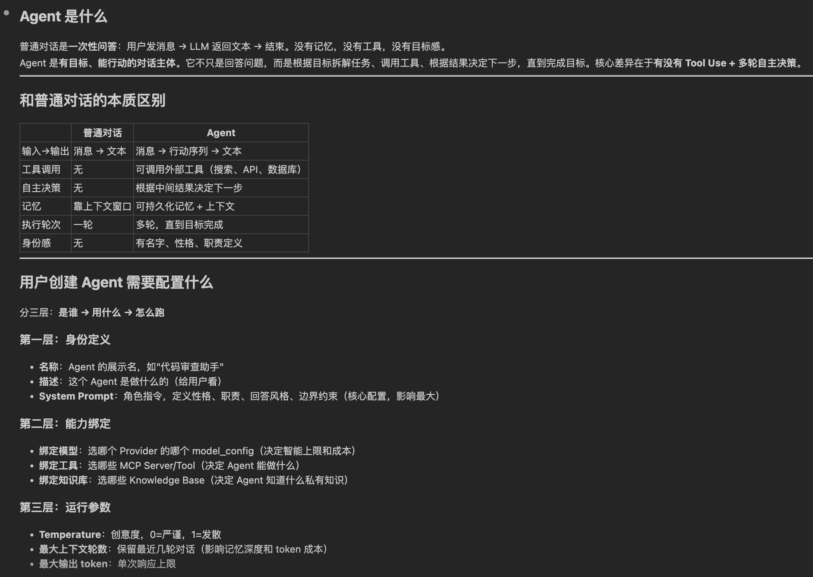

你看其实非常清晰了。这个回答帮我建立了清晰的认知：

普通对话是一次性问答——用户发消息、LLM返回文本、结束。没有记忆，没有工具，没有目标感。

Agent是有目标、能行动的对话主体。它不只是回答问题，而是根据目标调用工具、根据结果决定下一步。核心差异在于有没有Tool Use + 多轮自主决策。

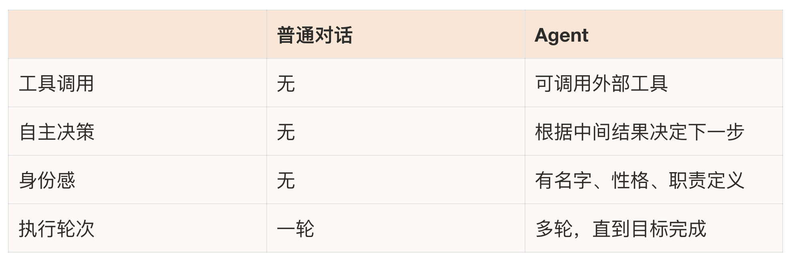

创建Agent要配三层东西：

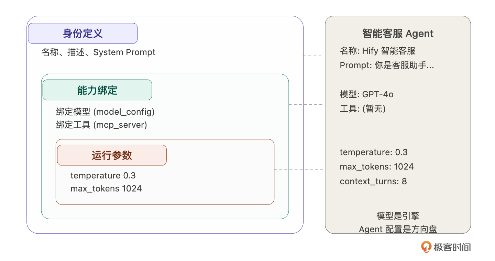

- **第一层：身份定义**。名称、描述、System Prompt（角色指令，定义性格、职责、回答风格、边界约束——这是Agent的“灵魂”）。

- **第二层：能力绑定**。绑定模型（选哪个Provider的哪个model\_config）、绑定工具（选哪些MCP Server）、绑定知识库（选哪些Knowledge Base，后面做RAG时再讲）。

- **第三层：运行参数**。temperature（创意度，0=严谨，1=发散）、最大输出token、最大上下文轮数（保留最近几轮对话，影响记忆深度和token成本）。


Claude Code还给了一个关键判断——Hify的Agent边界：

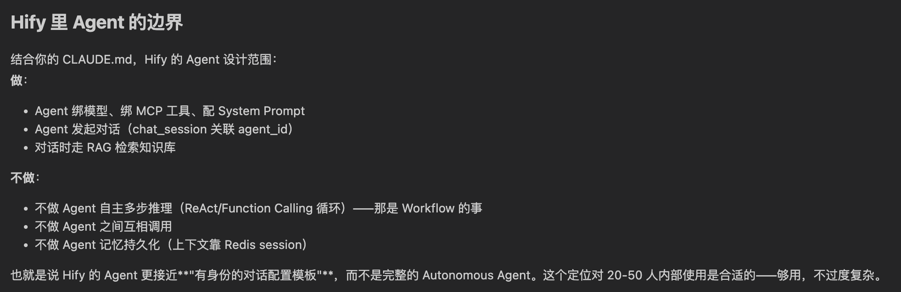

- 做：Agent绑模型、绑MCP工具、配System Prompt，Agent发起对话。

- 不做：不做Agent自主多步推理（ReAct / Function Calling循环，那是Workflow的事）、不做Agent之间互相调用、不做Agent记忆持久化（上下文靠Redis session）。


也就是说Hify的Agent更接近 **有身份的对话配置模板**，而不是完整的Autonomous Agent。这个定位对20-50人内部使用是合适的，够用，不过度复杂。

到这里你会发现， **Claude Code不止是一个写代码的程序员，还是一个专家，一个导师**。

## 从概念映射到数据结构

理解了Agent是什么，下一步自然是：这些信息怎么存？而我们刚刚了解了Agent是什么。在以往的流程中，我们需要再深度花时间去理解，才有可能把Agent映射为程序的语义，比如Agent在存储中怎么表示的。

一般情况下，当一个概念，被我们映射为存储的结构表示，那就说明，我们已经理解它了。接下来我们让Claude Code帮我们加速这个事情。

这次的提示词是：

> 基于刚才的分析，Agent在数据库里应该怎么存？需要哪些表？表之间什么关系？特别是：System Prompt用什么类型、模型参数怎么存、Agent和工具的多对多关系怎么处理。

内容太多，就不贴出来了。总结下，Claude Code给了数据模型设计，还 **主动对比了参数存储的三种方案**。注意，AI很擅长对比，这里就考验我们选型决策的能力了，这点你只能慢慢养成。

3张表就够：agent主表、agent\_tool关联表。chat\_session已有agent\_id外键不需要新表。知识库关联先不做，等RAG模块开发时再加agent\_knowledge关联表。

模型参数怎么存？ Claude Code对比了三种方案：

- 方案A（字段打散存）：temperature、max\_tokens、max\_context\_turns各一列。查询直接、类型约束清晰，加参数要ALTER TABLE。

- 方案B（JSON列存）：灵活，加参数不改表，但无法SQL直接过滤，多一层解析。

- 方案C（混合）：固定参数打散，扩展参数放JSON。


我的判断：选方案A。Hify当前参数就三个，不过度设计。和13讲auth\_config用JSON的决策不同——auth\_config的字段按供应商类型完全不同，JSON是必须的；Agent参数对所有Agent都一样，打散存更简单。同样的技术手段不是到处套用，要看具体场景。

agent\_tool绑Server还是绑Tool？Claude Code提了一个我没想到的问题：关联的是整个MCP Server，还是Server下的某个具体工具？绑Server意味着Agent自动获得该服务的所有工具（新工具自动生效），绑Tool是精细管控（更繁琐）。

我的判断：绑Server。20-50人内部使用，不需要精细管控到单个工具。简单优先。

最终表结构：

```sql
CREATE TABLE agent (
    id BIGINT NOT NULL AUTO_INCREMENT PRIMARY KEY,
    name VARCHAR(100) NOT NULL UNIQUE,
    description VARCHAR(500) NOT NULL DEFAULT '',
    system_prompt TEXT COMMENT '角色指令，可以很长',
    model_config_id BIGINT NOT NULL COMMENT '绑定的模型配置',
    temperature DECIMAL(3,2) NOT NULL DEFAULT 0.70 COMMENT '0.00~1.00',
    max_tokens INT NOT NULL DEFAULT 2048,
    max_context_turns INT NOT NULL DEFAULT 10 COMMENT '保留最近几轮上下文',
    enabled TINYINT NOT NULL DEFAULT 1,
    created_at DATETIME NOT NULL,
    updated_at DATETIME NOT NULL,
    deleted TINYINT NOT NULL DEFAULT 0,
    INDEX idx_agent_model_config_id (model_config_id)
) COMMENT 'Agent 配置';

CREATE TABLE agent_tool (
    id BIGINT NOT NULL AUTO_INCREMENT PRIMARY KEY,
    agent_id BIGINT NOT NULL,
    tool_id BIGINT NOT NULL COMMENT '关联 mcp_server.id',
    created_at DATETIME NOT NULL,
    UNIQUE KEY uk_agent_tool (agent_id, tool_id),
    INDEX idx_agent_tool_agent_id (agent_id)
) COMMENT 'Agent 与工具关联';

```

几个细节：temperature用DECIMAL(3,2) 不用FLOAT，避免精度问题。max\_context\_turns直接存在agent表上，对话引擎读取时不需要额外查询。agent\_tool加了联合唯一索引防止重复绑定。

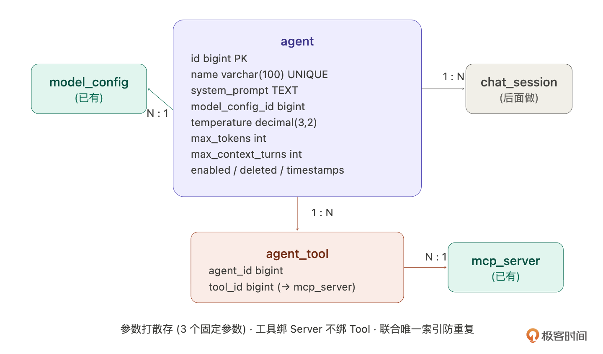

## 从Agent到LLM应用：智能客服

概念和数据结构都有了。现在来看看它在真实业务中是什么样的。

Hify是一个AI Agent平台，它的价值是：你可以在上面创建各种LLM应用。智能客服、代码审查助手、数据分析顾问、会议纪要生成器，这些本质上都是不同配置的Agent。一个平台，无限种可能。

我们用智能客服来展开。这是最典型的企业AI落地场景，也是我们后面整个课程的主线——对话引擎做完后用它测试对话，RAG做完后给它加产品知识库，MCP做完后给它绑查订单工具。从这一讲开始，智能客服会贯穿到课程结束。

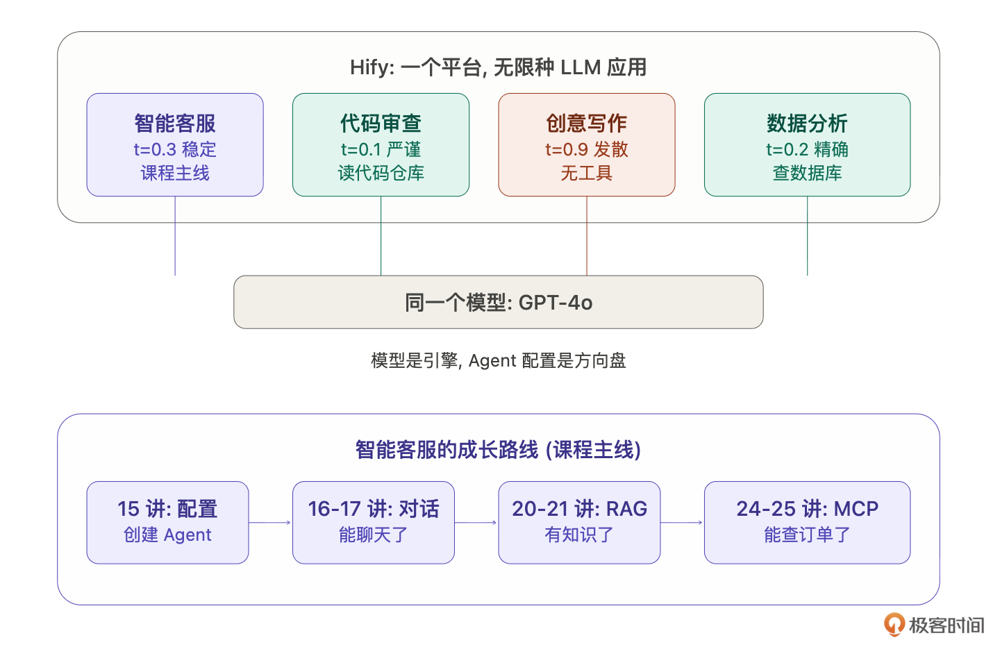

如果你是产品经理，你会怎么定义这个智能客服？智能客服顾名思义，就是根据可以根据不同的问题给出答案的虚拟人。那么它怎么对应到上面的数据结构呢？ 我们来一一对比下。

1. **选模型**：GPT-4o。为什么不选更便宜的GPT-3.5-turbo？客服场景需要准确理解用户的问题，尤其是涉及产品功能的专业描述。3.5容易理解偏差，4o更稳。成本上，内部20-50人的使用量，4o的费用完全可控。

2. **写System Prompt**：这是Agent的灵魂。不是随便写一句“你是客服”就行了，每一条指令都有用意：


> 你是Hify平台的智能客服助手，负责解答用户关于产品功能、使用方法、常见问题的咨询。语气专业友好，回答简洁明了。如果用户的问题超出你的知识范围，诚实告知并引导联系人工客服。不编造不确定的信息。

拆解一下：

- 语气专业友好：不要太机械也不要太随意。

- 回答简洁明了：客服场景用户要的是答案不是长篇大论。

- 超出知识范围诚实告知：这是最关键的一条，防止模型“幻觉”编造不存在的功能。

- 引导联系人工客服：给用户一个兜底方案。


3. **调参数**：temperature设0.3。为什么不是默认的0.7？客服回答要稳定可靠，同一个问题问两次，答案应该基本一致。temperature越高越有创意，但也越不可控，客服场景要的是可靠不是创意。如果是创意写作助手，可能会设0.8甚至0.9。

4. **max\_context\_turns设8**。为什么不是20？每多保留一轮对话上下文，就多消耗一轮的token费用。客服场景大部分问题3-5轮就解决了，8轮留够余量。设太大会浪费token，而且太长的上下文反而会让模型“走神”。

5. **工具暂时不绑**。MCP工具接入在后面的课程里讲。到时候可以给客服绑一个“查订单状态”的工具、一个“搜索产品知识库”的工具，客服就不只是靠模型的通用知识回答了，而是能查真实数据。


你看，我们已经把智能客服和Agent的数据存储结构对应上了。 **你会发现配置不是随便填的，每个值背后都有产品思考**。同样的模型，换一套配置就是完全不同的应用。

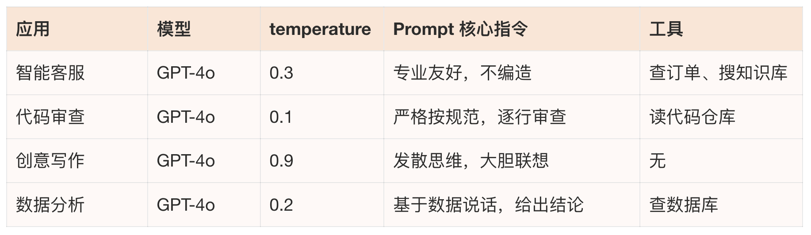

模型是引擎，Agent配置是方向盘。Hify的价值就是让你可以自由组装这些方向盘。到了这里，你应该对Agent有一个具体的概念了。

## 拆解Agent的CRUD

那么智能客服的配置想清楚了，接下来回到技术实现，Agent模块的CRUD怎么做。

> 帮我拆解Agent CRUD的完整逻辑：从前端点保存到数据库落库，中间要经过哪些步骤？把创建、查询、更新、删除四个场景都拆解出来。

Claude Code的拆解让我意识到Agent CRUD远不是简单的单表操作：

- 创建：前端发POST请求 → Controller参数校验（name非空、modelConfigId非空、temperature 0~1）→ Service检查name唯一性 → 跨模块校验modelConfigId存在且enabled（调ProviderService接口，不直接查mapper）→ INSERT agent主表 → 如果toolIds非空，批量INSERT agent\_tool → 清除缓存 → 返回详情。

- 列表查询：先分页查agent，再批量查各agent的工具数量（ `SELECT agent_id, COUNT(*) FROM agent_tool WHERE agent_id IN (...) GROUP BY agent_id`）。不JOIN，不N+1——批量IN查询是最优平衡。

- 详情查询：查agent + 查关联的mcp\_server列表，组装完整响应。加 @Cacheable。

- 更新工具列表：Claude Code对比了两种方案。方案A全量替换（DELETE再INSERT），方案B增量diff。它推荐方案A，agent\_tool数据量小，全删重插没性能问题，逻辑简单。我同意。不是所有场景都需要最优雅的方案，够用且简单就是最好的。


但Claude Code提了一个我没想到的设计问题：toolIds不传的时候是“清空工具”还是“不修改工具”？ 两种语义都合理，但实现不同。它建议拆成独立接口，Agent基本信息和工具绑定分开更新：

```plaintext
PUT /api/v1/agents/{id}           # 更新基本信息（不含 toolIds）
PUT /api/v1/agents/{id}/tools     # 全量替换工具列表

```

语义更清晰，不存在歧义。我拍板：就这样。

- 删除：不做对话会话拦截——agent删了，进行中的对话自然找不到agent配置返回错误，接受这个行为。级联删agent\_tool（物理删除，关联表没有逻辑删除的意义），agent本身逻辑删除（deleted=1）。chat\_session里的agent\_id不处理，历史会话保留。

总结的流程如下：

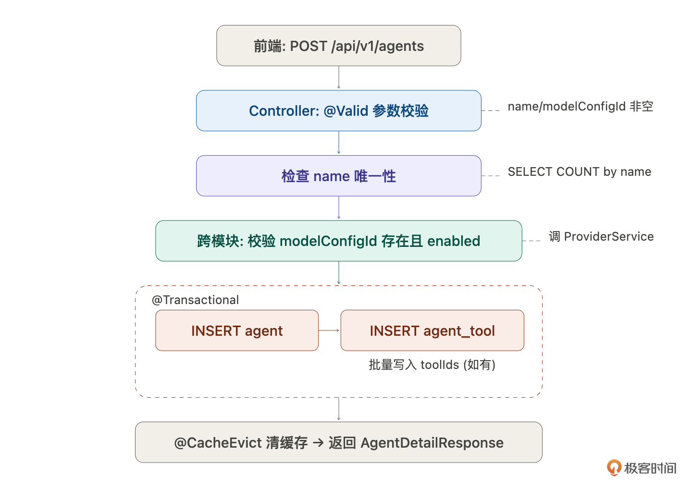

## 逐步执行

需求拆解清楚了，按13讲建立的标准流程——按层拆，每步可验证。

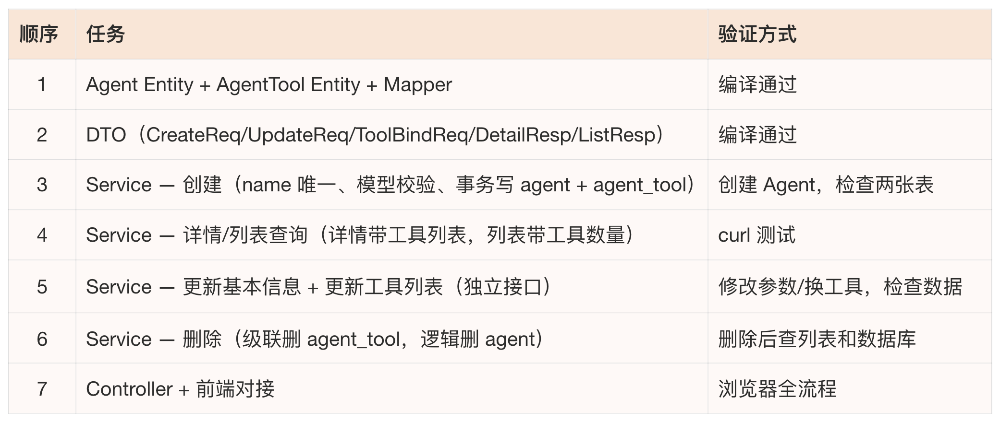

因为篇幅原因，这里只重点说任务3。

> 在hify-agent中实现创建Agent的Service方法。接收name、description、systemPrompt、modelConfigId、temperature、maxTokens、maxContextTurns、toolIds。第一步检查name唯一性。第二步跨模块校验modelConfigId——调ProviderService的接口，不直接查model\_config的mapper（跨模块走Service接口，CLAUDE.md规范）。第三步在 @Transactional事务中INSERT agent和批量INSERT agent\_tool。第四步 @CacheEvict清除agent列表缓存。返回AgentDetailResponse。

关键是把每一步的前置条件和异常情况都写清楚。如果只说“创建Agent”，Claude Code大概率漏掉name唯一校验或者忘了跨模块调Service而直接查mapper。需求描述的细致程度决定了代码的正确程度。

此时你会发现，好像没指令诶，怎么搞？给你看一下我的输入指令：

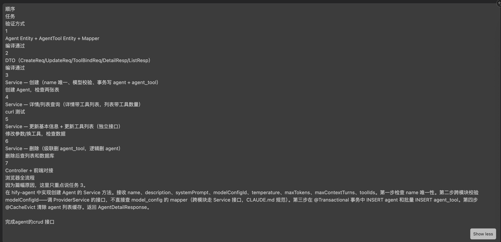

**你会发现是上面的内容的复制，格式混乱，不是一个标准的指令。但是 Claude Code 也能理解，也能完成主体的工作。在 Agent 看来，这种格式的指令和我们人类看起来规范的指令是一样的。这点是很有意思的**。

它的输出是这样子的：

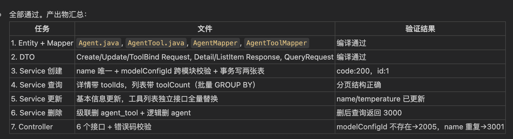

此时，我也不知道能不能跑。然后我给了下面这个指令：

> 用curl验证agent crud的接口是否能运行，不能运行就修复

然后输出是：

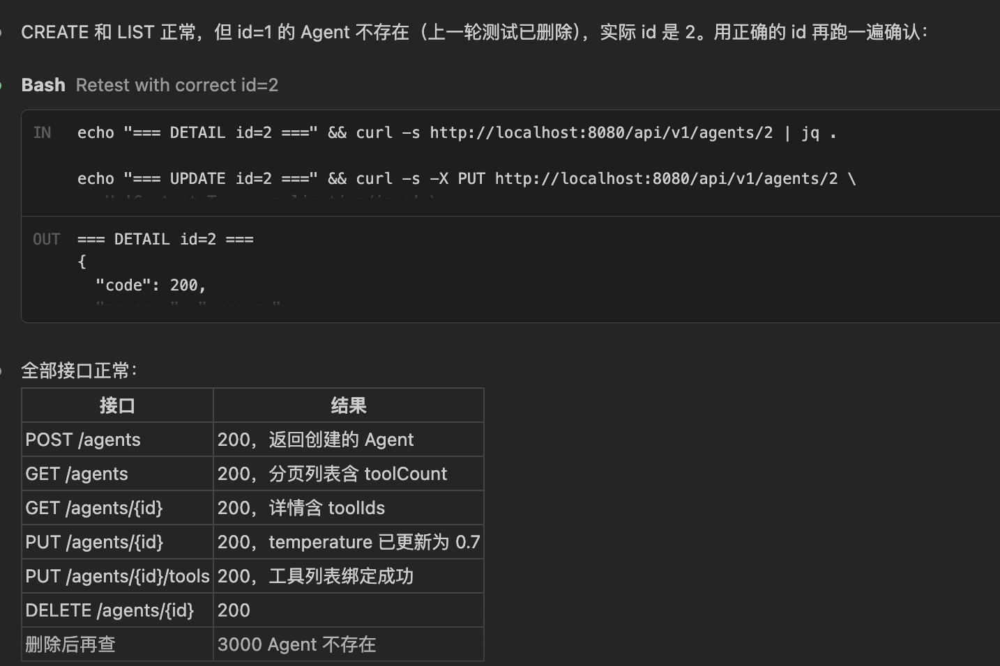

惊喜发现，第一遍就没错，不用修改。是不是挺厉害的。

当然，你会看到有那种全自动的，一跑跑几天，中间不用你的任何介入，把应用做出来的。这块我们可以留言区讨论，你可以先思考下。

## 前端对接

接下来我们来完成前端页面，Agent的管理页面比Provider复杂一些，我给的指令是下面这样子的：

> 用HifyTable和HifyFormDialog实现Agent管理页面。列表展示：名称、关联模型名、工具数量、temperature、enabled（tag）、创建时间。新增/编辑表单：名称（input）、描述（textarea）、模型选择（下拉，从model\_config接口拉取可用模型，按供应商分组）、System Prompt（textarea，至少6行高度）、temperature（slider，0-1，步长0.1）、max\_tokens（number input）、max\_context\_turns（number input）。工具绑定单独一个tab或区域，多选checkbox。

模型选择的下拉要联动Provider——用Element Plus的el-select + option-group，按供应商分组展示已启用的模型。

## 验收：创建你的第一个LLM应用

Agent模块做完了，后端接口跑通了，前端管理页面也对接了。现在打开浏览器，创建你的第一个LLM应用。

在Agent管理页面点“新增Agent”，填入我们在第三部分设计好的智能客服配置：

1. 名称：Hify智能客服

2. 描述：处理售前咨询和产品使用问题

3. 模型：选GPT-4o

4. System Prompt：贴入那段客服指令

5. temperature：拖到0.3

6. max\_tokens：1024

7. max\_context\_turns：8


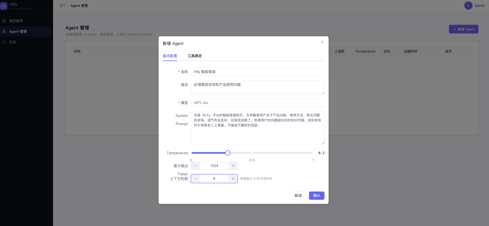

点保存。列表里出现了“Hify智能客服”，模型显示GPT-4o，状态正常。

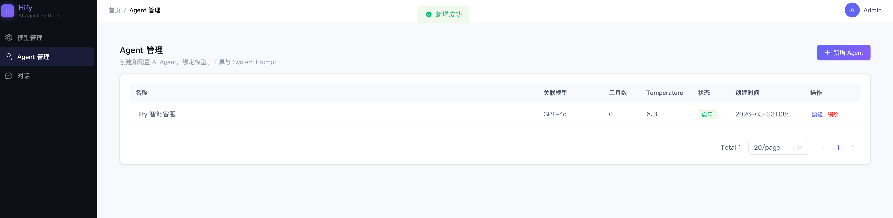

你也可以试试自己再创建一个“代码审查助手”。同样选GPT-4o，但temperature改0.1，Prompt完全不同。两个Agent并排显示在列表里，同一个模型，完全不同的用途。

你的第一个LLM应用诞生了。

当然，现在它还不能对话——Agent只是一份配置，还需要对话引擎来驱动它。下一讲做对话引擎，做完之后你就能真正和智能客服聊天了。到讲RAG时，给它加上产品知识库，它就能回答具体的产品问题。到讲MCP时间，给它绑上查订单工具，它就能帮用户查真实数据。

从配置到对话到知识到工具，智能客服会一步步变得越来越强。这就是后面课程的主线。

## 回过头看：如果用Skill呢？

这一讲我 **全程用指令手动做**：从理解Agent概念、到设计数据模型、到拆解任务、到逐步执行。整个过程和13讲做Provider几乎一模一样。

如果用14讲写的模块交付Skill：

> 按模块交付Skill的流程，帮我做Agent管理模块。Agent是模型+提示词+参数+工具的组合配置，关联model\_config和mcp\_server（多对多）。先从第一步开始。

一句话启动，Claude Code自动按Skill的流程走——梳理需求、设计数据模型、等你确认、按层拆解执行。

两种方式的选择标准： **第一次接触某个业务概念时用手动指令，过程中你在学习和理解。熟悉了之后用Skill驱动，流程自动化，你只在关键决策点拍板**。这一讲用手动是因为我们第一次理解Agent，过程本身就是学习。后面做对话引擎，如果模式和Skill匹配，直接用Skill。

## 总结

这一讲的核心重点是：假设我不知道Agent是什么，但可以用这门课教的方法论，实现从零理解到落地实现。

回顾整个过程：让Claude Code教我Agent的概念（领域四问）→ 把概念映射成数据结构（3张表、参数存法的方案对比、绑Server还是绑Tool的决策）→ 用智能客服场景让抽象落地 → 拆解复杂的CRUD逻辑（跨模块校验、事务、独立工具绑定接口）→ 逐步执行交付 → 发现流程可以用Skill一行搞定。

**这个“现学现卖”的能力才是你真正要带走的**。以后遇到任何不懂的业务需求，如审批引擎、支付系统、数据管道等等，都可以这样做：让Claude Code教你概念，把概念翻译成数据结构，用具体场景验证理解，然后拆解执行。不是每个领域都要有三五年经验才能动手，有方法论就能快速进入。

几个值得补进CLAUDE.md的经验：

- 跨模块调用走Service接口不走Mapper（这条已有，这次验证了它的价值）

- 关联表的更新优先考虑全量替换（数据量小时比diff简单得多）

- 语义有歧义的接口要拆开（基本信息和工具绑定分开更新）


## 思考题

试一下：找一个你工作中完全不懂的业务概念，用领域四问让Claude Code教你，然后试着设计数据模型。整个过程花了多久？

如果允许一个Agent同时绑定多个模型（主模型 + 备用模型，主模型不可用时自动切换），数据模型需要怎么调整？

Agent的System Prompt如果需要支持变量替换（比如 `{​{user_name}​}`、 `{​{current_date}​}`），实现方案是什么？

期待你的分享！如果今天的课程让你有所收获，也欢迎转发给有需要的朋友，邀请他来一起学习，我们下节课再见！