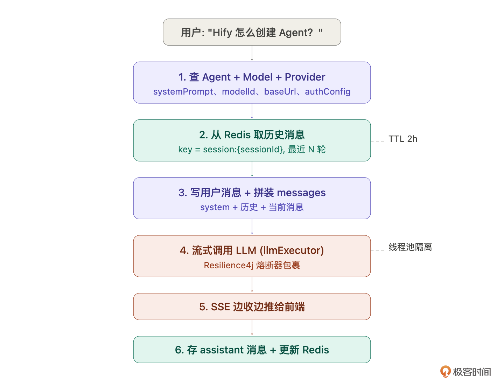
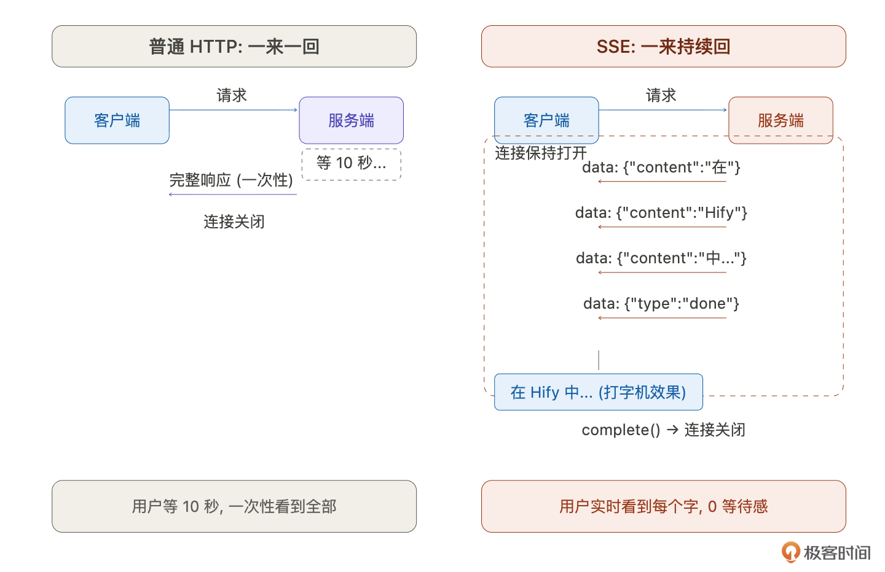
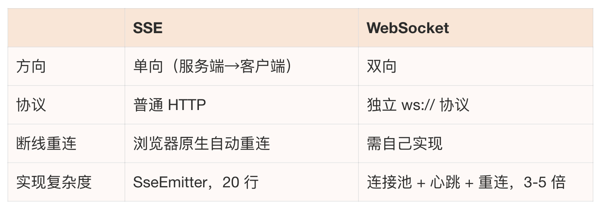
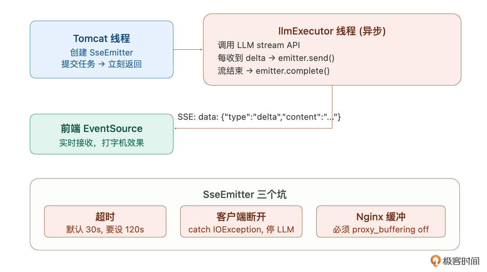
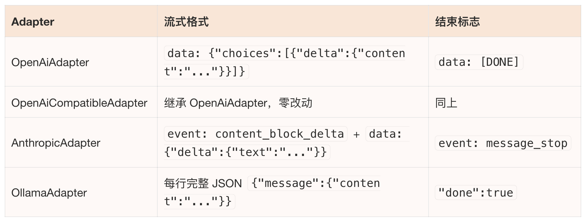

# 16｜对话引擎（上）：理解对话链路与流式技术选型
你好，我是Robert。

上一讲我们创建了智能客服Agent，名字、Prompt、模型、参数都配好了，但它现在还不能说话。Agent只是一份配置，需要对话引擎来驱动它。

对话引擎是Hify最核心的模块。没有它，前面做的模型管理、适配层、Agent配置都只是准备工作。这一讲和下一讲会把对话引擎做完。

和15讲学Agent一样，我们先搞清楚对话引擎到底是什么，再动手。

## 对话引擎是什么

> 在AI应用平台里，对话引擎是什么？它的职责是什么？和普通的HTTP接口调用有什么区别？

Claude Code的回答帮我建立了认知：对话引擎不是一个简单的“转发器”，不是把用户的话原封不动发给LLM，再把回复原封不动传回来。它是连接用户和LLM的一条处理管道，中间要做很多事。

1. **会话管理**。用户和智能客服聊了十轮，这十轮属于同一次对话。对话引擎要维护“会话”的概念，哪些消息属于同一次对话、会话什么时候创建、什么时候结束。

2. **上下文拼装**。LLM本身没有记忆。你问完“Hify怎么创建Agent”，再问“那怎么配置模型”，LLM不知道“那”指的是什么。对话引擎要把System Prompt +历史消息+当前消息拼成一个完整的messages数组，每次调用都带上上下文，让LLM “看起来”有记忆。

3. **流式响应**。LLM生成一个完整回复可能要十几秒。如果等全部生成完再返回，用户要盯着空白页面干等。对话引擎要做流式推送，LLM生成一个字就推一个字给前端，用户看到的是像人打字一样一个字一个字冒出来。这就是ChatGPT的打字机效果。

4. **消息存储**。对话结束后，用户消息和AI回复要持久化到数据库。用户下次打开能看到历史记录，管理员能做数据分析。


和普通HTTP接口的核心区别： **普通接口是请求-响应模式，一来一回就结束。对话引擎是长连接+流式，请求发出后，响应不是一次性返回的，而是一个字一个字持续推送，可能持续几十秒甚至一两分钟。这带来了完全不同的技术挑战：线程不能一直占着、连接不能提前断、前端要实时渲染。**

我追问了一个具体问题：

> 对话引擎和LLM API的关系是什么？为什么不直接让前端调LLM API？

Claude Code的回答点出了关键：直接让前端调LLM API有三个问题。

1. API Key暴露在前端不安全。
2. 每个LLM供应商的API格式不同，前端要适配多套格式。
3. 没有上下文管理，前端每次要自己拼历史消息传给LLM，还要自己管会话。

总结就是： **对话引擎就是把这些脏活集中到后端处理，前端只需要发一条消息、接收一串流式回复**。

## 对话引擎的完整链路

概念清楚了，让Claude Code帮我画出完整的技术链路：

> 用户和一个Agent对话，从前端发消息到收到流式回复，中间每一步技术上发生了什么？从前端到Controller到Service到LLM再回来，逐步梳理。

Claude Code给了一张非常完整的链路图：

```plaintext
用户输入 "Hify 怎么创建 Agent？"
    │
    ▼
[前端] POST /api/v1/chat/sessions/{sessionId}/messages
       接收: SSE 流式响应
    │
    ▼
[ChatService] ── 组装上下文 ──
    │  1. 查 session → 拿到 agentId
    │  2. 查 Agent → 拿到 systemPrompt、modelConfigId、参数
    │  3. 查 ModelConfig → 拿到 modelId、providerId
    │  4. 查 Provider → 拿到 baseUrl、authConfig
    │  5. 从 Redis 取最近 N 轮历史消息
    │
    ▼
[ChatService] ── 写入用户消息 ──
    │  INSERT chat_message(role='user', content)
    │
    ▼
[ChatService] ── 构造 LLM 请求 ──
    │  messages = [
    │    { role: "system",    content: agent.systemPrompt },
    │    { role: "user",      content: "上上轮问题" },
    │    { role: "assistant", content: "上上轮回复" },
    │    { role: "user",      content: "Hify 怎么创建 Agent？" }
    │  ]
    │
    ▼
[LlmHttpClient] ── 流式调用 LLM ──
    │  llmExecutor 线程池（和业务线程隔离）
    │  Resilience4j 熔断器包裹
    │
    ▼
[LLM API] 返回 SSE 流 → 边收边推给前端
    │
    ▼
[ChatService] ── 流结束后 ──
    │  INSERT chat_message(role='assistant', content=完整回复)
    │  更新 Redis 历史消息

```

六步：查配置 → 取历史 → 写用户消息 → 拼装请求 → 流式调用 → 存回复。

其中第5步（从Redis取历史）和第6步（更新Redis）是上下文管理的核心，下一讲展开。这一讲聚焦第4步，流式调用和推送的技术方案。



## 数据结构设计

在深入流式技术之前，先把数据模型定下来。

> 对话引擎需要哪些表？会话和消息怎么存？消息表需要哪些字段？

现有的schema.sql里已经有了chat\_session和chat\_message的基础结构。Claude Code分析后建议补几个字段：

- chat\_session补status。流式响应中途出错时需要记录会话状态。ACTIVE / ARCHIVED两个状态够用。

- chat\_message补finish\_reason和latency\_ms。finish\_reason记录LLM为什么停止——stop（正常结束）、length（超max\_tokens截断）、error（调用失败），调试和后续计费都用到。latency\_ms记录响应耗时，性能分析用。

- content从TEXT改LONGTEXT。 一条assistant消息可能几千字，代码生成场景可能更长，LONGTEXT彻底避免截断。


SQL Schema如下：

```sql
chat_session
  id          bigint PK
  agent_id    bigint          -- 关联 agent
  title       varchar(200)    -- 首条消息前 20 字自动生成
  status      varchar(20)     -- ACTIVE / ARCHIVED
  deleted / created_at / updated_at

chat_message
  id            bigint PK
  session_id    bigint         -- 关联 chat_session
  role          varchar(20)    -- user / assistant / system
  content       longtext
  tokens        int            -- token 数（上下文管理用）
  finish_reason varchar(20)    -- stop / length / error
  latency_ms    int            -- 响应耗时 ms
  deleted / created_at / updated_at

```

几个设计决策：role只有user / assistant / system，和OpenAI的messages格式直接对齐。system消息一般不存库，由Agent.systemPrompt每次动态注入。token数在流式响应结束后由LLM返回的usage写入。会话title取第一条user消息前20字，不额外消耗token。

chat\_message是增长最快的表，这一点在05讲数据库规范里已经预判了。

## 流式响应：SSE完整解析

这是对话引擎技术含量最高的部分。大部分后端工程师写过无数的请求-响应接口，但没写过流式推送。先搞清楚原理。

### SSE是什么

> SSE（Server-Sent Events）的工作原理是什么？和普通HTTP请求有什么区别？数据格式是什么样的？

Claude Code的解释：



普通HTTP请求是“一来一回”——客户端发请求，服务端返回完整响应，连接关闭。SSE是“一来持续回”——客户端发请求，服务端保持连接不关闭，持续往客户端推数据，直到主动关闭。

数据格式很简单，每条消息以 `data:` 开头，用两个换行分隔：

```plaintext
data: {"type":"delta","content":"在"}

data: {"type":"delta","content":"Hify"}

data: {"type":"delta","content":"中"}

data: {"type":"done","finishReason":"stop"}

```

前端用EventSource API接收，浏览器原生支持，不需要额外依赖：

```javascript
const es = new EventSource('/api/v1/chat/sessions/1/messages/stream')
es.onmessage = e =&gt; appendToken(JSON.parse(e.data).content)
es.onerror = () =&gt; es.close()

```

### 为什么不用WebSocket

> AI对话的流式响应，用SSE还是WebSocket？



**AI 对话就是“客户端发一条消息，服务端流式回复”，典型的单向推送。用户发消息走普通 POST 请求就行，不需要双向通信。WebSocket 的双向能力在这里完全用不上**。

业界验证：OpenAI、Anthropic、Dify，所有主流AI对话产品都选SSE。

### SseEmitter的工作原理

> Spring MVC的SseEmitter怎么工作？生命周期是什么样的？

SseEmitter本质是一个长连接容器。Controller方法返回SseEmitter对象后，Spring不会关闭HTTP连接，而是持有它。后续代码通过 `emitter.send()` 往这个连接里推数据，最后 `emitter.complete()` 关闭连接。



关键在于线程切换。Tomcat的请求线程创建SseEmitter后立刻返回，不能让Tomcat线程等LLM响应，那要等几十秒，线程池会被占满。实际的LLM调用在llmExecutor线程池里异步执行：

```plaintext
Tomcat 线程:
  创建 SseEmitter(120s) → 提交任务给 llmExecutor → return emitter
  （线程释放，可以处理其他请求）

llmExecutor 线程:
  调用 LLM stream API → 收到 delta → emitter.send(delta)
                       → 收到 delta → emitter.send(delta)
                       → 收到 [DONE] → 存消息 → emitter.complete()

```

这就是为什么10讲要配独立的llmExecutor线程池。LLM调用在自己的池子里跑，不占Tomcat线程，管理页面不受影响。

### SseEmitter的三个坑

Claude Code **特别提醒了** 三个必须处理的问题：

1. **超时**。SseEmitter默认超时30秒。LLM生成一个长回复可能要一两分钟，30秒一到连接直接断了用户看到半截回复。必须设长， `new SseEmitter(120_000L)`，120秒。

2. **客户端断开**。用户对话到一半关了浏览器标签页，HTTP连接断了。但llmExecutor线程不知道，它还在调LLM，每收到一个delta就 `emitter.send()`，直到IOException。如果不catch这个异常并停止LLM调用，线程会白跑到LLM输出完，浪费llmExecutor的线程资源。必须在send的catch里停止LLM调用并释放线程。

3. **Nginx缓冲**。这是最容易被忽略的。Nginx默认会缓冲上游响应，收集一批数据后才一次性发给客户端。结果用户看到的是“等了十几秒突然全部内容一起出现”，流式效果完全失效。必须在Nginx配置里关掉缓冲：


```nginx
location /api/ {
    proxy_pass http://backend;
    proxy_buffering off;
    proxy_cache off;
    proxy_read_timeout 120s;
}

```

还有一个很细的细节： **事务不要跨SseEmitter。**@Transactional方法里不要直接返回SseEmitter，事务提交时机和流结束时机不同，会导致事务提前提交或连接超时。要把写消息的操作拆成独立方法调用。

## 扩展适配层：加Chat能力

14讲做的ProviderAdapter接口只有testConnection和listModels。对话引擎需要chat（同步）和streamChat（流式）。

> 给ProviderAdapter接口扩展chat和streamChat方法。设计ChatRequest和ChatResponse DTO。

- ChatRequest：modelId、messages（List，每条含role和content）、temperature、maxTokens。

- ChatResponse：content（完整回复文本）、finishReason（stop/length/error）、completionTokens。


**streamChat的核心设计：** 接收一个 `Consumer&lt;String> onChunk` 回调。适配层每收到LLM的一段delta文本就调一次onChunk，ChatService在onChunk里调 `emitter.send()` 推给前端。流结束后返回完整的ChatResponse。

各Adapter的流式格式差异很大，这是最需要仔细review的部分：



先实现OpenAiAdapter的streamChat，review通过后其他三个批量生成。和14讲同样的模式。

生成后怎么验证？流式代码涉及多线程和回调，不好直接读。用一个高效方法：让写代码的AI解释它自己的代码。

> 逐步解释你刚才生成的streamChat代码。特别说明：线程是怎么切换的、如果LLM中途抛异常会怎样、如果客户端断开会怎样。

它解释一遍，你听逻辑。如果解释里有自相矛盾的地方（比如“异常时调completeWithError”但代码里没有catch），说明代码有bug。这比自己逐行读不熟悉的异步代码高效得多。

## 对话接口设计

最后定接口格式。先看业界怎么做。

> ChatGPT API和Dify的对话接口怎么设计的？

OpenAI：无状态。每次传完整messages数组，不管会话。好处是简单，坏处是历史管理全甩给调用方。

Dify：有状态。用conversation\_id关联，服务端维护历史，前端只传当前消息。好处是前端简单，坏处是后端要管会话。

Hify选有状态，接口RESTful风格：

```plaintext
POST /api/v1/chat/sessions                    # 创建会话
POST /api/v1/chat/sessions/{id}/messages      # 发消息
GET  /api/v1/chat/sessions                    # 会话列表
GET  /api/v1/chat/sessions/{id}/messages      # 历史消息
DELETE /api/v1/chat/sessions/{id}             # 删除会话

```

发消息请求体极简：

```json
{
  "content": "Hify 怎么创建 Agent？",
  "stream": true
}

```

比Dify更简单，不需要user字段（没有多租户），不需要inputs（没有变量注入），session已经关联了agentId不需要再传。

流式响应格式：

```plaintext
data: {"type":"delta","content":"在"}
data: {"type":"delta","content":"Hify"}
data: {"type":"delta","content":"中..."}
data: {"type":"done","finishReason":"stop","latencyMs":1240}

```

最后一条done事件带finishReason和latencyMs，前端据此停止loading并显示完整消息。

消息存储选流结束后同步存MySQL。20-50人同步写没压力，不引入消息队列。

## 总结

这一讲做了四件事：

1. 理解对话引擎。不是转发器，是处理管道——会话管理、上下文拼装、流式推送、消息存储。
2. 设计数据模型。在已有表基础上补了status、finish\_reason、latency\_ms、LONGTEXT。
3. 搞懂流式响应。SSE的原理、和WebSocket的区别、SseEmitter的线程模型和三个坑（超时、客户端断开、Nginx缓冲）、事务不跨SseEmitter。
4. 扩展适配层和定接口。ProviderAdapter加Chat / streamChat，四个Adapter的流式格式差异。RESTful有状态接口设计。

概念清楚了、表设计好了、流式方案定了、适配层扩展完了、接口格式定了。下一讲直接执行，CRUD实现、上下文管理、跑通完整链路，让智能客服真正开口说话。

方法论上的新收获： **验证不熟悉的代码，让AI解释它自己写的代码，你听逻辑找矛盾。流式响应、回调、多线程这些不常写的代码，用这个方法比自己硬读高效得多。**

## 思考题

1. SseEmitter超时设了120秒，但有些复杂问题LLM可能需要更长时间。超时应该固定还是动态？
2. 如果要支持“停止生成”（用户中断AI回复），技术上怎么实现？需要改适配层吗？
3. 四个Adapter的流式格式都不同，如果以后有新供应商用了第五种格式，现在的架构能不能低成本扩展？

期待你的分享！如果今天的课程让你有所收获，也欢迎转发给有需要的朋友，邀请他来一起学习，我们下节课再见！