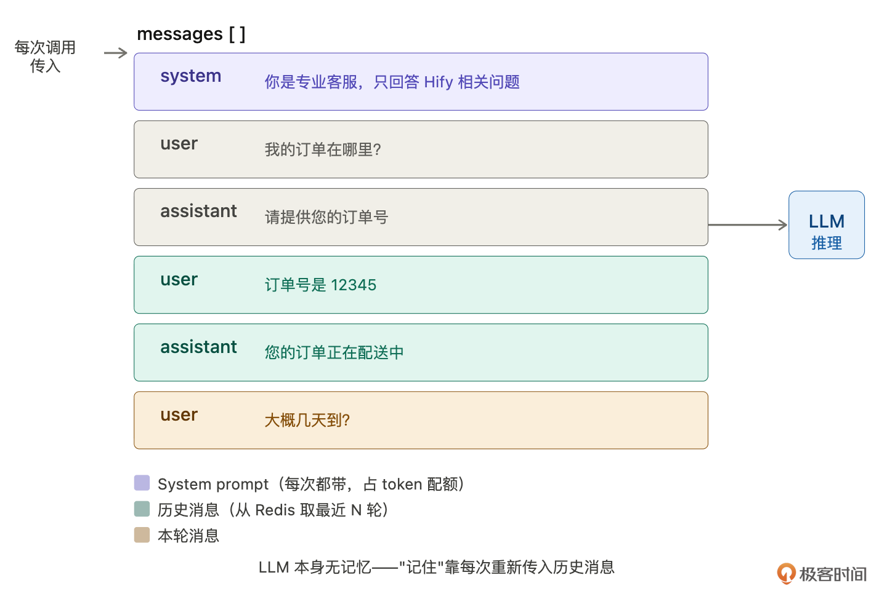
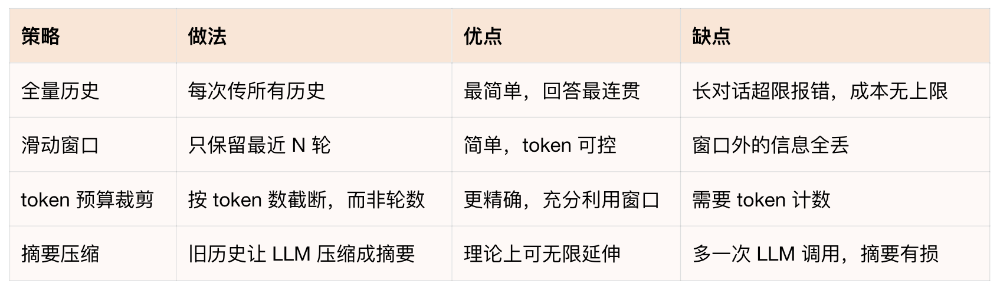
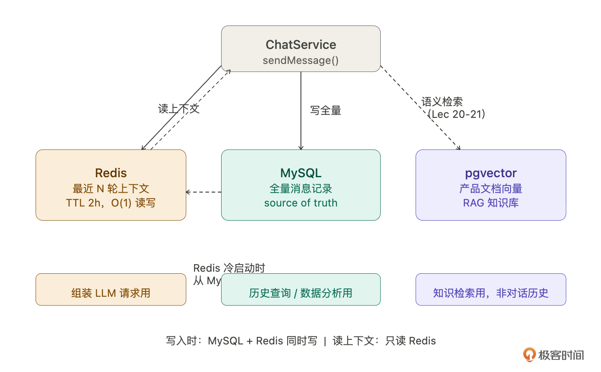
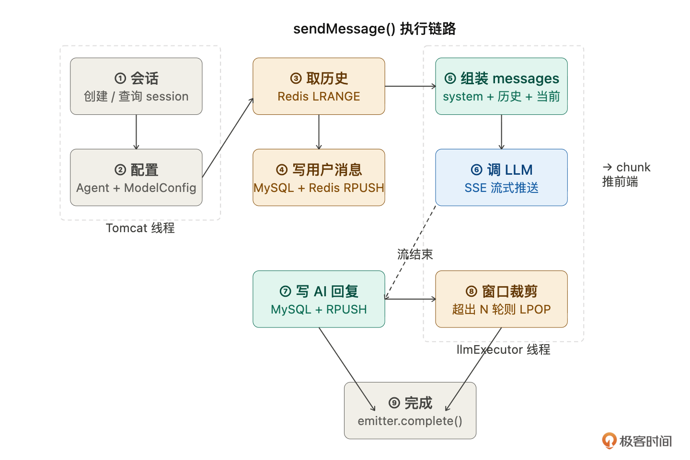
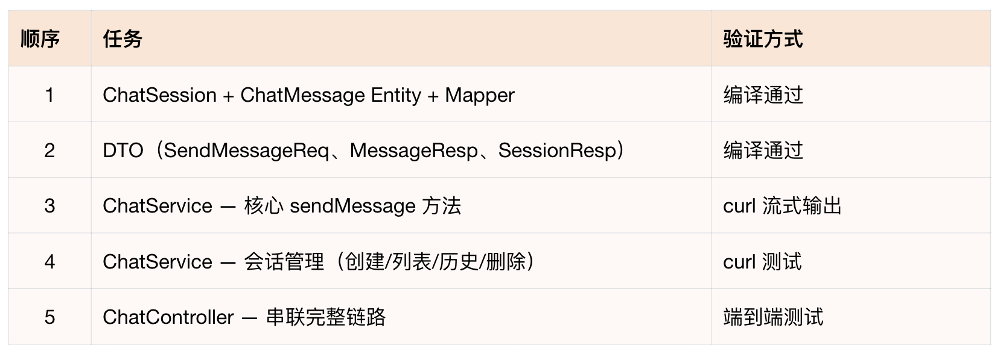

# 17｜对话引擎（下）：让智能客服真正开口说话
你好，我是Robert。

16讲把对话引擎的所有设计决策都定好了—— **六步链路、数据模型、SSE 流式方案、适配层扩展、接口格式**。这一讲把它们全部落地，让智能客服真正开口说话。

但在写CRUD之前，有一个核心问题要先解决： **上下文**。

## 上下文是什么

你可能觉得“上下文”是个显而易见的概念，就是对话历史嘛。但它在技术实现上没那么简单。

> AI对话里的“上下文”到底是什么？LLM本身有记忆吗？多轮对话是怎么实现的？

Claude Code的回答纠正了一个常见误解：

LLM本身没有记忆。 每次调用都是无状态的，你上一轮告诉它“我的订单号是12345”，下一轮它完全不知道。它不像数据库会持久化状态，每次调用都是一张白纸。



那ChatGPT怎么做到记住你说过什么？ **答案是每次调用都把历史消息重新塞进请求里，让模型在同一次推理中“看到”历史，造成记得的假象**。

上下文就是你传给模型的messages数组的全部内容：

```json
{
  "messages": [
    { "role": "system",    "content": "你是专业客服" },
    { "role": "user",      "content": "我的订单在哪里" },
    { "role": "assistant", "content": "请提供订单号" },
    { "role": "user",      "content": "订单号是 12345" },
    { "role": "assistant", "content": "您的订单正在配送中" },
    { "role": "user",      "content": "大概几天到" }
  ]
}

```

模型看到这整个数组，才能理解“几天到”指的是哪个订单。去掉任何一条，语义就断了。

这就带来了一个核心问题： **上下文窗口有限**。模型能处理的messages总长度有上限，叫context window，单位是token。GPT-4o是128K token（约10万汉字），Claude 3.5 Sonnet是200K，本地Llama 3可能只有8K。超出窗口直接报错或截断。而且token是要花钱的，历史越长，每次调用越贵。

所以上下文管理的核心任务是： **在有限的token预算内，保留尽可能多的有用历史**。

接下来我问：

> 对话上下文管理有哪几种常见策略？各自的优缺点是什么？



最终Hify选 **滑动窗口**。这个决策过程主要是Claude Code建议（这里其实可以展开，你可以和Claude Code深度交流每种方案的异同、原理，深入理解这个决策的过程）。

理由是：20-50人内部使用，对话不会特别长。 `maxContextTurns` 已经在Agent表上配置了，每个Agent可以独立调整。Redis List天然支持RPUSH新消息，超出时LPOP旧的，实现十行以内。Token预算裁剪留作后续优化路径，等真的出现“消息长度差异大导致体验差”的问题再做。

还有两个实际问题Claude Code提醒了我：

1. **System Prompt 占 token**。每次请求都要带system prompt，如果prompt很长（几千字），会持续占用token配额，变相压缩可用的对话历史。这是为什么15讲说要控制prompt长度。

2. **Token 怎么算**？粗略估算：1个汉字 ≈ 1.5 token，1个英文单词 ≈ 1 token。精确计算要用各家模型的tokenizer，Hify不自己算，直接用LLM返回的 `usage.completion_tokens` 记录存入chat\_message.tokens字段。


## 对话存储选型

上下文策略定了，下一个问题：对话历史存在哪？这时给Claude Code的提示词是：

> 对话历史应该存在哪？Redis、MySQL、向量数据库在对话引擎里分别扮演什么角色？

Claude Code的分析帮我理清了三者的分工：



1. MySQL，持久化存储，数据的source of truth。存全量对话记录，用户查看历史聊天、管理员做数据分析、Redis缓存失效后的数据来源，都从MySQL查。不用于组装LLM请求，每次都SQL查询+排序太慢。

2. Redis，工作内存，专门用于组装LLM请求。存最近 `maxContextTurns` 轮消息，ChatService每次收到消息，直接从Redis取最近N轮拼入messages数组发给LLM。读写O(1) 毫秒级，TTL 2 小时到期自动清理。


```plaintext
key: session:{sessionId}
val: [ {role,content}, {role,content}, ... ]   ← 最近 N 轮
TTL: 2h，每次对话刷新

```

两者的关系：MySQL是真相来源（全量），Redis是热缓存（最近N轮）。写入时两边同时写，消息存MySQL的同时RPUSH到Redis，读取上下文只读Redis，Redis过期后从MySQL重新加载（Cache-Aside）：

```java
List&lt;ChatMessage&gt; history = redis.get(sessionKey);
if (history == null) {
    // 冷启动：从 MySQL 加载最近 N 条，回写 Redis
    history = chatMessageMapper.selectRecent(sessionId, maxContextTurns * 2);
    redis.set(sessionKey, history, Duration.ofHours(2));
}

```

那向量数据库（pgvector）呢？这里要特别说清楚，pgvector不是用来存对话历史的。很多初学者容易混淆“对话记忆”和“知识检索”。 **对话历史是结构化的（一条条消息，有时间顺序），用 MySQL + Redis 就够了。**

**pgvector 在 Hify 里的角色是 RAG 知识库**，把产品文档切成小段，每段生成一个向量表示（1536维float数组）存进pgvector，用户提问时做语义检索找到最相关的文档段落，拼进上下文给LLM参考。这是20-21讲的内容。到时候智能客服就能回答具体的产品问题了，不是靠模型的通用知识瞎猜，而是基于你的产品文档给出准确回答。

三者协作的完整流程：



## CRUD 实现

上下文和存储方案都定了，开始写代码。16讲的设计决策全部落地。

按标准流程拆解，13讲和15讲已经教过方法论，这里直接执行：



重点是任务 3——ChatService.sendMessage，它串联了16讲的整条六步链路：

> 实现ChatService.sendMessage方法。接收sessionId（可选）和content。流程：异常处理：LLM超时走onTimeout回调、客户端断开catch IOException停止LLM调用、send失败调completeWithError。事务注意：写消息操作拆成独立方法，不要在返回SseEmitter的方法上加@Transactional。

这是整个课程最复杂的一个Service方法。九个步骤，涉及多表查询、Redis读写、Token计算、线程切换、流式回调、异常处理。给Claude Code的指令必须写到这个细致程度，任何一步漏了都会出问题。

Claude Code生成后，用16讲学的方法验证：

> 逐步解释sendMessage方法的执行流程。特别说明：哪些操作在Tomcat线程、哪些在llmExecutor线程、Redis和MySQL的写入时机、如果第7步LLM调用失败第5步写入的用户消息怎么办。

让它解释，你听逻辑。如果它说“LLM失败会回滚用户消息”，但代码里没有回滚逻辑，就说明有问题。实际上用户消息不需要回滚，用户确实发了这条消息，只是AI没有成功回复，下次重试时用户消息已经在历史里了。

## 验收：和智能客服对话

所有代码写完了。这是最有仪式感的时刻，从15讲创建Agent到现在，智能客服终于能说话了。

```bash
# 创建会话，发第一条消息
curl -N -X POST http://localhost:8080/api/v1/chat/sessions \
  -H "Content-Type: application/json" \
  -d '{"agentId": 1}'
# 返回 sessionId

# 和智能客服对话（流式）
curl -N -X POST http://localhost:8080/api/v1/chat/sessions/{sessionId}/messages \
  -H "Content-Type: application/json" \
  -H "Accept: text/event-stream" \
  -d '{"content": "Hify 怎么创建 Agent？", "stream": true}'

# 应该看到流式输出：
# data: {"type":"delta","content":"在"}
# data: {"type":"delta","content":"Hify"}
# data: {"type":"delta","content":"中，您可以..."}
# data: {"type":"done","finishReason":"stop","latencyMs":3200}

```

第一轮通了。现在测上下文，这是关键验证点：

```bash
# 追问（不重复说明背景）
curl -N -X POST http://localhost:8080/api/v1/chat/sessions/{sessionId}/messages \
  -H "Content-Type: application/json" \
  -H "Accept: text/event-stream" \
  -d '{"content": "那怎么配置模型？", "stream": true}'

```

如果智能客服回答“您需要先进入模型管理页面…”，说明它记住了上下文，知道你在问Hify的操作。如果它回答“请问您想配置什么模型？能否提供更多背景？”，说明上下文拼装有问题，历史没有带进去。

```bash
# 再追问几轮，测试上下文裁剪
curl -N -X POST ... -d '{"content": "temperature 一般设多少？"}'
curl -N -X POST ... -d '{"content": "如果我想做一个代码审查的 Agent 呢？"}'
curl -N -X POST ... -d '{"content": "它的 Prompt 应该怎么写？"}'

```

检查后端日志，应该能看到上下文拼装的信息：历史消息6条，token预算3000，保留最近3轮。

检查数据：

```bash
# MySQL：全量历史
SELECT role, LEFT(content, 50), tokens FROM chat_message
WHERE session_id = {sessionId} ORDER BY created_at;

# Redis：最近 N 轮
redis-cli LLEN session:{sessionId}
# 应该等于 maxContextTurns * 2（一问一答算两条）

```

全部通过。智能客服能流式回复，能记住上下文，历史太长会自动裁剪。

不过现在和它对话还得用curl，下一讲做前端对话页面，消息气泡、打字机效果、自动滚动，让对话体验从命令行升级到浏览器。

## 总结

这一讲做了三件事：搞清楚上下文的本质和管理策略，理清对话存储的三层分工，实现完整的对话CRUD并跑通多轮对话。

上下文的本质：LLM没有记忆，每次调用都是白纸。“记忆”是对话引擎通过拼装历史消息实现的。核心挑战是在有限token预算内保留尽可能多的有用历史。

存储三层分工：Redis存最近N轮（上下文组装用，高频读写），MySQL存全量历史（记录查询用），pgvector不存对话历史（那是RAG知识库的事，后面讲）。

增量开发：sendMessage是整个课程最复杂的方法——九步、多表、多缓存、多线程。给Claude Code的指令要写到每一步的细节，然后让它解释自己的代码验证逻辑。

## 思考题

当前的裁剪策略是“从最近往前保留”，但如果用户第一轮提供了关键背景信息（比如“我是Hify的管理员”），被裁掉后后面的回答就不准了。怎么实现“关键消息置顶”？

两个用户同时和同一个Agent对话，上下文会不会串？当前的session隔离是否足够？

如果要实现“摘要压缩”，历史超过阈值时先让LLM总结再拼装，怎么改sendMessage？改动范围有多大？

期待你的分享！如果今天的课程让你有所收获，也欢迎转发给有需要的朋友，邀请他来一起学习，我们下节课再见！