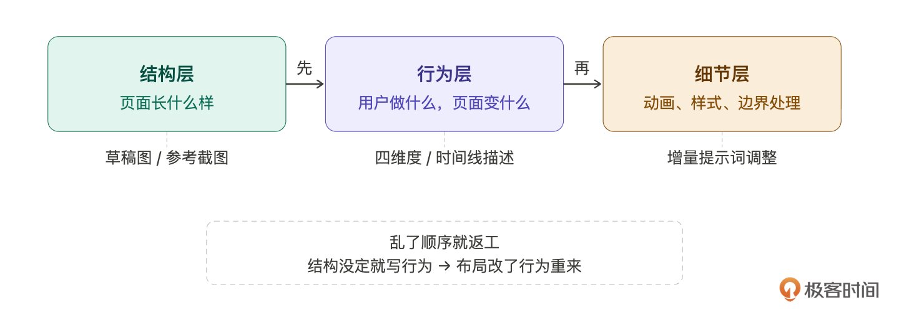
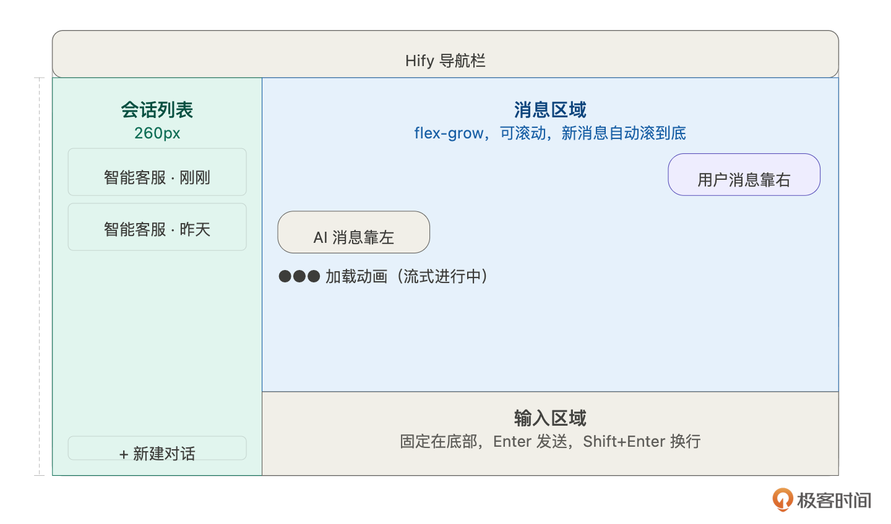
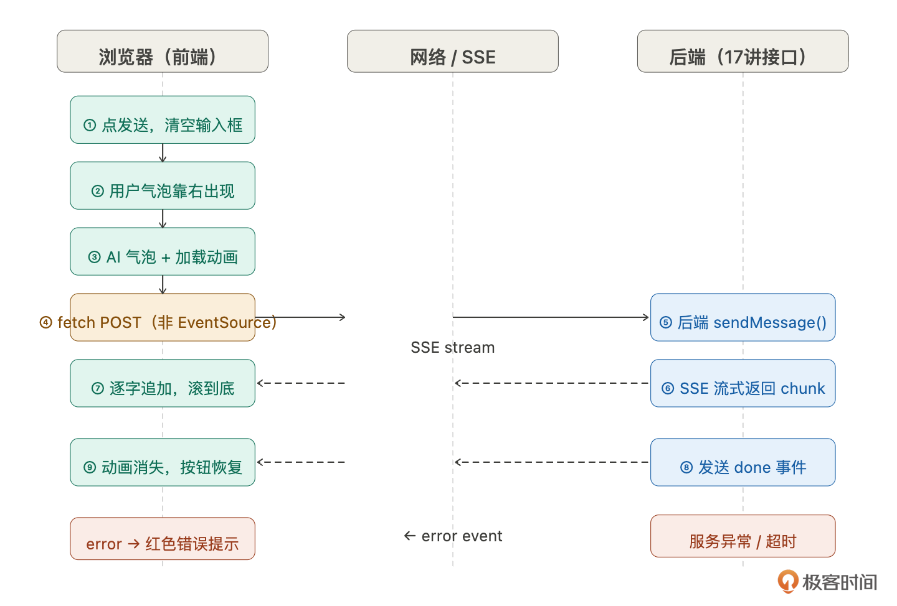
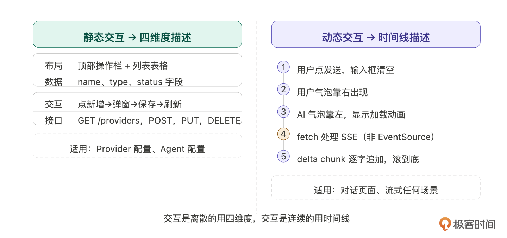
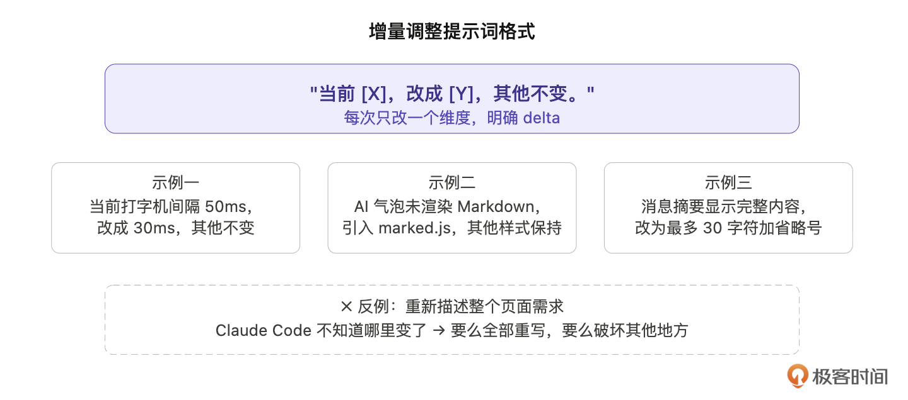
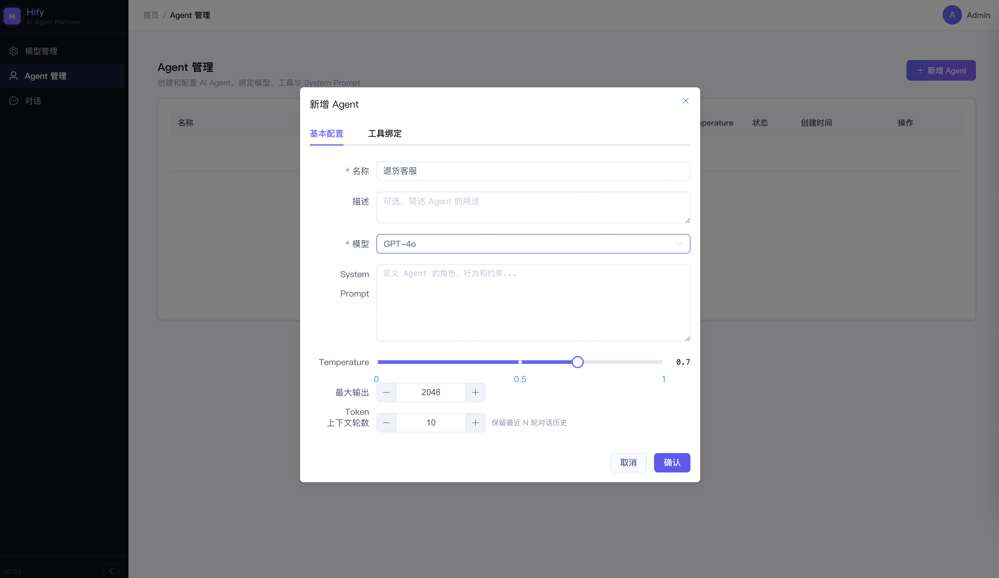
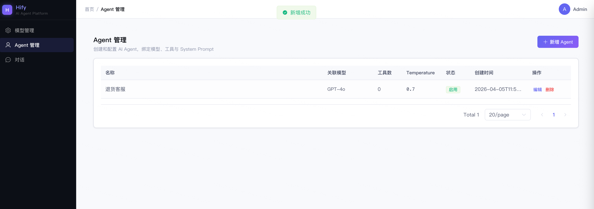
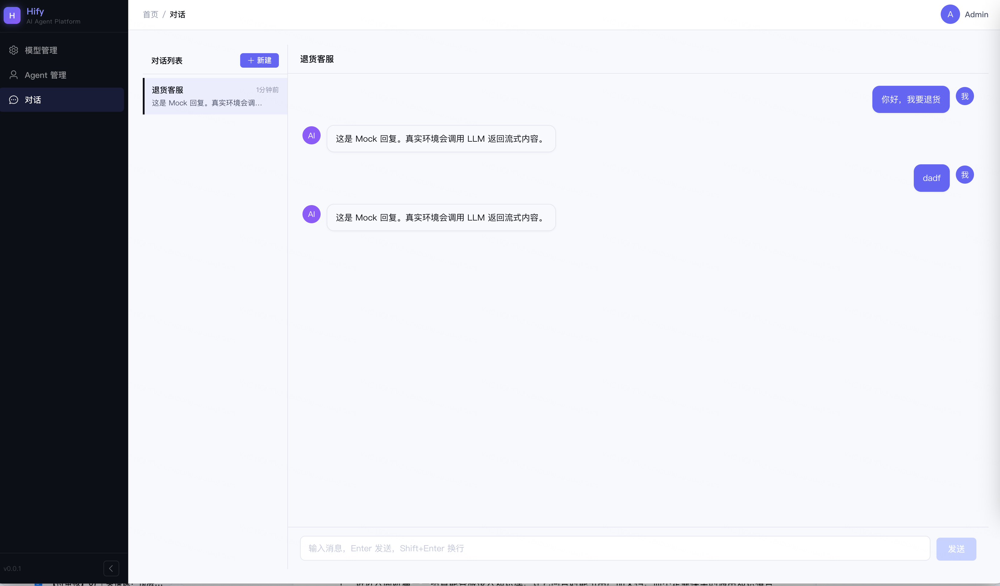

# 18｜复杂前端交互：让 Claude Code 帮你搞定流式聊天界面
你好，我是Robert。

17讲做完了对话引擎的后端——六步链路跑通，curl能看到SSE流式输出，上下文管理验证完毕。但用户和智能客服对话还得靠命令行。这一讲我们把它搬到浏览器里，做完Hify的整个前端：Provider和Agent的管理页面，以及真正的聊天对话界面。

但在动手之前，有一件事要先想清楚： **复杂页面和简单页面，给Claude Code的描述方式是不一样的**。

## 复杂度分层：为什么不能一次性描述

把整个对话页面的需求一次性丢给Claude Code，会发生什么？

先看一个典型的错误提示词：

> 帮我做一个AI对话页面，左边是会话列表，右边是聊天窗口，支持流式回复，用户消息靠右，AI消息靠左，底部有输入框，按Enter发送，要有打字机效果，支持Markdown渲染，自动滚动到底部。

这条提示词列出了大量功能点，看起来很完整。实际生成的结果：布局大致对，但消息气泡样式随机，打字机效果是setTimeout模拟的假效果（内容一次性拿到再逐字显示），SSE用了标准EventSource发POST请求，而标准EventSource只支持GET，接口根本跑不通。调试两小时，问题出在描述方式上，不在代码上。

对比一个按层拆解之后、第二步才会写的提示词片段：

> 对话页面的发送交互，按时间线实现：用户点发送后输入框立刻清空，消息区域底部追加用户气泡；紧接着出现空的AI气泡加载动画；前端用fetch手动处理SSE流（不要用EventSource，接口是POST）；每收到delta chunk就追加内容到AI气泡并滚动到底部；收到done事件后移除加载动画，恢复发送按钮。

同样的功能，第二个提示词把行为拆成了有顺序的步骤，并且显式说明了技术约束（fetch而非EventSource）。Claude Code按这个生成的代码，第一次跑就通了。

差别不在于字数多少，在于 **描述的层次**。

复杂页面需要拆解，拆解的顺序有三层，有顺序依赖：

- **结构层**：页面长什么样，组件怎么排列

- **行为层**：用户做了什么，页面发生什么

- **细节层**：动画速度、样式微调、边界处理


乱了顺序就会返工——结构没对齐就去写行为，行为写完了布局改了，整个组件重来。所以正确的顺序是：先对齐结构，再描述行为，最后打磨细节。这也是本讲的主线。



## 第一步：草稿图对齐结构

> 在描述需求之前，先画一张图。

不是让你学UI设计，是用最低成本和Claude Code对齐“页面长什么样”。文字描述布局，信息密度低，容易有歧义。一张草稿图抵得上几百字。

两种做法，按成本选择：

**做法一：截参考图。** 打开ChatGPT或Claude的对话页面，截一张图，上传给Claude Code：

> 参考这张图的整体布局。左侧会话列表，右侧聊天窗口，底部固定输入框。用Element Plus实现，配色用Hify的浅色主题。

这是最低成本的做法。主流AI对话产品的布局已经是行业共识，Claude Code看一眼就能理解。

**做法二：手绘草稿。** 如果你想要的布局和现有产品不一样，画一张低保真草稿，矩形框标注区域名称就够了，不需要精确尺寸。



无论哪种做法，关键是先让Claude Code描述它的理解，再让它写代码：

> 看这张草图，描述你理解的页面布局，不要写代码。

Claude Code的描述就是布局共识的验证。如果它说“左侧是260px的会话列表，右侧分上下两部分——消息区域自适应高度，输入区域固定在底部”，和你想的一致，直接说“正确，开始实现”。如果有偏差，在这里纠正，比写完代码再改成本低得多。

## 第二步：文字描述填充行为

结构对齐之后，开始描述“页面怎么动”。这里有两类需求，描述方式不同。

### 静态交互：四维度描述

Provider管理页、Agent配置页，这类页面的交互是离散的：点按钮→弹窗→填表单→保存→列表刷新。用四个维度描述就够了：

> Provider管理页。布局：顶部操作栏（标题+新增按钮），主体是Provider列表表格。数据：展示name、type、status，status用标签区分启用/禁用。交互：点新增弹出表单弹窗，字段包括名称、类型（下拉选OpenAI/Anthropic/Ollama）、Base URL、API Key；保存后列表刷新；支持编辑和删除，删除需二次确认。接口：GET /api/v1/providers查列表，POST新增，PUT编辑，DELETE删除。

Agent配置页同理，参考15讲的字段定义。

### 动态交互：时间线描述

对话页面不一样，它的 **交互是连续的**，不是“点了什么发生什么”，而是“发送之后接下来这一秒的事情”。用四维度描述，行为细节大量缺失。

如下图所示，正确的方式是按时间线一步一步讲：



所以提示词可以是：

> 发送消息的完整时间线：
>
> 1. 用户在输入框输入内容，点发送（或按Enter）
> 2. 输入框立刻清空，发送按钮变为不可点击
> 3. 消息区域底部出现用户消息气泡（靠右，深色背景）
> 4. 紧接着出现AI消息气泡（靠左，浅色背景），内容区域为空，显示加载动画
> 5. 前端用fetch手动处理SSE流（不要用EventSource，接口是POST）
> 6. 每收到一个delta chunk，把content追加到AI气泡，同时滚动到底部
> 7. 收到done事件，加载动画消失，发送按钮恢复可用
> 8. 如果请求失败或收到error事件，AI气泡显示红色错误提示，发送按钮恢复

第5步就是开头那个错误提示词踩的坑——SSE over POST是做AI对话产品几乎必踩的坑，在时间线描述里显式说明，一句话避开。

同类需要显式说明的技术约束还有：Markdown渲染（AI回复包含格式化内容，需要引入渲染库）、滚动策略（新消息追加时滚到底，用户手动向上滚时不打断）。这些属于“不说Claude Code不知道，说了它就能处理好”的细节，时间线描述是把它们自然带出来的好时机。



## 第三步：增量调整

Claude Code生成之后跑起来，效果八九成对，但一定有需要调的地方，比如打字机效果太快、气泡间距不对、Markdown代码块样式不搭。

调整时一个原则： **每次只改一个维度，描述说清楚delta。**

很多人习惯重新描述整个需求，Claude Code搞不清楚哪里变了，要么全部重写，要么改了这里破坏了那里。更有效的格式：

- 调整1

> 当前打字机效果每字符间隔50ms，感觉太快，改成30ms，其他不变。

- 调整2

> AI消息气泡没有渲染Markdown，引入marked.js把content渲染成HTML，代码块用等宽字体，其他样式保持。

- 调整3

> 会话列表的消息摘要显示完整内容，改为最多30个字符，超出用省略号截断。

每个提示词描述一件事，明确原来是什么、现在改成什么。几轮下来，细节就到位了。



在之前的课程中，有同学问过， **用其他模型可不可以完成本次课程的内容**。答案是可以的。我的回答是，由于不同的模型能力有差异，产出的结果是不一样的。此时对我们来说，最大的区别就是在这一步增量调整这里，好的模型，这一步不需要经过太多调整，其他模型这一步可能需要反复调整。这就是区别。

但是，我反倒觉得这是一个学习的过程。模型差一点更好。这一步可以反复让我们去锻炼自己prompt的能力，也就是 **学会和AI说话**，这也是我们这门课程的重点之一。

## 验收：同一个接口，从curl到浏览器

17讲的验收是用curl直接调后端接口：

```bash
curl -N -X POST http://localhost:8080/api/v1/chat/sessions/{sessionId}/messages \
  -H "Content-Type: application/json" \
  -H "Accept: text/event-stream" \
  -d '{"content": "我的订单状态怎么查？", "stream": true}'

# data: {"type":"delta","content":"您"}
# data: {"type":"delta","content":"好"}
# data: {"type":"delta","content":"，请问"}
# ...
# data: {"type":"done","finishReason":"stop","latencyMs":2800}

```

后端通了。这一讲的验收是同一个接口，在浏览器里调用，走完整的用户操作流程：

> 1. 打开Hify，进入“对话”，新建对话，选“退货客服” Agent
>
> 2. 发送“我的订单状态怎么查？”看到用户气泡靠右，AI气泡靠左，内容逐字追加
>
> 3. 追问“那退款流程呢？”智能客服记住上下文，直接回答，不需要重复背景（17讲的上下文管理在这里可视化了）
>
> 再问几轮，确认多轮对话连贯



会话管理：

> 1. 左侧列表出现这个对话，显示Agent名称和消息摘要
>
> 2. 新建第二个对话，列表有两条，点击切换，右侧记录对应切换
>
> 3. 刷新页面，两个对话都还在（MySQL持久化正常）



全部通过。Hify基础篇到这里完整了，管理员能在页面上配置Provider和Agent，用户能在浏览器里和智能客服多轮对话，流式回复、上下文连贯、异常有提示。

下一讲进入高阶篇，给智能客服接入知识库，让它回答时能引用产品文档，而不是靠模型的通用知识猜答案。

## 总结

这一讲的核心不是实现对话页面本身，而是掌握复杂前端需求的拆解方法。

**结构→行为→细节的顺序不能乱**。先用草稿图或参考截图对齐布局，再用文字描述交互行为，最后增量调整细节。乱了顺序就会返工。

**静态交互用四维度，动态交互用时间线**。管理页面的交互是离散的，四个维度描述完整。对话页面的交互是连续的，时间线描述才能覆盖所有细节。

**技术约束要在描述里显式说明**。SSE over POST、Markdown渲染、滚动策略，不说Claude Code就会用默认方式处理，大概率出错。

**增量调整说清楚delta**。每次只改一个维度，描述原来是什么、改成什么，比重新描述整个需求效率高得多。

## 思考题

1. 本讲用“先让Claude Code描述它的理解，再让它写代码”来对齐布局。这个模式不只适用于前端，你觉得在哪些其他场景里，也可以用同样的“先确认理解再执行”来降低返工风险？

2. 时间线描述法覆盖了正常流程，但异常分支（网络中断、服务超时、用户在流式过程中切换会话）没有在提示词里描述，Claude Code会怎么处理？下次遇到类似需求，你会怎么加入异常分支的描述？

3. 如果要加“重新生成”功能——用户对AI的回答不满意，点一下重新生成，AI重新回答。按时间线描述法，这个功能的提示词你会怎么写？


期待你的分享！如果今天的课程让你有所收获，也欢迎转发给有需要的朋友，邀请他来一起学习，我们下节课再见！