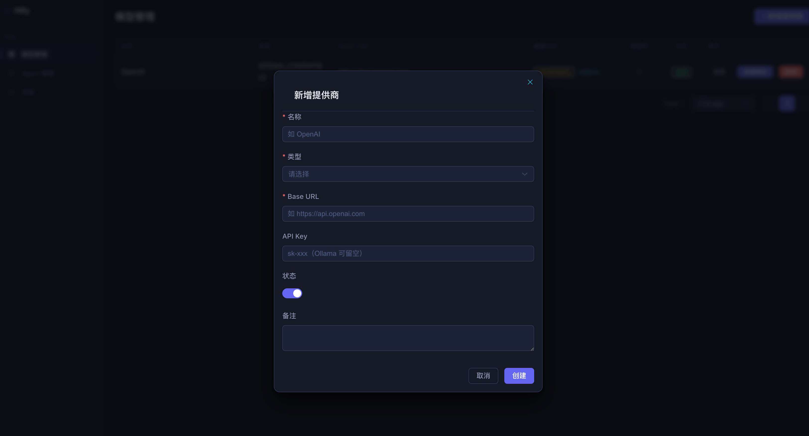
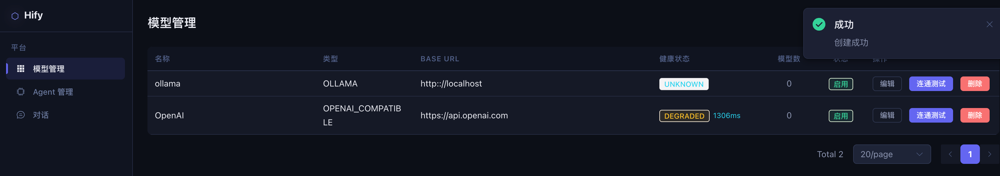
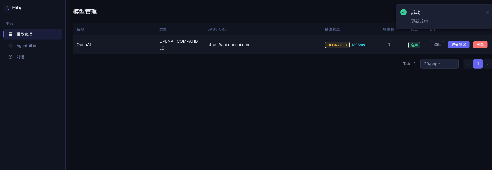
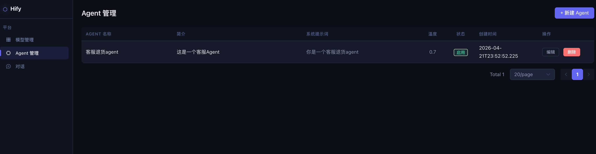
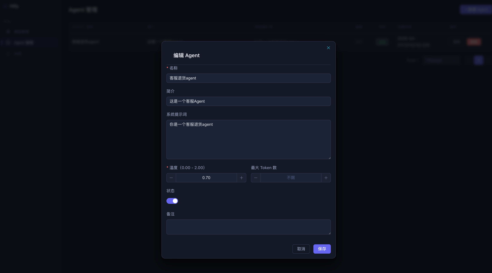
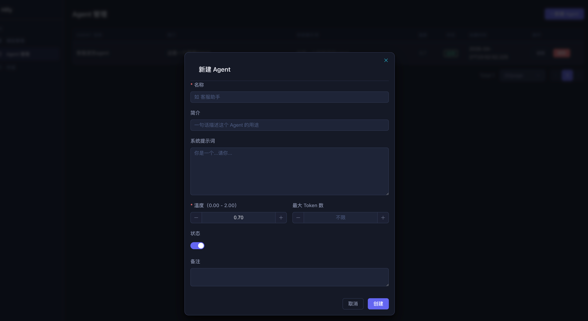

# 19｜实操课：核心功能基础篇全流程演示
你好，我是Robert。

这是核心功能基础篇的实操课。13到18讲，我们完成了Hify从“能跑”到“能用”的全部功能——Provider管理、适配层、Agent配置、对话引擎、前端界面。这节实操课，我会把这整个过程完整演示一遍，让你看到真实的操作节奏：我给了什么指令、Claude Code怎么回、我怎么判断和追问、哪里顺、哪里卡住了、怎么解决的。

本节实操课将以文字+视频的方式进行，主要包含两部分：

- 第一部分：我在核心功能开发过程中真实的体验和看法，以及几个大家比较关心的问题。

- 第二部分：屏录演示，分三个场景，覆盖Provider模块交付和Skill沉淀两条主线。


## 我的真实体验和看法

工程搭建篇结束之后，我对核心功能开发这件事其实有点忐忑。骨架搭好、组件封装好、UI出来了，但真正的业务逻辑才是重头戏——外部API调用、流式推送、上下文管理，这些以前在项目里摸过，但每次都要花相当多时间。

实际跑下来，比预期快很多。Provider模块前后端全部交付，大概半天。Agent模块因为有了模块交付Skill，比Provider还快。对话引擎复杂一些，两个完整的工作日，但其中大半时间花在了想清楚上，真正让Claude Code写代码的时间很短。

了解快在哪里、慢在哪里，比一个总时间更有参考价值。

**快在哪里：**

有了08-12讲的基础设施，每个业务模块的“脚手架”几乎不占时间。Entity继承BaseEntity、Mapper继承BaseMapper、Controller套Result + PageHelper，这些模板性的东西，一条指令生成，review一遍，基本不用改。

Skill带来的节奏变化更明显。13讲手动做Provider，14讲沉淀了模块交付Skill，15讲做Agent时一句“按模块交付Skill的流程，帮我做Agent模块”就启动了。Claude Code自动按流程走，在数据模型确认环节停下来等我拍板，不多做也不漏做。做第三个模块、第四个模块，这个节奏感越来越稳。

前端对接也比以前快很多。11讲封装的HifyTable和HifyFormDialog，每个管理页面的改动量非常小。API文件是新增的，页面代码基本只是把数据源从mock函数换成API函数，分页、loading、空状态、确认弹窗全都不用重写。基础组件的回报，在用的时候才真正感受到。

**慢在哪里：**

两类情况。

第一类是“想清楚”的时间。每个模块开始前，供应商分析、数据模型讨论、边界决策，这些和Claude Code来回讨论的时间不短。Provider模块将近一个小时，对话引擎的设计讨论甚至超过了写代码的时间。但这个时间花得值，这些决策如果漏掉，后面返工的代价是几倍。我已经把这部分时间当成必要投入，不算慢，算前置。

第二类是跨层问题的排查。流式响应在curl里验证是对的，上了浏览器发现打字机效果失效，是Nginx缓冲的问题，curl绕过了Nginx所以发现不了。这类“换了一层环境就暴露”的问题，Claude Code不会主动提醒，靠的是你自己的经验。排查下来时间不长，但需要你知道往哪个方向找。

**最让我惊喜的：**

两件事。

一是13讲里让Claude Code分析供应商分类的那一步。它按接口兼容性做了分类，指出DeepSeek、Moonshot这些国产模型接口和OpenAI完全兼容，只需要换baseUrl。这个洞察直接影响了架构决策——不是每接一个供应商就写一套适配代码，而是设计一个“OpenAI兼容”类型让用户自己配baseUrl。以前这类调研要自己搜文档、找对比文章，花一两个小时还不一定全面，现在一条指令五分钟，而且直接给出设计建议。

二是15讲里让Claude Code分析Agent概念的那一步。我给了“我对Agent的理解很模糊”的前提，它回了一张普通对话vs Agent的对比表，还主动区分了三层配置：身份定义、能力绑定、运行参数。不是我问出来的，是它主动给的结构。这让我真正体会到14讲说的“让Claude Code教你”是什么感觉——你不需要先懂再做，可以边问边做，一两个小时建立七成认知，然后把理解翻译成数据结构落地。

下面展开三个问题，是课程里大家比较关心的。

**1. “想清楚”这一步可以跳过吗？**

很多人急着动手，觉得先问概念是浪费时间，直接让Claude Code写代码更快。

13讲数据模型讨论将近一个小时，但产出很具体：auth\_config用JSON存，后来加Anthropic和Azure时一行表结构都没改；健康状态独立成表，定时探测高频写不影响provider表的缓存；model\_config分展示名和调用ID，Azure的deployment name和展示名不同，这个字段设计直接解决了问题。

跳过讨论直接让Claude Code建表，这三个设计八九成会漏掉。到后面对话引擎依赖这些字段时，要回来改表、改接口、改前端，代价是这一小时的三倍以上。

**想清楚不是在拖慢进度，是在前面花一点时间，避免后面花五倍时间返工。**

**2. Skill写完了之后，真的会用吗？**

14讲写了模块交付Skill，15讲第一次用，但我注意到一个现象：Skill的存在感比CLAUDE.md低，发指令时不一定会想起来。

我后来的做法是：每开始一个新模块，先停一秒问自己“有没有对应的Skill？”习惯养成之前，可以在CLAUDE.md顶部加一行提示：“开始新模块前，先看 .claude/skills/ 目录”。

Skill写了不用，等于把经验存档了但从不读档。这门课从14讲开始一直在说“经验可以编码化”，但编码化之后还要真的被调用，才有价值。

**3. 对话引擎验收，curl够了吗？**

不够。17讲用curl验证了流式输出是对的，但18讲上了前端之后，打字机效果在浏览器里失效了。这是Nginx缓冲的问题，curl绕过了Nginx所以发现不了。

后端接口测通是必要条件，不是充分条件。完整验收必须走完“浏览器操作 → Nginx转发 → 后端处理 → SSE推流 → 前端渲染”这条完整链路。每一层都可能有自己的坑，curl只覆盖了其中一段。

## 屏录演示

下面进入屏录部分，分三个场景。

### 场景一：后端跑通——从Entity到Controller

目标：展示Provider模块后端的交付节奏，重点演示几个有代表性的任务，最后用curl验证全部接口。

**第一步：确认数据模型，更新schema.sql**

指令：

```plaintext
按照以下数据模型，在 schema.sql 中新增三张表：
provider（含 auth_config JSON 字段）、
model_config（含 name 和 model_id 分开存）、
provider_health（独立表，含 fail_count、latency_ms、last_success_at）。

```

要点：

- 展示三张表的核心设计决策：auth\_config用JSON（不同供应商鉴权结构不同）、provider\_health独立成表（高频写不竞争锁）

- 更新完schema.sql，用mock profile启动验证建表成功


**第二步：Entity + Mapper**

指令：

```plaintext
按照 CLAUDE.md 规范和 schema.sql 的表结构，在 hify-provider 中创建
Provider、ModelConfig、ProviderHealth 的 Entity 和 Mapper。
Entity 继承 BaseEntity（ProviderHealth 除外），Mapper 继承 BaseMapper。
auth_config 和 extra_params 字段用 JacksonTypeHandler。

```

要点：

- 这个任务很干净，Claude Code基本不出错

- review重点： `@TableName(autoResultMap = true)` 有没有加、JSON字段的TypeHandler有没有对上


**第三步：Service——连通性测试（重点演示）**

指令：

```plaintext
在 hify-provider 中实现连通性测试。根据 provider.type 分发：
OPENAI 和 OPENAI_COMPATIBLE 调 GET /v1/models（Bearer Token），
ANTHROPIC 调 GET /v1/models（Header 带 x-api-key + anthropic-version），
OLLAMA 调 GET /api/tags（无认证）。
统一返回 ConnectionTestResult（success、latencyMs、modelCount、errorMessage）。
使用 LlmHttpClient，超时 10 秒。

```

要点：

- 这里不同供应商的差异用if-else处理，先跑通，14讲专门重构

- 展示Claude Code自动处理了三种鉴权方式的差异：Bearer Token、x-api-key Header、无认证

- 重点说明超时参数：10秒，不设超时会卡死线程


**第四步：Controller + curl验收**

指令：

```plaintext
在 hify-provider 中创建 ProviderController，实现所有接口：
POST 创建、GET 列表（分页）、GET 详情（含 modelConfig 和 health）、
PUT 更新、DELETE 删除、POST /{id}/test-connection。
所有接口返回 Result&lt;T&gt;，入参加 &#64;Valid 校验。

```

curl验收：

```bash
# 创建 OpenAI Provider
curl -X POST http://localhost:8080/api/v1/providers \
  -H "Content-Type: application/json" \
  -d '{
    "name": "OpenAI",
    "type": "OPENAI",
    "baseUrl": "https://api.openai.com",
    "authConfig": {"apiKey": "sk-xxx"}
  }'

# 连通性测试
curl -X POST http://localhost:8080/api/v1/providers/1/test-connection

# 查看详情（含模型列表和健康状态）
curl http://localhost:8080/api/v1/providers/1

# 分页列表
curl "http://localhost:8080/api/v1/providers?page=1&pageSize=10"

```

要点：

- 展示test-connection响应： `latencyMs` 有值、 `modelCount` 是真实拉取的数量

- 展示详情接口： `modelConfigs` 列表里有真实模型、 `providerHealth.status` 变成UP

- 展示分页列表： `PageResult` 结构正确， `total` 和 `list` 都在


### 场景二：前端对接——mock换成真实API

目标：把11讲做的ProviderList mock页面接上真实后端，走完浏览器完整验收。

**第一步：创建前端API文件**

指令：

```plaintext
在 hify-web/src/api/provider.ts 中创建 API 方法：
getProviderList（分页，参数 page/pageSize/type/enabled）、
createProvider、updateProvider、deleteProvider、testConnection。
类型定义和后端 DTO 字段对齐。

```

要点：

- 展示生成的 `provider.ts`，说明返回类型直接写业务数据类型，不需要包 `Result&lt;T>`—— `request.ts` 拦截器已经自动解包了

- 列表接口返回 `PageResult&lt;Provider>`，对应后端解包后的data字段


**第二步：页面对接——mock换成API**

指令：

```plaintext
把 ProviderList.vue 的 mock 数据换成真实 API 调用。改动点：
1. HifyTable 的 api prop 从 mock 函数换成 getProviderList
2. HifyFormDialog 的 submit 事件处理换成 createProvider/updateProvider
3. 删除按钮的 useConfirm 换成 deleteProvider
4. 操作列加"连通性测试"按钮，点击调 testConnection，结果用 ElMessage 提示
5. 加"健康状态"列：UP 绿色 tag、DOWN 红色 tag、DEGRADED 黄色 tag、UNKNOWN 灰色 tag，显示最近延迟 ms
6. 加"模型数"列：显示该供应商下已启用的模型数量

```

要点：

- 展示改动量：API文件是新增的，ProviderList.vue改动很小，组件结构没有动

- 重点说明HifyTable的 `api` prop换了一行，分页、loading、空状态全部自动处理——这是11讲封装前端组件的回报

- 展示健康状态tag的颜色配置：UNKNOWN灰色是还没测过，不要用红色表示禁用，禁用是正常状态


**第三步：浏览器完整验收**

操作顺序：



1. 打开 `http://localhost:5173`，进入“模型管理”，看到空列表

2. 点“新增提供商”，填入OpenAI信息（名称、类型OPENAI、baseUrl、API Key），提交

3. 列表刷新，出现一条记录，健康状态显示灰色UNKNOWN

4. 点“连通性测试”，ElMessage提示成功，健康状态变成绿色UP，延迟列显示毫秒数

5. 点模型数查看详情，看到从OpenAI拉取的真实模型列表

6. 再添加一个Ollama Provider（类型OLLAMA，baseUrl `http://localhost:11434`），测试连通

7. 再添加一个DeepSeek（类型OPENAI\_COMPATIBLE，baseUrl `https://api.deepseek.com`），验证兼容类型开箱即用

8. 编辑、删除的常规操作验收

9. 等一分钟，查MySQL的 `provider_health` 表 `last_check_at`，确认定时任务在自动探测


要点：

- 重点说明第6、7步：Ollama和DeepSeek接入路径完全不同，但在同一套管理界面里，体现“一套管理，多种供应商”的设计价值

- curl在场景一里已经验证了接口通，浏览器验收是确认整条链路通，包括Nginx代理、前端渲染、状态更新


### 场景三：把经验变成Skill

目标：演示14讲的Skill沉淀过程。Provider模块做完了，把这次的流程教给Claude Code，让它以后自动按这个流程走。

**第一步：让Claude Code教你Skill是什么**

指令：

```plaintext
Claude Code 的 Skill 机制是什么？
怎么创建、怎么使用、和 CLAUDE.md 有什么区别？

```

要点：

- 展示它的回答：Skill是 `.claude/skills/` 目录下的Markdown文件，定义特定任务的操作流程

- CLAUDE.md是全局规范（每次对话自动加载），Skill是任务手册（引用时才生效）

- 强调：不需要去翻文档，问它自己就教你——这是咨询模式的又一个应用场景


**第二步：把Provider模块的交付流程沉淀成Skill**

指令：

```plaintext
我刚完成了 Hify 项目 Provider 模块的开发，流程是这样的：
1. 先用咨询模式梳理供应商选型、数据模型设计、边界问题
2. 数据模型确定后更新 schema.sql
3. 后端按 MVC 分层拆解：Entity+Mapper → DTO → Service → Controller
4. 每步编译或 curl 验证通过再进下一步
5. 前端对接：创建 API 文件，把 mock 数据源换成真实 API
6. 完整验收：后端 curl + 浏览器全流程

帮我把这个流程沉淀成 .claude/skills/module-delivery.md。
要求：每一步有明确的产出物和验证方式，关键决策点标注"等待用户确认"，
把我踩过的坑写成注意事项。

```

要点：

- 打开生成的 `module-delivery.md`，展示它的结构

- review三件事：产出物是否明确（不是“做需求分析”，而是“产出包含DDL的需求文档”）、决策点是否标注“等待用户确认”、坑是否写进去了

- 展示review后手动补进去的一条注意事项：JSON字段必须用 `@TableName(autoResultMap = true)` + `JacksonTypeHandler`，否则反序列化为null——这是这次真实踩过的


**第三步：用Skill启动下一个模块，验证效果**

指令：

```plaintext
按模块交付 Skill 的流程，帮我做 Agent 管理模块。先从第一步开始。

```

要点：

- 对比演示：没有Skill时，要手写一大段流程描述，“先帮我分析需求，然后设计数据模型，然后按Entity、DTO、Service、Controller的顺序拆解……” 有了Skill，一句话启动

- 展示Claude Code自动按Skill的流程走，在数据模型设计完后停下来，标注“等待用户确认”

- 说明Skill也需要迭代：做完Agent模块，发现Skill里没有写“跨模块依赖怎么处理”，把这条补进去。每做一个模块，Skill就更完善一点




## 总结

三个场景走完，展示了核心功能基础篇的两条核心交付路径：模块从后端到前端的完整闭环、经验从执行到沉淀的Skill循环。

几个值得记住的动作：

- 数据模型讨论不能跳。auth\_config用JSON、健康状态独立成表，这些决策在后面每个模块都有依赖，前面省下的时间，后面要还三倍。

- 报错给完整日志。只给最后一行，Claude Code在猜；给完整栈和相关配置，它能定位根本原因，通常一轮解决。

- curl通了不算完。浏览器走完整链路，才是真正的交付闭环，每一层都可能有自己的坑。

- Skill写了要真的用。开始新模块前先看一眼 `.claude/skills/`，习惯养成之前可以在CLAUDE.md顶部加一行提示。


从下一讲开始进入高阶篇，给智能客服接入产品文档，让它回答时能引用真实内容。

期待你与我分享自己的体验。如果今天的课程让你有所收获，也欢迎转发给有需要的朋友，邀请他来一起学习，我们下节课再见！