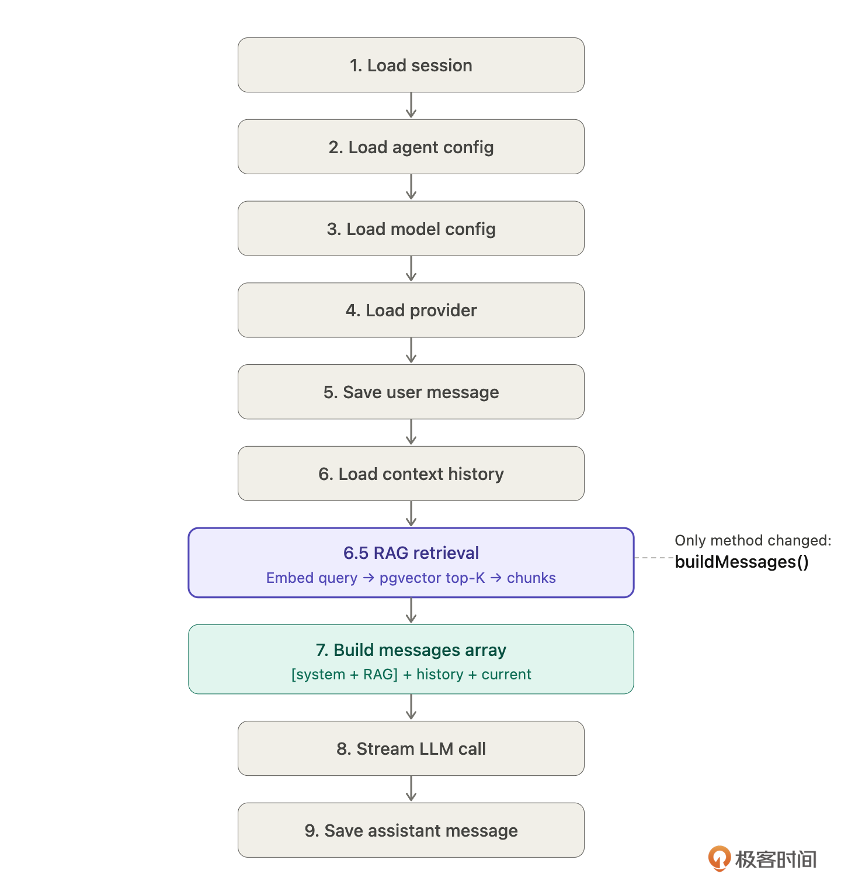
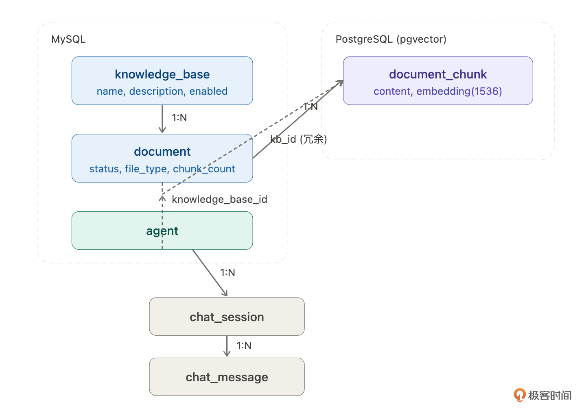
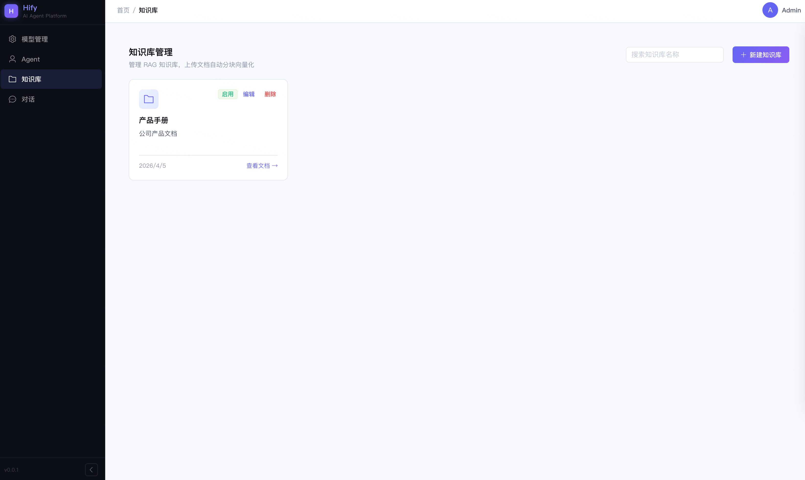
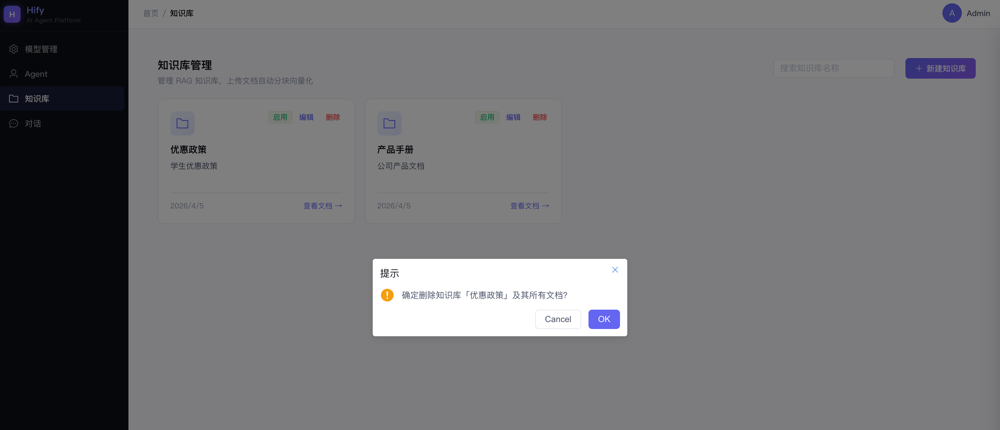
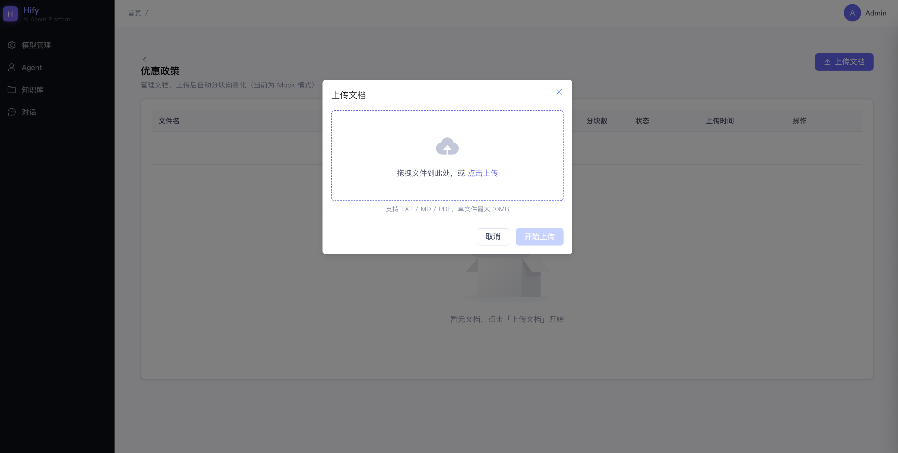
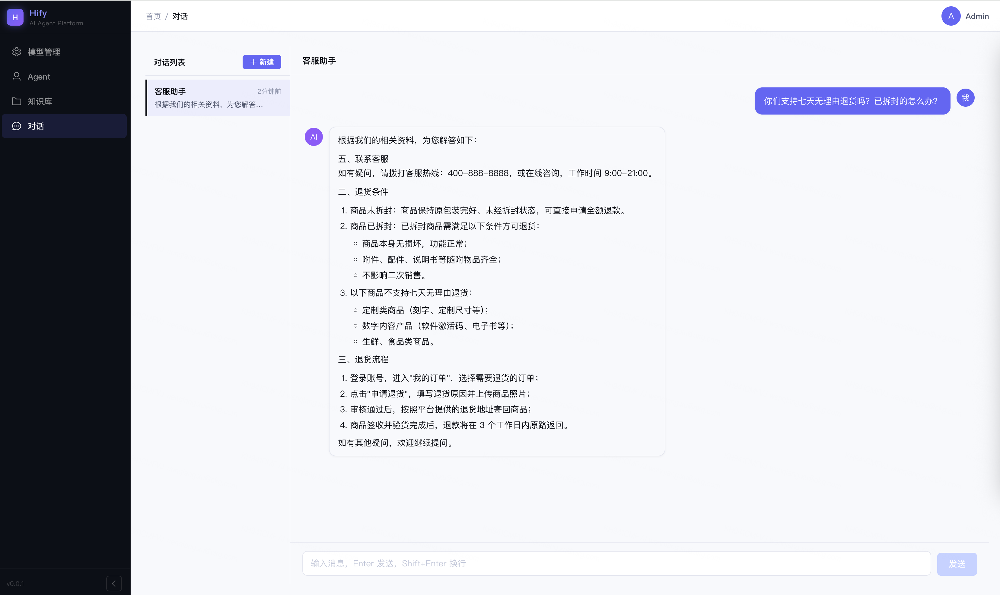

# 21｜RAG 知识库（下）：给客服一本手册，对话功能集成 RAG
你好，我是Robert。

20讲完成了探路，pgvector装好了，Embedding API能调了，两个能力分别验证通过。这一讲把它们变成Hify的真实功能。但在动手之前，我想先说清楚这一讲的挑战在哪里。

我们这节课是要实现RAG的全流程，我把它叫做数据管线。什么是数据管线呢？它就是组织、生成知识库的全流程的名称。 **数据管线是新模块，需要从零开始建，不碰已有代码，相对独立**。

真正的挑战是第二件事，把 **RAG检索接入已经跑通的对话引擎**。17讲的sendMessage链路已经可以运行，用户在用，我要在这条链路里插入一个新环节，同时保证原有功能一分都不能少。

这不只是RAG的问题，以后你给任何一个跑通的系统加新能力，都会遇到同样的挑战： **怎么加新的，不破坏旧的**。

## 先想清楚要改哪里

动手之前，先把改动范围圈清楚。

> 17讲的sendMessage有六步链路。RAG检索应该插在哪一步？插入之后上下文结构怎么变？

为什么要先问这个问题？ **不是所有“在已有系统里加功能”都需要大改**，关键是找到最小侵入点。在动手写任何一行代码之前，先搞清楚要改的是哪个方法、在哪一行之前插入，改动范围先圈死。

之前的课程中，很多同学在问，怎样在老项目中使用AI的能力，也就是使用AI对老项目进行改造和开发。这句话就是我的核心观点。从小到大，从快到慢。AI理解和拆解项目也是需要过程的。

Claude Code梳理了完整的九步链路（17讲实现时是六步，后来细化成了九步）：

```plaintext
1. 加载 Session → 拿到 agentId
2. 加载 Agent   → 拿到 systemPrompt、modelConfigId、temperature、maxContextTurns
3. 加载 ModelConfig → 拿到 modelId、providerId
4. 加载 Provider → 拿到 baseUrl、authConfig
5. 写入用户消息到 MySQL
6. 从 Redis 加载上下文历史
7. 拼 messages 数组：[system] + 历史 + 当前消息
8. 调 LLM streamChat
9. 写入 assistant 消息，更新 Redis

```

RAG检索插在第6步之后、第7步之前，标记为第6.5步：

```plaintext
6.5 ★ RAG 检索：用户问题 → Embedding → pgvector Top-K → 相关 chunk

```

为什么是这个位置？逻辑很清晰：第5步之后用户消息才确定，才能拿它去检索；第7步是拼装messages，检索结果要注入system prompt，必须在第7步之前拿到。不能更早，因为第1-4步还在加载配置，根本不知道用户问了什么。

插入之后，messages结构从：

```plaintext
[system: Agent 原始 Prompt]
[user: 上一轮]
[assistant: 上一轮]
[user: 当前消息]

```

变成：

```plaintext
[system: Agent 原始 Prompt + 参考资料]
[user: 上一轮]        ← 历史消息不变
[assistant: 上一轮]   ← 历史消息不变
[user: 当前消息]      ← 当前消息不变

```

只有system变了，其余不动。检索结果注入system prompt，对历史消息和当前消息完全无侵入。这是最小侵入的接入方式——改动面小，风险低，旧功能最不容易被破坏。



圈定改动范围：只改ChatService的buildMessages方法，其他八步不动。流式调用、SseEmitter转发、消息存储、Redis上下文管理，全部不碰。把这个约束写进给Claude Code的指令，是防止改动扩散的第一道防线。

## 数据模型

在实现数据管线之前，先把数据模型定好。

> Hify要支持RAG知识库。管理员上传文档，系统自动分块、向量化存入pgvector。对话时检索相关内容注入上下文。帮我设计数据模型。

Claude Code给了三张表的设计，有一个细节我没想到，这是两个数据库，不是一个。

### 三张表，两个数据库

```plaintext
MySQL
  knowledge_base   — 知识库容器
  document         — 文档元信息 + 处理状态

PostgreSQL (pgvector)
  document_chunk   — 分块文本 + embedding 向量

```

为什么分两个数据库？ `knowledge_base` 和 `document` 是业务数据，有完整的增删改查，走MyBatis-Plus，放MySQL。 `document_chunk` 是向量数据，只有批量写入和相似度查询两种操作，需要pgvector的向量检索能力，放PostgreSQL。用JdbcTemplate直接写SQL比配MyBatis Mapper更简单。

Spring里要配双数据源：

```yaml
spring:
  datasource:
    mysql:
      url: jdbc:mysql://localhost:3306/hify
    pgvector:
      url: jdbc:postgresql://localhost:5432/hify

```

两个数据库的分工：MySQL管“文档是什么、处理状态怎样”，pgvector管“向量存在哪、怎么检索”。

### DDL

**MySQL：knowledge\_base**

知识库容器，轻量，就是一个分组——名称、描述、状态。真正的内容在document和chunk里。

```sql
CREATE TABLE knowledge_base (
    id          BIGINT       NOT NULL AUTO_INCREMENT PRIMARY KEY,
    name        VARCHAR(100) NOT NULL,
    description VARCHAR(500) DEFAULT '',
    enabled     TINYINT(1)   NOT NULL DEFAULT 1,
    deleted     TINYINT(1)   NOT NULL DEFAULT 0,
    created_at  DATETIME     NOT NULL,
    updated_at  DATETIME     NOT NULL
);

```

**MySQL：document**

关联 `knowledge_base_id`，记录文件元信息和处理状态。

```sql
CREATE TABLE document (
    id                BIGINT       NOT NULL AUTO_INCREMENT PRIMARY KEY,
    knowledge_base_id BIGINT       NOT NULL,
    name              VARCHAR(200) NOT NULL,
    file_type         VARCHAR(20)  NOT NULL,   -- txt / pdf / md
    file_size         BIGINT       NOT NULL,
    status            VARCHAR(20)  NOT NULL DEFAULT 'PENDING',
    -- PENDING / PROCESSING / DONE / FAILED
    error_message     VARCHAR(500) DEFAULT '',
    chunk_count       INT          NOT NULL DEFAULT 0,
    deleted           TINYINT(1)   NOT NULL DEFAULT 0,
    created_at        DATETIME     NOT NULL,
    updated_at        DATETIME     NOT NULL,
    KEY idx_document_kb_id (knowledge_base_id)
);

```

重点是 `status` 字段——PENDING → PROCESSING → DONE / FAILED四个状态。文档处理是异步的，前端轮询这个字段显示进度。 `error_message` 记录失败原因， `chunk_count` 记录分块数量。

**PostgreSQL：document\_chunk**

向量数据，存分块文本和embedding。

```sql
CREATE EXTENSION IF NOT EXISTS vector;

CREATE TABLE document_chunk (
    id                BIGSERIAL    PRIMARY KEY,
    knowledge_base_id BIGINT       NOT NULL,   -- 冗余，检索时免 JOIN
    document_id       BIGINT       NOT NULL,
    chunk_index       INT          NOT NULL,
    content           TEXT         NOT NULL,
    embedding         vector(1536) NOT NULL,   -- text-embedding-3-small
    token_count       INT          NOT NULL DEFAULT 0,
    deleted           SMALLINT     NOT NULL DEFAULT 0,
    created_at        TIMESTAMPTZ  NOT NULL DEFAULT NOW()
);

CREATE INDEX idx_chunk_kb ON document_chunk (knowledge_base_id) WHERE deleted = 0;

```

`knowledge_base_id` 是冗余字段，检索时直接按知识库过滤，不用JOIN document表。 `embedding` 是1536维向量，对应OpenAI text-embedding-3-small模型的输出维度。

**agent表加一列：**

```sql
ALTER TABLE agent
    ADD COLUMN knowledge_base_id BIGINT DEFAULT NULL;

```

NULL表示不启用RAG，有值表示启用。对话链路里判断这个字段决定要不要走检索，加一列，对已有功能零侵入。

### 关系图



### mock profile处理

H2不支持vector类型。 `schema-h2.sql` 里把 `document_chunk` 的embedding列改成TEXT，相似度查询在mock profile下返回空列表，不影响其他功能的验证。

## 数据管线

数据管线是独立的新能力，先单独做完并验收，不混在对话引擎的改动里。这样如果出了问题，能精确定位是哪一层。

### 数据管线拆解

动手之前，先让Claude Code帮我把数据管线拆清楚。

> Hify要支持RAG知识库。管理员上传文档，系统自动分块、向量化存入pgvector，对话时检索相关内容注入上下文。
>
> 问三个问题：
>
> 1. 这条数据管线由哪几个环节组成？每个环节做什么？
> 2. 管线之外，还需要哪些配套功能才能让这个特性完整可用？
> 3. 哪些部分需要前端页面？

Claude Code给了一个很清晰的拆解。整理之后，数据管线这个特性分三块：

**第一块：知识库与文档的CRUD（1）**

管线不是凭空跑的，得先有知识库容器，得有文档上传入口。这是骨架：创建知识库、上传文档、查看状态、查看分块、删除。没有这些接口，管线没有输入，前端没有操作入口。

**第二块：管线处理逻辑（2）**

文档上传后，异步触发五步处理：状态更新 → 解析文本 → 分块 → 向量化 → 存入pgvector。这是核心能力。

**第三块：前端页面（3）**

管理员需要界面来操作，创建知识库、上传文档、看处理进度、查看分块结果。不做前端的话，只能curl调接口，不是一个完整的功能。

开发顺序： **1 → 2 → 3 → 4验收。** 先搭后端骨架，再填管线处理逻辑，再做前端，最后前后端一起验收。每一步都可以独立测试，出了问题能精确定位是哪一层。

这里我就不一点点展开讲了，我直接给出我的提示词。你可以根据提示词，结合这个章节的内容去推敲为什么这么问？为什么这么组织？这个过程，也可以让Claude Code协助你，比如，你可以把这篇文章给Claude Code，让它给你总结。

### 1\. 知识库与文档CRUD——后端

先把增删改查的骨架搭好，管线处理逻辑后面再加。

知识库CRUD指令：

```plaintext
Hify 的知识库管理模块，后端部分。参考数据模型章节的 knowledge_base 表。

实现以下接口：
POST   /api/v1/knowledge-bases          — 创建知识库，参数：name（必填）、description（可选）
GET    /api/v1/knowledge-bases          — 分页查询知识库列表，参数：page、size、name（模糊搜索）
GET    /api/v1/knowledge-bases/{id}     — 查询单个知识库详情
PUT    /api/v1/knowledge-bases/{id}     — 更新知识库，参数：name、description、enabled
DELETE /api/v1/knowledge-bases/{id}     — 逻辑删除知识库

约束：
- 代码放在 hify-knowledge 模块
- 分层结构：Controller → Service → Mapper，遵循 CLAUDE.md 的代码组织规范
- Controller 只做参数校验和响应包装，业务逻辑在 Service
- 删除知识库时，关联的 document 和 document_chunk 一起逻辑删除
- 返回格式统一用 Result&lt;T&gt; 包装

```

文档管理CRUD指令：

```plaintext
Hify 的文档管理模块，后端部分。参考数据模型章节的 document 表和 document_chunk 表。

实现以下接口：
POST   /api/v1/knowledge-bases/{kbId}/documents    — 上传文档
       接收 multipart/form-data，校验文件类型（只接受 txt/md/pdf）和大小（不超过 10MB）
       文件落盘到 upload 目录，MySQL 写入 document 记录（status=PENDING）
       立即返回 documentId，提交异步任务到线程池
GET    /api/v1/knowledge-bases/{kbId}/documents     — 分页查询知识库下的文档列表
GET    /api/v1/documents/{id}                       — 查询单个文档详情（含 status、chunk_count、error_message）
GET    /api/v1/documents/{id}/chunks                — 查询文档的分块列表（调 pgvector 的 JdbcTemplate）
DELETE /api/v1/documents/{id}                       — 逻辑删除文档，同时删除 pgvector 里的 chunk

约束：
- 上传接口必须异步。文档处理要几秒到几十秒，同步等待会超时，也会占住 Tomcat 线程
  上传接口只负责：接收文件、创建记录、提交异步任务。处理逻辑全在异步线程里跑
- asyncExecutor 用独立线程池，核心线程 2，最大线程 4，队列 100
- document 的 status 字段驱动前端轮询：PENDING → PROCESSING → DONE / FAILED
- 查询 chunks 走 pgvector 数据源的 JdbcTemplate，不走 MyBatis
- 删除文档时，pgvector 里的 chunk 也要逻辑删除（UPDATE deleted=1）

```

### 2\. 管线处理逻辑——后端

上传接口提交异步任务后，管线开始工作。五个环节串联处理。

先让Claude Code把每个环节的输入输出格式梳理清楚：

```plaintext
知识库文档处理管线，每个环节的输入是什么、输出是什么？
输出的格式要能直接喂给下一个环节。

```

为什么要专门问这个？多步骤串联任务最容易出的错，就是环节之间数据格式对不上。上一步输出了A，下一步期望收到B，接口一对就出问题。把每个环节的输入输出先对齐，再写代码，省去很多调试时间。

管线实现指令：

```plaintext
Hify 文档处理管线，在异步线程池中执行。接续上传接口提交的异步任务。

管线有五个环节，每个环节拆成独立的 private 方法，管线方法只负责串联和状态管理：

1. 状态更新
   document.status = PROCESSING

2. 解析 — extractText(filePath, fileType) → String
   TXT/MD：直接读文件内容，UTF-8
   PDF：用 Apache PDFBox 提取文字层。扫描版 PDF（提取文字为空）一期不支持，返回错误
   解析失败（加密 PDF、损坏文件）→ status=FAILED，写 error_message，后续环节不执行

3. 分块 — splitChunks(text) → List&lt;ChunkDTO&gt;
   递归分割：chunk_size=512 token，overlap=64 token
   切割优先级：段落边界（\n\n）&gt; 句子边界（句号、问号）&gt; 字符数截断
   每个 ChunkDTO 包含：chunkIndex、content、tokenCount

4. 向量化 — embedChunks(List&lt;ChunkDTO&gt;) → List&lt;ChunkDTO&gt;（补上 embedding 字段）
   调用 Embedding API，input 支持数组，一次请求处理多个块
   分批逻辑：每批最多 100 条，超过就分多批
   注意：API 返回的 data[] 数组按 index 字段排序后再和原始 chunk 列表对应
   不能假设返回顺序和输入顺序一致

5. 存储 — saveChunks(documentId, knowledgeBaseId, List&lt;ChunkDTO&gt;)
   JdbcTemplate.batchUpdate() 批量写入 pgvector 的 document_chunk 表
   写完后更新 document.status=DONE，chunk_count=N

异常处理：
- 任何一个环节失败，都要 catch 住，更新 document.status=FAILED，写清楚 error_message
- 不能因为一个文档处理失败影响线程池里其他文档的处理

约束：
- 不要把所有逻辑写在一个大方法里
- 管线方法只负责串联五步 + 状态管理，每个环节的具体逻辑在独立方法里
- Embedding API 的配置复用 Provider 模块的配置，不要硬编码 URL 和 API Key

```

管线代码组织的原则： **每个环节独立，管线只负责串联。** 不只是为了代码整洁，更重要的是，某个环节出了问题时，能精确定位是哪一步，单独测试单独修复，而不是在一个几百行的大方法里翻来翻去。这个原则适用于任何多步骤数据处理管线。

### 3\. 前端页面

后端接口跑通后，做前端。分两个页面：知识库管理和文档管理。

知识库管理页指令：

```plaintext
Hify 前端，知识库管理页面。Vue 3 + Element Plus。

页面路径：/knowledge-bases
功能：
1. 列表页
   - 表格展示：名称、描述、状态（启用/禁用）、文档数量、创建时间
   - 顶部搜索框：按名称模糊搜索
   - 操作列：编辑、删除（二次确认）
   - 右上角"新建知识库"按钮

2. 新建/编辑弹窗
   - 表单字段：名称（必填）、描述（可选）
   - 编辑时回填已有数据
   - 提交后刷新列表

3. 点击知识库名称，跳转到文档管理页：/knowledge-bases/{id}/documents

调用后端接口：
- GET    /api/v1/knowledge-bases          列表
- POST   /api/v1/knowledge-bases          新建
- PUT    /api/v1/knowledge-bases/{id}     编辑
- DELETE /api/v1/knowledge-bases/{id}     删除

约束：
- 遵循 CLAUDE.md 的前端代码规范
- 表格用 el-table，弹窗用 el-dialog，表单校验用 el-form 的 rules
- 空状态给提示文案，不要空白页面

```

文档管理页指令：

```plaintext
Hify 前端，文档管理页面。Vue 3 + Element Plus。

页面路径：/knowledge-bases/{kbId}/documents
功能：
1. 页面顶部显示当前知识库名称，有返回按钮回到知识库列表

2. 文档列表
   - 表格展示：文件名、文件类型、文件大小、分块数量、处理状态、创建时间
   - 状态列用不同颜色标签：
     PENDING（灰色）、PROCESSING（蓝色，带 loading 动画）、DONE（绿色）、FAILED（红色）
   - FAILED 状态鼠标悬浮显示 error_message
   - 操作列：查看分块、删除（二次确认）

3. 上传功能
   - 右上角"上传文档"按钮，点击打开上传弹窗
   - 支持拖拽上传，限制文件类型 txt/md/pdf，限制大小 10MB
   - 上传后立即在列表中出现，状态为 PENDING
   - 自动轮询：每 3 秒调一次 GET /api/v1/documents/{id}
     状态变为 DONE 或 FAILED 时停止轮询，刷新列表

4. 查看分块弹窗
   - 点击"查看分块"打开弹窗
   - 列表展示每个 chunk 的序号和内容（content 字段，截断显示前 200 字，点击展开全文）
   - 不展示 embedding 向量（太长没有可读性）

调用后端接口：
- GET    /api/v1/knowledge-bases/{kbId}/documents     文档列表
- POST   /api/v1/knowledge-bases/{kbId}/documents     上传文档
- GET    /api/v1/documents/{id}                       轮询状态
- GET    /api/v1/documents/{id}/chunks                查看分块
- DELETE /api/v1/documents/{id}                       删除文档

约束：
- 轮询逻辑用 setInterval，组件销毁时 clearInterval，避免内存泄漏
- 上传组件用 el-upload，设置 accept 和 before-upload 校验
- PROCESSING 状态的行禁止删除操作（按钮置灰）

```

### 4\. 验收

前后端都完成后，走一遍完整流程验收。

**后端验收：**

```bash
# 创建知识库
curl -X POST http://localhost:8080/api/v1/knowledge-bases \
  -H "Content-Type: application/json" \
  -d '{"name": "产品手册", "description": "公司产品手册和售后政策"}'

# 上传文档（立即返回，后台处理）
curl -X POST http://localhost:8080/api/v1/knowledge-bases/1/documents \
  -F "file=&#64;product_manual.txt"
# 返回 documentId，status: PROCESSING

# 轮询处理状态
curl http://localhost:8080/api/v1/documents/1
# status 应该在几秒内变成 DONE，chunk_count 有值

# 检查分块结果
curl http://localhost:8080/api/v1/documents/1/chunks
# 应该有若干条记录，每条有 content 和 chunkIndex

```

查pgvector的document\_chunk表，确认每条记录都有1536维的embedding向量。

**前端验收：**

知识库管理



上传文档，拆解为向量存储



## 接入对话引擎

数据管线跑通了，现在把检索接入sendMessage。这是本节课风险最高的一步。

原因很简单： **数据管线是新建的，坏了只影响新功能。而sendMessage是已有用户在用的链路，改坏了是线上故障**。

这种情况下，有一个通用的增量开发节奏 **：圈定改动范围 → 验证旧功能没坏 → 验证新功能生效**。三步的顺序不能乱，每一步都是对前一步的护栏。其中最难的是第一步，也就是大家日常最容易碰到的。怎么圈定呢？

这个答案，其实我们这节课一直在强调， **从小到大，你来指导**。如果你想当甩手掌柜，那肯定是不可能的。至少目前不行。

### 写精确的指令，把改动范围圈死

先想清楚要改什么。sendMessage九步链路里，RAG插在第6.5步——用户消息向量化、检索相关chunk、注入system prompt。对应到代码，就是 `ChatService` 里的 `buildMessages` 方法。

改动范围确定了，指令就要把这个约束写进去：

```plaintext
修改 ChatService 的 buildMessages 方法，在 System Prompt 后插入 RAG 检索结果。

改动范围：只改 buildMessages 这一个方法。

具体逻辑：
- 检查 Agent 是否有 knowledgeBaseId；没有就跳过，直接返回原始 system prompt
- 有的话：把用户消息向量化，调 document_chunk 相似度查询，topK=3，过滤相似度低于 0.75 的结果
- 把检索到的 chunk 拼进 system prompt，格式如下：

  {Agent 原始 Prompt}

  请基于以下参考资料回答用户问题。
  如果资料中没有相关信息，直接说"我没有找到相关资料"，不要编造。

  【参考资料】
  [1] {chunk1内容}
  [2] {chunk2内容}

不要修改流式调用、SseEmitter 转发、消息存储的逻辑。不要改 Controller 层。

```

这条指令有几个细节值得说：

- **改动范围要显式写出来**。Claude Code默认会举一反三，它可能判断“既然改了buildMessages，顺便把Controller的参数也调整一下更合理”。在新项目里这是优点，在有线上用户的系统里是风险。写“不要改Controller层”，是把扩散边界提前锁死。

- **Agent原始Prompt要保留，参考资料附在后面**。不是替换，是拼接。两者之间有空行，语义层次分明，LLM读起来清楚哪部分是角色设定、哪部分是检索资料。

- **“没有相关信息就直接说”这句非常关键**。没有这个约束，LLM在检索结果不充分时会用训练知识补充，还不告诉你它在补。加了这句，LLM知道自己的边界，RAG不只让LLM能引用文档，也让它知道自己不知道什么。

- **没有绑知识库的Agent，行为和之前完全一致**。 `knowledgeBaseId` 为空时， `buildMessages` 直接走原来的路径，零影响。开关在Agent维度，不影响全局。


### 改完先跑旧用例

代码改完，第一件事不是测新功能，是确认旧的还没坏：

```bash
curl -N -X POST http://localhost:8080/api/v1/chat/sessions/1/messages \
  -H "Content-Type: application/json" \
  -H "Accept: text/event-stream" \
  -d '{"content": "Hify 支持哪些模型供应商？", "stream": true}'

```

用一个没绑知识库的session，正常问一个问题。流式返回正常、内容正确，旧功能完好，再继续。

如果这里出了问题，先回滚再排查，不要在旧功能已经坏掉的状态下继续往下走。两件事同时出错，定位会乱。

### 跑新用例，看检索是否命中

旧功能确认没坏，再给Agent绑上知识库，测新功能：

```bash
# 绑定知识库
curl -X PUT http://localhost:8080/api/v1/agents/1 \
  -H "Content-Type: application/json" \
  -d '{"knowledgeBaseId": 1}'

# 提问
curl -N -X POST http://localhost:8080/api/v1/chat/sessions/2/messages \
  -H "Content-Type: application/json" \
  -H "Accept: text/event-stream" \
  -d '{"content": "你们支持七天无理由退货吗？已拆封的怎么办？", "stream": true}'

```

看后端日志，应该能看到 `RAG 检索命中 2 条，相似度 0.94、0.81`。回答里出现具体条款引用，说明检索链路通了。

三步走的本质是： **每一步只验证一件事。** 第一步缩小改动面，第二步确认没有破坏，第三步确认新能力生效，顺序不能反。如果先测新功能再测旧功能，旧功能出了问题你不知道是这次改动导致的，还是原本就有的。

这套节奏不只适用于RAG接入，适用于在任何跑通的系统里加任何新能力。

## 完整验收

数据管线和对话引擎都改完了，现在做整体验收。

验收不只是“跑一遍看看有没有报错”。RAG的验收要覆盖三个维度：检索链路是否通、回答质量是否变了、边界场景是否守住了。三个维度都过，这个功能才算真正完成。

### 准备测试文档

先准备一份内容确定的测试文档，上传到知识库。用真实业务内容，不要用“测试测试”这种占位文字，内容越接近真实场景，验收结论越可信。

```plaintext
退换货政策：
自签收之日起七天内，未拆封商品支持无理由退货。
已拆封但存在质量问题的商品，三十天内可申请换货。
退货运费由买家承担，换货运费由公司承担。
生鲜食品、定制商品不支持退换货。

产品保修：
所有电子产品享受一年免费保修。
保修期内非人为损坏，提供免费维修或更换。

会员权益：
银卡会员：年消费满 2000 元自动升级，享受 9.5 折优惠。
金卡会员：年消费满 5000 元自动升级，享受 9 折优惠 + 专属客服。

```

文档上传后，等状态变为 `DONE`，确认 `chunk_count` 有值，再进行后续验收。管线没跑完就测对话，检索会命中空结果，容易误判。

### 验收一：对比绑知识库前后的回答

这是最核心的验收点。同一个问题，绑知识库前后的回答应该有明显差异。

用同一个Agent，先不绑知识库，问：

> 你们支持七天无理由退货吗？已拆封的怎么办？

预期回答类似：

> 根据一般的电商行业惯例，大多数平台支持七天无理由退货……

靠猜的，用的是训练知识，说的是一般情况。

再给这个Agent绑上知识库，问同样的问题：

```bash
curl -X PUT http://localhost:8080/api/v1/agents/1 \
  -H "Content-Type: application/json" \
  -d '{"knowledgeBaseId": 1}'

```

预期回答变成：

> 根据退换货政策，自签收之日起七天内，未拆封商品支持无理由退货。如果商品已拆封但存在质量问题，三十天内可申请换货。

从“靠猜的通用回答”变成“引用具体条款的准确回答”，这个差异说明检索链路通了，内容注入生效了。

同时看后端日志，应该能看到：

```plaintext
RAG 检索命中 2 条，相似度 0.94、0.81

```

日志没有这一行，说明检索没有触发，要往 `buildMessages` 里查。

### 验收二：边界场景——文档里没有的问题

问一个测试文档里完全没有覆盖的问题：

> 你们有没有学生优惠？

预期回答：

> 根据现有的产品手册，我没有找到关于学生优惠的相关信息。如需了解，建议联系人工客服确认。

没有编造，诚实告知边界。这是Prompt里那句“如果资料中没有相关信息，直接说我没有找到相关资料”发挥的作用。

如果这里LLM回答了一个听起来合理的学生优惠方案，说明约束没有生效，要回去检查system prompt的拼接逻辑。

### 验收三：没有绑知识库的Agent不受影响

换一个没有绑知识库的Agent，正常对话，确认行为和之前完全一致。

```bash
curl -N -X POST http://localhost:8080/api/v1/chat/sessions/3/messages \
  -H "Content-Type: application/json" \
  -H "Accept: text/event-stream" \
  -d '{"content": "你好，介绍一下你自己", "stream": true}'

```

流式返回正常，日志里没有任何RAG相关的输出。这一步确认的是：RAG的开关在Agent维度，没有绑知识库的Agent完全不受影响，最小侵入的承诺兑现了。



三个验收维度都过，这个功能才算完整交付：链路通、质量变好、边界守住、旧功能没坏。

## 总结

你可能会发现，这两讲和前面的课有点不一样，内容变多了，细节变少了，很多地方直接给提示词，没有一步步拆解。

原因很简单：RAG本身是一个可以单独开一门课的话题。我们把它压进两讲，取舍是必然的。我的选择是： **把思考过程和提示词完整给你，细节让你自己去琢磨。**

如果你真的深度读完这两讲，按照主体框架自己展开，让Claude Code配合你把每个环节做透，你完全可以做出一个生产可用的知识库系统，学到的东西会远超两讲的篇幅。

这门课一直想教的不是某个技术点，是思考方式。这两讲值得多花时间。

两讲做了一件完整的事： **在一个跑通的系统里，加入一个你从未接触过的技术能力，从探路到集成到验收**。

第20讲的方法论是探路，从业务痛点出发建立认知，拆解技术组件缩小陌生范围，约束驱动选型，最小Demo建立手感。

第21讲的方法论是集成，找到最小侵入点，独立验收新能力，增量开发三步走。数据管线单独做完再接入，接入后先跑旧用例再跑新用例。这套流程不只适用于RAG，适用于在任何跑通的系统里加任何新能力。

还有一个值得带走的代码组织原则： **每个环节独立方法，管线只负责串联。** 数据管线是这样，任何多步骤串联任务都适用。某个环节出了问题，能精确定位，单独修复，不用在一个几百行的大方法里翻来翻去。

## 思考题

1. 分块策略：固定切割vs按结构切割

当前用的是固定512 token + 64 overlap的递归分割。但如果文档本身有明确的章节结构，比如“退换货政策”“产品保修”“会员权益”这样的标题，按固定大小切可能会把一个完整章节切断，检索时拿到的是半截内容。那么按标题分块会不会更好？两种策略各有什么适用场景？让Claude Code帮你实现一个基于标题识别的分块策略，和当前的递归分割对比检索效果。

2. 动态参数：topK和相似度阈值怎么调？

现在topK=3、阈值0.75是写死的。问题来了：用户的问题涉及多个主题时，3条不够；问题很简单时，3条又太多，白占token。

固定参数是一种妥协，不是最优解。让Claude Code帮你设计一个根据场景动态调整这两个参数的方案——想清楚“场景”怎么判断，参数怎么映射。

3. 表格内容的检索难题

当前RAG只处理纯文本。如果文档里有表格，比如会员等级对比表、银卡金卡的权益并排放，切块之后表格结构就碎了，检索效果会很差，LLM拿到的是一堆乱序的单元格内容。

这是RAG的一个经典难题，没有银弹。让Claude Code分析有哪些处理方案，各自的代价和适用边界在哪里。

期待你的分享！如果今天的课程让你有所收获，也欢迎转发给有需要的朋友，邀请他来一起学习，我们下节课再见！