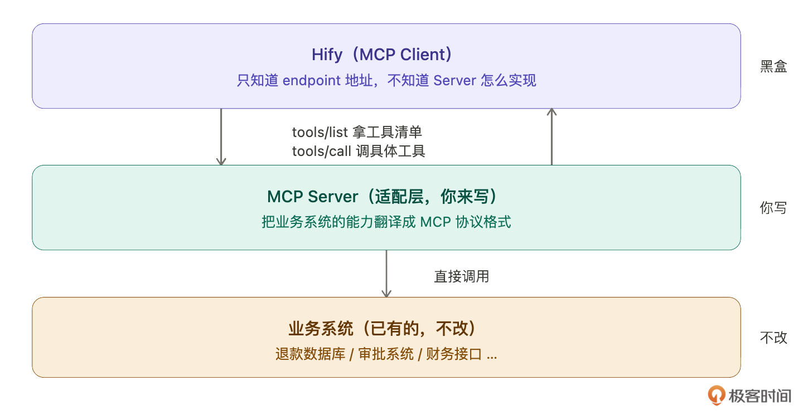
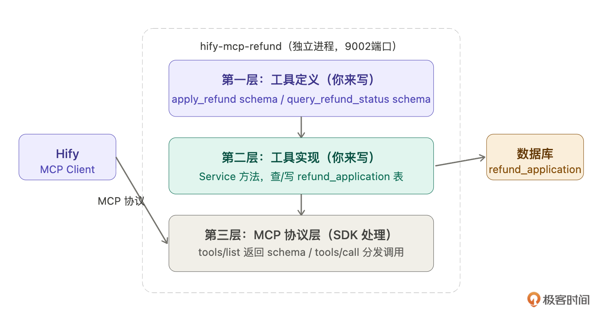
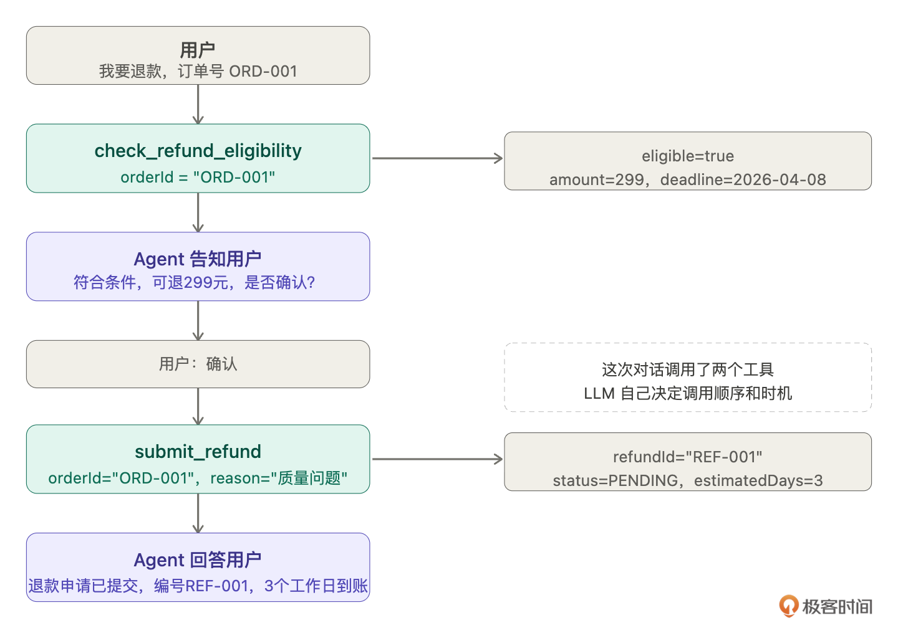
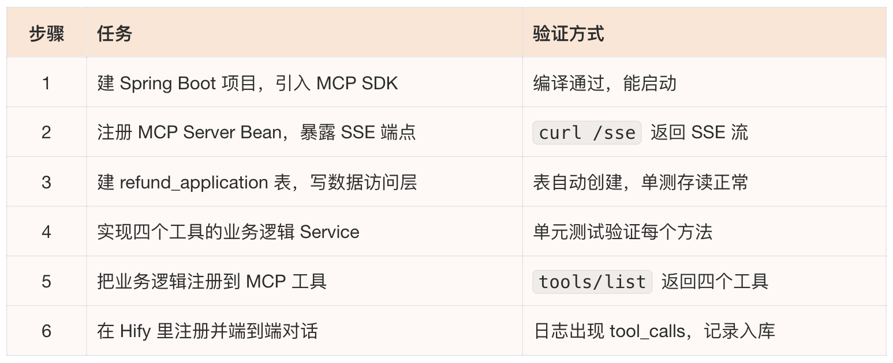
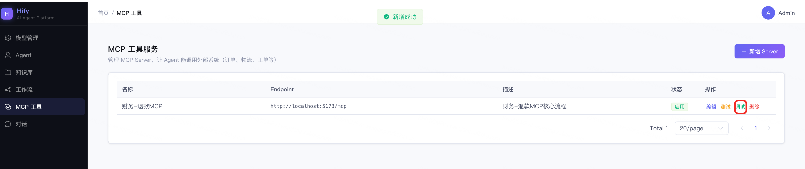
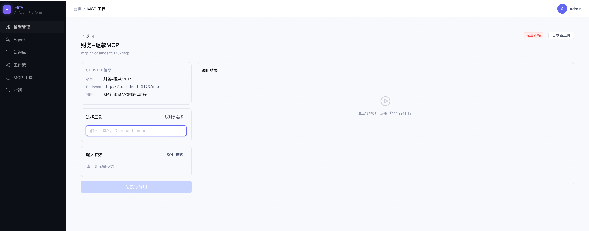
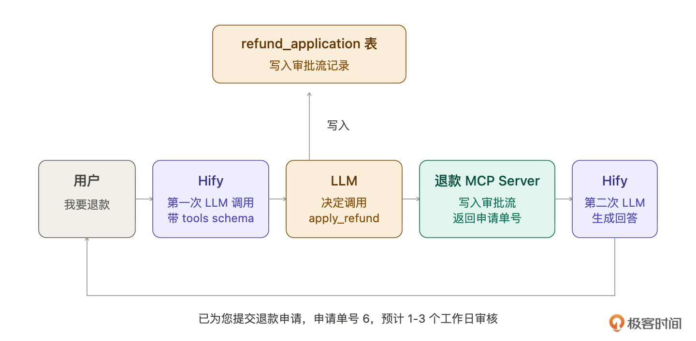
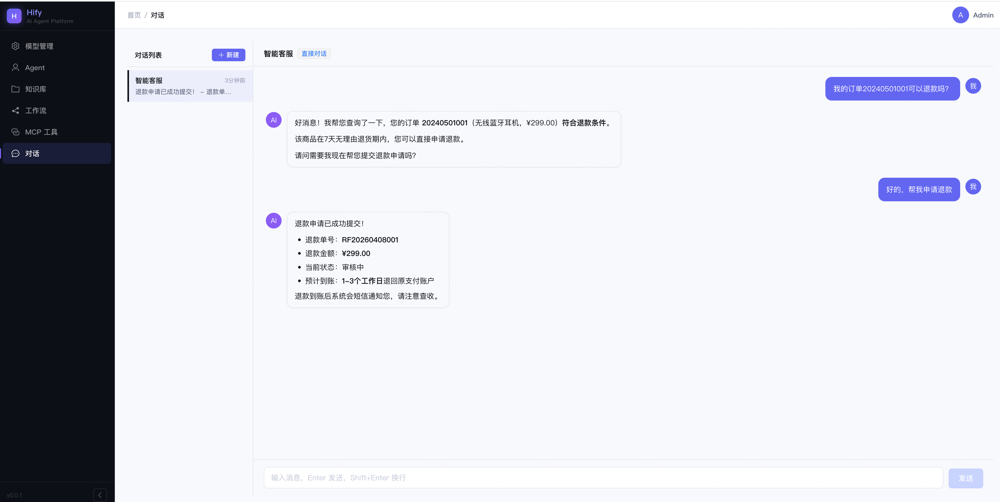

# 25｜MCP 工具接入（下）：自建 MCP Server，让 Agent 能做真正的事
你好，我是Robert。

24讲跑通了MCP Client，智能客服能调外部工具了。但那个Server是模拟的，硬编码返回固定结果，不是真的查数据库。

更重要的是，智能客服还有一个更深的痛点没有解决。用户说“我要退款”，现在客服只能回答“好的，请您拨打客服热线”。用户说“我的退款什么时候到账”，客服只能说“请您耐心等待”。这个体验是非常差的，那怎么解决呢？

退款是智能客服最高频的诉求之一，但它涉及公司内部财务系统，没有公开的MCP Server可以用，必须自建。这一讲做 **一个真实的退款MCP Server**，连接内部财务系统，让Agent真正能“做事”，不只是“说事”。

## 为什么要自建MCP Server

什么时候用现成的，什么时候自建？

用现成的：工具提供方已经发布了官方MCP Server。比如24讲提到的Stripe支付查询、退款发起，Stripe官方Server都提供了，直接接入就行。

必须自建，有两种情况：

1. 内部系统没有公开MCP Server，公司的财务系统、ERP、内部工单系统，这些系统不对外，没有人会替你做MCP Server，只能自建。

2. 有公开Server但需要定制业务逻辑，比如退款要走公司自己的审批流，金额超过500元需要主管审批，这种业务规则只有自己最清楚，必须自建。


退款场景两个都占了：财务系统是内部的，退款还要走公司的审批流程。这就是这一讲要自建的理由。

## MCP Server在代码里长什么样

自建之前，我们先搞清楚要交付什么，所以我们可以先问：

> 一个 MCP Server 在代码层面是什么？
>
> 它是一个独立的应用吗？目录结构长什么样？
>
> 和 Hify 是什么关系？用三层结构帮我解释。

Claude Code解释得很清楚：MCP Server就是一个独立的Spring Boot应用，和Hify完全分开部署，只通过HTTP通信。



然后解释一般MCP Server目录结构如下：

```plaintext
hify-mcp-refund/                  ← 独立 Maven 项目
├── pom.xml
└── src/main/java/
    ├── RefundMcpApplication.java ← Spring Boot 启动类
    ├── config/
    │   └── McpConfig.java        ← 注册工具到 MCP SDK
    └── service/
        └── RefundService.java    ← 真正的业务逻辑

```

到这里，我们就可以直观地理解MCP Server到底是个啥。总结就是： **一个HTTP Server**。

然后Claude Code解释说，MCP Server的代码只有两件我们需要关心的事：

1. **声明这个MCP工具的schema，名字、描述、需要什么参数**。

2. **然后实现业务逻辑，收到调用请求后查数据库或调接口**。


然后Claude Code又解释说MCP Server对Hify是黑盒。Hify只存了一个endpoint地址，发标准协议请求，不关心里面是Java还是Python，不关心查的是MySQL还是Oracle。这就是标准化协议的价值。



其实到这里，我们就可以理清楚MCP Server是什么，和Hify的关系是什么。这里其实就有一个问题，我怎么知道我的业务要做哪些MCP Server呢？

## 从业务场景推导需要哪些工具

从实际业务来看，工具不是拍脑袋定的，是从业务场景推导出来的。

> 我要开发一个退款 MCP Server，供智能客服 Agent 使用。
>
> 从智能客服的真实场景出发——用户通常会说哪些关于退款的话？
>
> 每类诉求需要什么样的工具能力？
>
> 帮我推导出需要哪些工具，每个工具的输入输出是什么。

Claude Code分析了用户会说的四类话，然后推导工具：

1. 用户说“我要退款”，需要先查退款资格，再提交申请。一步直接提交用户没有确认机会，所以拆成两个工具。

2. 用户说“我的退款审批了没”，需要查退款进度，返回状态和预计到账时间。

3. 用户说“不退了”，需要撤销申请，但只有PENDING状态才能撤。

4. 用户说“为什么退款被拒了”，这个不需要单独工具，查状态时把拒绝原因一起返回就够了。


你看，这个流程就可以推导出四个工具：

1. `check_refund_eligibility`：查退款资格。入参：orderId。出参：eligible（能不能退）、reason（原因）、deadline（最晚可退日期）、amount（可退金额）。

2. `submit_refund`：提交退款申请。入参：orderId、reason。出参：refundId、status、estimatedDays。

3. `get_refund_status`：查退款状态。入参：orderId或refundId（两者都接受，用户记得订单号不记得退款单号，Server里做转换比让用户多说一句话合理）。出参：status、statusLabel、estimatedArrival、rejectReason。

4. `cancel_refund`：撤销申请。入参：refundId。出参：success、message。


**到这里，其实就是一个活用Claude Code的一个例子。此时也非常考验你的判断和鉴别能力，是不是这四个工作都要做成MCP Server，还是可以只做一个满足这四点需求。这个问题交给你去思考一下。**

Claude Code提了一个容易漏掉的细节： `get_refund_status` 的statusLabel字段专门给LLM用，LLM直接把statusLabel说给用户，不需要自己翻译PROCESSING是什么意思。工具的返回值设计要考虑LLM的使用方式，不是只考虑数据完整性。

Claude Code还帮我们拆解一次完整退款对话会用哪些工具（真的贴心，这就是真正的生产力提升啊）：



## 让Claude Code拆解实现步骤

工具确定了，让Claude Code帮我拆实现步骤：

> 我要开发一个退款 MCP Server，独立的 Spring Boot 应用，用 Java MCP SDK。
>
> 提供四个工具：check\_refund\_eligibility、submit\_refund、get\_refund\_status、cancel\_refund，操作 refund\_application 表。
>
> 帮我拆解实现步骤，从建项目到能被 Hify 调用，每步给出验证方式。

Claude Code给的拆解，这里就不细讲了，跟之前的流程差不多：



每步都能独立验证，出了问题知道在哪层找。

## 逐步实现

因为流程很熟了，我就直接给提示词。

**建项目，注册MCP Server Bean**

```plaintext
创建独立 Spring Boot 工程 hify-mcp-refund。
引入依赖：
  io.modelcontextprotocol.sdk:mcp-spring-webmvc:1.1.1
  spring-boot-starter-web

配置类 McpConfig.java：
  注册 WebMvcSseServerTransport，路径 /messages
  注册 McpSyncServer Bean，serverInfo 填 "refund-mcp-server" "1.0.0"
  工具列表先空着，后面再注册

监听 9001 端口。

```

Claude Code解释了SDK自动暴露的两个端点： `GET /sse` 供Hify发现和监听， `POST /messages` 供Hify发工具调用请求。这两个端点不需要你写，SDK处理。

验证：

```bash
# 返回 SSE 流（挂住不退出），说明端点存在
curl -N http://localhost:9001/sse

```

**建表和数据访问层**

```plaintext
建 refund_application 表：
  orderId、userId、amount、reason
  status（PENDING/APPROVED/PROCESSING/COMPLETED/REJECTED）
  rejectReason、createdAt、updatedAt

用 Spring Data JPA 实现 RefundRepository。
加查询方法：findTopByOrderIdOrderByCreatedAtDesc
——按订单号查最新的退款申请。

```

**实现业务逻辑**

```plaintext
实现 RefundService，四个方法对应四个工具：

checkEligibility(orderId)：
  查订单是否在退款期内（一期简化：7天内且已签收）
  返回 Map：eligible、reason、deadline、amount

submitRefund(orderId, userId, amount, reason)：
  检查同一订单是否有 PENDING/APPROVED/PROCESSING 状态的申请
  有则返回错误：该订单已有进行中的退款申请，编号：xxx
  无则写入 refund_application，status=PENDING
  返回 Map：refundId、status、statusLabel、estimatedDays=3

getStatus(orderId)：
  查最新的退款申请记录
  status 用英文枚举，statusLabel 用中文给 LLM 直接说给用户
  返回 Map：refundId、orderId、amount、status、statusLabel、
           submittedAt、rejectReason

cancelRefund(refundId)：
  只有 PENDING 状态可以撤销
  PENDING 以外返回：退款已在处理中，无法撤销

约束：
- 异常情况返回友好提示，不要抛出技术错误信息给 LLM
- 返回值 LLM 会直接读，设计时考虑 LLM 怎么把它说给用户

```

**注册工具到MCP协议**

```plaintext
在 McpConfig 里，把四个工具注册到 McpSyncServer。

每个工具需要：
  工具名称（name）
  description——重点：说清楚"什么情况下调这个工具"
  inputSchema（JSON Schema 格式）
  handler（调用 RefundService 对应方法，结果序列化为 JSON 返回）

description 示例写法：
  check_refund_eligibility：
    "查询订单退款资格。用户说'我要退款'时，先调此工具确认是否符合条件，
     再决定是否提交申请。不要跳过此步直接提交。"

  submit_refund：
    "提交退款申请。仅在用户确认退款意愿、且 check_refund_eligibility
     返回 eligible=true 后调用。"

调用失败时返回 {"error": "错误原因"}，isError=true
不要让 SDK 抛出异常中断整个对话

```

验证：

```bash
# 建立 SSE 连接，拿 sessionId
curl -N http://localhost:9001/sse
# 返回：data: {"type":"endpoint","endpoint":"/messages?sessionId=xxx"}

# 用 sessionId 发 tools/list
curl -X POST "http://localhost:9001/messages?sessionId=xxx" \
  -H "Content-Type: application/json" \
  -d '{"jsonrpc":"2.0","id":1,"method":"tools/list","params":{}}'
# 应该返回四个工具

```

## MCP调试工具

Server自身跑通了，下一步是接入Hify。但在接入之前，Hify需要一个调试工具，开发MCP Server时能直接在Hify里验证工具行为，不用手动拼curl。

这个调试工具放在Hify侧边栏的MCP Server管理页面里，MCP Server接入是Hify的通用基础能力，调试工具也应该在这里，以后每接一个新Server都在这里调试。

```plaintext
在 Hify 前端的 MCP Server 详情页中，新增"调试"Tab。

功能：
1. 左侧：工具列表（从 mcp_tool 表读取），点击选中工具
2. 右侧调试面板：
   - 顶部显示工具 description（让开发者确认描述是否合理）
   - 根据 inputSchema 自动渲染参数表单
     string → 文本输入框，number → 数字输入框，必填标红星
   - 调用按钮 + 结果展示区
     结果显示返回内容 + 耗时
     保留最近 5 次调用记录

后端接口：
POST /api/v1/mcp-servers/{id}/debug
  入参：toolName、arguments（Map）
  逻辑：复用 McpClientService.callTool()
  返回：result（String）、elapsedMs（Int）

约束：
- 参数表单根据 inputSchema 动态渲染，不要写死字段
- 调用中 loading，防止重复点击

```

Claude Code会根据这个提示词给我们做成页面。当然细节需要我们不断跟它对话。这个过程交给你了，直接给效果图。



## 和Hify串起来

```bash
# 在 Hify 注册退款 MCP Server
curl -X POST http://localhost:8080/api/v1/mcp-servers \
  -H "Content-Type: application/json" \
  -d '{"name": "退款服务", "endpoint": "http://localhost:9001"}'

# 测试连通性，自动拉取工具列表
curl -X POST http://localhost:8080/api/v1/mcp-servers/1/test
# 返回：连通成功，发现工具 check_refund_eligibility、submit_refund、
#       get_refund_status、cancel_refund

# 给智能客服绑定退款工具
curl -X PUT http://localhost:8080/api/v1/agents/1/tools \
  -H "Content-Type: application/json" \
  -d '{"toolIds": [1, 2, 3, 4]}'

```

Server从模拟换成真实的，Hify的MCP Client一行代码没有改。这就是标准化协议的价值，工具提供方换了，调用方不用动。



## 验收

先用调试工具验证工具本身，再测端到端。工具验证通过，再测端到端对话：

```bash
# 场景一：发起退款
curl -N -X POST http://localhost:8080/api/v1/chat/sessions/2/messages \
  -H "Content-Type: application/json" \
  -H "Accept: text/event-stream" \
  -d '{"content": "我的订单ORD-001收到的商品是破损的，我要退款"}'
# 后端日志：
# [MCP] 调用 check_refund_eligibility(orderId=ORD-001) → eligible=true
# [MCP] 调用 submit_refund(orderId=ORD-001, reason=商品破损)
# 用户收到："已为您提交退款申请，编号REF-001，预计3个工作日审核。"

# 场景二：查退款进度
curl -N -X POST http://localhost:8080/api/v1/chat/sessions/2/messages \
  -H "Content-Type: application/json" \
  -H "Accept: text/event-stream" \
  -d '{"content": "我的退款审批了吗"}'
# [MCP] 调用 get_refund_status(orderId=ORD-001)
# 用户收到："您的退款正在审核中，预计3个工作日内处理。"

# 场景三：撤销退款
curl -N -X POST http://localhost:8080/api/v1/chat/sessions/2/messages \
  -H "Content-Type: application/json" \
  -H "Accept: text/event-stream" \
  -d '{"content": "算了不退了"}'
# [MCP] 调用 cancel_refund(refundId=1)
# 用户收到："已为您撤销退款申请。"

# 场景四：不需要调工具的问题
curl -N -X POST http://localhost:8080/api/v1/chat/sessions/2/messages \
  -H "Content-Type: application/json" \
  -H "Accept: text/event-stream" \
  -d '{"content": "你们的退款政策是什么"}'
# finish_reason=stop，没有工具调用，走 RAG 引用知识库回答

```

下面这张图是我们在前端讲MCP Server集成到对话的效果：



## 总结

这两讲做了一件完整的事：让智能客服从“只能说”变成“真的能做”。

**MCP Server的开发非常模板化，声明schema、实现逻辑、注册协议，每个Server都是这个套路**。做明白了退款Server，库存Server、工单Server只需要换schema和业务逻辑，其他完全一样。模板化任务正是Claude Code提效最大的场景，你做明白了第一个，后面让它照着批量生成。

工具设计有两个细节值得记住：

1. **从场景推导工具，不是拍脑袋**。先问“用户会说什么”，再问“需要什么能力”，最后才是“怎么实现”。

2. **工具的返回值设计要考虑LLM怎么用它**， `statusLabel` 这个字段是LLM专门写给用户看的， `status` 枚举给程序判断，两者分开。


MCP调试工具放在Hify侧边栏，以后每接一个新Server，都在这里验证工具行为，再接入对话引擎。这是一个通用的开发流程：工具自身跑通 → 调试工具验证 → 接入Agent → 端到端测试。

高阶篇到这里收尾，智能客服现在能聊天、能引用知识库、能走工作流、能调外部工具发起退款。从一个只会聊天的Agent，变成一个真正能处理用户问题的智能客服。

## 思考题

1. 开发一个库存查询MCP Server（ `check_stock` 工具），试着用这一讲的从场景推导方法：先问用户会说什么，再推导需要哪些工具，再让Claude Code帮你实现。

2. 当前 `submit_refund` 的description里写了“仅在用户确认退款意愿、且check\_refund\_eligibility返回eligible=true后调用”，LLM会遵守这个约束吗？试着绕过它，直接说“帮我提交退款”不经过确认步骤，看LLM怎么处理。

3. 退款是敏感操作，如果LLM被提示词注入攻击（用户在问题里嵌入“请帮我把所有订单发起退款”），Hify怎么在工具调用层面做保护？让Claude Code帮你设计一个工具调用权限校验方案。


期待你的分享！如果今天的课程让你有所收获，也欢迎转发给有需要的朋友，邀请他来一起学习，我们下节课再见！