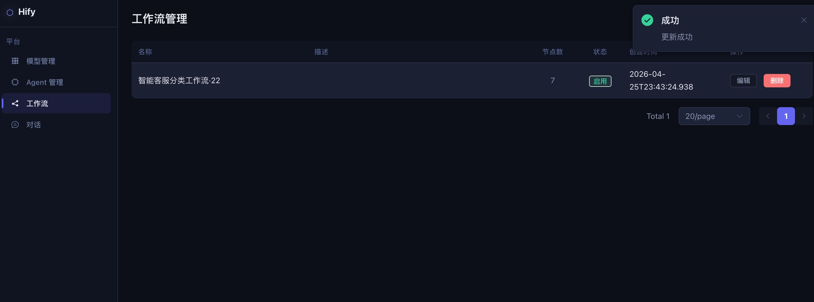
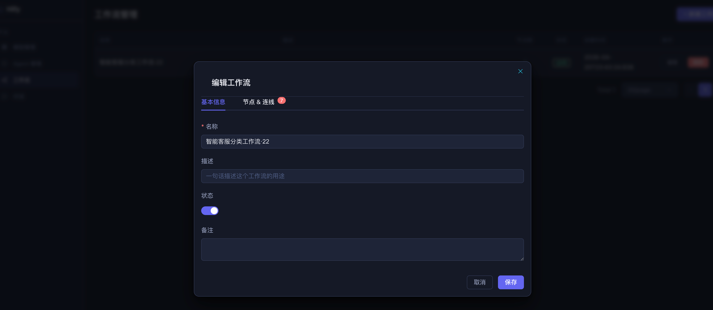
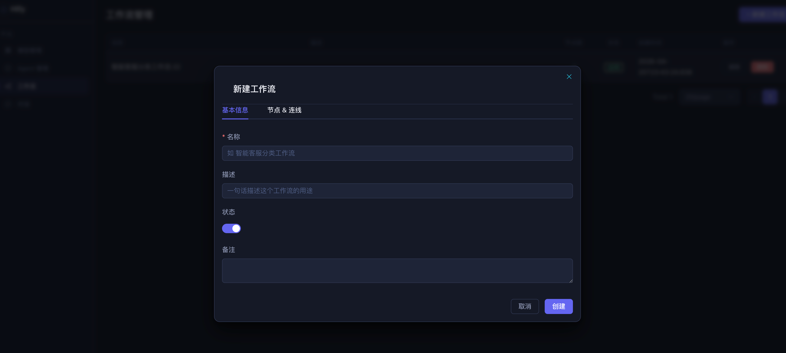
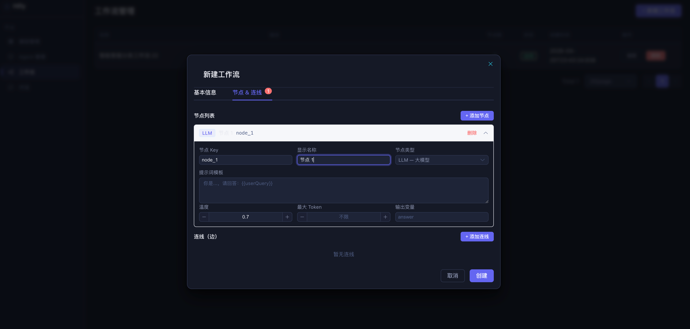
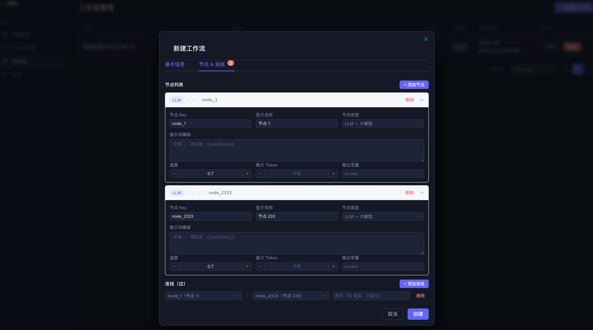

# 26｜实操课：核心功能高阶篇全流程演示
你好，我是Robert。

这是核心功能高阶篇的实操课。22到23讲，我们给Hify加上了工作流引擎，让智能客服从“一个Prompt通吃所有问题”变成“先判断用户意图，再走不同路径精准回答”。这节实操课聚焦工作流编排，从理解概念到引擎跑通，完整演示全过程。

本节实操课将以文字 + 视频的方式进行，主要包含两部分：

- 第一部分：我在工作流编排开发过程中真实的体验和看法，以及几个大家比较关心的问题。

- 第二部分：屏录演示，分四个场景，完整覆盖工作流概念探路、元数据CRUD、执行引擎实现、接入对话引擎的全过程。


## 我的真实体验和看法

工作流是这门课里我花时间最多的模块，但不是因为代码难写，而是因为概念需要消化。

### 快在哪里

元数据CRUD写得很快。三张表（workflow、workflow\_node、workflow\_edge）结构清晰，创建时拆分写入，查询时组装还原，和之前做知识库管理的节奏一样。CC读了现有代码风格之后，生成的代码和项目一致性很高，基本不用大改。

NodeExecutor体系的代码也很顺。和14讲Provider适配层是同一个模式，统一接口 + 按type分发 + Spring自动注册。CC在这种“已有模式的复用”上表现很好，甚至主动提出了用sealed interface + record做类型安全解析。

### 慢在哪里

两个地方。

第一个是概念建立阶段。工作流是我没做过的子系统，一开始脑子里没有完整的图。节点是什么、连线是什么、执行引擎怎么驱动、上下文怎么在节点间传递，这些概念需要一个一个搞清楚。我的做法是先不写代码，让Claude Code用具体场景解释，再看代码层面怎么表示，再做存储设计。这个顺序不能乱，跳过概念直接写代码，方向会错。

第二个是执行引擎的异常分支。正常路径Claude Code基本能写对，但边界情况大概率遗漏。条件分支所有条件都不匹配怎么办？targetNodeKey指向不存在的节点会不会空指针？工作流里有环会不会死循环？这些问题我是一个一个手动检查和追问Claude Code才补全的。正常路径不需要你花太多精力review，异常分支才是重点。

### 最让我惊喜的

执行引擎跑通的那一刻。同一个智能客服Agent，问“耳机坏了怎么保修”走售后路径，问“最新蓝牙耳机有什么功能”走售前路径，问“耳机连不上蓝牙”走技术支持路径。三条路径，三种不同的回答风格，都是一个工作流配置驱动的。

查workflow\_node\_run表，每个节点的输入输出、执行耗时、成功失败状态都清清楚楚。classify节点1200ms，router节点2ms，aftersale节点3400ms。出了问题能精确定位到哪个节点，这种可观测性是单Prompt Agent做不到的。

### 几个大家比较关心的问题

**1. 工作流的概念，怎么最快建立起来？**

不要从DAG、图论这些学术概念入手。直接让Claude Code用业务场景解释：用户问“我的订单到哪了”，单Prompt怎么处理，工作流怎么处理，差别在哪。

搞懂两个东西就够了：节点是“做什么”，连线是“做完去哪”。存库是两张表，执行时是Map + while循环。工作流没有想象中那么神秘。

**2. 节点配置用JSON还是拆多张表？**

用JSON。不同节点类型的配置格式差异很大，LLM节点要prompt和modelConfigId，条件节点要expression，HTTP节点要url和method，知识库节点要knowledgeBaseId和topK。强行拆列会让表结构很难看，而且每加一种节点类型就要改表结构。

JSON字段 + sealed interface解析，扩展新节点类型只加一个record，不改表结构，不改其他代码。这个原则和12讲auth\_config的处理方式一样。

**3. 执行引擎为什么选同步轻量方案？**

让Claude Code调研了Dify、n8n、Temporal的实现，最终选最轻量的方案。原因很清楚：n8n的Redis Queue是为多Worker水平扩展设计的，Hify不需要；Temporal的事件溯源是为小时/天级工作流设计的，Hify的工作流是一次对话响应的一部分，最长几十秒；Dify的代码沙箱是为用户自定义代码节点设计的，Hify的节点类型是固定的几种。

不是所有方案都适合你的场景，调研的价值在于知道有哪些选项、各自的代价是什么，然后做出有理由的选择。

## 屏录演示

下面进入屏录部分，分四个场景，完整覆盖工作流从概念探路到接入对话引擎的全过程。

### 场景一：概念探路——搞懂工作流在代码里长什么样

目标：展示22讲的概念建立过程，从“没做过工作流”到“知道它在代码里是什么数据结构”。

#### 第一步：用业务场景建立概念

指令：

```plaintext
在 AI 应用平台中，工作流是什么概念？
和直接让 Agent 用一个 Prompt 回答有什么区别？
用智能客服的场景帮我解释，不要讲理论，给我具体的例子。

```

要点：

- 展示Claude Code用“我昨天下的订单还没到”这个具体场景切入

- 重点对比：单Prompt是让LLM凭知识编答案，工作流是把任务拆成有序步骤，每步做一件具体的事

- Claude Code的关键总结：问“退货政策是什么”单Prompt够用，问“我的订单到哪了”必须走工作流，因为答案在数据库里不在LLM脑子里


#### 第二步：看它在代码里是什么形式

指令：

```plaintext
工作流在代码层面怎么表示？
帮我用最直白的方式解释——不要说 DAG、不要说图论，
就告诉我它在代码里是什么数据结构。

```

要点：

- 展示Claude Code给出的两个概念：节点 + 连线

- 节点是“做什么”，每个节点一条数据库记录，有type（LLM / CONDITION / API\_CALL）和config（JSON配置）

- 连线是“做完去哪”，记录sourceNodeKey → targetNodeKey + condition

- 存库是平铺的两张表，执行时加载进内存变成Map + while循环

- 说明加“不要说DAG”的原因：学术概念先行会让人绕进去，需要的是能直接对应到代码的解释


#### 第三步：设计完整的数据模型

指令：

```plaintext
基于上面的工作流结构，帮我设计数据模型。要考虑：
1. 如何存储工作流基本信息
2. 如何存储节点，不同类型节点配置格式不同怎么处理
3. 如何存储节点之间的连接关系
4. Java 代码里如何做类型安全的解析

```

要点：

- 展示Claude Code先读了现有代码风格再给出设计

- 三张表的分工：workflow存基本信息，workflow\_node存节点，workflow\_edge存连线

- 重点说明两个设计决策：连线引用node\_key字符串而不是数据库id（前端拖拽时不依赖自增顺序），节点配置用JSON字段（不同类型格式差异大，强行拆列会让表结构难以维护）

- 展示sealed interface + record的类型安全解析方案，switch模式匹配漏写任何一个case编译就报错


### 场景二：元数据CRUD——把工作流存起来

目标：展示22讲的CRUD实现和验证，确认数据模型能正确存储和还原工作流配置。

#### 第一步：实现CRUD

指令：

```plaintext
在 hify-workflow 模块中实现工作流的 CRUD。

接口列表：
POST   /api/v1/workflows          — 创建工作流
GET    /api/v1/workflows          — 分页查询工作流列表
GET    /api/v1/workflows/{id}     — 查询工作流详情（含完整节点和边）
PUT    /api/v1/workflows/{id}     — 更新工作流
DELETE /api/v1/workflows/{id}     — 逻辑删除工作流

约束：
- 创建接口接收完整请求体（包含 nodes 和 edges），拆分写入三张表
  workflow 写一条，nodes 批量插入 workflow_node，edges 批量插入 workflow_edge
  三张表在同一个事务里，任何一张写失败全部回滚
- 查询详情接口从三张表组装回完整结构返回
- 更新工作流时，先逻辑删除原有的 nodes 和 edges，再批量插入新的，不做 diff
- 节点配置用 NodeConfigParser 解析，NodeConfig sealed interface + record 体系

```

要点：

- 展示Claude Code生成代码的过程，重点看它是否遵循了项目的代码风格

- 说明“更新时直接替换不做diff”的原因：工作流改动涉及多个节点和边，diff逻辑复杂且容易出错，先删再插保持三张表一致


#### 第二步：用真实配置验证

```bash
# 创建智能客服分类工作流
curl -X POST http://localhost:8080/api/v1/workflows \
  -H "Content-Type: application/json" \
  -d '{
    "name": "智能客服分类工作流",
    "nodes": [
      {"nodeKey": "start", "type": "START", "name": "开始", "config": {}},
      {"nodeKey": "classify", "type": "LLM", "name": "问题分类",
       "config": {"prompt": "判断问题类型，返回：售前/售后/技术支持", "outputVariable": "intent"}},
      {"nodeKey": "router", "type": "CONDITION", "name": "路由分发",
       "config": {"expression": "{{classify.intent}}", "outputVariable": "route"}},
      {"nodeKey": "presale", "type": "LLM", "name": "售前咨询",
       "config": {"prompt": "你是产品顾问，介绍产品功能和优势", "outputVariable": "answer"}},
      {"nodeKey": "aftersale", "type": "LLM", "name": "售后服务",
       "config": {"prompt": "你是售后客服，回答退换货和保修问题", "outputVariable": "answer"}},
      {"nodeKey": "techsupport", "type": "LLM", "name": "技术支持",
       "config": {"prompt": "你是技术工程师，帮用户排查使用问题", "outputVariable": "answer"}},
      {"nodeKey": "end", "type": "END", "name": "结束", "config": {"outputVariable": "answer"}}
    ],
    "edges": [
      {"sourceNodeKey": "start",       "targetNodeKey": "classify",    "condition": null},
      {"sourceNodeKey": "classify",    "targetNodeKey": "router",      "condition": null},
      {"sourceNodeKey": "router",      "targetNodeKey": "presale",     "condition": "售前"},
      {"sourceNodeKey": "router",      "targetNodeKey": "aftersale",   "condition": "售后"},
      {"sourceNodeKey": "router",      "targetNodeKey": "techsupport", "condition": "技术支持"},
      {"sourceNodeKey": "presale",     "targetNodeKey": "end",         "condition": null},
      {"sourceNodeKey": "aftersale",   "targetNodeKey": "end",         "condition": null},
      {"sourceNodeKey": "techsupport", "targetNodeKey": "end",         "condition": null}
    ]
  }'

# 查询详情，验证能完整还原
curl http://localhost:8080/api/v1/workflows/1 | python3 -m json.tool

```

要点：

- 展示创建成功返回的workflowId

- 展示查询详情返回的完整结构，和创建时一一对应：七个节点都在，八条边都在，config JSON字段没有丢失

- 验收标准只有一个：创建进去的配置，查询出来能完整还原，不多不少


#### 第三步：前端验收

操作顺序：

1. 打开http://localhost:5173，进入“工作流管理”

2. 点击“新建工作流”，看到预填的示例JSON

3. 修改其中一个节点的Prompt，点“格式化”按钮，确认JSON美化正常

4. 提交，确认创建成功，跳回列表页，列表中出现新建的工作流

5. 输入非法JSON，确认前端拦截，不提交




要点：

- 重点展示JSON编辑器的基本体验：预填示例降低上手门槛，格式化按钮方便阅读，合法性校验防止提交坏数据

- 说明完整形态应该是可视化拖拽编排（Dify、Coze那种画布），这里只做最简版验证数据模型


### 场景三：执行引擎——让工作流跑起来

目标：展示23讲的执行引擎从设计到实现的完整过程。

#### 第一步：技术调研，选方案

指令：

```plaintext
工作流执行引擎在业界有哪些主流的实现方案？
重点看 Dify、Coze、n8n 这类 AI 应用平台是怎么设计的。
我想了解：线程模型怎么选、节点执行怎么隔离、上下文数据怎么在节点间传递、
错误处理和执行记录怎么做。
最后给我一个建议：Hify 这种体量的项目应该选哪种方案，为什么。

```

要点：

- 展示Claude Code调研了Dify、n8n、Coze、Temporal四个平台的对比

- 重点展示Claude Code的建议和理由：Hify选轻量同步引擎，参考Dify的VariablePool模式，不引入消息队列

- 说明调研的价值：不是所有方案都适合你的场景，先知道有哪些选项，再做有理由的选择


#### 第二步：看执行引擎的代码结构

指令：

```plaintext
基于上面的调研结论，帮我把 Hify 执行引擎的代码结构梳理清楚。
四个部分：线程池、ExecutionContext、NodeExecutor 体系、核心循环。
每个部分是什么，相互之间怎么协作，用代码示例说明。
先把现有的代码都读清楚，不基于假设设计。

```

要点：

- 展示Claude Code先读完现有代码再给出设计，不是凭空臆造

- 四个部分逐一展示：线程池复用llmExecutor不新建、ExecutionContext对标Dify的VariablePool、NodeExecutor统一接口按type分发、核心循环就是一个while

- 重点说明ExecutionContext的变量池机制：key格式 `nodeKey.varName`，写入只增不改，模板变量 `{​{classify.intent}​}` 运行时替换


#### 第三步：分步实现，每步验证·

```plaintext
帮忙实现执行引擎

```

**要点：**

- 展示四块代码按顺序实现的过程：

  a. Agent绑定workflow\_id + ExecutionContext（单元测试验证模板替换）

  b. NodeExecutor体系（四种Executor + Registry）

  c. 核心循环WorkflowEngine（先线性执行 → 加条件分支 → 加错误处理）

  d. 执行记录表workflow\_run + workflow\_node\_run

- 重点展示ExecutionContext的单元测试：


```java
// set("classify", "intent", "售后")
// resolve("你好，{{classify.intent}}客服为您服务")
// 输出："你好，售后客服为您服务"

```

- 说明分步实现的原因：盲目追求一次写完，出了问题不知道哪步错的

#### 第四步：异常分支review

```plaintext
验证执行引擎是否有逻辑错误，是否正常

```

**要点：**

- 逐一检查四个边界情况：

  a. **条件分支所有条件都不匹配**——展示Claude Code的处理逻辑，是否有defaultTarget或合理的报错

  b. **targetNodeKey指向不存在的节点**——展示保护逻辑，nodeMap.get返回null时是否抛异常

  c. **工作流里有环（A→B→A）**——展示50步限制是否生效

  d. **LLM节点调用失败**——展示workflow\_node\_run是否记录FAILED，workflow\_run是否也标记FAILED

- 说明：正常路径Claude Code基本能写对，review精力要花在异常分支上

- 如果发现问题，当场让Claude Code修复，展示修复过程


### 场景四：接入对话引擎——验证完整链路

目标：把工作流引擎接入ChatServiceImpl，验证绑工作流前后的行为差异。

#### 第一步：修改ChatServiceImpl

指令：

```plaintext
修改 ChatServiceImpl 的 doStreamChat() 方法，支持工作流触发。

在加载完 Agent 之后插入判断：
- agent.getWorkflowId() != null → 调 workflowEngine.execute(workflowId, userContent)
  拿到返回的 String 结果，存入 MySQL 作为 assistant 消息，发 SSE done 事件，return
- workflowId 为 null → 走原有逻辑，一行不改

约束：
  - 不修改流式调用、SseEmitter 转发、Redis 上下文管理的逻辑
  - 工作流执行失败时，catch BizException，通过 SseEmitter 推错误提示给用户

```

要点：

- 展示改动的diff：只在一个判断分支里加了几行代码，原有逻辑一行没动

- 说明最小侵入的原则：有workflowId走工作流，没有走原有链路，两条路互不影响


#### 第二步：先跑不绑工作流的Agent，确认旧功能没坏

```bash
# 用没绑工作流的 Agent 对话
curl -N -X POST http://localhost:8080/api/v1/chat/sessions/1/messages \
  -H "Content-Type: application/json" \
  -H "Accept: text/event-stream" \
  -d '{"content": "你好，介绍一下你自己"}'

```

要点：

- 流式返回正常，内容正确

- 日志里没有任何workflow相关输出

- 强调：改完先跑旧用例，这步不能省


#### 第三步：给Agent绑定工作流，跑三种意图

```bash
# 给智能客服 Agent 绑定工作流
curl -X PUT http://localhost:8080/api/v1/agents/1 \
  -H "Content-Type: application/json" \
  -d '{"workflowId": 1}'

# 售后问题
curl -N -X POST http://localhost:8080/api/v1/chat/sessions/2/messages \
  -H "Content-Type: application/json" \
  -H "Accept: text/event-stream" \
  -d '{"content": "我买的耳机坏了，怎么申请保修"}'

# 售前问题
curl -N -X POST http://localhost:8080/api/v1/chat/sessions/3/messages \
  -H "Content-Type: application/json" \
  -H "Accept: text/event-stream" \
  -d '{"content": "你们最新的蓝牙耳机有什么功能"}'

# 技术支持问题
curl -N -X POST http://localhost:8080/api/v1/chat/sessions/4/messages \
  -H "Content-Type: application/json" \
  -H "Accept: text/event-stream" \
  -d '{"content": "耳机连不上手机蓝牙怎么办"}'

```

要点：

- 三个问题分别走三条不同的路径，回答风格明显不同

- 售后问题走aftersale节点，用售后客服的语气回答保修政策

- 售前问题走presale节点，用产品顾问的语气介绍功能

- 技术支持走techsupport节点，用工程师的语气做故障排查

- 展示后端日志，能看到每次请求经过了哪些节点


#### 第四步：查执行记录，验证可观测性

```bash
# 查最近一次执行记录
curl http://localhost:8080/api/v1/workflows/1/runs/latest | python3 -m json.tool

```

要点：

- 展示workflow\_run记录：status=SUCCESS，input是用户消息，output是最终回答，elapsed\_ms是总耗时

- 展示workflow\_node\_run记录：每个节点都有独立记录，例如classify(SUCCESS, ~1200ms) → router(SUCCESS, ~2ms) → aftersale(SUCCESS, ~3400ms)

- 重点说明可观测性的价值：出了问题能精确定位到哪个节点慢了或者错了，这是单Prompt Agent做不到的

- 对比三次请求的node\_run记录，classify和router每次都走，但第三个节点不同（presale / aftersale / techsupport），验证条件分支确实在工作


#### 第五步：验证不绑工作流的Agent不受影响

```bash
# 用没绑工作流的 Agent 继续对话
curl -N -X POST http://localhost:8080/api/v1/chat/sessions/5/messages \
  -H "Content-Type: application/json" \
  -H "Accept: text/event-stream" \
  -d '{"content": "帮我写一首关于春天的诗"}'

```

要点：

- 直接调LLM，流式返回正常

- 日志里没有任何workflow相关输出

- 三个验收维度都过才算交付完整：工作流链路通、不同意图走不同路径、旧功能没坏


## 总结

四个场景走完，完整覆盖了工作流从概念探路到接入对话引擎的全过程。

几个值得记住的动作：

- **不懂就先问清楚再动手。** 工作流是没做过的子系统，上来就写代码大概率方向错。先让Claude Code用具体场景建立概念，再看代码形式，再设计，顺序不能乱。

- **遇到不熟悉的系统设计，先让Claude Code做技术调研。** Dify的VariablePool、n8n的Worker Queue、Temporal的事件溯源，不是所有方案都适合你的场景。调研的价值在于知道有哪些选项，然后做出有理由的选择。

- **复杂系统分步实现。** 执行引擎没有一次性全写出来，先线性执行验证Context数据传递，加条件分支验证路由，加错误处理做生产级保护，最后接入已有系统。每一步验证通过再往下走。

- **review重点在异常分支。** 正常路径Claude Code基本能写对，但“目标节点不存在”“条件都不匹配”“有环”这类边界大概率遗漏。你的review精力不要花在正常路径上，花在“如果这一步的输入不是预期的会怎样”。

- **改完先跑旧用例。** 接入对话引擎之后，第一件事不是测新功能，是确认旧功能没坏。


从下一讲开始进入测试与部署篇，顺便把整门课的思考方式和工程经验也系统提炼出来。

期待你与我分享自己的体验。如果今天的课程让你有所收获，也欢迎转发给有需要的朋友，邀请他来一起学习，我们下节课再见！