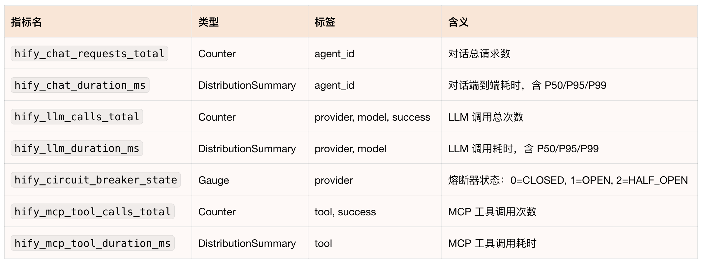
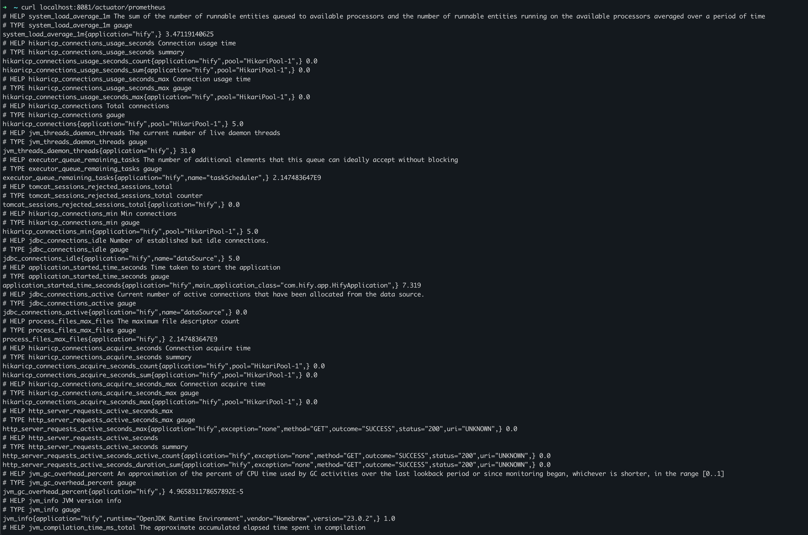
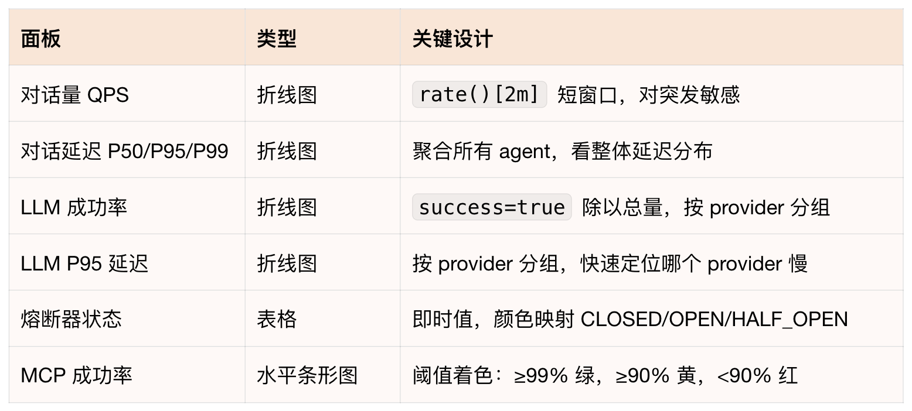
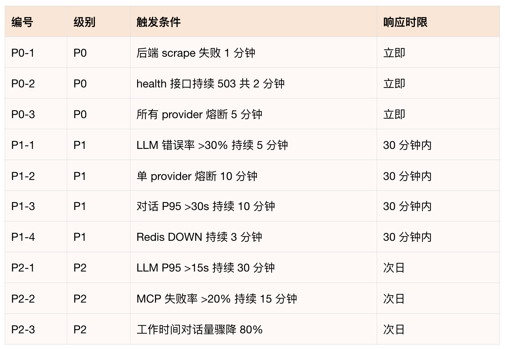
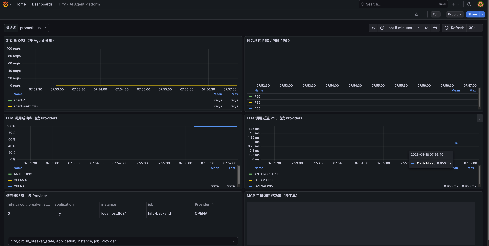

# 29｜可观测性与排错：生产级系统的最后拼图
你好，我是Robert。

Hify部署上去了，用户开始用了。然后你收到第一个反馈：“客服回复好慢”。

你打开服务器不知道慢在哪。是LLM调用慢？是数据库查询慢？是某个Provider触发了熔断？还是Redis连接耗尽了？你什么都看不到，因为系统是个黑盒。这也是我们在日常开发中经常遇到的问题。

这种问题在没有可观测性的系统里是最难受的，不是不能解决，是你连从哪里开始都不知道。只能靠猜，或者把每个可能的原因挨个排查，花上半天。

这一讲把它变透明。做完之后，同样的问题，你的处理方式是：看Grafana大盘LLM P95延迟最近一小时的趋势是什么样的。找到对应时间段的日志，用traceId过滤出这条请求的完整链路 `llm_call_done durationMs=3768 providerId=2`，LLM调用花了3.7秒，问题在Provider 2，不是Hify的问题。整个过程两分钟。

## 先和Claude Code讨论可观测性方案

不急着加代码。先用咨询模式搞清楚Hify需要做什么、不需要做什么。

```plaintext
Hify 是一个 Spring Boot + Vue 的 AI 应用，模块化单体架构，部署在 K8s 上。
核心功能是 LLM 对话，依赖 MySQL、Redis、pgvector，调用外部 LLM API 和 MCP Server。

我想加可观测性，帮我分析：
1. 应该做哪些，为什么
2. 哪些一期不需要做，理由是什么
3. 有没有什么需要提前考虑的架构决策

不要写代码，先给分析。

```

Claude Code给出了系统性的分析，几个关键判断值得单独说。

**必须做的**：结构化日志（每条日志带sessionId、agentId、providerId，格式用JSON）、Actuator健康端点细化到各依赖、LLM调用耗时和熔断指标（Resilience4j有Micrometer集成，加一个依赖就能暴露熔断器状态）、慢请求WARN日志（超过阈值打WARN，最低成本的性能感知）。

**一期不需要做的**：分布式链路追踪（Hify是单体，一次请求不跨进程，Zipkin/Jaeger用不上）、前端监控（内部工具，投入产出比不够）、日志平台ELK（先落磁盘，用kubectl logs看，有聚合需求再接平台，不要一开始就引入ELK的运维复杂度）。

Claude Code提出了三个需要提前考虑的架构决策，这是这次分析最有价值的部分。

**决策一：Actuator端口隔离**。Spring Boot支持把Actuator单独跑在另一个端口（如8081），业务API走8080对外，Actuator走8081只在集群内供Prometheus抓取。不提前规划，后续要改K8s Service和Nginx配置，代价较高。

**决策二：traceId现在就要放进MDC**。虽然一期不做分布式追踪，但要提前在MDC里放traceId和sessionId。原因是将来接OpenTelemetry或SkyWalking时，traceId的字段名和注入位置需要对齐，提前占位可以平滑迁移，否则要改所有日志打点代码。

**决策三：日志字段规范要趁早定**。日志字段一旦进了生产，改名代价极高，所有grep和告警规则都要跟着改。现在就定好字段名： `sessionId、agentId、providerId、modelName、action、durationMs、success、errorCode`，写进CLAUDE.md，所有LLM调用处统一遵守。

这三个决策你不一定自己想得到，但它们决定了后续扩展的成本。这就是咨询模式的价值，讨论清楚再动手，比做完了再回头改省力得多。这部分的回答，基本就涵盖了一个应用主要的可观测模块的组成了。

## 结构化日志 + traceId

基于第一步的分析，日志这里要同时落地两件事： **JSON格式 + traceId贯穿请求链路**。

```plaintext
帮 Hify 配置结构化日志，同时引入 OpenTelemetry 生成 traceId。

要求：
1. 日志格式是 JSON，包含 timestamp、level、traceId、thread、logger、message
2. 同一次请求的所有日志共享同一个 traceId，可以用 traceId 过滤出完整链路
3. traceId 通过 OpenTelemetry 生成，为后续链路追踪预留扩展点
4. 对话链路的关键节点要有日志：请求进入、LLM 调用开始/结束、工具调用、异常
5. 日志输出到 stdout，由 K8s 采集

不需要接 Jaeger 或 Zipkin，一期只用 traceId 串联日志。

```

Claude Code没有直接生成代码，而是先读了项目中的相关文件，读完后给出了三个发现：

1. `RequestLogInterceptor` 已存在且有traceId逻辑，但新线程（llmExecutor）里MDC会丢失。

2. `logback-spring.xml` 生产环境是手拼JSON字符串（有转义风险），输出到文件而非stdout。

3. `ChatServiceImpl` 日志稀疏，缺少LLM调用开始/结束的结构化节点。


三个问题都是提示词里没有说，Claude Code自己读代码发现的。这决定了它要做什么：引入logstash-logback-encoder、修复MDC跨线程丢失、重写logback配置、补结构化日志埋点、用OpenTelemetry API替换UUID生成traceId。

改动涉及是三个文件：

1. **RequestLogInterceptor**：用 `Span.current()` 获取traceId，当前无OTel Span时fallback到UUID 16位hex，保持格式一致。公开了MDC key常量（ `MDC_TRACE_ID`、 `MDC_SESSION_ID`），其他地方写MDC时用常量不用字符串字面量。

2. **MdcTaskWrapper（新建）**：解决llmExecutor跨线程MDC丢失问题。父线程的MDC快照在提交任务时捕获，子线程执行前恢复，执行后清理。ChatServiceImpl里所有提交到llmExecutor的任务都用它包一层。

3. **logback-spring.xml（重写）**：生产环境改用 `LogstashEncoder`，MDC字段（traceId、sessionId、agentId）自动提升为顶层JSON字段，不再手拼字符串。加异步Appender，避免I/O阻塞业务线程。开发环境保持可读格式。


发完第一条提示词后，我又补了一条，把CLAUDE.md的字段规范加进约束。Claude Code回复说第一条已经实现，逐条对照了要求，发现只有 `providerId` 和 `success` 字段没有对齐，直接补了这两个字段进去没有重新生成所有文件，只改了缺失的部分。

做完后，一条完整的对话请求，日志链长这样：

```json
{"timestamp":"2026-04-17T10:23:01.123Z","level":"INFO","traceId":"a3f1b2c4d5e6f708","sessionId":"42","agentId":"7","thread":"llm-3","logger":"ChatServiceImpl","message":"action=llm_call_start sessionId=42 agentId=7 providerId=2 modelName=gpt-4o tools=3"}
{"timestamp":"2026-04-17T10:23:04.891Z","level":"INFO","traceId":"a3f1b2c4d5e6f708","sessionId":"42","agentId":"7","thread":"llm-3","logger":"ChatServiceImpl","message":"action=llm_call_done sessionId=42 agentId=7 providerId=2 modelName=gpt-4o durationMs=3768 success=true finishReason=stop tokens=245"}

```

用 `traceId=a3f1b2c4d5e6f708` 过滤，整条链路一目了然。回到开篇的问题：用户说“客服回复慢”，拿时间段搜日志，找到traceId，一看LLM调用花了3.7秒， `providerId=2`，问题在这个Provider端，不是Hify的问题。

**OpenTelemetry的扩展路径：**

一期 `Span.current()` 返回noop span，自动fallback到UUID。后续接入完整链路追踪时，只需在pom里加一行 `opentelemetry-spring-boot-starter` 依赖，traceId自动变成真实的OTel trace ID，所有日志和埋点代码零改动。这是第一步讨论时提到的架构决策在代码层面的落地。

## 指标埋点

日志告诉你“某次请求发生了什么”；指标告诉你“系统整体状况如何”，过去一小时平均响应时间多少、LLM调用成功率多少、哪个Provider报错最多、熔断触发了几次。

```plaintext
帮 Hify 加 Prometheus 指标监控。

需要埋点的位置：
1. 对话请求：请求总数（按 agentId 分组）、请求延迟分布
2. LLM 调用：调用总数（按 provider、model 分组）、调用延迟、成功/失败计数
3. 熔断器：各 Provider 熔断状态（CLOSED/OPEN/HALF_OPEN）
4. MCP 工具调用：调用次数、成功/失败

技术要求：
- 用 Spring Boot Actuator + Micrometer
- 指标通过 /actuator/prometheus 暴露
- 指标命名前缀统一用 hify_

```

Claude Code先检查了pom和application.yml，确认没有任何Actuator/Micrometer依赖，然后读了 `CircuitBreakerService` 发现一个问题： **熔断器用的是 `ConcurrentHashMap` 自建实例，不走Resilience4j的 `CircuitBreakerRegistry`，所以 Micrometer 自动集成无法采集到熔断器状态，需要手动注册 Gauge。**

这个细节你在提示词里没有提，Claude Code读代码后自己发现并处理了。

改动涉及五个文件：

1. **pom文件**：根pom加版本管理，hify-app引入 `spring-boot-starter-actuator` + `micrometer-registry-prometheus`，hify-common引入 `micrometer-core`（埋点用）。

2. **application.yml**：Actuator独立跑在8081端口（和第一步讨论的架构决策一致），只暴露 `health` 和 `prometheus` 端点，不通过Nginx对外。

3. **HifyMetrics.java（新建）**：统一管理所有指标定义，命名规范 `hify_{模块}_{动作}_{单位}`。熔断器状态用Gauge + `ConcurrentHashMap` 组合解决手动注册问题：状态变更时更新Map，Gauge读取Map的值，避免重复注册。

4. **CircuitBreakerService**：熔断器状态变更时调用 `metrics.circuitBreakerState()`，把CLOSED/OPEN/HALF\_OPEN编码为0/1/2写入Gauge。

5. **ChatServiceImplLLM**：调用开始/结束、工具调用、对话完成各埋点，记录计数和耗时。


做完后验证：

```bash
curl http://localhost:8081/actuator/prometheus | grep hify_

```

最终暴露的指标：



注意访问端口是8081，不是8080。Prometheus抓取配置也要指向8081：

```yaml
scrape_configs:
  - job_name: hify
    static_configs:
      - targets: ['hify-backend:8081']

```

## 完善健康检查

28讲的 `/health` 只返回ok，现在完善成能反映各依赖的真实状态。

```plaintext
完善 Hify 的 /api/v1/health 接口。

当前只返回 {"code":0,"data":"ok"}，需要改成：
- 检查 MySQL、Redis、pgvector 连通性
- 返回各依赖的状态和错误信息
- 整体状态：所有依赖 UP 才返回 UP，任何一个 DOWN 则整体 DOWN

格式参考：
{
  "status": "UP",
  "components": {
    "mysql": "UP",
    "redis": "UP",
    "pgvector": "UP"
  }
}

```

Claude Code先读了现有的HealthController、MockCacheConfig、KnowledgeServiceImpl和application.yml，发现三个需要处理的情况：

1. mock profile没有Redis，直接检测会报错，需要跳过。

2. pgvector是外部PostgreSQL，当前application.yml里没有单独的连接配置，需要新增。

3. 知识库模块目前是mock实现，pgvector配置为空时也要能正常启动。


基于这些发现，Claude Code确定了设计方案：MySQL用已有DataSource执行 `SELECT 1`，Redis用 `Optional&lt;RedisTemplate>` 注入（没有Bean时显示 `skipped`），pgvector用独立JDBC URL（配置为空时显示 `skipped`）。DOWN时返回HTTP 503，而不是200，这是关键，K8s readinessProbe看的是HTTP状态码，只有收到非2xx才会把Pod标记为NotReady。

三种场景下的响应：

全部UP（HTTP 200）：

```json
{"status":"UP","components":{"mysql":"UP","redis":"UP","pgvector":"UP"}}

```

Redis故障（HTTP 503）：

```json
{"status":"DOWN","components":{"mysql":"UP","redis":{"status":"DOWN","error":"Connection refused: localhost:6379"},"pgvector":"UP"}}

```

mock开发环境（HTTP 200，Redis和pgvector未配置）：

```json
{"status":"UP","components":{"mysql":"UP","redis":"skipped","pgvector":"skipped"}}

```

`skipped` 不算DOWN，开发环境下K8s探针不会误报。 `error` 字段只给运维看，不会通过Nginx暴露到公网。

为什么DOWN要返回503？28讲把 `/health` 配成了K8s的readinessProbe。readiness决定K8s要不要把流量导进这个Pod。如果MySQL挂了但接口还返回HTTP 200，K8s认为Pod健康，流量照常进来，所有查库的请求全报错。返回503，K8s发现readiness失败，把这个Pod从Service Endpoints里摘掉，流量自动切到其他正常Pod，用户不受影响。

## 部署Prometheus

部署Prometheus：

```plaintext
帮我生成 Prometheus 的 K8s 部署文件。

要求：
- 从 hify-backend 的 /actuator/prometheus 抓取指标，每 15 秒一次
- 数据持久化用 PVC
- Service 类型 ClusterIP，只在集群内访问

```

Claude Code先读了application.yml确认端口，发现Actuator在8081而不是8080，提示词里写的端口是错的，Claude Code按实际配置写，不是按提示词写。

生成了四个文件：ConfigMap（抓取配置）、PVC（10Gi持久化存储）、Deployment、Service。

几个值得注意的设计：

1. 抓取地址是 `hify-backend:8081`，不是8080Actuator独立端口，不绕Nginx。

2. `strategy: Recreate`：PVC的 `accessModes: ReadWriteOnce` 只允许单节点挂载。RollingUpdate会短暂存在两个Pod同时运行，新Pod挂载PVC会失败。Recreate先删旧Pod再起新Pod，单实例Prometheus的正确策略。

3. initContainer修正权限：Prometheus官方镜像以UID 65534（nobody）运行，PVC新建时目录权限是root，直接挂载会写入失败。initContainer提前 `chown`，避免启动报错。这个坑很隐蔽，你不一定想的到，Claude Code自动处理了。


部署顺序：

```bash
kubectl apply -f deploy/k8s/prometheus-pvc.yml
kubectl apply -f deploy/k8s/prometheus-configmap.yml
kubectl apply -f deploy/k8s/prometheus-deployment.yml
kubectl apply -f deploy/k8s/prometheus-service.yml

```

结果验收，执行curl localhost:8081/actuator/prometheus即可看到下面的输出：



## 生成Grafana Dashboard

这是这一步的核心技巧。不需要自己手动在Grafana里拖拽配置面板，直接把指标列表给Claude Code，让它生成Dashboard JSON，导入就能用。

```plaintext
帮我生成 Hify 的 Grafana Dashboard JSON。

Hify 暴露了以下指标：
- hify_chat_requests_total（label: agent_id）
- hify_chat_duration_ms（DistributionSummary，label: agent_id）
- hify_llm_calls_total（label: provider, model, success）
- hify_llm_duration_ms（DistributionSummary，label: provider, model）
- hify_circuit_breaker_state（label: provider，0=CLOSED 1=OPEN 2=HALF_OPEN）
- hify_mcp_tool_calls_total（label: tool, success）

Dashboard 需要包含以下面板：
1. 对话量（QPS 曲线，按 agent_id 分组）
2. 对话延迟（P50/P95/P99）
3. LLM 调用成功率（按 provider 分组）
4. LLM 调用延迟（P95，按 provider 分组）
5. 熔断器状态（各 Provider 当前状态）
6. MCP 工具调用成功率

输出完整的 Grafana Dashboard JSON，我直接导入使用。

```

Claude Code生成了247行Dashboard JSON，但在输出之前先主动指出了一个问题：

> 你的指标名和实际埋点有出入。根据HifyMetrics.java里的定义，实际指标名是 `hify_chat_duration_ms`（不是 `hify_chat_request_duration_seconds`），单位是毫秒，类型是DistributionSummary。以实际埋点的指标名生成Dashboard，否则面板会空白。

然后在生成完成后又指出了第二个问题：

> `HifyMetrics.java` 用的是DistributionSummary，Micrometer对DistributionSummary默认生成 `_count`、 `_sum`、 `_max`，不生成 `_bucket`。Dashboard里 `histogram_quantile()` 的查询会空白。如果要P95/P99精确分位数，需要在每个DistributionSummary.builder() 里加 `.publishPercentileHistogram(true)`，才能生成 `_bucket`。要不要现在改？

确认后，Claude Code读了HifyMetrics.java，在所有DistributionSummary上加了这一行配置。

这两个问题你在提示词里都没提到，Claude Code一个是在执行前主动发现，一个是执行后自己检查发现。没有这两步，生成的Dashboard导入进去面板全是空白。

六个面板的设计：



导入方式：Grafana → Dashboards → Import → Upload JSON file → 选 `deploy/grafana-dashboard.json`。

## 让Claude Code梳理告警策略

有了指标，下一步是告警。告警中又一个关键点是： **不是所有异常都需要叫醒人，分级处理才能避免告警疲劳**。

```plaintext
基于 Hify 当前暴露的指标，帮我梳理告警策略。

Hify 的业务背景：企业内部智能客服，工作时间使用，非 24 小时高可用场景。
用户规模：几十人并发。

帮我整理：
1. 哪些指标需要告警
2. 每条告警的阈值建议和触发条件
3. 告警级别（P0 立即响应 / P1 30 分钟内 / P2 次日处理）
4. 理由

不要写 Grafana 配置，先给策略清单。

```

Claude Code给出的清单分四个部分P0、P1、P2，以及不建议告警的指标。

- P0：立即响应（服务不可用）
  - 后端scrape失败： `up{job="hify-backend"} == 0` 持续1分钟。后端进程挂了或网络断了，所有用户无法使用。

  - health接口返回503：持续2分钟。MySQL断开后所有对话写入失败，服务完全不可用。

  - 所有provider熔断器全部OPEN： `min(hify_circuit_breaker_state) == 1` 持续5分钟。所有LLM provider都熔断意味着完全无法对话。
- P1：30分钟内响应（功能降级）
  - LLM调用错误率 > 30%，持续5分钟：每3次对话就有1次失败，用户体验已明显受损；低于这个值可能是偶发网络抖动。

  - 单个provider熔断器持续OPEN超过10分钟：10分钟是给provider自动恢复的宽限时间，超过说明需要人工介入。

  - 对话P95延迟 > 30秒，持续10分钟：LLM正常响应5-15s，30s是明显异常，不是LLM本身慢而是系统级问题。

  - Redis DOWN持续3分钟：Redis断开后上下文缓存失效，每次对话回落到MySQL加载历史，性能下降但不完全不可用；3分钟给Redis自动重连的时间。
- P2：次日处理（潜在风险）
  - LLM P95延迟 > 15秒，持续30分钟：15s慢但在用户接受范围内，可能是provider侧负载高，次日评估是否要切换模型。

  - MCP工具调用失败率 > 20%，持续15分钟：工具失败不影响基础对话，但持续失败说明外部系统有问题。

  - 工作时间对话量骤降80%，持续20分钟：工作时间（9-18点）对话量骤降往往是前端不可达或Nginx挂了，后端看起来正常，容易漏报。
- 不建议告警的指标：
  - 单次LLM调用延迟（LLM本身就慢，偶发20s属正常）。

  - MCP工具调用次数（业务量指标，不代表故障）。

  - 非工作时间的任何P1/P2（内部工具，夜间无人使用无需on-call）。

  - 熔断器HALF\_OPEN状态（是正常恢复流程，不需要打扰人）。

**汇总表如下**：



这份清单有两点值得注意。

第一，Claude Code一开始就分析了“业务背景对告警的影响”内部工具、工作时间使用、几十人并发，这三个条件决定了阈值要比C端产品宽松，非工作时间的P1/P2不需要on-call。阈值是根据业务场景定的，不是套通用标准。

第二，“不建议告警”这部分和正面清单同样重要，告警太多会产生疲劳，让人忽略真正重要的告警。HALF\_OPEN状态是一个典型例子，看起来像异常，实际上是熔断器正常恢复流程，加了告警只会让人误判。

策略确认后，让Claude Code生成对应的Grafana Alert规则JSON，导入配置即可。

## 验收

```bash
# 部署 Prometheus 和 Grafana
kubectl apply -f deploy/k8s/prometheus-pvc.yml
kubectl apply -f deploy/k8s/prometheus-configmap.yml
kubectl apply -f deploy/k8s/prometheus-deployment.yml
kubectl apply -f deploy/k8s/prometheus-service.yml
kubectl apply -f deploy/k8s/grafana.yaml
kubectl get pods -n hify   # 确认都在 Running

```

产生真实数据：和Hify对话几轮，触发RAG检索，绑定MCP工具查询订单。



- 打开Grafana大盘（节点IP:30030），确认

- 对话量QPS曲线有数据

- 对话延迟P50/P95/P99有分布

- LLM调用成功率按provider分组显示

- 熔断器状态表格显示CLOSED（绿色）


验证日志链：找一条刚才的对话，搜它的traceId

```bash
kubectl logs -n hify deploy/hify-backend | grep "traceId=&lt;你的traceId&gt;"
# 应该看到从 http_request → llm_call_start → llm_call_done → chat_stream_done
# 完整链路的所有日志，durationMs 告诉你每一步的耗时

```

模拟依赖故障，验证健康检查 + K8s自动摘流量：

```bash
# 临时断开 Redis（在 Redis 侧 kill 连接或停服务）
curl http://hify-backend:8080/api/v1/health
# {"status":"DOWN","components":{"mysql":"UP","redis":{"status":"DOWN","error":"Connection refused"},"pgvector":"UP"}}

kubectl get pods -n hify
# hify-backend-xxx   0/1   Running   0   10m   ← 0/1 表示 NotReady，K8s 已摘掉流量

```

Redis恢复后，健康检查重新返回UP，Pod变回1/1 Ready，流量自动恢复。

## 总结

这一讲做完，“客服回复好慢”这个问题有了完整的排查路径。

**traceId定位单次请求**：拿时间段搜日志，找到traceId， `llm_call_done durationMs=3768` 告诉你LLM调用花了3.7秒， `providerId=2` 告诉你是哪个Provider的问题。

**Grafana大盘看趋势**：不是偶发就是系统性问题，LLM P95延迟面板一眼看出。Dashboard JSON是Claude Code生成的，不需要手动拖拽配置，而且Claude Code在生成前主动发现了指标名不对，生成后发现DistributionSummary缺 `_bucket` 会导致面板空白，这两步你不一定想的到。

**健康检查自动摘流量**：MySQL或Redis故障时，readinessProbe检测到503，K8s自动把Pod从负载均衡里摘掉，用户请求不会打到故障实例。

**分级告警不吵人**：10条告警，3条P0立即响应，其余按级别处理。不建议告警的清单和正面清单同样重要，Claude Code是结合Hify的业务背景（内部工具、工作时间使用）给出的阈值，不是套通用标准。

整个过程几个反复出现的模式值得记住：Claude Code先读代码再动手，提示词里没说的问题它自己发现；执行后主动做自检，发现DistributionSummary的问题是执行后检查到的；端口写错了按实际配置生成，不是按提示词盲目执行。这些加在一起，和“告诉AI写什么就写什么”是两种完全不同的工作方式。

## 思考题

1. 当前日志输出到stdout，由K8s采集，用 `kubectl logs` 看。如果要加按traceId全文搜索的能力，需要引入日志平台。让Claude Code对比Loki和EFK两个方案，结合Hify的规模给出建议重点，问它运维复杂度和资源消耗的差异。

2. 告警策略清单确认了，下一步是把它变成Grafana Alert规则。P0-3 “所有provider熔断器全部OPEN” 对应的PromQL是 `min(hify_circuit_breaker_state) == 1`，让Claude Code帮你生成这条告警的Grafana Alert JSON，测试能否正确触发。

3. OpenTelemetry现在只用了traceId串联日志， `Span.current()` 返回noop。如果要开启完整链路追踪每个LLM调用，每次数据库查询都记录成Span，发到Jaeger可视化需要做哪些改动？让Claude Code评估改动范围，重点看是否需要修改业务代码。


期待你的分享！如果今天的课程让你有所收获，也欢迎转发给有需要的朋友，邀请他来一起学习，我们下节课再见！