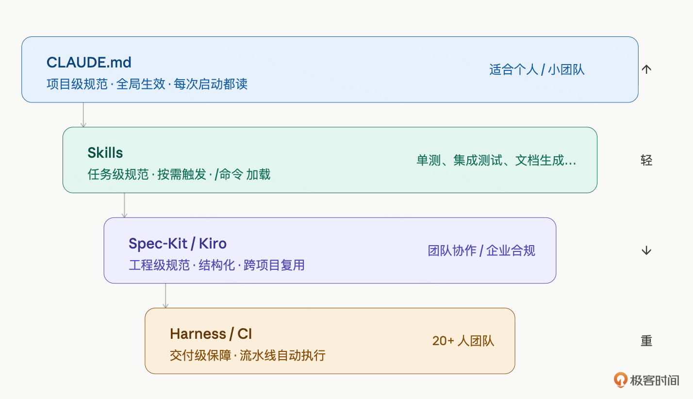
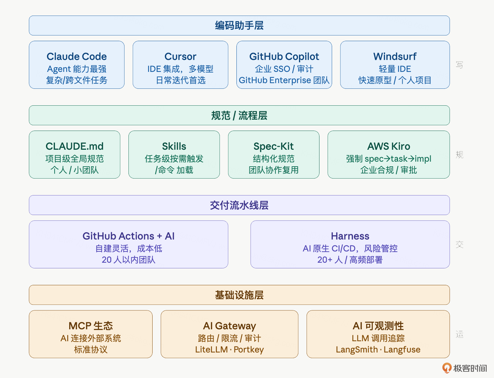

# 31｜进阶：SDD、Spec-Kit、Spec Coding 与老项目改造
你好，我是Robert。

课程发布以来，收到了很多问题。有些问题反复出现，集中在四个方向：CLAUDE.md越写越长怎么办？企业里SDD到底能不能落地？Spec-Kit和Spec Coding怎么用？老项目怎么用Claude Code改造？

这些问题本质上是同一件事： **规范驱动开发在真实项目里怎么落地。**

坦白说，这个话题在一讲里讲不完，尤其是老项目改造，完整展开需要很长的内容，5月初会有一门新课系统地分享这部分内容。本讲的定位是：先把思路和原则讲清楚，给几个关键提示词，让你能开始行动，不会太细，但够用。

大家的经验基本类似，都经历过两种项目：从零搭建的绿地项目，和接手别人留下来的存量系统。后者更难，但也更常见。这一讲结合真实经验，把规范驱动开发怎么落地说清楚。

## 规范工具的四个层次

很多人用了一段时间Claude Code之后会发现一个问题：CLAUDE.md越写越长，Claude Code开始忽略某些规范，或者不同模块的约定互相冲突。 **根本原因是把不同性质的内容混在了一起。**

规范工具分四个层次，每层解决的问题不同：



CLAUDE.md的职责边界：这个项目的全局规则。技术栈约束、代码风格、命名规范、禁止事项、模块职责划分。读者是Claude Code，每次启动都读，所以要精简、稳定、不频繁变更。

Skills的职责边界：某类任务怎么做。单测流程、集成测试流程、API文档生成、代码审查、数据库迁移，这些是任务级的操作流程，不是全局规范。用 `/单测`、 `/集成测试` 命令触发，按需加载。

CLAUDE.md塞太多的症状：文件超过200行、里面有大量“步骤1/2/3”的操作流程、不同模块的规范混在一起、Claude Code开始忽略靠后的内容。

正确的分拆方式： **先问这句话是全局规范还是任务流程。**“使用AssertJ做断言”是全局规范，放CLAUDE.md。单测的完整流程是：先读代码、输出路径分析、给测试计划、我确认后再写代码，这是任务流程，放Skills。分清楚这两类，CLAUDE.md自然瘦下来。

实际的目录结构：

```plaintext
➜  hify git:(main) tree .claude
.claude
└── skills
    ├── module-delivery.md
    └── provider-adapter.md

2 directories, 2 files

```

CLAUDE.md保持精简，Skills按任务类型分文件，各司其职。

## SDD工具层次：从轻到重

企业实际开发里，我用过三类工具，适合不同规模和场景。

### CLAUDE.md + Skills：适合个人和小团队

这是整门课用的方案。优点是极轻量，零配置，直接开始。缺点是规范只存在于本地，没有版本管理，团队协作时容易各自维护一份不同版本的CLAUDE.md。这也是我一直用CLAUDE.md，然后配合上Skills的原因，因为简单不用动脑子，顺手即用。

适合场景：个人项目、3人以内小团队、规范变化慢的项目。

### Spec-Kit：适合团队协作

Spec-Kit是开源工具，把规范文档结构化，支持版本管理，和Claude Code的SKILL体系对接。核心思路是把“规范”从Markdown自由文本升级为有结构的规范文件，Claude Code能更精确地解读和执行。

安装和初始化：

```bash
npm install -g spec-kit
spec-kit init

```

初始化后生成 `spec/` 目录：

```plaintext
spec/
├── project.spec.md       # 项目级规范
├── modules/
│   ├── chat.spec.md      # 对话模块规范
│   └── provider.spec.md  # Provider 模块规范
└── tasks/
    ├── unit-test.task.md # 单测任务规范
    └── api-doc.task.md   # 文档任务规范

```

一个实际的规范文件（ `spec/modules/chat.spec.md`）：

```markdown
# 对话模块规范

## 职责边界
- 负责：对话会话管理、消息收发、上下文管理、SSE 流式输出
- 不负责：LLM 调用细节（由 Provider 模块处理）、知识库检索（由 Knowledge 模块处理）

## 接口规范
- 所有接口返回 Result&lt;T&gt;，HTTP 状态码统一 200
- 流式接口使用 SSE，Content-Type: text/event-stream
- 事件格式：{"type":"delta"|"done"|"error","content":"..."}

## 数据约束
- sessionId：Long 类型，不对外暴露自增规律（前端用 UUID 映射）
- 消息内容：最大 4096 字符，超出截断并返回 CONTENT_TOO_LONG 错误码
- 上下文窗口：最近 N 轮，N 由 Agent 配置决定，默认 10

## 禁止事项
- 禁止在 ChatServiceImpl 直接调用 OpenAI SDK，必须通过 ProviderAdapter 接口
- 禁止在 Service 层直接写 SQL，必须通过 Mapper
- 禁止吞掉 LLM 调用异常，必须传播到调用方

## 测试要求
- 核心链路必须有集成测试覆盖
- LLM 调用使用 MockProviderAdapter 替代真实调用

```

和Claude Code结合使用：

```plaintext
读取 spec/modules/chat.spec.md，
基于这份规范，帮我实现 ChatService 的 createSession 方法。

输出前先确认：你理解的职责边界和禁止事项是什么？

```

Claude Code会先复述它理解的规范，你确认后再写代码。和直接写代码相比，规范先行的输出质量更高，需要修改的次数更少。

Spec-Kit和CLAUDE.md的关系： **不是替代，是互补。** CLAUDE.md管“怎么做”（代码风格、工具选择），Spec-Kit管“做什么”（模块职责、接口规范、约束条件）。两者一起，Claude Code有了完整的上下文。

### AWS Kiro：适合企业级强制流程

Kiro是AWS推出的AI IDE，核心是把“写代码”这件事强制拆成四步：

```plaintext
spec（需求规范）→ design（技术方案）→ tasks（任务拆解）→ implement（执行实现）

```

每一步都有AI辅助，但不能跳步骤。spec没写完不能进design，design没确认不能生成tasks。

这种强制流程的价值在企业场景里很明显：需求变更有记录、技术方案有审批、实现和需求可追溯。代价是流程重，小项目用起来感觉在走过场。

适合场景：20人以上团队、有合规要求的项目、需求-开发-测试全链路追溯的场景。

**选工具的原则：够用就好。个人项目用CLAUDE.md + Skills，团队项目加Spec-Kit，企业级合规场景才需要Kiro。**

## Spec Coding完整流程

Spec Coding不是一个工具，是一种工作方式：先写规范，再让AI执行。规范是输入，代码是输出，规范写得好，代码少改。

下面用一个完整例子演示：给Hify加“对话导出为PDF”功能。对比两种方式。

**方式一：直接执行**

```plaintext
帮我给 Hify 加一个对话导出为 PDF 的功能。

```

Claude Code会生成代码，但你不知道它做了哪些假设：导出哪些字段？PDF的样式是什么？导出是同步还是异步？接口在哪个Controller？这些假设可能都不符合你的预期，改起来费时间。

**方式二：Spec Coding**

第一步，写规范：

```plaintext
我要给 Hify 加"对话导出为 PDF"功能，在写代码之前，
帮我把这个功能的规范写清楚。

需要包含：
1. 功能边界：导出什么内容，不导出什么
2. 接口设计：请求/响应格式，同步还是异步
3. 数据约束：对话长度限制，文件大小限制
4. 错误处理：哪些情况返回错误，错误码是什么
5. 对现有模块的影响

输出 spec 格式，不要写代码。

```

Claude Code生成的规范：

```markdown
## Hify 对话导出 PDF 功能规范

### 1. 功能边界

导出内容：对话标题、导出时间戳、Agent 名称、按时间升序排列的所有消息
（role、内容、发送时间）、RAG 引用来源（附在对应消息下方）。

不导出：System Prompt（内部配置不对用户暴露）、token 数等调试字段、
工具调用中间过程（tool_call / tool_result 类型消息跳过）、附件图片（当前不支持多模态）。

### 2. 接口设计

GET /api/v1/chat/sessions/{sessionId}/export/pdf

同步接口。理由：目标规模 20-50 人，单次导出不会并发爆炸；消息上限可控，
生成时间 &lt; 3s；异步需要轮询，增加前端复杂度不值得。

成功：HTTP 200，Content-Type: application/pdf，
Content-Disposition: attachment; filename="chat_{sessionId}_{yyyyMMdd}.pdf"
失败：HTTP 4xx/5xx，统一 Result&lt;Void&gt; 格式

### 3. 数据约束

- 消息条数上限 500 条（超出返回 4001，拒绝导出）
- 单条消息内容长度 10000 字符（超出截断，末尾加"…内容过长已截断"）
- 生成文件大小软限 10MB（超出返回 4002）
- 接口超时 10s（返回 1003）

### 4. 错误处理

| 错误码 | 场景 | HTTP 状态 |
|--------|------|---------|
| 4001 | session 不存在 | 404 |
| 4002 | 消息条数超过 500 条 | 422 |
| 4003 | PDF 文件超过 10MB | 422 |
| 4004 | session 内无有效消息（全是 tool 类型） | 422 |
| 1003 | 生成超时（&gt;10s） | 503 |

### 5. 对现有模块的影响

hify-chat：新增导出接口和 PdfExportService，消息查询全量拉取绕过分页。
hify-common：ErrorCode 枚举新增 4002/4003/4004。
hify-app：pom.xml 引入 flying-saucer-pdf-openpdf（无 iText 商业授权问题），
确认中文字体打包。
前端：新增下载按钮，window.open 触发 GET 请求即可。
PDF 生成为 CPU 密集操作，建议在 asyncExecutor 线程池中执行，不占 Tomcat 业务线程。

```

第二步，你review规范，确认或修改。比如你可能觉得文件大小限制10MB太小，或者想把超时时间从10s改成30s。这一步花5分钟，比改代码省多了。

注意真实输出和手写示例的差异：Claude Code给出的是同步接口，并且给出了明确的理由（目标规模20-50人，并发不大，异步增加前端复杂度不值得）；错误码直接对应到具体的HTTP状态码；还主动说了PDF生成要用 `asyncExecutor` 线程池、推荐用 `flying-saucer-pdf-openpdf` 而不是iText（有商业授权问题）。这些细节你在提示词里都没提，是Claude Code读了Hify的项目结构和现有代码后自己判断的。

第三步，确认后执行：

```plaintext
规范已确认（见上方）。现在按这份规范实现导出功能。

技术约束：
- 使用 iText 生成 PDF
- 异步任务用 Spring &#64;Async + llmExecutor 线程池
- 任务状态存 Redis，key: export:task:{taskId}，TTL 1 小时

```

这时候Claude Code的输出和你的预期高度吻合，因为所有假设都已经在规范里明确了。

Spec Coding的适用场景：复杂功能（超过3个文件改动）、有不确定性的需求（第一次做这类功能）、涉及外部系统集成。简单的CRUD不需要，直接执行效率更高。

## 老项目改造：思路、原则与关键提示词

老项目改造是个很大的话题，完整讲完需要很大的篇幅。这里不做完整实操演示，而是说清楚我的思路和原则，给几个关键提示词，让你能开始行动。

### 我的看法

企业里大多数项目都是有多年历史的存量代码。没有单测、命名混乱、模块边界模糊，这才是真实的战场。很多人的第一反应是推倒重来，但这几乎从来不是对的答案。

**改造的本质是降低风险，不是追求完美**。你不需要把整个代码库改造成教科书级别的规范，你需要的是：每次改动时，这个文件比改之前稍微好一点。

**改造的敌人是“大重构”思维**。专门开一个大重构项目，暂停新功能三个月，把所有代码都重写一遍，这种方式在企业里几乎不可能成功。要么中途被叫停，要么引入大量新bug，要么团队士气崩溃。渐进改造才是可持续的。

### 三个核心原则

**原则一：摸底先于动手**。

不要凭经验猜现状，让Claude Code读完代码给出客观报告。你的感觉是“这个系统很乱”，Claude Code给你的是“OrderServiceImpl.java:234直接拼接SQL，UserController包含大量业务逻辑”，具体到文件和行号。

```plaintext
读完这个项目的所有代码，给我一份现状报告。

包含：
1. 模块职责是否清晰，哪些地方存在职责混乱
2. 命名风格是否统一，有哪些不一致的模式
3. 高风险代码：圈复杂度高的方法、没有超时处理的外部调用、可能的 SQL 注入点
4. 测试覆盖情况：哪些核心链路没有测试保护

每个问题给出具体的类名/方法名，不要泛泛而谈。

```

拿到报告，对照自己对系统的理解确认，把确认过的问题写进CLAUDE.md，作为改造的起点。这份报告还有第二个用途：每个月重跑一遍，对比上个月的报告，衡量改造进展。

**原则二：先补安全网，再做改造。顺序不能反**。

这是最重要的原则，也是最容易犯错的地方。

为什么顺序不能反？因为你不知道现有代码的“正确行为”是什么。老项目经常有这种情况：代码看起来有bug，但实际上下游依赖了这个bug的行为。你把它“修好”了，反而把下游搞崩了。

错误顺序：重构代码 → 补测试 → 发现测试失败 → 不知道是重构引入的新bug还是测试写错了 → 大量时间排查。

正确顺序：写集成测试锁住现有行为（测试通过 = 现状已记录）→ 重构 → 运行测试，全绿表示外部行为没有变化，如果有红立即能定位到这次重构的哪个改动。

```plaintext
基于现状报告，帮我规划 [模块名] 的集成测试清单。

目标是锁住现有行为，不是验证"正确行为"。
如果代码有明显的 bug，先把现有行为记录下来，
修复放在测试通过之后。

每条测试给出：测试场景、输入数据、期望输出（基于现有代码的实际行为）。
先给清单，不要写代码。

```

优先级：先覆盖核心业务链路，再覆盖高风险代码，最后覆盖辅助功能。一个月做完前两类，就有足够的安全网了。

**原则三：童子军规则，渐进改造。**

每次动到哪个文件，顺手让Claude Code把这个文件的规范对齐。不需要专门的大重构项目。

```plaintext
在实现这个功能的同时，对我们正在修改的文件做以下对齐：
1. 命名风格统一为 CLAUDE.md 里的规范
2. 把 Service 层里的 SQL 拼接移到 Mapper 的 XML 里
3. 裸露的 catch(Exception e) {} 改成打 WARN 日志
4. 方法超过 50 行的，如果逻辑清晰可拆分，顺手拆一下

不要改这个文件之外的代码，不要引入新依赖。

```

每次发现一类新问题，修完后更新CLAUDE.md的“遗留问题处理规范”节。这样Claude Code下次遇到同类问题会自动处理，不需要你再说。

### 改造节奏的预期

不要期望快。一个有5年历史的中型项目，渐进改造到“规范覆盖率80%”大概需要3-6个月，期间团队正常交付新功能。

每周固定一个改造session，专门做规范对齐，不做新功能。剩余时间正常迭代，顺手做童子军修复。两条线并行，互不干扰。这是可持续的节奏。

## AI编码工具全景

学完这门课，你需要知道Claude Code在整个工具生态里的位置。工具很多，但分清楚每一层解决的是什么问题，选择就不难了。



### 编码助手层：日常怎么用

**Claude Code**：Terminal原生，最强的Agent能力，能读写整个代码库，适合需要跨多个文件的复杂任务，搭骨架、重构、生成测试、分析依赖关系。代价是没有IDE集成，Tab补全体验比Cursor差。

**Cursor**：IDE集成，多模型支持（CC + GPT + Kimi + Claude），Tab补全体验好，适合日常编码，改bug、加字段、调接口。内置的多模型切换让双模型review变得很自然（Claude Code写完，切到GPT做review）。

**GitHub Copilot**：和GitHub生态深度集成，企业SSO、审计日志、策略管理都很成熟。如果你的团队已经在用GitHub Enterprise，Copilot的管理成本最低。

Windsurf：轻量IDE，不需要配置复杂环境，适合快速原型或者不想折腾工具链的个人项目。

我的实际使用方式：Claude Code和Cursor两个其实买一个就行。Claude Code的能力更全，但是Cursor编码够用了，主要是内置的多模型切换让双模型review变得很自然。这个是我强推的。

### 规范/流程层：选轻还是选重

本讲第一部分已经详细说了四个层次。这里补充一个判断标准：

团队人数是最关键的变量。1人开发或3人以内用CLAUDE.md + Skills完全够。3-15人加Spec-Kit解决规范同步问题。15人以上才需要考虑Kiro这种强制流程工具。 **人少的时候用重工具，大量时间消耗在走流程上，得不偿失**。

### 交付流水线层：GitHub Actions vs Harness

很多人在这里纠结，说清楚区别：

**GitHub Actions + AI**（比如用Claude Code生成测试、用AI做PR review）：自己搭，灵活，成本低，适合20人以内的团队。缺点是需要自己维护workflow，AI能力需要手动集成。

**Harness**：开箱即用的AI原生CI/CD平台，把测试、部署、安全扫描、AI辅助代码审查整合在一起。不只是帮你写代码，而是把AI嵌入整个交付流水线，自动识别高风险变更、自动触发额外测试、生产问题自动关联到代码变更。代价是有一定的学习成本和平台费用。

什么时候从GitHub Actions切换到Harness？团队超过20人、每天部署频率超过5次、开始需要精细的变更风险管控。在这个规模以下，GitHub Actions就够了，不要为了用工具而用工具。

### 基础设施层：AI应用的底座

**MCP生态**：AI连接外部系统的标准协议，24讲有完整介绍。这不是编码工具，是连接层，它的价值在于让AI能访问你的数据库、调用你的API、操作你的文件系统，而不需要每次都写自定义的集成代码。

**AI Gateway（LiteLLM、Portkey）**：解决企业多团队用LLM的管控问题。如果只有你一个人用，不需要。如果你的公司有10个团队都在调OpenAI、Claude、各种模型，问题就来了：API Key怎么统一管理？谁在用？用了多少钱？某个团队突然用量暴增怎么限流？AI Gateway统一做这些，模型路由、限流、审计、成本分摊。这是企业AI基础设施从“各自为战”走向“统一管理”的标志。

**AI应用可观测性（LangSmith、Langfuse）**：你的AI应用上线之后，某个Prompt效果变差了，某个工具调用失败率升高了，怎么发现、怎么定位？LangSmith和Langfuse是专门为AI应用设计的可观测性工具，记录每次LLM调用的输入输出、延迟、Token消耗、工具调用链路。和Grafana的区别是：Grafana看的是系统指标，LangSmith看的是AI行为。

## 怎么选合适的工具

工具是手段，不是目的。给一个判断框架，从你的实际痛点出发。

**你现在最痛的问题是什么**？

1. **代码生成质量不够好**：先别换工具，先检查规范。90% 的情况是CLAUDE.md写得不够清晰，或者该放到Skills里的流程塞在了CLAUDE.md里。工具没问题，规范有问题。

2. **Claude Code vs Cursor不知道选哪个**：两个都用。Claude Code订阅用于复杂任务（跨文件、重构、测试），Cursor订阅用于日常迭代（单文件修改、小功能）。如果只能选一个，先从Cursor开始，IDE集成让上手更平滑；当你开始做更复杂的任务时再加Claude Code。

3. **团队规范不一致，各写各的**：Spec-Kit。把规范文档结构化，和Claude Code的SKILL体系对接，支持版本管理。不需要Kiro这么重，Spec-Kit能解决大多数团队协作的规范问题。

4. **企业有合规要求，需求-开发-测试全链路可追溯**：Kiro。接受流程带来的额外时间成本，换来的是每个代码变更都有完整的需求spec和技术方案追溯。

5. **CI/CD质量保障**：先用GitHub Actions，自己写workflow，Claude Code帮你生成测试脚本。团队超过20人、部署频率高之后再评估Harness。

6. **公司多个团队都在用LLM，成本和安全开始失控**：AI Gateway。LiteLLM开源可自部署，Portkey有托管版本。这是从“个人用AI”走向“企业用AI”的必经一步。

7. **AI应用上线后出了问题不知道怎么排查**：LangSmith或Langfuse。接入之后每次LLM调用都有完整记录，比在日志里找JSON字符串高效很多。


一个通用判断原则： **当你觉得需要一个新工具的时候，先问自己，这个问题是现有工具解决不了，还是现有工具用得不够好？** 大多数时候，问题不是缺工具，是现有工具没用到位。新工具引入有学习成本、维护成本、团队推广成本，在确认现有工具真的解决不了之前，不要轻易引入。

工具这件事，我有几个实际感受，不一定对，供参考。

1. **不要追工具，要追问题**。每隔一两个月就有新工具出来，有人来问“老师你用过xxx吗，值得切换吗？”我的回答通常是：先问你现在最痛的问题是什么，再看这个工具解不解决这个问题。工具生态变化很快，但你的问题是稳定的，代码生成质量、规范同步、交付保障，这三类问题不会因为出了新工具而消失。

2. **Claude Code + Cursor的组合是目前投入产出比最高的**。Claude Code做复杂任务，Cursor做日常迭代，两者订阅加起来一个月大概40美元，相当于一个实习生一天的成本，但产出远不止这些。如果只能选一个，先从Cursor开始，IDE集成让上手更平滑；等你开始做更复杂的任务，重构、搭骨架、生成测试，再加Claude Code。

3. **规范工具的选择，团队人数是最重要的变量**。3人以内CLAUDE.md + Skills完全够，不要过度引入工具。3-15人可以考虑Spec-Kit。超过15人才需要Kiro这种强制流程工具。很多团队5个人就开始搭复杂的规范体系，结果大量时间消耗在走流程上，得不偿失。

4. **AI Gateway是企业AI基础设施成熟度的一个标志**。如果你的公司只有你一个人在用LLM，不需要。如果有10个团队都在调各种模型，而且还没有统一管理，这件事迟早会出问题，API Key泄露、某个团队用量暴增、成本失控。这时候上AI Gateway不是锦上添花，是亡羊补牢。

5. **可观测性这块很多人忽视**。AI应用上线之后，某个Prompt效果变差了，某个工具调用成功率下降了，你怎么发现？怎么定位？如果你现在的回答是看日志，那说明可观测性还没建起来。LangSmith和Langfuse接入成本不高，建议在AI应用上线的同时就接上，不要等出了问题再找。


最后一句： **工具是手段，解决问题才是目的**。用最简单的工具解决问题，不要为了用工具而用工具。这门课里用的CLAUDE.md + Skills，在大多数场景下已经够了。

## 总结

这一讲没有太多提示词，作为收尾内容和你分享了一下我对工具选型、高级用法的看法。核心观点其实就一句话： **你一个人开发，最简单的工具是最好用的，不要去追求工具，而是要追求解决问题**。

总结一下本讲的观点，主要有6点：

1. 规范工具有四个层次，从CLAUDE.md到Skills到Spec-Kit到Kiro，越往上越重、越适合大团队。团队人数是最关键的判断变量。

2. CLAUDE.md塞太多的根本原因，是把任务流程（应该放Skills）和全局规范混在了一起。分清楚这两类，CLAUDE.md自然瘦下来。

3. Spec Coding的价值不是工具，是先写规范再执行的工作习惯。规范写得好，代码少改，比直接让Claude Code猜你的意图效率更高。

4. 老项目改造：不要推倒重来，不要专门开大重构项目。三个核心原则，摸底先于动手、先补安全网再做改造、童子军规则渐进改造。这是可持续的方式。

5. 工具全景：Claude Code解决编码效率，Harness解决交付质量，AI Gateway解决企业LLM管控，LangSmith/Langfuse解决AI应用可观测性。四层各有职责，不是竞争关系，是组合使用的。

6. 选工具：从你的实际痛点出发，先确认现有工具是不是没用到位，再考虑引入新工具。大多数时候，问题不是缺工具，是规范没建好。


## 思考题

1. 你现在工作的项目属于哪种情况，绿地项目还是老项目？如果是老项目，用本讲的三步流程做一次快速评估：值不值得改造、改造目标是什么、从哪个模块开始？

2. 你的CLAUDE.md现在有多少行？扫一遍，哪些内容应该拆到Skills里？拆完之后，CLAUDE.md是不是更清晰了？

3. 如果你已经在用Cursor，试着把双模型review的工作流建起来：Claude Code写完核心模块，切到ChatGPT/Kimi做review，对比两个模型发现的问题有什么差异。


期待你的分享！如果今天的课程让你有所收获，也欢迎转发给有需要的朋友，邀请他来一起学习，我们下节课再见！