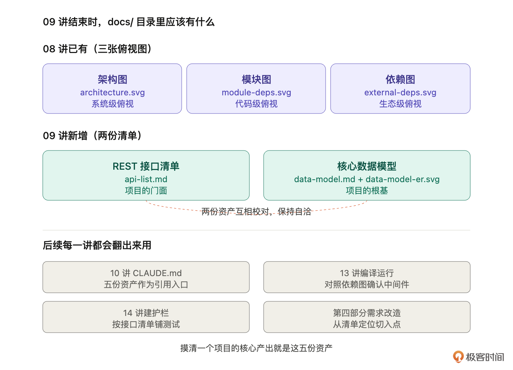
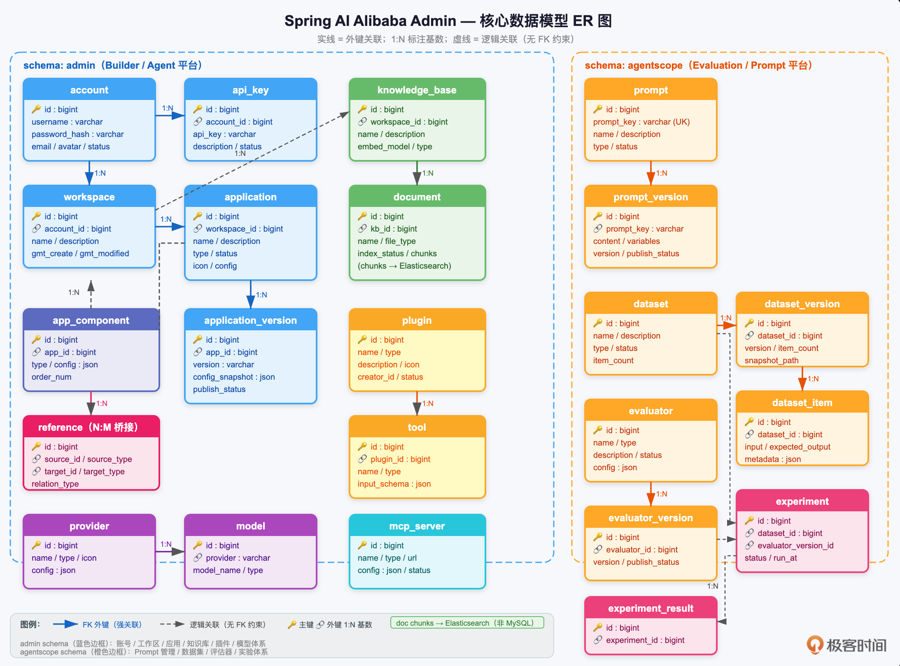

# 09｜接口和数据模型：让 AI 产出生成接口清单和 Schema
你好，我是 Robert。

上一讲画完了三张俯视图，系统级有了架构图、代码级有了模块图、生态级有了依赖图。三种粒度的俯视摆在 `docs/` 里，你和 AI 对这个项目有了第一层共识，通过俯视告诉你“项目长什么样”，但它没告诉你“项目怎么被调用”和“项目在处理什么数据”，而这就是本节课要讲的内容。

对应八步心法第 5 步： **梳理接口和数据模型**。梳理完你会拿到两份新的资产： **一份 REST 接口清单** 和 **一份核心数据模型说明**，都住进 `docs/` 里。



## 接口和数据模型为什么要一起梳理

你可能会想，接口和数据模型是两件事，为什么合在一节课讲？因为它们是 **项目的门面和根基**，彼此绑定。

1. **接口是门面**。外部世界通过接口和这个项目打交道。前端调什么 API、三方集成请求什么端点、运维连什么管理接口，全是接口。接口清单决定了“这个项目对外承诺了什么”。

2. **数据模型是根基**。接口处理的每一个请求、返回的每一份响应，背后都对应某些数据结构的流动。Prompt 对象长什么样、Dataset 的字段有哪些、Evaluator 的结果存成什么格式，这些是项目的内部骨骼。

3. **两者绑定的原因**：接口的参数和返回，90% 的情况下是数据模型的某种映射或变形。接口 `POST /api/prompts/create` 的请求体基本就是 Prompt 数据模型的子集，响应基本就是 Prompt 的一个视图。 **接口和数据模型画不清楚，就看不出这个项目的真实形状**。


更重要的一点，从改造的角度看，你要加一个新功能，大概率要改三处：加一个接口、改几个数据模型字段、改对应的业务逻辑。接口清单和数据模型就是你 **改动的导航地图**。没有这两份资产，每次改造都要从零摸索。

所以 09 讲要让 AI 帮你一次性把这两份都梳理出来。

## 资产 1：REST 接口清单

**提示词**：

```plain
扫一下这个项目里所有的 Controller，给我整理一份 REST 接口清单。
每个接口列出方法（GET/POST 等）、路径、一句话说明、主要入参、返回结构。
按模块分组。保存到 docs/api-list.md。

```

**关键点**：

- “按模块分组”是让清单有组织。Spring AI Alibaba Admin 有 Prompt、Dataset、Evaluator、Experiment、Trace 几大模块，每个模块下有若干接口。分组的清单可读性远高于一张一百行的大表。

- “一句话说明”强制 AI 给出人类能看懂的意图，而不是只抄 `@Operation` 注解或方法名。接口叫 `createPromptTemplate`，一句话说明应该是“创建一个新的 Prompt 模板”，让非开发同事也能看懂。

- “主要入参、返回结构”要求 AI 不只列端点，还要列参数类型和返回类型，但 **不要展开所有字段**，只要主要的。字段细节交给数据模型那份文档。


下面是运行出来的清单内容：

```plain
# REST 接口清单

&gt; 来源：扫描所有 Controller 源码自动整理，共 32 个 Controller。
&gt; 统一返回结构：`Result&lt;T&gt;` `{ code, message, data: T }`，分页为 `PageResult&lt;T&gt;` / `PagingList&lt;T&gt;` `{ total, list }`。

---

## 目录

- [1. 认证 / 账号](#1-认证--账号)
- [2. Prompt 管理](#2-prompt-管理)
- [3. 数据集管理](#3-数据集管理)
- [4. 评估器管理](#4-评估器管理)
- [5. 实验管理](#5-实验管理)
- [6. 模型配置（Studio）](#6-模型配置studio)
- [7. 可观测性](#7-可观测性)
- [8. 应用管理](#8-应用管理)
- [9. 工作流调试](#9-工作流调试)
- [10. 知识库 / 文档 / 分块](#10-知识库--文档--分块)
- [11. 模型 / Provider 管理](#11-模型--provider-管理)
- [12. 工具 / 插件](#12-工具--插件)
- [13. MCP Server](#13-mcp-server)
- [14. Agent Schema](#14-agent-schema)
- [15. 文件上传](#15-文件上传)
- [16. API Key](#16-api-key)
- [17. 工作空间](#17-工作空间)
- [18. 组件服务](#18-组件服务)
- [19. Chat 对话（OpenAPI）](#19-chat-对话openapi)
- [20. OAuth2](#20-oauth2)
- [21. 系统](#21-系统)
- [22. 代码生成器（Graph Studio）](#22-代码生成器graph-studio)

---

## 1. 认证 / 账号

**Base path：** `/console/v1/auth`、`/console/v1/accounts`

### 1.1 认证

| 方法 | 路径 | 说明 |
|------|------|------|
| POST | `/console/v1/auth/login` | 用户名密码登录，返回 JWT Token |
| POST | `/console/v1/auth/refresh-token` | 刷新 Token |
| POST | `/console/v1/auth/logout` | 退出登录，使 Token 失效 |

**POST `/console/v1/auth/login`**
- 入参：`LoginRequest { username, password }`
- 返回：`Result&lt;TokenResponse&gt;` — `{ accessToken, refreshToken, expiresIn }`

**POST `/console/v1/auth/refresh-token`**
- 入参：`RefreshTokenRequest { refreshToken }`
- 返回：`Result&lt;TokenResponse&gt;`

**POST `/console/v1/auth/logout`**
- 入参：Header 携带 Token
- 返回：`Result&lt;Void&gt;`

---

### 1.2 账号管理

| 方法 | 路径 | 说明 |
|------|------|------|
| POST | `/console/v1/accounts` | 创建账号 |
| GET | `/console/v1/accounts` | 分页查询账号列表 |
| GET | `/console/v1/accounts/{accountId}` | 获取账号详情 |
| PUT | `/console/v1/accounts/{accountId}` | 更新账号信息 |
| DELETE | `/console/v1/accounts/{accountId}` | 删除账号 |
| PUT | `/console/v1/accounts/change-password` | 修改密码 |
| GET | `/console/v1/accounts/profile` | 获取当前登录用户信息 |

**POST `/console/v1/accounts`**
- 入参：`Account { username, email, role, ... }`
- 返回：`Result&lt;String&gt;` — 新建账号 ID

**GET `/console/v1/accounts`**
- 入参：`BaseQuery { page, size, keyword }` (query string)
- 返回：`Result&lt;PagingList&lt;Account&gt;&gt;`

**PUT `/console/v1/accounts/change-password`**
- 入参：`ChangePasswordRequest { oldPassword, newPassword }`
- 返回：`Result&lt;String&gt;`

---

## 2. Prompt 管理

**Base path：** `/api`

| 方法 | 路径 | 说明 |
|------|------|------|
| POST | `/api/prompt` | 创建 Prompt |
| GET | `/api/prompt` | 按 promptKey 获取 Prompt |
| GET | `/api/prompts` | 分页列表 |
| PUT | `/api/prompt` | 更新 Prompt |
| DELETE | `/api/prompt` | 删除 Prompt |
| POST | `/api/prompt/version` | 创建 Prompt 版本 |
| GET | `/api/prompt/version` | 获取指定版本详情 |
| GET | `/api/prompt/versions` | 版本分页列表 |
| GET | `/api/prompt/template` | 获取 Prompt 模板详情 |
| GET | `/api/prompt/templates` | 模板分页列表 |
| POST | `/api/prompt/run` | 执行 Prompt（流式） |
| GET | `/api/prompt/session` | 获取对话 Session |
| DELETE | `/api/prompt/session` | 删除对话 Session |

**POST `/api/prompt`**
- 入参：`PromptCreateRequest { promptKey, name, description, content, ... }`
- 返回：`Result&lt;Prompt&gt;`

**GET `/api/prompt`**
- 入参：`?promptKey=xxx`
- 返回：`Result&lt;Prompt&gt;`

**GET `/api/prompts`**
- 入参：`PromptListRequest { page, size, keyword }` (query string)
- 返回：`Result&lt;PageResult&lt;Prompt&gt;&gt;`

**POST `/api/prompt/version`**
- 入参：`PromptVersionCreateRequest { promptKey, content, remark, ... }`
- 返回：`Result&lt;PromptVersion&gt;`

**GET `/api/prompt/version`**
- 入参：`?promptKey=xxx&version=xxx`
- 返回：`Result&lt;PromptVersionDetail&gt;`

**POST `/api/prompt/run`**
- 入参：`PromptRunRequest { promptKey, version, variables, sessionId, stream }`
- 返回：`Flux&lt;PromptRunResponse&gt;` — SSE 流式响应

**GET `/api/prompt/session`**
- 入参：`?sessionId=xxx`
- 返回：`Result&lt;ChatSession&gt;`

---

## 3. 数据集管理

**Base path：** `/api/dataset`

| 方法 | 路径 | 说明 |
|------|------|------|
| POST | `/api/dataset/dataset` | 创建数据集 |
| GET | `/api/dataset/datasets` | 数据集分页列表 |
| GET | `/api/dataset/dataset` | 获取数据集详情 |
| PUT | `/api/dataset/dataset` | 更新数据集 |
| DELETE | `/api/dataset/dataset` | 删除数据集 |
| POST | `/api/dataset/datasetVersion` | 创建数据集版本 |
| GET | `/api/dataset/datasetVersions` | 版本分页列表 |
| PUT | `/api/dataset/datasetVersion` | 更新版本信息 |
| POST | `/api/dataset/dataItem` | 创建数据项 |
| GET | `/api/dataset/dataItems` | 数据项分页列表 |
| GET | `/api/dataset/dataItem` | 获取单条数据项 |
| PUT | `/api/dataset/dataItem` | 更新数据项 |
| DELETE | `/api/dataset/dataItem` | 删除数据项 |
| GET | `/api/dataset/experiments` | 关联实验列表 |
| POST | `/api/dataset/dataItemFromTrace` | 从链路追踪创建数据项 |

**POST `/api/dataset/dataset`**
- 入参：`DatasetCreateRequest { name, description, ... }`
- 返回：`Result&lt;Dataset&gt;`

**GET `/api/dataset/datasets`**
- 入参：`DatasetListRequest { page, size, keyword }` (query string)
- 返回：`Result&lt;PageResult&lt;Dataset&gt;&gt;`

**GET `/api/dataset/dataset`**
- 入参：`?datasetId=123`
- 返回：`Result&lt;Dataset&gt;`

**POST `/api/dataset/dataItem`**
- 入参：`DatasetItemCreateRequest { datasetId, items: [{ input, expectedOutput, ... }] }`
- 返回：`Result&lt;List&lt;DatasetItem&gt;&gt;`

**POST `/api/dataset/dataItemFromTrace`**
- 入参：`DataItemCreateFromTraceRequest { traceId, datasetId, ... }`
- 返回：`Result&lt;List&lt;DatasetItem&gt;&gt;`

---

## 4. 评估器管理

**Base path：** `/api/evaluator`

| 方法 | 路径 | 说明 |
|------|------|------|
| POST | `/api/evaluator/evaluator` | 创建评估器 |
| GET | `/api/evaluator/evaluators` | 评估器分页列表 |
| GET | `/api/evaluator/evaluator` | 获取评估器详情 |
| PUT | `/api/evaluator/evaluator` | 更新评估器 |
| DELETE | `/api/evaluator/evaluator` | 删除评估器 |
| POST | `/api/evaluator/evaluatorVersion` | 创建评估器版本 |
| GET | `/api/evaluator/evaluatorVersions` | 版本分页列表 |
| POST | `/api/evaluator/debug` | 调试评估器 |
| GET | `/api/evaluator/templates` | 评估器模板列表 |
| GET | `/api/evaluator/template` | 获取模板详情 |
| GET | `/api/evaluator/experiments` | 关联实验列表 |

**POST `/api/evaluator/evaluator`**
- 入参：`EvaluatorCreateRequest { name, type, config, templateId, ... }`
- 返回：`Result&lt;Evaluator&gt;`

**POST `/api/evaluator/debug`**
- 入参：`EvaluatorTestRequest { evaluatorId, input, expectedOutput }`
- 返回：`Result&lt;EvaluatorDebugResult&gt;` — `{ score, passed, detail }`

**GET `/api/evaluator/templates`**
- 入参：`EvaluatorTemplateListRequest { page, size }` (query string)
- 返回：`Result&lt;PageResult&lt;EvaluatorTemplate&gt;&gt;`

---

## 5. 实验管理

**Base path：** `/api`

| 方法 | 路径 | 说明 |
|------|------|------|
| POST | `/api/experiment` | 创建实验 |
| GET | `/api/experiments` | 实验分页列表 |
| GET | `/api/experiment` | 获取实验详情 |
| GET | `/api/experiment/results` | 获取实验整体评估结果 |
| GET | `/api/experiment/result` | 获取单个评估结果明细（分页） |
| PUT | `/api/experiment/stop` | 停止实验 |
| PUT | `/api/experiment/restart` | 重启实验 |
| DELETE | `/api/experiment` | 删除实验 |

**POST `/api/experiment`**
- 入参：`ExperimentCreateRequest { name, datasetId, evaluatorIds[], promptKey, promptVersion, ... }`
- 返回：`Result&lt;Experiment&gt;`

**GET `/api/experiment/results`**
- 入参：`?experimentId=123`
- 返回：`Result&lt;List&lt;ExperimentEvaluatorResult&gt;&gt;` — 每个评估器的汇总分

**GET `/api/experiment/result`**
- 入参：`ExperimentEvaluatorResultDetailListRequest { experimentId, evaluatorId, page, size }`
- 返回：`Result&lt;PageResult&lt;ExperimentEvaluatorResultDetail&gt;&gt;`

---

## 6. 模型配置（Studio）

**Base path：** `/api`

| 方法 | 路径 | 说明 |
|------|------|------|
| GET | `/api/model/supported` | 查询支持的模型提供商列表 |
| GET | `/api/models` | 模型配置分页列表 |
| GET | `/api/model` | 按 ID 获取单条模型配置 |
| GET | `/api/models/enabled` | 获取所有已启用的模型配置 |

**GET `/api/model/supported`**
- 入参：无
- 返回：`Result&lt;List&lt;String&gt;&gt;` — 提供商名称列表，如 `["openai","dashscope","deepseek"]`

**GET `/api/models`**
- 入参：`ModelConfigQueryRequest { page, size, provider }` (query string)
- 返回：`Result&lt;PageResult&lt;ModelConfigResponse&gt;&gt;`

**GET `/api/models/enabled`**
- 入参：无
- 返回：`Result&lt;List&lt;ModelConfigResponse&gt;&gt;`

---

## 7. 可观测性

**Base path：** `/api/observability`

| 方法 | 路径 | 说明 |
|------|------|------|
| GET | `/api/observability/traces` | 链路列表（分页） |
| GET | `/api/observability/traces/{traceId}` | 获取 Trace 详情及 Span 树 |
| GET | `/api/observability/services` | 服务列表及统计 |
| GET | `/api/observability/overview` | 全局概览统计 |

**GET `/api/observability/traces`**
- 入参：`TracesQueryRequest { page, size, serviceName, startTime, endTime, status }` (query string)
- 返回：`Result&lt;PageResult&lt;TraceSpanDTO&gt;&gt;`

**GET `/api/observability/traces/{traceId}`**
- 入参：`traceId` (path)
- 返回：`Result&lt;TraceDetailDTO&gt;` — 含完整 Span 树

**GET `/api/observability/services`**
- 入参：`ServicesQueryRequest { startTime, endTime }` (query string)
- 返回：`Result&lt;ServicesResponseDTO&gt;` — `{ services: [{ name, requestCount, errorRate, avgDuration }] }`

**GET `/api/observability/overview`**
- 入参：`OverviewQueryRequest { startTime, endTime }` (query string)
- 返回：`Result&lt;OverviewStatsDTO&gt;` — `{ totalTraces, errorCount, avgDuration, ... }`

---

## 8. 应用管理

**Base path：** `/console/v1/apps`

| 方法 | 路径 | 说明 |
|------|------|------|
| POST | `/console/v1/apps` | 创建应用 |
| GET | `/console/v1/apps` | 应用分页列表 |
| GET | `/console/v1/apps/{appId}` | 获取应用详情 |
| PUT | `/console/v1/apps/{appId}` | 更新应用 |
| DELETE | `/console/v1/apps/{appId}` | 删除应用 |
| POST | `/console/v1/apps/{appId}/publish` | 发布应用 |
| POST | `/console/v1/apps/{appId}/copy` | 复制应用 |
| GET | `/console/v1/apps/{appId}/versions` | 应用版本列表 |
| GET | `/console/v1/apps/{appId}/versions/{version}` | 获取指定版本详情 |
| POST | `/console/v1/apps/chat/completions` | 应用对话（内部调试用） |

**POST `/console/v1/apps`**
- 入参：`Application { name, type, description, config, ... }`
- 返回：`Result&lt;String&gt;` — 新建 appId

**POST `/console/v1/apps/{appId}/publish`**
- 入参：`appId` (path)
- 返回：`Result&lt;Void&gt;`

**POST `/console/v1/apps/chat/completions`**
- 入参：`AgentRequest { appId, messages[], stream, ... }`，`HttpServletResponse`
- 返回：SSE 流 / JSON（取决于 stream 参数）

---

## 9. 工作流调试

**Base path：** `/console/v1/apps`

| 方法 | 路径 | 说明 |
|------|------|------|
| POST | `/console/v1/apps/workflow/debug/init` | 初始化工作流调试，返回入参定义 |
| POST | `/console/v1/apps/workflow/debug/run-task` | 执行调试任务 |
| POST | `/console/v1/apps/workflow/debug/get-task-process` | 查询任务执行进度 |
| POST | `/console/v1/apps/workflow/debug/resume-task` | 恢复暂停的任务 |
| POST | `/console/v1/apps/workflow/debug/part-graph/run-task` | 执行子图任务 |
| POST | `/console/v1/apps/workflow/debug/part-graph/stop-task` | 停止子图任务 |
| POST | `/console/v1/apps/workflow/{appId}/run_stream` | 正式运行工作流（SSE 流） |

**POST `/console/v1/apps/workflow/debug/init`**
- 入参：`InitRequest { appId, version }`
- 返回：`Result&lt;List&lt;TaskRunParam&gt;&gt;` — 入参字段定义列表

**POST `/console/v1/apps/workflow/debug/run-task`**
- 入参：`TaskRunRequest { appId, inputs, nodeId }`
- 返回：`Result&lt;TaskRunResponse&gt;` — `{ taskId, status }`

**POST `/console/v1/apps/workflow/{appId}/run_stream`**
- 入参：`appId` (path)，`ApiTaskRunRequest { inputs, ... }`
- 返回：`SseEmitter` — 实时事件流

---

## 10. 知识库 / 文档 / 分块

**Base path：** `/console/v1/knowledge-bases`、`/console/v1/documents`

### 知识库

| 方法 | 路径 | 说明 |
|------|------|------|
| POST | `/console/v1/knowledge-bases` | 创建知识库 |
| GET | `/console/v1/knowledge-bases` | 知识库分页列表 |
| GET | `/console/v1/knowledge-bases/{kbId}` | 获取知识库详情 |
| PUT | `/console/v1/knowledge-bases/{kbId}` | 更新知识库 |
| DELETE | `/console/v1/knowledge-bases/{kbId}` | 删除知识库 |
| POST | `/console/v1/knowledge-bases/query-by-codes` | 按 code 批量查询 |
| POST | `/console/v1/knowledge-bases/retrieve` | 向量检索（RAG 召回） |

**POST `/console/v1/knowledge-bases/retrieve`**
- 入参：`DocumentRetrieverQuery { kbCode, query, topK, minScore }`
- 返回：`Result&lt;List&lt;DocumentChunk&gt;&gt;`

### 文档

| 方法 | 路径 | 说明 |
|------|------|------|
| POST | `/console/v1/knowledge-bases/{kbId}/documents` | 批量创建文档 |
| GET | `/console/v1/knowledge-bases/{kbId}/documents` | 文档分页列表 |
| GET | `/console/v1/knowledge-bases/{kbId}/documents/{docId}` | 获取文档详情 |
| PUT | `/console/v1/knowledge-bases/{kbId}/documents/{docId}` | 更新文档 |
| DELETE | `/console/v1/knowledge-bases/{kbId}/documents/{docId}` | 删除文档 |
| DELETE | `/console/v1/knowledge-bases/{kbId}/documents/batch-delete` | 批量删除文档 |
| PUT | `/console/v1/knowledge-bases/{kbId}/documents/{docId}/re-index` | 重新索引文档 |

**POST `/console/v1/knowledge-bases/{kbId}/documents`**
- 入参：`CreateDocumentRequest { filePaths[], parseConfig, indexConfig }`
- 返回：`Result&lt;List&lt;String&gt;&gt;` — 文档 ID 列表

### 文档分块

| 方法 | 路径 | 说明 |
|------|------|------|
| POST | `/console/v1/documents/{docId}/chunks` | 创建分块 |
| GET | `/console/v1/documents/{docId}/chunks` | 分块分页列表 |
| PUT | `/console/v1/documents/{docId}/chunks/{chunkId}` | 更新分块 |
| DELETE | `/console/v1/documents/{docId}/chunks/{chunkId}` | 删除分块 |
| DELETE | `/console/v1/documents/{docId}/chunks/batch-delete` | 批量删除分块 |
| POST | `/console/v1/documents/{docId}/chunks/preview` | 预览分块效果（不入库） |
| PUT | `/console/v1/documents/{docId}/chunks/update-status` | 批量更新分块状态 |

---

## 11. 模型 / Provider 管理

**Base path：** `/console/v1/models`、`/console/v1/providers`

### 模型选择器

| 方法 | 路径 | 说明 |
|------|------|------|
| GET | `/console/v1/models/{modelType}/selector` | 按类型获取可用模型分组列表 |
| GET | `/console/v1/models/enabled` | 获取已启用模型列表 |

**GET `/console/v1/models/{modelType}/selector`**
- 入参：`modelType` (path) — 如 `chat`、`embedding`
- 返回：`Result&lt;List&lt;ModelProviderGroup&gt;&gt;`

### Provider 配置

| 方法 | 路径 | 说明 |
|------|------|------|
| POST | `/console/v1/providers` | 添加 Provider |
| GET | `/console/v1/providers` | Provider 列表 |
| GET | `/console/v1/providers/{provider}` | 获取 Provider 详情 |
| PUT | `/console/v1/providers/{provider}` | 更新 Provider |
| DELETE | `/console/v1/providers/{provider}` | 删除 Provider |
| GET | `/console/v1/providers/protocols` | 查询支持的协议列表 |
| POST | `/console/v1/providers/{provider}/models` | 为 Provider 添加模型 |
| GET | `/console/v1/providers/{provider}/models` | 查询 Provider 下的模型 |
| GET | `/console/v1/providers/{provider}/models/{modelId}` | 获取模型详情 |
| PUT | `/console/v1/providers/{provider}/models/{modelId}` | 更新模型配置 |
| DELETE | `/console/v1/providers/{provider}/models/{modelId}` | 删除模型 |
| GET | `/console/v1/providers/{provider}/models/{modelId}/parameter_rules` | 获取模型参数规则 |

---

## 12. 工具 / 插件

**Base path：** `/console/v1/tools`、`/console/v1`（plugins）

### 工具（内置）

| 方法 | 路径 | 说明 |
|------|------|------|
| POST | `/console/v1/tools` | 创建工具 |
| GET | `/console/v1/tools` | 全量工具列表 |
| GET | `/console/v1/tools/page` | 工具分页列表 |
| GET | `/console/v1/tools/{id}` | 获取工具详情 |
| PUT | `/console/v1/tools/{id}` | 更新工具 |
| DELETE | `/console/v1/tools/{id}` | 删除工具 |
| GET | `/console/v1/tools/search` | 按名称搜索工具 |
| GET | `/console/v1/tools/plugin/{pluginId}` | 按插件 ID 查询工具 |
| PATCH | `/console/v1/tools/{id}/enabled` | 启用 / 禁用工具 |

**PATCH `/console/v1/tools/{id}/enabled`**
- 入参：`id` (path)，`?enabled=true/false`
- 返回：`Result&lt;Void&gt;`

### 插件

| 方法 | 路径 | 说明 |
|------|------|------|
| POST | `/console/v1/plugins` | 创建插件 |
| GET | `/console/v1/plugins` | 插件分页列表 |
| GET | `/console/v1/plugins/{pluginId}` | 获取插件详情 |
| PUT | `/console/v1/plugins/{pluginId}` | 更新插件 |
| DELETE | `/console/v1/plugins/{pluginId}` | 删除插件 |
| POST | `/console/v1/plugins/{pluginId}/tools` | 为插件添加工具 |
| GET | `/console/v1/plugins/{pluginId}/tools` | 插件工具列表 |
| GET | `/console/v1/plugins/{pluginId}/tools/{toolId}` | 获取插件工具详情 |
| PUT | `/console/v1/plugins/{pluginId}/tools/{toolId}` | 更新插件工具 |
| DELETE | `/console/v1/plugins/{pluginId}/tools/{toolId}` | 删除插件工具 |
| POST | `/console/v1/plugins/{pluginId}/tools/{toolId}/test` | 测试插件工具 |
| POST | `/console/v1/plugins/{pluginId}/tools/{toolId}/publish` | 发布插件工具 |
| POST | `/console/v1/tools/{toolId}/enable` | 启用工具 |
| POST | `/console/v1/tools/{toolId}/disable` | 禁用工具 |
| POST | `/console/v1/tools/query-by-ids` | 按 ID 批量查询工具 |

---

## 13. MCP Server

**Base path：** `/console/v1/mcp-servers`

| 方法 | 路径 | 说明 |
|------|------|------|
| POST | `/console/v1/mcp-servers` | 注册 MCP Server |
| PUT | `/console/v1/mcp-servers` | 更新 MCP Server |
| GET | `/console/v1/mcp-servers` | MCP Server 分页列表 |
| GET | `/console/v1/mcp-servers/{serverCode}` | 获取 MCP Server 详情（含工具列表） |
| DELETE | `/console/v1/mcp-servers/{serverCode}` | 删除 MCP Server |
| POST | `/console/v1/mcp-servers/query-by-codes` | 按 code 批量查询 |
| POST | `/console/v1/mcp-servers/debug-tools` | 调试 MCP 工具调用 |

**POST `/console/v1/mcp-servers`**
- 入参：`McpServerDetail { code, name, url, transport, tools[], ... }`
- 返回：`Result&lt;String&gt;` — serverCode

**POST `/console/v1/mcp-servers/debug-tools`**
- 入参：`McpServerCallToolRequest { serverCode, toolName, arguments }`
- 返回：`Result&lt;McpServerCallToolResponse&gt;` — `{ result, error }`

---

## 14. Agent Schema

**Base path：** `/console/v1/agent-schemas`

| 方法 | 路径 | 说明 |
|------|------|------|
| POST | `/console/v1/agent-schemas` | 创建 Agent Schema |
| GET | `/console/v1/agent-schemas` | 全量列表 |
| GET | `/console/v1/agent-schemas/page` | 分页列表 |
| GET | `/console/v1/agent-schemas/{id}` | 获取详情 |
| PUT | `/console/v1/agent-schemas/{id}` | 更新 |
| DELETE | `/console/v1/agent-schemas/{id}` | 删除 |
| GET | `/console/v1/agent-schemas/search` | 按名称搜索 |
| PATCH | `/console/v1/agent-schemas/{id}/enabled` | 启用 / 禁用 |

---

## 15. 文件上传

**Base path：** `/console/v1/files`

| 方法 | 路径 | 说明 |
|------|------|------|
| POST | `/console/v1/files/upload` | 上传文件（服务端转存） |
| GET | `/console/v1/files/download` | 下载 / 预览文件 |
| POST | `/console/v1/files/upload-policies` | 获取前端直传 OSS 策略 |
| GET | `/console/v1/files/get-preview-url` | 获取文件预览链接 |

**POST `/console/v1/files/upload`**
- 入参：`multipart/form-data`，`files[]`（多文件），`category`（分类）
- 返回：`Result&lt;List&lt;UploadPolicy&gt;&gt;` — `{ url, key, ... }`

**POST `/console/v1/files/upload-policies`**
- 入参：`WebUploadRequest { fileNames[], category }`
- 返回：`Result&lt;List&lt;WebUploadPolicy&gt;&gt;` — 前端直传 OSS 所需签名信息

**GET `/console/v1/files/download`**
- 入参：`?filePath=xxx&preview=true/false`
- 返回：文件字节流（`void`，直接写入 response）

---

## 16. API Key

**Base path：** `/console/v1/api-keys`

| 方法 | 路径 | 说明 |
|------|------|------|
| POST | `/console/v1/api-keys` | 创建 API Key |
| GET | `/console/v1/api-keys` | 分页列表 |
| GET | `/console/v1/api-keys/{id}` | 获取详情 |
| PUT | `/console/v1/api-keys/{id}` | 更新 |
| DELETE | `/console/v1/api-keys/{id}` | 删除 |

**POST `/console/v1/api-keys`**
- 入参：`ApiKey { name, expireAt, ... }`
- 返回：`Result&lt;String&gt;` — 生成的 key 值（仅此次可见）

---

## 17. 工作空间

**Base path：** `/console/v1/workspaces`

| 方法 | 路径 | 说明 |
|------|------|------|
| POST | `/console/v1/workspaces` | 创建工作空间 |
| GET | `/console/v1/workspaces` | 分页列表 |
| GET | `/console/v1/workspaces/{workspaceId}` | 获取详情 |
| PUT | `/console/v1/workspaces/{workspaceId}` | 更新 |
| DELETE | `/console/v1/workspaces/{workspaceId}` | 删除 |

---

## 18. 组件服务

**Base path：** `/console/v1/component-servers`

| 方法 | 路径 | 说明 |
|------|------|------|
| GET | `/console/v1/component-servers` | 组件分页列表 |
| GET | `/console/v1/component-servers/app-publishable` | 可发布应用分页列表 |
| POST | `/console/v1/component-servers` | 发布应用为组件 |
| PUT | `/console/v1/component-servers/{code}` | 更新组件 |
| DELETE | `/console/v1/component-servers/{code}` | 删除组件 |
| GET | `/console/v1/component-servers/{code}/detail-by-code` | 按 code 获取组件详情 |
| GET | `/console/v1/component-servers/{appId}/detail-by-appid` | 按 appId 获取组件详情 |
| GET | `/console/v1/component-servers/{code}/query-refer` | 查询引用关系 |
| GET | `/console/v1/component-servers/{appId}/query-config` | 查询组件配置 |
| POST | `/console/v1/component-servers/query-by-codes` | 按 code 批量查询 |
| GET | `/console/v1/component-servers/{code}/query-schema` | 获取组件 Schema |
| POST | `/console/v1/component-servers/schema-by-codes` | 按 code 批量获取 Schema |

---

## 19. Chat 对话（OpenAPI）

**Base path：** `/api/v1/apps`

&gt; 供外部 Agent 应用调用的标准对话接口。

| 方法 | 路径 | 说明 |
|------|------|------|
| POST | `/api/v1/apps/chat/completions` | Agent 对话（流式 / 非流式） |
| POST | `/api/v1/apps/workflow/completions` | 工作流同步执行 |
| POST | `/api/v1/apps/workflow/async-completions` | 工作流异步执行 |
| POST | `/api/v1/apps/workflow/stop-completions` | 停止异步任务 |
| POST | `/api/v1/apps/workflow/async-results` | 查询异步执行结果 |

**POST `/api/v1/apps/chat/completions`**
- 入参：`AgentRequest { appId, messages[], stream, model, ... }`，`HttpServletResponse`
- 返回：SSE 流（`stream=true`）或 JSON

**POST `/api/v1/apps/workflow/async-completions`**
- 入参：`WorkflowRequest { appId, inputs, ... }`
- 返回：`Result&lt;TaskRunResponse&gt;` — `{ taskId }`

**POST `/api/v1/apps/workflow/async-results`**
- 入参：`AsyncResultRequest { taskId }`
- 返回：`Result&lt;AsyncResultResponse&gt;` — `{ status, outputs, error }`

---

## 20. OAuth2

**Base path：** `/oauth2`

| 方法 | 路径 | 说明 |
|------|------|------|
| GET | `/oauth2/login/github` | 获取 GitHub OAuth 授权跳转 URL |
| GET | `/oauth2/callback/github` | GitHub OAuth 回调，完成登录 |

**GET `/oauth2/callback/github`**
- 入参：`?code=xxx`（GitHub 回调 code）
- 返回：重定向（写入 Cookie / 跳转前端）

---

## 21. 系统

**Base path：** `/console/v1/system`

| 方法 | 路径 | 说明 |
|------|------|------|
| GET | `/console/v1/system/global-config` | 获取系统全局配置 |
| GET | `/console/v1/system/health` | 健康检查 |

**GET `/console/v1/system/global-config`**
- 入参：无
- 返回：`Result&lt;GlobalConfig&gt;` — 前端所需全局配置项

**GET `/console/v1/system/health`**
- 入参：无
- 返回：`"ok"`（纯字符串）

---

## 22. 代码生成器（Graph Studio）

**Base path：** `/graph-studio/api`

| 方法 | 路径 | 说明 |
|------|------|------|
| — | `/graph-studio/api/app/**` | Graph 应用管理（实现 AppAPI 接口） |
| — | `/graph-studio/api/dsl/**` | DSL 导入导出（实现 DSLAPI 接口） |
| — | `/graph-studio/api/run/**` | 运行 Graph（实现 RunnerAPI 接口） |
| POST | `/starter.zip` 等 | 代码工程下载（继承 Spring Initializr） |

&gt; 此模块基于 Spring Initializr 框架扩展，具体路由由框架约定，接收 `GraphProjectRequest` 生成 Spring AI Alibaba 工程骨架。

```

**常见坑**：

第一个坑，AI 有时候会漏扫。Spring AI Alibaba Admin 的 Controller 分散在 `server-core`、 `server-openapi`、 `server-runtime` 几个模块里。你要在提示词里顺手提一句“项目是多模块的，每个 server 子模块下都可能有 Controller”。第一版出来一旦发现数量少得可疑，直接问一句“你扫了几个模块？有没有漏？”，AI 会补回来。

第二个坑，AI 可能把内部 RPC 接口和 REST 接口混在一起。Spring AI Alibaba Admin 里有些是对外 REST，有些是给 SDK 或 Agent 用的内部接口。让 AI 在清单里区分“对外”和“内部”两类。

第三个坑，返回结构写得太粗。AI 有时候写“返回 Prompt 对象”就完事了。这不够，至少要告诉你“返回一个 Prompt 列表还是单个 Prompt，有没有包装成 `Result&lt;>` 这种统一响应结构”。不够的话让它再细化一层。

## 资产 2：数据模型说明

**提示词**：

```plain
看项目的 entity 类、DTO、数据库建表 SQL，给我梳理核心数据模型。
每个模型列出字段、类型、一句话说明。标出主键、外键、枚举值。
关键模型之间的关系画一张简单的 ER 图。保存到 docs/data-model.md 和 docs/data-model-er.svg。

```

**关键点**：

- **三个数据源一起看**：entity 类（Java 层的 model）、DTO（传输层的 model）、建表 SQL（DB 层的 model）。三者不完全一致是常态，比如 entity 有的字段 DTO 里不暴露，DTO 有的字段是两个 entity 的组合。让 AI 三边对照。

- “标出主键、外键、枚举值”这三个是数据模型的 **硬信息**。主键告诉你每个表怎么定位一条记录，外键告诉你表之间怎么关联，枚举告诉你某些字段的取值范围（比如 Prompt 的状态、Experiment 的运行状态）。这三个是改造时最容易踩坑的地方。

- 让 AI 同时产出 Markdown 说明和一张 ER 图。前者适合精确查找（PromptTemplate 表有哪些字段），后者适合整体把握（这几个表是怎么关联的）。


生成的 ER 图如下：



**常见坑**：

第一个坑，AI 可能只看 Java 层的 entity，忽略建表 SQL。这样拿到的字段可能和数据库实际表不一致。比如 JPA 的 `@Transient` 字段在 entity 里有、DB 里没有，反过来 DB 有一些字段没映射到 entity 里。让 AI **以 DB 层为准**，entity 和 DTO 作为参照。

第二个坑，AI 可能把 DTO 和 entity 混成一个说明。这两种 model 的职责完全不同：entity 是持久层的映射，DTO 是传输层的契约。放一起说你会晕。让 AI 分开， **entity 一份、DTO 一份**，分别说清楚。

第三个坑，ER 图里容易漏关系。有些关系不通过外键表达，是通过业务代码维护的“逻辑关联”（比如 `prompt_id` 是某个字段，但 DB 里没建外键约束）。让 AI 除了看 DDL，也扫一下代码里 `findBy` 之类的查询方法，把隐式关系补上。

## 五份资产怎么用

画完 08 讲的三张图、做完 09 讲的两份清单， `docs/` 目录现在有五份东西：

```plain
docs/
├── architecture.svg      ← 架构图
├── module-deps.svg       ← 模块图
├── external-deps.svg     ← 依赖图
├── api-list.md           ← 接口清单
└── data-model.md + data-model-er.svg  ← 数据模型

```

这五份资产不是摆在目录里吃灰，是后面每一讲的查询入口。

- 10 讲写 CLAUDE.md，会把这五份资产引用进去，让 AI 每次启动都能快速定位项目的门面和根基。

- 13 讲让 AI 搞编译运行，需要对照“依赖图”确认中间件是不是都启动了。

- 14 讲建护栏，需要对照“接口清单”决定哪些接口要加集成测试，对照“数据模型”决定哪些表要加 characterization test。

- 第四部分做需求改造时，选一个接口改，你第一件事就是翻“接口清单”看当前长什么样、翻“数据模型”看字段关系，再动手。


**摸清一个项目的核心产出就是这五份资产**。它们不需要多漂亮，只需要够你和 AI 共同作为后续工作的输入就行。

## 接口清单和数据模型之间的“校对”

还有一件事值得多说一句。 **接口清单和数据模型这两份资产之间应该是自洽的**。如果你发现接口清单里某个 API 返回 `PromptTemplate`，但数据模型里根本找不到 `PromptTemplate` 这个实体， **说明两份资产有一份是错的**。

这种不自洽在 AI 梳理的时候经常出现。AI 可能在接口清单里保留了老的类名，但数据模型里用了 refactor 之后的新名字。或者反过来。

**两份资产做完一定要互相对一下**。让 AI 做一次校对：

```plain
对照 docs/api-list.md 和 docs/data-model.md，看接口里提到的每个实体在数据模型里是不是都有定义。
有不一致的地方列出来。
然后验证不一致的地方并修复。

```

AI 会扫一遍，列出不一致点。你再让它修正。 **修正完的两份资产才是可信的**。这个“互相校对”的动作在 11 讲 SKILL.md 会固化成一个可复用的模板，到时候每次更新任何一份资产都触发一次校对，防止资产之间慢慢漂移。

## 小结

这一讲产出了两份新资产：REST 接口清单和核心数据模型说明。

1. 两份资产要一起做，因为接口是项目的门面、数据是项目的根基，它们互相绑定。接口的参数返回是数据模型的映射，数据模型的变化会倒逼接口变化。做改造的时候这两份资产是你的导航地图。

2. 提示词的关键是 **让 AI 读真实文件**。接口清单让它扫所有 Controller，数据模型让它综合看 entity、DTO、建表 SQL。不让它读代码就会脑补。

3. 做完互相校对。接口里提到的实体在数据模型里要能找到，反过来也一样。这个自洽性是资产可信的前提。


到这里 `docs/` 里已经有五份资产了。加上下一讲我们要写的 CLAUDE.md，项目的“脑图”就基本成型。

## 思考题

1. 你手上项目的 Controller 如果让 AI 扫一遍，估计能扫出多少个接口？你自己能说清楚的有几个？差距在哪里？

2. 你们团队现在有没有一份类似的“接口清单”文档？如果有，多久更新一次？如果没有，团队是怎么回答“我们有哪些对外接口”这个问题的？


欢迎在评论区把你的答案写出来。如果今天的课程让你有所收获，也欢迎转发给有需要的朋友，邀请他来一起学习，我们下节课再见！