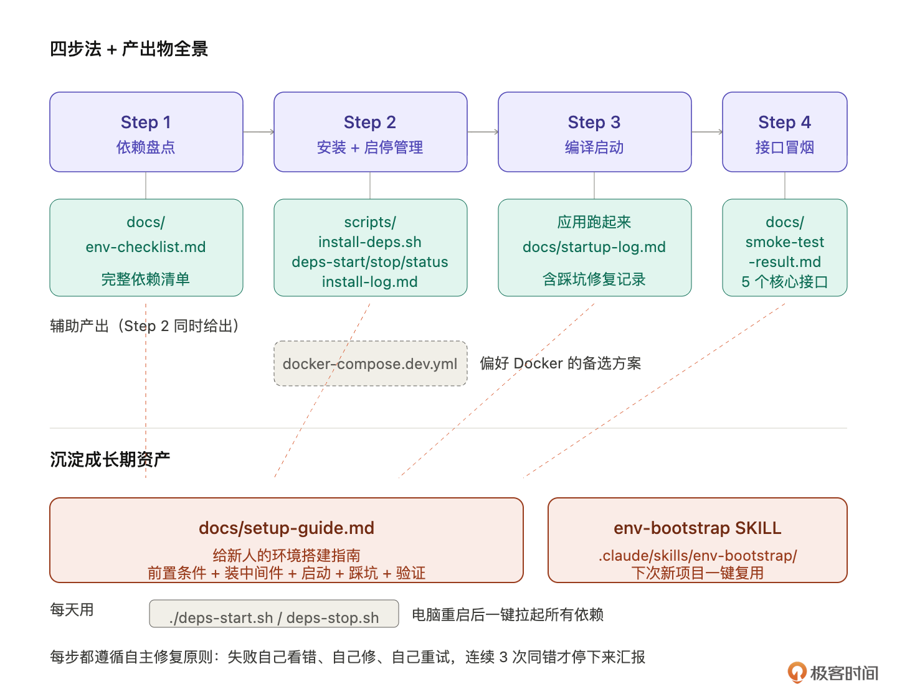
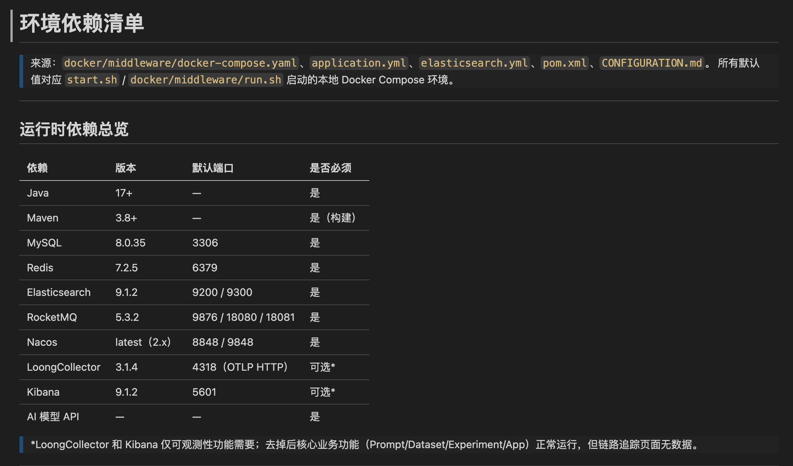
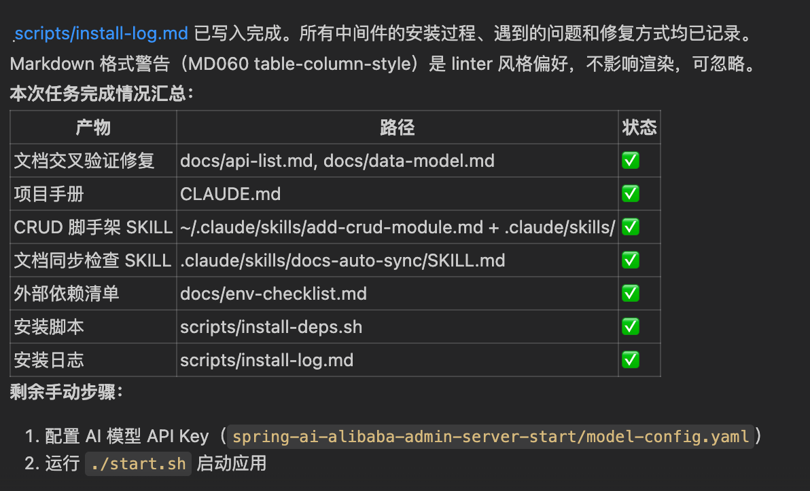
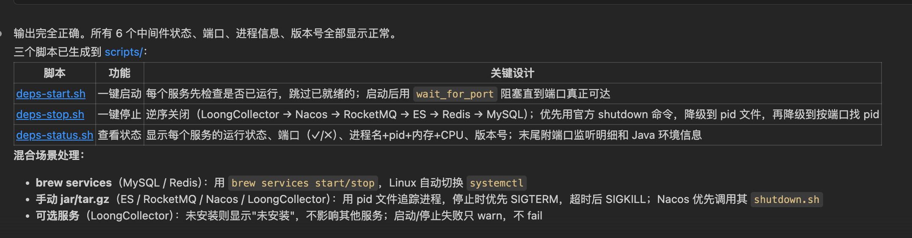
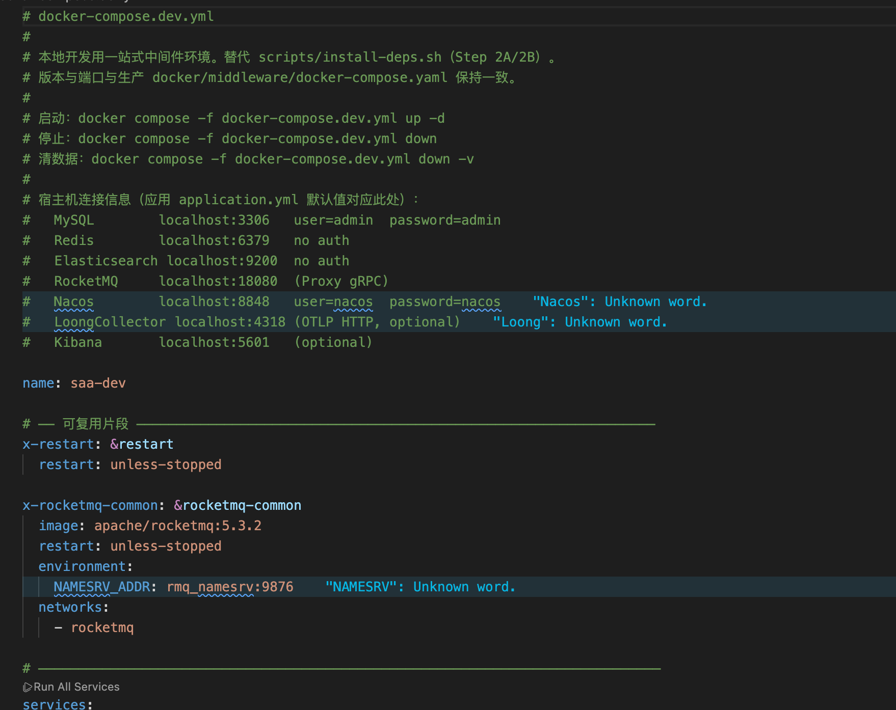
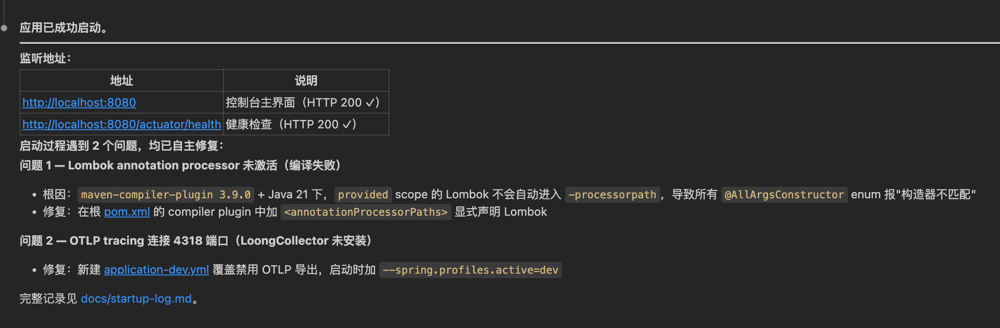
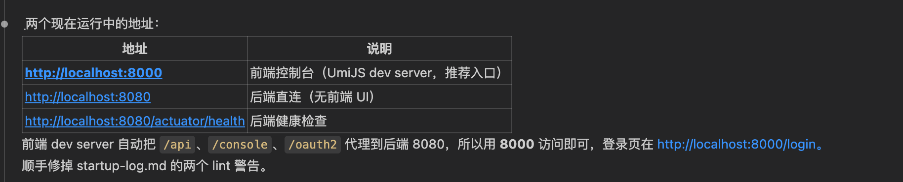
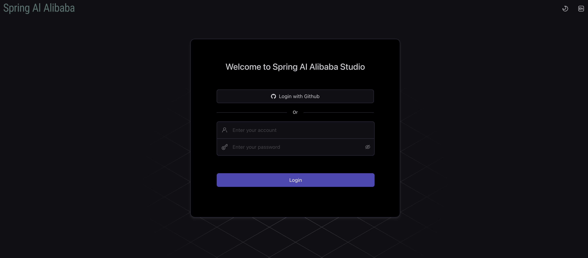
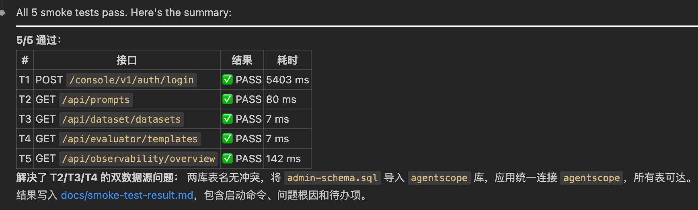
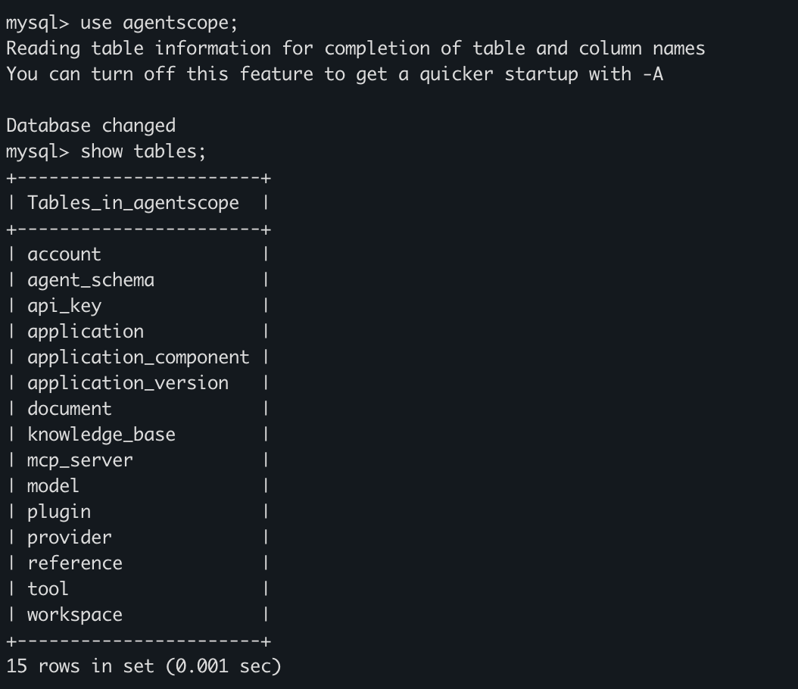

# 13｜让 AI 当你的环境工程师：依赖、编译、启动、冒烟一把过
你好，我是 Robert。

第二部分我们把一个老项目从“完全不懂”摸到了“docs/ 五份资产 + CLAUDE.md + 一个 SKILL”的程度。但有一件事还没做： **让项目真的在你电脑上跑起来**。

这一讲开始进入第三部分。说一下这部分的定位： **第三部分的工作流几乎对每个老项目都一样**。不管你实践的是 Spring AI Alibaba Admin，还是你公司那个跑了五年的订单系统，前置工作的步骤都差不多：分析依赖、装中间件、编译启动、冒烟接口、摸清测试、必要时补出兜底测试。

**每一步的提示词都可以拿来即用，改改项目名就行**。这是第三部分最高的“性价比”：不需要学方法论，照着跑就能快一两天。

13 讲处理的就是其中最折磨人的一部分： **环境搭建**。

## 环境搭建是老项目改造最大的坑

接手过老项目的人都懂这个折磨。

**clone 下来** `mvn install` **一跑，先报缺 Nacos、再报 MySQL 版本不对、再报某个端口冲突、再报对接的内部服务连不上。** 每一项都得 google 半天、装一遍、配一遍、试一遍，一天就这么过去了，一脸绝望。

更难的是 **README 不会告诉你完整的中间件清单**。Nacos 写在 README 上，OTel Collector 在 application-prod.yml 里藏着，Redis 是某个 starter 间接拉的。照着 README 跑能跑通的概率不到一半。

而且这些中间件装好了还要管。每次电脑重启所有服务都停了，第二天上班得一个个起。Mac 上 brew services 还能管一部分，Nacos / OTel Collector 这种自己下载 jar 跑的服务一断电就没了，每次手动 `sh startup.sh` 一个个拉起来。

这一讲让 AI 当你的环境工程师，把这套折磨自动化掉。四步走： **依赖盘点 → 本地安装 \+ 启停管理 → 编译启动 → 接口冒烟**。

跑完后，你电脑上会有一个真正“活着”的 Spring AI Alibaba Admin。中途 AI 自己 debug 自己修复，你不需要每个错误都介入。这就是释放生产力，也让你更加轻松，不用天天纠结这些细节问题。

## 让 AI 把环境一把搞定

下面是四步法的完整提示词。每一条都可以直接拷贝到 Claude Code 跑，改改项目名就能用在自己公司项目上。



### Step 1：依赖盘点

第一步先让 AI 把这个项目运行需要的所有外部依赖列清楚。这一步的产出是后面所有步骤的基础。

**提示词**：

```plain
综合看 docs/external-deps.svg、application*.yml、pom.xml、README，
给我列一份这个项目运行需要的完整外部依赖清单。
每个依赖列出：名字、版本要求（精确到主版本）、默认端口、
连接信息、初始化要求（建库、配 Nacos 命名空间等）。
保存到 docs/env-checklist.md。

```

产出： `docs/env-checklist.md`。这份清单可能列出 MySQL 8.x、Nacos 2.x、OTel Collector、外加几个模型 API 的环境变量配置。

产出的结果是下图，你会发现需要依赖很多组件。其实这里你可以看到，提示词的重要性。如果要让我们整理这么多依赖，要耗费大量的时间。



review 重点：

- **和 docs/external-deps.svg 对得上**。08 讲画过的外部依赖图在这里复用，AI 列的清单不应该和图有出入。如果有出入，要么图错了，要么清单错了，要让 AI 解释清楚。

- **版本号有依据**。AI 不能瞎写“MySQL 用 8.0 就行”。版本要么来自 pom.xml（数据库连接池要求的最低版本）、要么来自 README（项目作者明确说过测过哪个版本）。让 AI 在每个版本号后面标注来源。

- **初始化要求要细**。Nacos 不是装上就能用，要建命名空间、推几个配置项。MySQL 不是建好库就行，要跑初始化 SQL。这些动作清单里都要有。


### Step 2A：本地安装方案（主推）

依赖列清楚了，下一步装。我主推本地安装。原因： **本地装的中间件用起来轻、断电不跑等问题都好处理，性能也比 Docker 在 Mac 上好**（特别是 Mac M 系列芯片下 Docker 有 ARM 兼容问题）。Docker 方案，Step 2C 顺手给一份给偏好 Docker 的同学。

让 AI 不只是给脚本，直接执行装上。

**提示词**：

```plain
读 docs/env-checklist.md，给我生成一份本地安装脚本，
保存到 scripts/install-deps.sh。
- 用 brew（macOS）或 apt（Linux）装中间件
- 包含每个中间件的初始化（建库 SQL、Nacos 配置等）
- 不会的依赖（比如某个 jar 包要下）写清楚下载链接和放哪

生成完直接执行这个脚本。执行过程遵循自主修复原则:
- 任何一步失败，先看报错信息
- 自己判断原因（版本不对、源问题、权限问题、依赖缺失）
- 自己修（换源、换版本、加 sudo、装前置依赖）
- 修完重试，跑通为止
- 不要每个错误都问我

如果同一个错误连续修 3 次还不行，停下来汇报具体卡在哪。
其他情况一律自己解决。

最终输出一份 scripts/install-log.md，记录每个中间件
最终用了什么命令装上、过程中遇到什么问题、怎么修的。

```

产出： `scripts/install-deps.sh` \+ `scripts/install-log.md`。看运行结果，这个提示词很完美，AI执行了正确的结果。



这条提示词的关键设计有两点：

- **“3 次还不行就停”是必须的兜底**。不带这条会出现 AI 改一个配置、报新错、再改、再报新错的死循环，几小时停不下来。3 次同样的错误说明问题超出 AI 判断能力，必须人介入。这是从实际跑出来的经验。

- **要求输出 install-log.md**。这份踩坑日志比脚本本身更值钱。下次同项目重装能照着跑，团队新人看日志知道项目的“环境怪癖”，某天 brew 默认装 MySQL 9 和项目要求的 8 冲突时日志里有“我们用 `brew install mysql@8` 而不是 `brew install mysql`”这种关键决策。


review 重点：

- 脚本是不是对每个中间件都包含“装 \+ 初始化 \+ 验证装上”三步。

- install-log.md 是不是真实反映了过程。

- 3 次失败的兜底有没有触发过、AI 有没有死循环。


### Step 2B：依赖启停管理脚本

中间件装好了，但还有一件事：电脑一关再开，所有服务都停了，每次手动起一遍特别烦。让 AI 生成一组启停管理脚本，把所有中间件的启停拉齐到统一命令。

**提示词**：

```plain
基于 Step 2A 装好的中间件，生成三个脚本到 scripts/ 下：
- deps-start.sh：一键启动所有依赖中间件
- deps-stop.sh：一键停止所有依赖中间件
- deps-status.sh：查看每个中间件的运行状态

考虑混合场景：有的用 brew services 管，有的是手动 jar，
有的是 systemd。脚本要能处理这几种。
启动后等服务就绪再返回，不要"启动了但还没 ready"。
status 脚本要打印每个中间件的运行状态和端口监听情况。

```

产出： `scripts/deps-start.sh` / `deps-stop.sh` / `deps-status.sh`。



每天上班 `./scripts/deps-start.sh`，下班 `./scripts/deps-stop.sh`，比 Docker 方案还方便（Docker 还要 docker-compose up）。这才是本地开发的应有姿态。

review 重点：

- **启动顺序要对**。Nacos 要在 OTel Collector 之前启动，因为 Collector 可能用 Nacos 做服务发现。MySQL 要在应用之前启动。AI 默认可能并行启动，让它按依赖顺序串行起。

- **status 脚本输出要清晰**。一眼看出哪个起来了、哪个挂了，比 `ps aux | grep` 一个个查方便十倍。


### Step 2C：Docker 方案（备选）

我主推本地安装，但我想有些同学可能偏好 Docker，给一条提示词让 AI 顺手出一份 Docker 方案。

```plain
顺手给一份 docker-compose.dev.yml，把所有依赖打包成 docker。
偏好 Docker 的同学可以用这个替代 Step 2A 和 2B。
版本号、端口、初始化脚本要齐全。
保存到项目根目录。不用运行

```

产出： `docker-compose.dev.yml`。



如果你偏好 Docker，直接 `docker-compose -f docker-compose.dev.yml up -d` 就好。本地装那套 install + start/stop 全部跳过。这是给大家的第二条路。

### Step 3：编译启动

中间件起来了，开始编译启动应用本身。这一步同样让 AI 自主修复。

**提示词**：

```plain
中间件已经起来了（用 ./scripts/deps-status.sh 确认）。
现在帮我跑 mvn clean package + 启动应用。
启动过程同样遵循自主修复原则
（参照 Step 2A 的兜底机制：连续 3 次同一错误才停下来汇报）。

启动成功后告诉我应用监听的端口、管理界面地址。
失败和修复的过程记到 docs/startup-log.md。

```

产出：项目跑起来了 \+ `docs/startup-log.md`。编译启动的常见错误比依赖安装更多：

- Java 版本不对（项目要 17，本地是 21 或 11）

- Maven 仓库连不上，或者拉的依赖版本和 lockfile 对不上

- 端口被占用（8080、8848 这些常用端口被别的服务占了）

- 配置文件缺失（application-dev.yml 不在仓库里，需要从 application.yml 拷一份改）

- Nacos 配置没推（应用启动时连 Nacos 拉不到配置）


每一类 AI 都有处理经验。给它自主修复授权，多数能自己搞定。



review 重点：

- 日志没报 ERROR。

- 端口监听正常。

- 管理界面 [http://localhost:8080](http://localhost:8080) 能打开（页面可能要登录，能看到登录页就算活着）。


然后我增加问了一句：

```plain
有前端页面吗？也启动一下，给我访问地址

```

然后结果是：



看这个输出就很舒服。然后页面也出来了：



其实到这里，你就可以看出来这套提示词和本节课思路的好处了。

### Step 4：接口冒烟

最后一步：用 curl 跑几个核心接口，确认项目真的活了。

**提示词**：

```plain
读 docs/api-list.md，挑 5 个最核心的接口（覆盖登录、Prompt、
Dataset、Evaluator、Trace 几大模块），用 curl 跑一遍。
返回 200 算通过，返回错误的列出来。
最后输出一份 docs/smoke-test-result.md。

```

产出： `docs/smoke-test-result.md`。跑完这一步， **项目算“真的活了”**。



然后我看了一眼数据库，都建好了。



review 重点：

- 选的接口是不是真的核心（不是挑了几个最简单的 GET 接口）。

- 返回结构和 api-list.md 描述的一致。

- 如果有接口返回错误，AI 是不是标出来了（不要为了“全绿”故意挑能过的）。


## 把过程沉淀成长期资产

四步跑完，你手里有了一个真正活着的项目，加这些产出：

```plain
docs/
├── env-checklist.md          ← 依赖清单
├── startup-log.md            ← 启动踩坑日志
└── smoke-test-result.md      ← 冒烟结果

scripts/
├── install-deps.sh           ← 一次性装齐
├── install-log.md            ← 安装踩坑日志
├── deps-start.sh             ← 每天用
├── deps-stop.sh              ← 每天用
└── deps-status.sh            ← 每天用

docker-compose.dev.yml        ← Docker 备选

```

这些产物有两个去向。

**一个产物给团队**：把 install-log.md + startup-log.md 整理成一份 `docs/setup-guide.md`，下个新人来照着跑。这件事 AI 帮你做：

```plain
基于 scripts/install-log.md 和 docs/startup-log.md，
整理一份给新人看的 setup-guide.md，
包含：前置条件、装中间件步骤、启动命令、常见踩坑、验证清单。
保存到 docs/setup-guide.md。

```

**另一个产物挖成 SKILL**：整套“依赖盘点 → 装中间件 → 启动 → 冒烟”流程做成一个 SKILL，下次任何新项目（或者重置环境）都能一键跑。这就是 11 讲挖到的第二个 SKILL。

```plain
基于这次环境搭建的全流程，给我生成一个 env-bootstrap 的 SKILL，
保存到 .claude/skills/env-bootstrap/SKILL.md。
触发场景：新接手项目、重置环境、定期验证环境健康。
步骤：依赖盘点 → 装中间件 → 启停脚本 → 编译启动 → 接口冒烟。
allowed-tools 限制到 Read, Bash, Write。

```

跑完 13 讲，你积累的 SKILL 数量从 1 个变成 2 个： `docs-auto-sync` \+ `env-bootstrap`。两个都是“反复做但没沉淀”的高价值流程，还有一个给你留着自己挖。

## 小结

这一讲讲了一件事： **让 AI 当你的环境工程师，把环境搭建从“半天到一天的折磨”压到“半小时跑完”**。

四步法：依赖盘点 → 本地安装 \+ 启停管理（主线，Docker 备选）→ 编译启动 → 接口冒烟。在这节课中，安装依赖的部分你可能需要关注下，因为本地环境的差异性，安装可能会失败，需要你给AI提供帮助，比如提供权限等。

每一步都让 AI 自主修复。3 次失败兜底防死循环。所有踩坑过程沉淀成日志，最终汇成 setup-guide.md 和 env-bootstrap SKILL，成为团队和你自己的长期资产。

整个第三部分的提示词都是这个特点：拿来即用，改改项目名就能在自己公司项目跑。这一讲是最典型的一讲。

下一讲我们摸清这个项目的测试现状：能跑通吗？覆盖度怎样？动手改造之前要不要补测试？

## 思考题

1. 你最近一次接手老项目搭环境花了多长时间？这一讲的四步法，哪一步让你眼前一亮？回想一下你当时手动做的那些事，哪些是 AI 现在能替你做的？

2. 你电脑上现在跑着多少个开发依赖（MySQL、Redis、Nacos 等）？有 start / stop 统一管理脚本吗？如果没有，每次电脑重启你是怎么处理这些服务的？


欢迎在评论区把你的答案写出来。如果今天的课程让你有所收获，也欢迎转发给有需要的朋友，邀请他来一起学习，我们下节课再见！