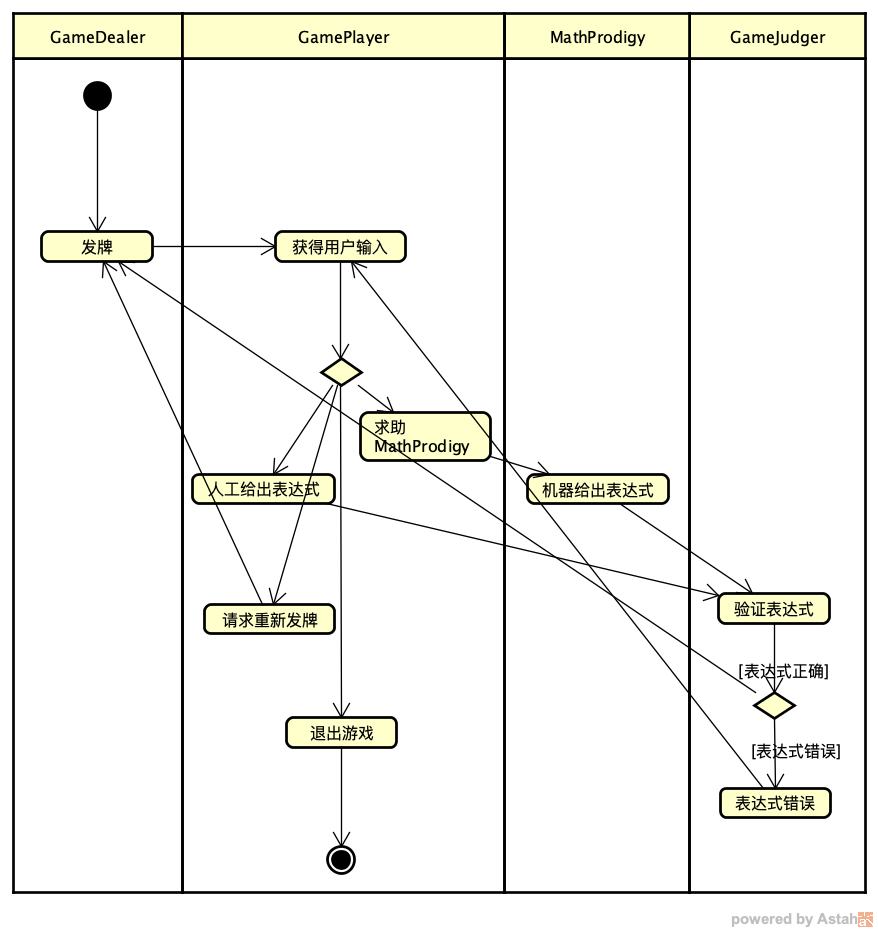

# 11｜使用Swarm实现Autonomous Agent应用
你好，我是李锟。

在上节课中，我们安装好了 Swarm，运行了第一个例子，然后一起学习了 Swarm 的官方文档。这节课我们把上节课学到的新知识投入实战，基于 Swarm 开发我们的 24 点游戏智能体应用。

我们之前已经基于 MetaGPT、AutoGPT 实现过两次这个应用，这节课要做的工作就是将之前的设计移植到 Swarm。

## 角色建模和工作流设计

首先我们要做的工作还是针对 Swarm 来做角色建模和工作流设计。

从概念上讲，Swarm 应用中的概念其实更接近 AutoGPT。Swarm 的两个核心概念是 Agent（智能体）和 Handoff（移交），Agent 与 AutoGPT 的 Agent 对应，Handoff 对应着 AutoGPT Builder 图形界面中两个 Agent 之间的那些连接关系（连接线以及相关的输入、输出数据）。因此 Swarm 版 24 点游戏智能体应用的角色建模和工作流设计与 AutoGPT 版完全相同，同样也划分为 4 个 Agent： **GameDealer**、 **MathProdigy**、 **GameJudger**、 **GamePlayer**。

我直接把 08 课中的流程图复制过来。



因为 Swarm 的每一个 Agent 在运行 client.run() 时都需要访问 LLM，而我们之前在实现 MetaGPT、AutoGPT 版的 24 点游戏智能体应用时，MathProdigy 和 GamePlayer 这两个 Agent（或 Role）是没有访问 LLM 的。对于 MathProdigy 和 GamePlayer，貌似最直接的方式是不使用 Swarm 的 Agent，而是用自定义的类来实现。这样做确实也能实现 24 点游戏智能体应用，不过为了展示 Swarm 调用外部函数（外部工具）的能力，也为了代码的一致性，我决定把它们 4 个全部实现为 Swarm 的 Agent。

## 实现第一版

总体的设计思路确定了，接下来我们需要先做一些基础性工作。我们按照自底向上的方式来做开发。

### 实现 Agent 的外部函数

我们需要先确定给这 4 个 Agent 提供几个函数。基于前面课程中的实现经验，GameDealer 可以完全基于 qwen2.5 的能力来实现发牌功能，因此不需要提供外部函数。然而 qwen2.5 独立解决 24 点表达式目前来说还非常困难，因此 MathProdigy 需要一个外部函数的支持。

上节课我已经提到过，我们将会基于 qwen2.5 的 Assistants API 和我们自己实现的验证函数来做计算，判断表达式是否正确，因此 GameJudger 也需要一个外部函数。GamePlayer 需要接受人类用户的输入，无疑也需要一个外部函数。所以，我们一共需要 3 个外部函数，分别命名为 get\_24\_points\_expression\_func、check\_24\_points\_expression\_func、get\_human\_reply\_func，这 3 个函数的实现如下：

```plain
def get_24_points_expression_func(last_cards_posted: str) -&gt; str:
    """Resolve the expression of 24 points game, return an arithmetic expression.
    Keyword arguments:
      last_cards_posted: an array of 4 integers between 1 to 13.
    """

    point_list = json.loads(last_cards_posted)
    if len(point_list) == 0:
        return "expression not found"

    expressions = get_cached_expressions(point_list)

    result = "expression not found"
    if len(expressions) &gt; 0:
        random_idx = random.randint(0, len(expressions)-1)
        expression = f"'{expressions[random_idx]}'".replace("'", "")
        print(f"The resolved 24 points expression is '{expression}'")
        return expression

    return "expression not found"

def check_24_points_expression_func(expression: str, last_cards_posted: str) -&gt; str:
    """Check if the result of an arithmetic expression is equal 24, return 'Correct' or 'Wrong'.
    Keyword arguments:
      expression: an arithmetic expression
      last_cards_posted: an array of 4 integers between 1 to 13.
    """

    result = eval(expression.replace("'", ""))
    if abs(result - 24) &lt; 0.001:
        return "Correct"

    return "Wrong"

def get_human_reply_func(last_cards_posted: str) -&gt; str:
    """Get a human reply for an an array formated as string. The replay should be 'deal', 'help', 'exit' or an an arithmetic expression.
    Keyword arguments:
      last_cards_posted: an array of 4 integers between 1 to 13.
    """

    PROMPT_TEMPLATE: str = """
    Cards the dealer just posted: {content}
    Please give an expression for the four operations that results in 24.
    Type 'help' if you feel it's difficult.
    Type 'deal' if you want the dealer to deal cards again.
    Type 'exit' if you want to exit this game, type 'exit'.
    """

    point_list = json.loads(last_cards_posted)
    card_list = get_random_card_list(point_list)
    cards_content = f"{{'card_list': {card_list}, 'point_list': {point_list}}}"

    prompt = PROMPT_TEMPLATE.format(content=cards_content)
    human_reply = input(prompt)

    return {"human_reply": f"{human_reply}"}

```

在这 3 个函数实现中调用的一些 helper 函数，在文件 game\_helper.py 中。与 MetaGPT、AutoGPT 版本中的 helper 函数基本上是一样的。

### 实现 Agent 的提示词模板

从上节课的学习中，我们可以理解，Swarm 的每个 Agent 访问 LLM 时提供的提示词主要划分为 **系统提示词** 和 **用户提示词** 两大类。系统提示词可以由创建 Agent 对象时 **instructions** 参数对应的函数提供，我写了一个 get\_instruction() 函数来提供 4 个 Agent 的系统提示词。与此对应，我还写了一个对应的 get\_user\_prompt() 函数来提供 4 个 Agent 的用户提示词。提示词模板和这两个函数的实现如下：

```plain
instruction_template_dict = {
    "GameDealer": """
        Generate 4 random natural numbers between 1 and 13, include 1 and 13. Just return 4 numbers in an array, don't include other content. The returned array should not be repeated with the following arrays:
        {old_arrays}
        """,
    "MathProdigy": """You are a helpful agent. """,
    "GameJudger": """You are a helpful agent. """,
    "GamePlayer": """You are a helpful agent. """,
}

user_prompt_template_dict = {
    "GameDealer": """generate an array""",
    "MathProdigy": """
        What's the 24 points expression of {last_cards_posted} ?
        If the result is 'expression not found', just return 'expression not found'.
        If the result is an arithmetic expression, just return the expression itself and do not add anything else.
        """,
    "GameJudger": """
        Cards posted is '{last_cards_posted}', what's the check result of {expression} ? Just return the check result itself such as 'Correct' or 'Wrong', and do not add anything else such as 'The check result is ...'.
    """,
    "GamePlayer": """
        What's the human reply of {last_cards_posted} ? Just return the human reply itself and do not add anything else, such as 'The human reply ...'.
    """,
}

def get_instruction(context_variables):
    global instruction_template_dict

    agent_name = context_variables["agent_name"]
    instruction_template = instruction_template_dict[agent_name]
    instruction = instruction_template

    if agent_name == "GameDealer":
        last_cards_posted = context_variables["old_arrays"]
        instruction = instruction_template.format(old_arrays=last_cards_posted)

    return instruction

def get_user_prompt(context_variables):
    global user_prompt_template_dict

    agent_name = context_variables["agent_name"]
    user_prompt_template = user_prompt_template_dict[agent_name]
    user_prompt = user_prompt_template

    if agent_name == "MathProdigy":
        last_cards_posted = context_variables["last_cards_posted"]
        user_prompt = user_prompt_template.format(last_cards_posted=last_cards_posted)

    elif agent_name == "GameJudger":
        expression = context_variables["expression"]
        last_cards_posted = context_variables["last_cards_posted"]
        user_prompt = user_prompt_template.format(expression=expression,last_cards_posted=last_cards_posted)

    elif agent_name == "GamePlayer":
        last_cards_posted = context_variables["last_cards_posted"]
        user_prompt = user_prompt_template.format(last_cards_posted=last_cards_posted)

    return user_prompt

```

需要特别注意的是每个 Agent 的提示词模板的设计，目标是为了让与之交互的 LLM 准确实现我们期望的行为，即确保 LLM 准确调用给每个 Agent 配置的函数，而且确保 LLM 返回结果的格式是我们期望的格式。其中的 context\_variables 是上节课介绍过的上下文变量，在每一次运行 client.run() 时传入。

你可能注意到了，只有 GameDealer 具体要做的事情是实现为系统提示词，其他 3 个 Agent 具体要做的事情都实现为用户提示词。这样做是有原因的，而且针对不同的 LLM 类型，实现方式未必是相同的。对于我们使用的 qwen2.5 来说，精确描述的用户提示词的效果是最好的，特别是在配置有外部函数的情况下。如果使用系统提示词，未必每次都能执行期望的函数调用。GameDealer 并未配置外部函数，所以具体要做的事情实现为系统提示词即可。

### 创建 Agent 对象实例

接下来我们创建 4 个 Agent 对象实例。我们分别给这 4 个 Agent 对象实例取名为 Bill、Gauss、Peter、David 以示区别。

```plain
agent_bill = Agent(
    name="GameDealer",
    instructions=get_instruction,
    model="qwen2.5",
    functions=[],
)

agent_gauss = Agent(
    name="MathProdigy",
    instructions=get_instruction,
    model="qwen2.5",
    functions=[get_24_points_expression_func],
)

agent_peter = Agent(
    name="GameJudger",
    instructions=get_instruction,
    model="qwen2.5",
    functions=[check_24_points_expression_func],
)

agent_david = Agent(
    name="GamePlayer",
    instructions=get_instruction,
    model="qwen2.5",
    functions=[get_human_reply_func],
)

```

注意：每个 Agent 对象实例在创建时都需要设置 model=“qwen2.5”，因为默认的 model 是 OpenAI 自家的 GPT-4o。

### 实现 Agent 的业务函数

完成了以上基础工作，我们再给每个 Agent 实现一个业务函数。

```plain
def deal_cards(old_arrays: List[int]) -&gt; str:
    global client, agent_bill

    print(f"used old_arrays is :{old_arrays}")
    context_var_dict = {
        "agent_name":"GameDealer",
        "old_arrays": f"{old_arrays}"
    }
    response = client.run(
        agent=agent_bill,
        messages=[{"role": "user", "content": get_user_prompt(context_var_dict)}],
        context_variables=context_var_dict
    )

    cards_posted = response.messages[-1]["content"]
    print(cards_posted)
    return cards_posted

def machine_give_expression(last_cards_posted: str) -&gt; str:
    global client, agent_gauss

    context_var_dict = {
        "agent_name":"MathProdigy",
        "last_cards_posted": f"{last_cards_posted}"
    }
    response = client.run(
        agent=agent_gauss,
        messages=[{"role": "user", "content": get_user_prompt(context_var_dict)}],
        context_variables=context_var_dict
    )

    expression = response.messages[-1]["content"]
    print(expression)
    return expression

def check_expression(expression: str, last_cards_posted: str) -&gt; str:
    global client, agent_peter

    context_var_dict = {
        "agent_name":"GameJudger",
        "expression": f"{expression}",
        "last_cards_posted": f"{last_cards_posted}"
    }
    response = client.run(
        agent=agent_peter,
        messages=[{"role": "user", "content": get_user_prompt(context_var_dict)}],
        context_variables=context_var_dict
    )

    check_result = response.messages[-1]["content"]
    print(check_result)
    return check_result

def get_human_reply(last_cards_posted: str) -&gt; str:
    global client, agent_david

    context_var_dict = {
        "agent_name":"GamePlayer",
        "last_cards_posted": f"{last_cards_posted}"
    }
    response = client.run(
        agent=agent_david,
        messages=[{"role": "user", "content": get_user_prompt(context_var_dict)}],
        context_variables=context_var_dict
    )

    human_reply = response.messages[-1]["content"]
    print(human_reply)
    return human_reply

```

这 4 个函数的功能，和 08 课 AutoGPT 版本中对应的同名 Block 的功能是一致的，这里就不赘述了。

### 在 main 函数中实现完整的工作流

最后，我们在一个 main 函数内实现完整的工作流。

```plain
def main_func():

    old_arrays = []
    last_cards_posted = deal_cards(old_arrays)

    while True:
        human_reply = get_human_reply(last_cards_posted)

        if human_reply == "deal":
            old_arrays.append(json.loads(last_cards_posted))
            last_cards_posted = deal_cards(old_arrays)
            continue
        elif human_reply == "help":
            expression = machine_give_expression(last_cards_posted)
        elif human_reply == "exit":
            print("Bye bye, have a good day!")
            break
        else:
            expression = human_reply

        if expression != "expression not found":
            check_result = check_expression(expression, last_cards_posted)
        else:
            check_result = "Correct"

        if check_result == "Correct":
            old_arrays.append(json.loads(last_cards_posted))
            last_cards_posted = deal_cards(old_arrays)

```

完整的代码实现，在课程代码 play\_24\_points\_game\_v1.py 中。运行起来体验一下吧。

```plain
cd ~/work/learn_swarm
run_swarm_app play_24_points_game_v1.py

```

## 第一版我们漏掉了什么？

从 Swarm 版 24 点游戏智能体应用第一版的实现来看，实现一个 Swarm 应用是非常简单直接的，比实现 MetaGPT、AutoGPT 应用都要简单。这个工作是如此轻松惬意，真是太棒了！

不过，事后隐隐会感觉到在第一版实现中似乎缺了点重要的东西，那么究竟是什么东西呢？

前面我讲过 Swarm 有两个核心概念 Agent 和 Handoff。第一版实现中确实使用了 Agent，也实现了函数调用，但是完全没有用到 Handoff，所有的工作流都是用手写代码实现的。这样做当然是不完善的，然而第一版的实现仍然是很有价值的，也完全符合我经常提到的 KISS 原则。我们来继续做一些改进，开发使用了 Handoff 的第二版实现。

根据上节课我们学习过的 [Swarm 的官方文档](https://github.com/openai/swarm)，外部函数既可以返回一个字符串，也可以返回一个 Result 对象，例如：

```plain
def talk_to_sales():
   print("Hello, World!")
   return Result(
       value="Done",
       agent=sales_agent,
       context_variables={"department": "sales"}
   )

```

Result 对象有 3 个参数：

- agent 是 client.run() 中下一个要调用的 Agent。

- value 是传给下一个 Agent 的内容。

- context\_variables 是 client.run() 中调用下一个 Agent 时传入的上下文变量。


既然如此，我们要做的就是把第一版中的外部函数做些修改，在必要的情况下返回一个 Result 对象，而不是返回一个字符串。

## 实现第二版

第二版实现是建立在第一版实现的基础之上的，接下来我介绍一些需要做哪些改动。

### 修改 Agent 的外部函数实现

3 个外部函数中 check\_24\_points\_expression\_func() 函数无需修改，其他两个函数需要修改，以下是修改之后的版本：

```plain
def get_24_points_expression_func(last_cards_posted: str) -&gt; str:
    """Resolve the expression of 24 points game, return an arithmetic expression.

    Keyword arguments:
      last_cards_posted: an array of 4 integers between 1 to 13.
    """

    point_list = json.loads(last_cards_posted)
    if len(point_list) == 0:
        return "expression not found"

    expressions = get_cached_expressions(point_list)

    if len(expressions) &gt; 0:
        random_idx = random.randint(0, len(expressions)-1)
        expression = f"'{expressions[random_idx]}'".replace("'", "")
        print(f"The resolved 24 points expression is '{expression}'")

        context_var_dict = {
            "agent_name":"GameJudger",
            "expression": f"{expression}",
            "last_cards_posted": f"{last_cards_posted}"
        }
        user_prompt = get_user_prompt(context_var_dict)
        return Result(
            value=user_prompt,
            agent=agent_peter,
            context_variables=context_var_dict
        )

    return "expression not found"

def get_human_reply_func(last_cards_posted: str) -&gt; str:
    """Get a human reply for an an array formated as string. The replay should be 'deal', 'help', 'exit' or an an arithmetic expression.

    Keyword arguments:
      last_cards_posted: an array of 4 integers between 1 to 13.
    """

    PROMPT_TEMPLATE: str = """
    Cards the dealer just posted: {content}
    Please give an expression for the four operations that results in 24.
    Type 'help' if you feel it's difficult.
    Type 'deal' if you want the dealer to deal cards again.
    Type 'exit' if you want to exit this game, type 'exit'.
    """

    point_list = json.loads(last_cards_posted)
    card_list = get_random_card_list(point_list)
    cards_content = f"{{'card_list': {card_list}, 'point_list': {point_list}}}"

    prompt = PROMPT_TEMPLATE.format(content=cards_content)
    human_reply = input(prompt)

    if human_reply == "help":
        context_var_dict = {
            "agent_name":"MathProdigy",
            "last_cards_posted": f"{last_cards_posted}"
        }
        user_prompt = get_user_prompt(context_var_dict)
        return Result(
            value=user_prompt,
            agent=agent_gauss,
            context_variables=context_var_dict
        )

    elif human_reply != "deal" and human_reply != "exit":
        context_var_dict = {
            "agent_name":"GameJudger",
            "expression": f"{human_reply}",
            "last_cards_posted": f"{last_cards_posted}"
        }
        user_prompt = get_user_prompt(context_var_dict)
        return Result(
            value=user_prompt,
            agent=agent_peter,
            context_variables=context_var_dict
        )

    return human_reply

```

### 为 Swarm 打补丁

接下来我们可以写一些简单的代码来测试修改后的外部函数。例如通过 client.run() 调用 agent\_david，我期望的行为是：

- 若用户输入 “help”，client.run() 自动调用 agent\_gauss 给出 24 点表达式，然后自动调用 agent\_peter 来做表达式的验证。

- 若用户自己给出了 24 点表达式，client.run() 自动调用 agent\_peter 来做表达式的验证。


然而在测试修改后的外部函数时，我发现应用运行时的行为并不能达到我的预期。开发过程又被卡住了！不过没什么大不了，关关难过关关过咯。:)

Swarm 的官方文档写的很简略，似乎在应用层面我没有什么可以继续做的事情了。那么我需要搞清楚在 Swarm 的 client.run() 中究竟做了些什么事情。好在 Swarm 是开源的，代码量很少，遇到问题完全可以 DIY（这就是我很多次强调选择“轻量级开发框架”的优点）。

通过跟踪 client.run() 内部的实现，我发现无法顺利调用下一个 Agent 及其对应外函数的原因，是 client.run() 中第二轮与 LLM 交互时，最后一条消息的 “role” 属性为 “tool”，而 qwen2.5 对由 tool 发来的消息比较冷淡，除非最后一条消息的 “role” 属性为 “user”，才会积极回应，返回我期望的回复（包括了调用外部函数的指示）。

client.run() 的实现位于 Swarm 的 “/swarm/core.py” 文件 (~/work/swarm/swarm/core.py) 内。我对 client.run() 的实现做了一点修改，在 while 循环最后面 “if partial\_response.agent:” 判断语句下添加了以下代码：

```plain
            history.extend(partial_response.messages)
            context_variables.update(partial_response.context_variables)
            if partial_response.agent:
                active_agent = partial_response.agent

                # 以下为新增代码
                new_user_msg = copy.copy(partial_response.messages[-1])
                if new_user_msg['role'] == 'tool':
                    new_user_msg['role'] = 'user'
                    del new_user_msg['tool_call_id']
                    del new_user_msg['tool_name']
                    history.append(new_user_msg)

```

注意：在修改 Swarm 的 core.py 前，需要先对 core.py 的原文件做一下备份。

新增代码做的事情比较简单，若在对话过程中发生了 Agent 切换，且发现对话历史 (chat history) 中最后一条消息的 role 为 “tool”，则在对话历史中添加一条新的 user 消息，消息内容与上一条 tool 消息相同。这样就可以触发 qwen2.5 返回期望的响应。

### 修改 Agent 的业务函数

使用修改后的外部函数之后，只需要通过 client.run() 分别调用 agent\_bill 和 agent\_david 两个 Agent，而不再需要调用 agent\_gauss、agent\_peter。因此第一版实现中的 4 个业务函数，现在只需要 2 个即可。agent\_bill 对应的业务函数 deal\_cards() 保持不变，其他 3 个业务函数现在合并为一个新的业务函数 run\_game\_one\_turn()，其实现如下：

```plain
def run_game_one_turn(last_cards_posted: str) -&gt; str:
    global client, agent_david

    context_var_dict = {
        "agent_name":"GamePlayer",
        "last_cards_posted": f"{last_cards_posted}"
    }
    response = client.run(
        agent=agent_david,
        messages=[{"role": "user", "content": get_user_prompt(context_var_dict)}],
        context_variables=context_var_dict
    )

    result = response.messages[-1]["content"]
    return result

```

### 修改 main 函数

新的 main 函数实现如下：

```plain
def main_func():
    old_arrays = []
    last_cards_posted = deal_cards(old_arrays)

    while True:
        result = run_game_one_turn(last_cards_posted)
        print(f"In this turn, cards posted is '{last_cards_posted}', result is '{result}'.")

        if result == "expression not found" or result == "Correct" or result == "deal":
            old_arrays.append(json.loads(last_cards_posted))
            last_cards_posted = deal_cards(old_arrays)
        elif result == "exit":
            print("Bye bye, have a good day!")
            break

```

完整的代码实现，在课程代码 play\_24\_points\_game\_v2.py 中。运行方式如下：

```plain
cd ~/work/learn_swarm
run_swarm_app play_24_points_game_v2.py

```

从上述代码中可以看出，第二版实现中的业务函数和 main 函数更加简练易懂。通过 Handoff 来实现工作流，比不用 Handoff 而是完全手写的方式要更加灵活，代码更加简练、更容易维护。

## 总结时刻

在这节课中，我们使用本课程中学习到的第三个多 Agent 应用开发框架 Swarm 实现了 24 点游戏智能体应用。不仅巩固了上节课的学习成果，还让我们很好地掌握了 Assistants API 的使用方法。善用 Assistants API，会使我们的 LLM 应用更加灵巧。我们使用的 qwen2.5 是最优秀的国产开源 LLM，对 Assistants API 也有很好的支持，如果你对具体细节感兴趣的话可以阅读一下 qwen2.5 的官方文档： [Function Calling](https://qwen.readthedocs.io/en/latest/framework/function_call.html)。

从最近这两节课的学习中，想必你已经体验到 Swarm 这个超轻量级开发框架的魅力。轻量级并不代表简陋，虽然 Swarm 开发团队在官方文档中说 Swarm 目前只能用于教学场景，然而 Swarm 非常灵活，也非常实用，其实加以扩充之后也可以用于生产环境。始终坚持用更简单、更有效率的方式来实现真实的业务需求，才能确保我们在激烈竞争的环境中立于不败之地。

这一课学习完成之后，我们已经掌握了三个很棒的多 Agent 开发框架的使用方法，也在开发 24 点游戏智能体应用的过程中积累了不少实战经验。这些经验为我们继续深入探索开发多 Agent 协作的 Autonomous Agent 应用奠定了坚实的基础。开发 Autonomous AI 应用，其实就是 AI 领域几十年以来的一个重要目标，未来会有非常广阔的应用场景。

在下一课中我将开启一个全新的领域，带你学习一个 **自动提示词工程** 开发框架 DSPy 。这也是 LLM 应用开发方面一个方兴未艾的领域。

## 思考题

第二版的实现还有什么不足之处，还可以继续改进吗？假如为 GameDealer 也设置一个外部函数，将其与 GamePlayer 连接起来，main 函数是不是会更加简练？

期待你的分享。如果今天的内容对你有所帮助，也期待你转发给你的同事或者朋友，大家一起学习，共同进步。我们下节课再见！