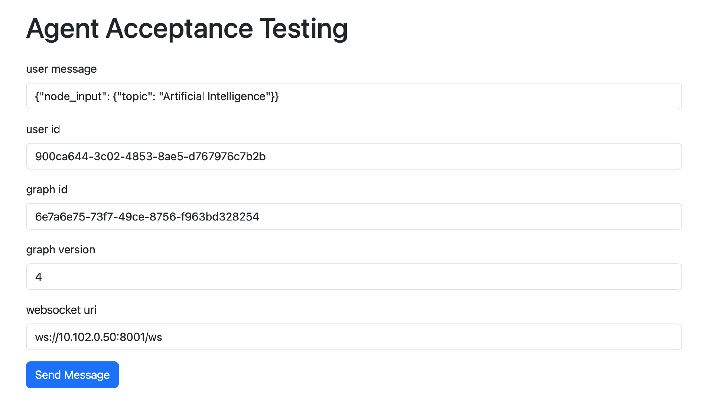
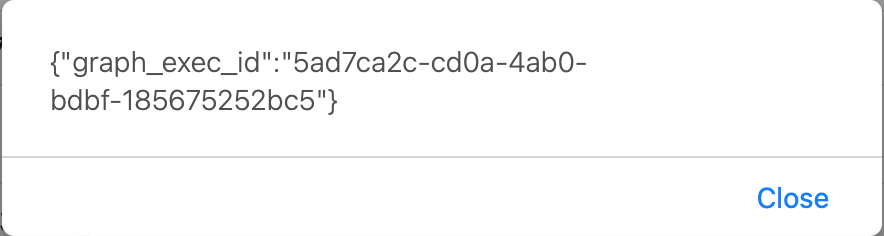
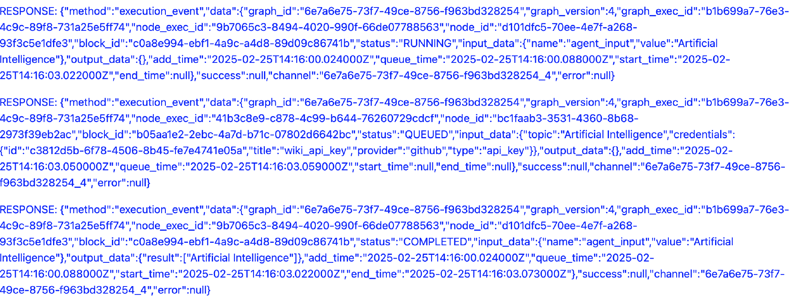
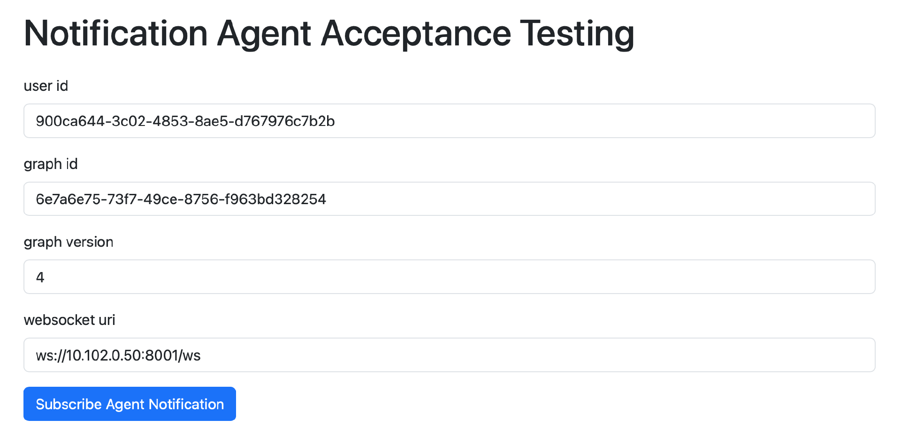
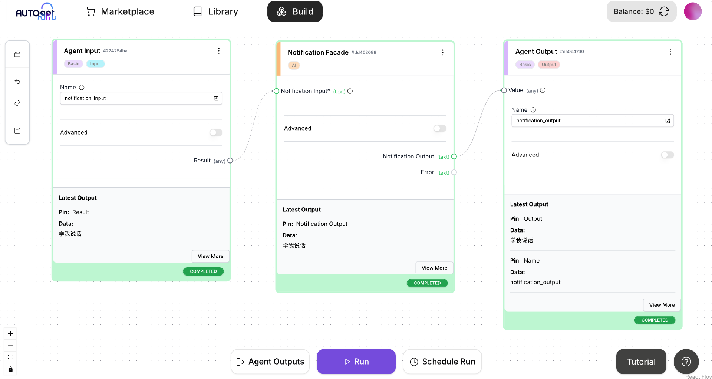
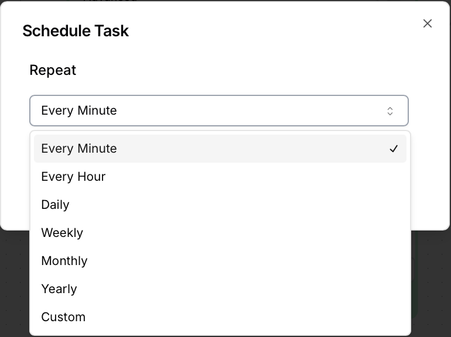
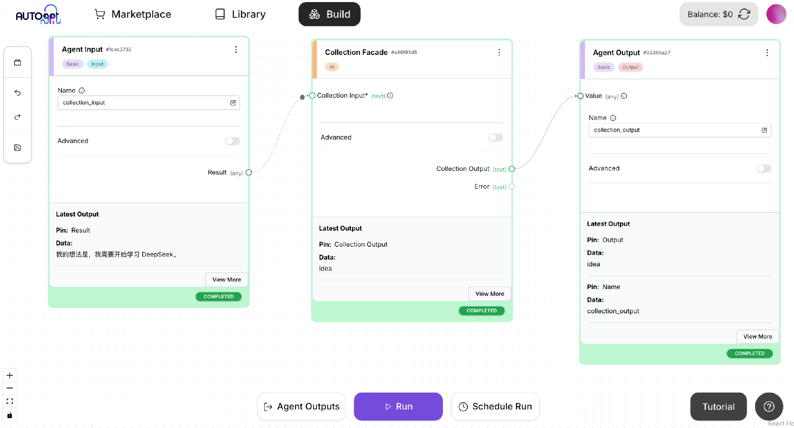

# 20｜企业员工AI助理编程：两个入口Agent的具体实现
你好，我是李锟。

在上节课中，我们确定了 AI 助理的 6 个入口 Agent 的功能。并且创建了两个有代表性的入口 Agent 的框架代码，即 **CollectionAgent 和 NotificationAgent**。在这节课中，我们来逐步实现这两个入口 Agent。

所谓“授人以鱼，不如授人以渔”，我相信你希望学习到的是设计开发的能力，而不仅仅是得到最终的实现代码。要实现一个企业级的 Autonomous Agent 有非常多的细节和开发工作，不可能在两节课中全部讲完。那个目标其实更适合放在一个两周（大多数敏捷开发团队一次迭代的时间长度）的编程工作坊或训练营中来完成。所以我在这节课中要讲解的其实是开发这两个入口 Agent 的要点。

在开发应用的一个新功能之前，需要首先考虑清楚这个功能应该如何测试。这里我说的并非粒度很小的 **单元测试**（Unit Testing），而是端到端的 **验收测试**（Acceptance Testing）。根据 **验收测试驱动开发**（ATDD）这种流行的开发方法，开发一个产品的各项功能，如果始终都能够首先想清楚如何做验收测试，并且从便于测试的角度来设计和开发，这个产品的可测试性、用户体验、可维护性通常都会很好。另一个极端是事先很少考虑各项功能如何方便地做验收测试，这样开发出来的产品，可测试性、用户体验、可维护性都会很糟糕。

因此在开发这两个入口 Agent 之前，我们需要先确定如何方便地对这两个入口 Agent 做验收测试。想清楚了如何做验收测试后，还可以通过测试脚本来做自动化的验收测试。不过我们首先要能够做手工的验收测试，自动化验收测试是后话，可以暂不考虑。

## 入口 Agent 的验收测试

我们在 [17 课](https://time.geekbang.org/column/article/852379) 中已经确定，AI 助理的客户端应用会实现为一个 PWA 应用（Progressive Web App， [渐进式 Web 应用](https://developer.mozilla.org/zh-CN/docs/Web/Progressive_web_apps)）。PWA 应用其实就是增强的 Web 应用，通过网页 + JS 脚本实现。因此对于 AI 助理的入口 Agent，最简单的验收测试手段，就是通过 **网页 \+ JS 脚本**。

在上节课中，我们还确定了每个入口 Agent 的输入、输出。与使用传统 OOD 方法设计出来的对象不同，我们确定每个入口 Agent 只需要一个输入、一个输出，输入、输出都是字符串（自然语言文本或 JSON 结构化文本）。既然所有的入口 Agent 外表上都是一样的，我们可以创建一个通用的入口 Agent 验收测试页面，而不需要为每个入口 Agent 创建单独的验收测试页面。

### 创建通用的入口 Agent 验收测试页面

对于位于 Web 前端（客户端）的入口 Agent 验收测试页面来说，除了可以调用 Web 后端（服务器端）的 RESTful API 外，还需要通过 WebSocket API 来及时获得后端推送的各种通知信息。在上节课中我们已经把 Web 后端应用（在 ~/work/ai-assiatant 目录下）与 AutoGPT Server 合并在一起，而 AutoGPT Server 本身已经提供了 WebSocket API，我们可以暂时先使用 AutoGPT Server 本身提供的 WebSocket API。未来根据需要再为 Web 后端应用开发自己的 WebSocket API。

将 Web 后端应用与 AutoGPT Server 合并之后，在未来的生产环境中 AutoGPT Server 可能会直接暴露在外网，因此其 .env 配置文件中必须设置为 “ENABLE\_AUTH=true”，也就是开启身份认证，否则将会面临严重的安全问题。即使 AI 助理这个应用运行在企业私有云或局域网环境中，安全性好于外网，所有对外暴露的功能仍然必须做好身份认证。

AutoGPT Server 开启了身份认证之后，它提供的 RESTful API 和 WebSocket API 都需要身份认证才能访问。前端的验收测试页面不需要直接调用 AutoGPT Server 的 RESTful API，而是调用 Web 后端应用的 RESTful API（暂时未做身份认证）。但是前端测试页面需要直接调用 AutoGPT Server 的 WebSocket API，因此我们需要解决一下身份认证的问题。

我们可以先采用一个临时方案绕开 WebSocket API 的身份认证，让验收测试和开发得以顺利开展。等入口 Agent 的功能开发得差不多后，以后再为这些功能加上身份认证。总之，在 AI 助理未来上生产环境之前，所有安全相关的功能都必须就绪并且进行过充分的测试。

为了绕开 AutoGPT Server 的 WebSocket API 的身份认证，我们需要修改~/work/AutoGPT/autogpt\_platform/backend/backend/server/ws\_api.py。

找到这一行：

```plain
async def authenticate_websocket(

```

将这个函数内容修改为：

```plain
async def authenticate_websocket(websocket: WebSocket) -&gt; str:
    if not settings.config.enable_auth:
        return DEFAULT_USER_ID

    # added by Li Kun at 2025-02-24
    user_id = websocket.query_params.get("user_id")
    if user_id is not None:
        return user_id

    token = websocket.query_params.get("token")
    if not token:
        await websocket.close(code=4001, reason="Missing authentication token")
        return ""

    try:
        payload = parse_jwt_token(token)
        user_id = payload.get("sub")
        if not user_id:
            await websocket.close(code=4002, reason="Invalid token")
            return ""
        return user_id
    except ValueError:
        await websocket.close(code=4003, reason="Invalid token")
        return ""

```

其中加了注释 “added by Li Kun at 2025-02-24” 的代码是添加的内容。这里做的事情是，当创建 WebSocket 连接时发现连接参数中有 user\_id 参数，则使用从外部传入的 user\_id 作为已通过身份认证的用户的 user\_id。

然后为 Web 后端应用添加 RESTful API。编辑 ~/work/ai-assistant/backend/server/customized/main.py，添加以下内容：

```plain
&#64;customized_app.get('/agent_page', response_class=HTMLResponse)
def index(request: Request):
    return template.TemplateResponse('agent.html', {"request": request, "text": None})

&#64;customized_app.post('/agent_execution')
async def call_collection_agent(
    request: Request,
    message: str = Form("message"),
    user_id: str = Form("user_id"),
    graph_id: str = Form("graph_id"),
    graph_version: int = Form("graph_version")
):
    msg_dict = json.loads(message)
    msg_dict['user_id'] = user_id
    graph_exec = execution_manager_client().add_execution(
        graph_id, msg_dict, user_id=user_id, graph_version=graph_version
    )
    return {"graph_exec_id": graph_exec.graph_exec_id}

```

然后创建入口 Agent 验收测试页面 ~/work/ai-assistant/templates/agent.html，以及其所包含的 JS 文件 ~/work/ai-assistant/static/agent\_test.js。

agent.html 内容如下：

```plain
&lt;!DOCTYPE html&gt;
&lt;html lang="zh-CN"&gt;
&lt;head&gt;
    &lt;meta charset="UTF-8"&gt;
    &lt;meta name="viewport" content="width=device-width, initial-scale=1.0"&gt;
    &lt;title&gt;Agent Acceptance Testing&lt;/title&gt;
    &lt;link href="/static/bootstrap.min.css" rel="stylesheet" integrity="sha384-QWTKZyjpPEjISv5WaRU9OFeRpok6YctnYmDr5pNlyT2bRjXh0JMhjY6hW+ALEwIH" crossorigin="anonymous"&gt;
&lt;/head&gt;
&lt;body&gt;
    &lt;div class="container mt-4"&gt;
        &lt;h1 class="mb-4"&gt;Agent Acceptance Testing&lt;/h1&gt;
        &lt;form id="agent-form" method="post"&gt;
            &lt;div class="mb-3"&gt;
                &lt;label for="message" class="form-label"&gt;user message&lt;/label&gt;
                &lt;input type="text" id="message" name="message" class="form-control"&gt;
            &lt;/div&gt;
            &lt;div class="mb-3"&gt;
                &lt;label for="user_id" class="form-label"&gt;user id&lt;/label&gt;
                &lt;input type="text" id="user_id" name="user_id" class="form-control"&gt;
            &lt;/div&gt;
            &lt;div class="mb-3"&gt;
                &lt;label for="graph_id" class="form-label"&gt;graph id&lt;/label&gt;
                &lt;input type="text" id="graph_id" name="graph_id" class="form-control"&gt;
            &lt;/div&gt;
            &lt;div class="mb-3"&gt;
                &lt;label for="graph_version" class="form-label"&gt;graph version&lt;/label&gt;
                &lt;input type="text" id="graph_version" name="graph_version" class="form-control"&gt;
            &lt;/div&gt;
            &lt;div class="mb-3"&gt;
                &lt;label for="ws_uri" class="form-label"&gt;websocket uri&lt;/label&gt;
                &lt;input type="text" id="ws_uri" name="ws_uri" class="form-control""&gt;
            &lt;/div&gt;

            &lt;div class="d-flex align-items-center mb-3"&gt;
                &lt;button type="submit" id="submit" class="btn btn-primary"&gt;
                    &lt;span class="spinner-border spinner-border-sm d-none" id="spinner" role="status" aria-hidden="true"&gt;&lt;/span&gt;
                    Send Message
                &lt;/button&gt;
            &lt;/div&gt;
        &lt;/form&gt;
    &lt;/div&gt;

    &lt;div id="output"&gt;&lt;/div&gt;

    &lt;script src="/static/agent_test.js" language="javascript" type="text/javascript"&gt;&lt;/script&gt;
&lt;/body&gt;
&lt;/html&gt;

```

agent\_test.js 内容如下：

```plain
var userId = "";
var graphId = "";
var graphVersion;
var wsUri = "";
var websocket = null;

function writeToScreen(message) {
    var output = document.getElementById("output");
    var pre = document.createElement("p");
    pre.style.overflowWrap = "break-word";
    pre.innerHTML = message;
    output.appendChild(pre);
}

function doSend(message) {
    writeToScreen("SENT: " + message);
    websocket.send(message);
}

function onOpen(evt) {
    writeToScreen("CONNECTED");
    doSend('{"method": "subscribe", "data": {"graph_id": "' + graphId + '", "graph_version": ' + graphVersion + '}}');
}

function onClose(evt) {
    writeToScreen("DISCONNECTED");
}

function onMessage(evt) {
    writeToScreen('&lt;span style="color: blue;"&gt;RESPONSE: '+ evt.data+'&lt;/span&gt;');
    // websocket.close();
}

function onError(evt) {
    writeToScreen('&lt;span style="color: red;"&gt;ERROR:&lt;/span&gt; '+ evt.data);
}

function startWebSocket() {
    websocket = new WebSocket(wsUri);

    websocket.onopen = function(evt) {
        onOpen(evt)
    };
    websocket.onclose = function(evt) {
        onClose(evt)
    };
    websocket.onmessage = function(evt) {
        onMessage(evt)
    };
    websocket.onerror = function(evt) {
        onError(evt)
    };
}

const conversionForm = document.getElementById('agent-form');
const submitButton = document.getElementById('submit');
const spinner = document.getElementById('spinner');

conversionForm.addEventListener('submit', async (event) =&gt; {
    event.preventDefault();
    submitButton.disabled = true;
    spinner.classList.remove('d-none');

    const formData = new FormData(conversionForm);
    message = formData.get("message");
    userId = formData.get("user_id");
    graphId = formData.get("graph_id");
    graphVersion = parseInt(formData.get("graph_version"), 10);
    wsUri = formData.get("ws_uri");
    if (wsUri.startsWith("ws://")) {
        wsUri = wsUri + '?user_id=' + userId
        startWebSocket()
    }

    if (message != null) {
        alert("Hello999")
        const response = await fetch('/customized/agent_execution', {
            method: 'POST',
            body: formData,
        });
        const resp = await response.text();
        alert(resp)
        // const graph_exec_id = await response.json();
        // alert(graph_exec_id)
    }

    submitButton.disabled = false;
    spinner.classList.add('d-none');
});

```

使用 poetry run app 重新启动 AutoGPT Server。在另外一台客户端机器，打开浏览器，访问：http://&lt;server\_host\_ip>:8006/customized/agent\_page。server\_host\_ip 需要替换为 Linux 主机的 IP 地址。

通用的入口 Agent 验收测试页面如下所示：



在页面的表单中输入以下内容：

- user message：发送给入口 Agent 的消息内容，JSON 格式。消息内容在 node\_input 中是一个 dict。dict 中的 key 对于不同的 Agent 会有所不同，与 Agent 入口 Block 的 Input 对象中的 key 一一对应。对于 CollectionAgent，dict 的 key 只有 collection\_input，参见上节课中 CollectionFacadeBlock 的框架代码。

- user id：入口 Agent 所属用户的 user\_id，从 PostgreSQL 数据库中可以查到。

- graph id：入口 Agent 的 graph\_id，从 PostgreSQL 数据库中可以查到。

- graph version：入口 Agent 最后保存版本的版本号、自然数，从 PostgreSQL 数据库中可以查到。

- websocket uri：AutoGPT Server 的 WebSocket API 的入口地址，其中的 IP 地址需要替换为 Linux 主机的 IP 地址。WebSocket API 运行端口是 8001，而不是 RESTful API 的运行端口 8006。


点击表单的 Send Message 按钮，会弹出一个如下所示的对话框：



对话框中的内容和 18 课调用 AutoGPT Server 的 RESTful API 启动 Agent 执行时获得的 graph\_exec\_id 相同。

点击 Send Message 按钮后，验收测试页面除了通过 RESTful API 启动 Agent 的执行外，还创建了一个 WebSocket 连接，并且订阅了当前测试的这个 Agent 的相关事件（代码实现在 agent\_test.js）。因此验收测试页面可以从服务器端获得这个 Agent 相关事件的通知，这些内容会附加到页面下面，如下图所示：



Web 前端应用可以对这些事件进行过滤和处理，确定哪些事件需要在 UI 界面上发送给用户。用户收到这些消息后，还可以回复这些消息。用户回复的内容一样也是通过 WebSocket API 发到服务器。从概念上来说， **WebSocket API 和 RESTful API 的主要区别是：前者以“推模式”工作，后者以“拉模式”工作。**

当前验收测试页面中 Agent 相关事件的显示样式非常难看，不过这个并不重要，我们实现了基本功能之后，显示样式可以慢慢优化。

我们跑通了这个简陋的入口 Agent 验收测试页面，究竟有何意义呢？

- 实现了 Web 前端应用调用 Web 后端应用的 RESTful API，然后 Web 后端应用通过本地 API (execution\_manager\_client().add\_execution()) 启动了入口 Agent 的执行。

- 通过 AutoGPT Server 的 WebSocket API 实现了对某个 Agent 相关事件的订阅。这样这个 Agent 未来就可以主动向用户发送通知或者推送各种消息（例如积极主动的建议），这对于提高 AI 助理的自主性很重要。因为 AI 助理需要以积极主动的方式工作，而不是用户推一下才会动一下，无论何时都要由用户主动发起交互。


这个通用的 Agent 验收测试页面可以测试大多数入口 Agent，包括更早之前我们开发的那个 WikipediaSummary Agent (见 [18 课](https://time.geekbang.org/column/article/853340))。不过 NotificationAgent 这个 Agent 比较特殊，NotificationAgent 永远都是主动向用户发送消息，而几乎不需要用户主动与其交互。我们需要为 NotificationAgent 单独创建一个简化的验收测试页面。

### 创建 NotifiactionAgent 的验收测试页面

我们为 NotificationAgent 创建一个验收测试页面~/work/ai-assistant/templates/notification.html。

notification.html 内容如下：

```plain
&lt;!DOCTYPE html&gt;
&lt;html lang="zh-CN"&gt;
&lt;head&gt;
    &lt;meta charset="UTF-8"&gt;
    &lt;meta name="viewport" content="width=device-width, initial-scale=1.0"&gt;
    &lt;title&gt;Notification Agent Acceptance Testing&lt;/title&gt;
    &lt;link href="/static/bootstrap.min.css" rel="stylesheet" integrity="sha384-QWTKZyjpPEjISv5WaRU9OFeRpok6YctnYmDr5pNlyT2bRjXh0JMhjY6hW+ALEwIH" crossorigin="anonymous"&gt;
&lt;/head&gt;
&lt;body&gt;
    &lt;div class="container mt-4"&gt;
        &lt;h1 class="mb-4"&gt;Notification Agent Acceptance Testing&lt;/h1&gt;
        &lt;form id="agent-form" method="post"&gt;
            &lt;div class="mb-3"&gt;
                &lt;label for="user_id" class="form-label"&gt;user id&lt;/label&gt;
                &lt;input type="text" id="user_id" name="user_id" class="form-control"&gt;
            &lt;/div&gt;
            &lt;div class="mb-3"&gt;
                &lt;label for="graph_id" class="form-label"&gt;graph id&lt;/label&gt;
                &lt;input type="text" id="graph_id" name="graph_id" class="form-control"&gt;
            &lt;/div&gt;
            &lt;div class="mb-3"&gt;
                &lt;label for="graph_version" class="form-label"&gt;graph version&lt;/label&gt;
                &lt;input type="text" id="graph_version" name="graph_version" class="form-control"&gt;
            &lt;/div&gt;
            &lt;div class="mb-3"&gt;
                &lt;label for="ws_uri" class="form-label"&gt;websocket uri&lt;/label&gt;
                &lt;input type="text" id="ws_uri" name="ws_uri" class="form-control"&gt;
            &lt;/div&gt;

            &lt;div class="d-flex align-items-center mb-3"&gt;
                &lt;button type="submit" id="submit" class="btn btn-primary"&gt;
                    &lt;span class="spinner-border spinner-border-sm d-none" id="spinner" role="status" aria-hidden="true"&gt;&lt;/span&gt;
                    Subscribe Agent Notification
                &lt;/button&gt;
            &lt;/div&gt;
        &lt;/form&gt;
    &lt;/div&gt;

    &lt;div id="output"&gt;&lt;/div&gt;

    &lt;script src="/static/agent_test.js" language="javascript" type="text/javascript"&gt;&lt;/script&gt;
&lt;/body&gt;
&lt;/html&gt;

```

与前面通用的 Agent 验收测试页面 agent.html 相比，这个页面只是去掉了输入用户消息的表单字段。

然后在 Web 后端应用再加一个 RESTful API。编辑~/work/ai-assistant/backend/server/customized/main.py，加入以下内容：

```plain
&#64;customized_app.get('/notification_page', response_class=HTMLResponse)
def index(request: Request):
    return template.TemplateResponse('notification.html', {"request": request, "text": None})

```

使用 poetry run app 重新启动 AutoGPT Server。在另外一台客户端机器，打开浏览器，访问：http://&lt;server\_host\_ip>:8006/customized/notification\_page。server\_host\_ip 需要替换为 Linux 主机的 IP 地址。

NotificationAgent 验收测试页面如下所示：



与之前通用的 Agent 验收测试页面的区别是不需要输入用户消息，点击表单的 Subscribe Agent Notification 按钮后，只是通过 WebSocket API 订阅对应 Agent 的相关事件（用来实现通知功能），而不是启动 Agent 的执行。

学习到这里，你可能会提出一个很大的疑问：如果没有测试页面启动 NotificationAgent 的执行，NotificationAgent 没有执行就不会有相关的事件，那么这个测试页面怎么可能收到通知消息呢？如果能提出这个疑问，说明你确实真的是学懂了，非常可喜可贺！

我来简单解释一下这个疑问，NotificationAgent 还可以通过周期性的定时调度来执行。AutoGPT Server 启动一个 Agent 的执行，有两种主要方式：

- 客户端通过调用 API（RESTful API 或本地 API）执行。

- 通过定时调度器来周期性执行。


我们重新在 Agent Builder 中打开 NotificationAgent，如图所示：



在 Agent Builder 的 Run 按钮右侧，有一个 Schedule Run 按钮，点击这个按钮，弹出一个对话框：



在对话框中可以选择执行 Agent 的时间周期。为了获得较为敏捷的事件通知，对于 NotificationAgent，可以将执行周期设置为每分钟一次。

如果你足够细心的话，接下来可能还会提出一个衍生问题：NotificationAgent 的通知内容又从哪里获得呢？其实有很多实现方式，取决于具体的功能实现。例如可以在 Redis Server 中实现一个简单的消息队列，NotificationAgent 从这个消息队列中获取到通知内容，然后通过 WebSocket API 发给前端测试页面。

另外，也不是只有专门的 NotificationAgent 可以向 Web 前端发送事件通知。前面实现通用的Agent 验收测试页面时我们已经看到了，其实 Web 前端应用可以通过 WebSocket API 订阅与任何一个 Agent 相关的事件通知。充分利用好这些 Agent 相关的事件通知，可以实现一个具有高度主动性的 LLM 应用，与传统那种只能被动工作的 ChatBot 体验大不相同。这也是我们设计开发 Autonomous Agent 的理想目标了。千里之行始于足下，宏伟的高楼大厦就源自这些不起眼的基础工作。

## 实现 入口 Agent 的 Block

两个入口 Agent 的验收测试页面就绪之后，我们就可以方便地为入口 Agent 开发相关的 Block，并且做测试了。接下来我再介绍一下如何开发 CollectionAgent。

### 实现 CollectionAgent 的入口 Block

CollectionAgent 的入口 Block 是 CollectionFacadeBlock，我们在上节课中已经创建了这个 Block。这个 Block 的功能应该是一个分发器，即对 CollectionAgent 需要完成的功能进行分类，然后分发给下一级粒度更小的 Block。

因为上节课我们划分的入口 Agent 都是粗粒度的，每个 Agent 都完成了不止一个 UserCase（用例）的功能。如果把所有功能全部塞在一个很大的 Block 中实现，因为几乎无法重用，未来维护起来会非常不方便。因此我们应该按照不同的 UseCase 对功能进行分类，然后分发给下一级 Block。Block 的划分可能会有 3～4 级，最低级别的 Block 功能单一，实现起来也很简单。

在 CollectionFacadeBlock 中实现分类工作，需要修改其中的提示词模板。我们先写一段最简单的提示词，试试效果：

```plain
    PROMPT_TEMPLATE: str = """
    你是我的工作助手，我给你一段文本，你需要把这段文本内容做分类。我给你的文本可以分为以下三类：
    1. idea：以“我的想法”开头。
    2. action：以"我要做"开头。
    3. checklist：以"检查列表"开头。
    请你对我给你的以下文本做分类，只返回给我分类的英文名称即可。
    {collection_input}
    """

```

在 Agent Builder 中重新执行 CollectionAgent，输入“我的想法是，我需要开始学习 DeepSeek”。执行后输出“idea”，表明这段话是一个 idea。



接下来我们可以根据入口 Block 的分类，把用户输入的消息分发给某个下一级 Block。例如对于 idea 类别，可以分发给一个专门处理 idea 增删改查的 Block。

上面这个做分类的提示词，只是用来做个示例，当然并非最终的提示词。我们可以持续改进和优化这个提示词，以便提供更好的用户体验，比如用户可以用更随意的语言输入，而不是必须遵照某种严格的格式。

## 总结时刻

在这节课中，我们为入口 Agent 创建了通用的验收测试页面，还为 NotificationAgent 单独创建了验收测试页面。在实现验收测试页面的过程中，我们解决了通过调用 Web 后端应用的 RESTful API 启动 Agent 的执行，以及通过调用 AutoGPT Server 的 WebSocket API 获得 Agent 相关事件通知这两个非常重要的技术问题。

最后，我介绍了 CollectionFacadeBlock 这个 CollectionAgent 的入口 Block 应该完成的功能，并且介绍了 Block 分级调用的实现思想。

下节课我将对企业员工 AI 助理未来功能的完善做一些展望。并且对实现未来的一些高级功能所需的相关知识做一些介绍。

## 思考题

1. 我们为什么要提前考虑某个功能如何测试，而不是放在实现之后再考虑？

2. 在所有测试类别中，为什么说端到端的验收测试最为重要？


欢迎你在留言区交流你的想法，也欢迎你把这节课的内容分享给其他朋友，我们下节课再见！