# 新春特辑1 | 卓越CTO必备的能力与素质
你好，我是《技术领导力实战笔记》专栏的主编成敏，今天是除夕，先在这里祝你除夕快乐，身体健康，万事如意！

从2018年4月16号，《技术领导力实战笔记》专栏更新第一篇文章开始，我们已经与你一起度过了9个多月的时光，更新了210篇文章，走过了专栏3/4的路程。

在这9个多月里，我们邀请到了近百位CEO、CTO、技术VP等技术领导者来分享他们的实践与经验，话题涉及技术领导者的核心能力、高效技术团队的打造、高效研发流程的建设、技术团队的考核与激励、技术团队文化的建设、技术人才的选育用留等多个方向。

这些文章虽有序但却分散在全年的专栏中，恰逢新春假期，我特别整理了5个热门的主题的直达专辑，以便您按照主题领域来回顾。你可以点击知识卡，跳转到你最想看的那篇文章，温故而知新。

今天专辑的主题是“卓越CTO必备的能力与素质”，希望你看完之后能有所收获，也欢迎留言选出你最喜欢的文章，或是分享你对于CTO必备能力与素质的观点。

[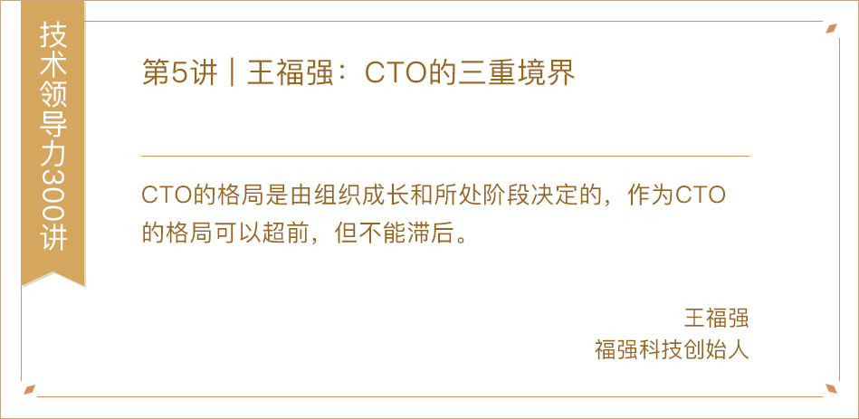](https://time.geekbang.org/column/article/6257)

[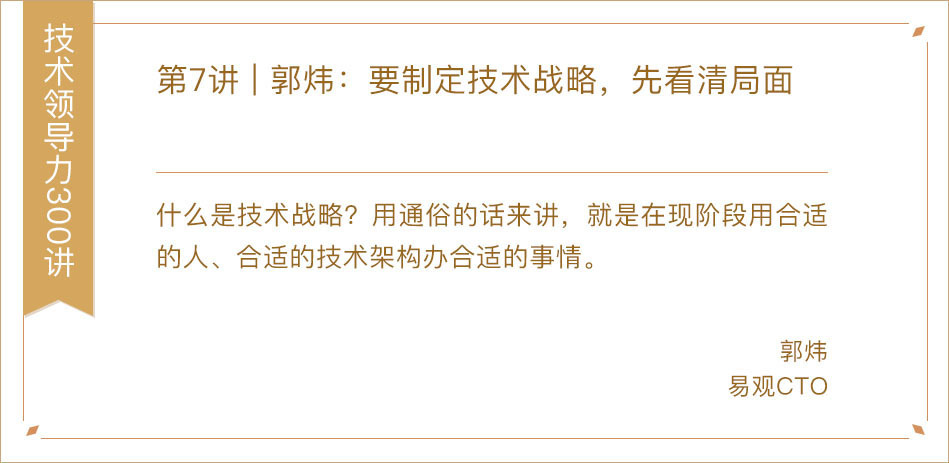](https://time.geekbang.org/column/article/6374)

[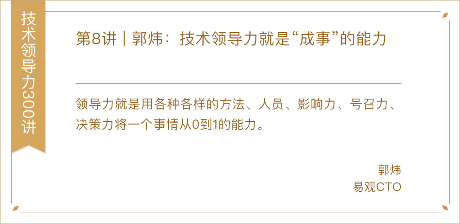](https://time.geekbang.org/column/article/6399)

[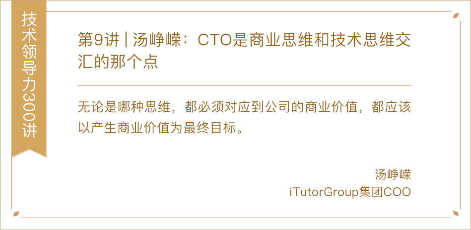](https://time.geekbang.org/column/article/6581)

[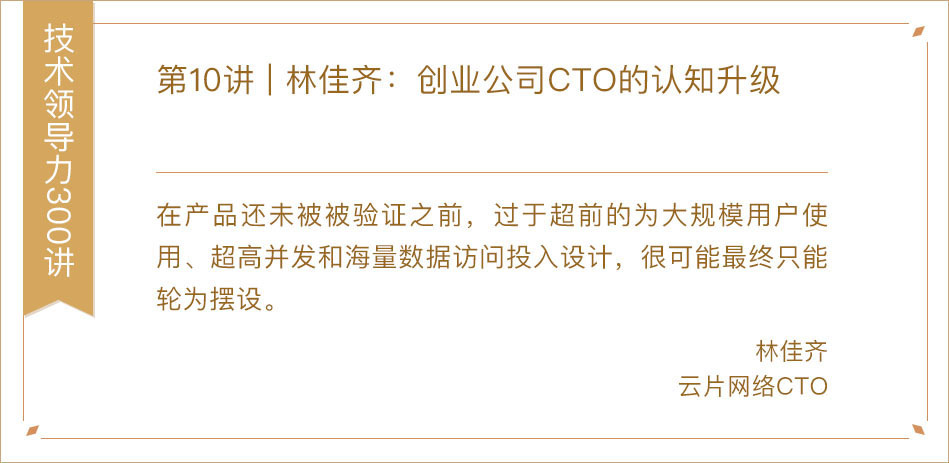](https://time.geekbang.org/column/article/6585)

[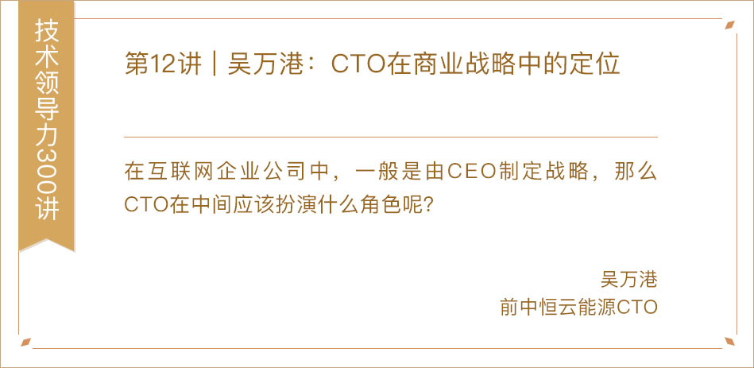](https://time.geekbang.org/column/article/6656)

[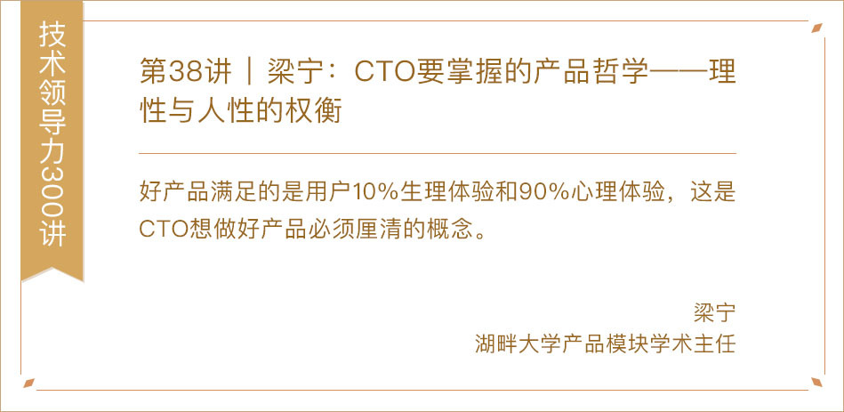](https://time.geekbang.org/column/article/9426)

[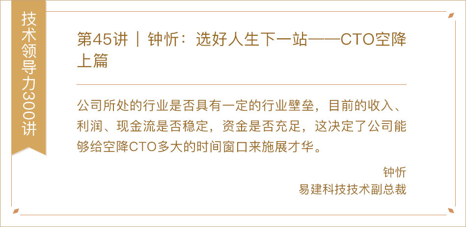](https://time.geekbang.org/column/article/10154)

[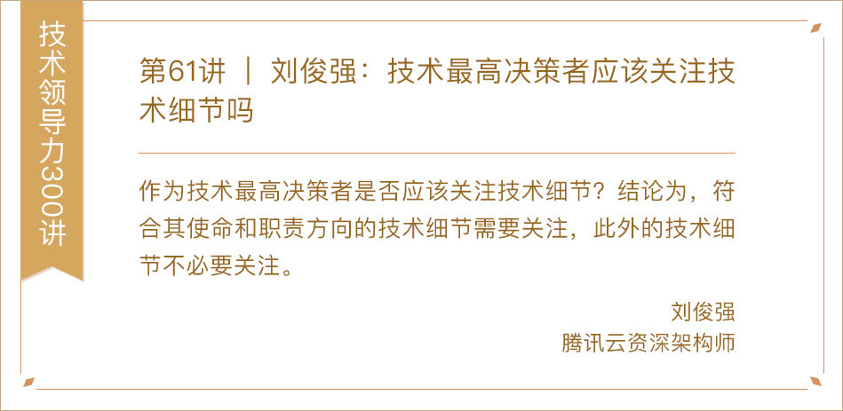](https://time.geekbang.org/column/article/12246)

[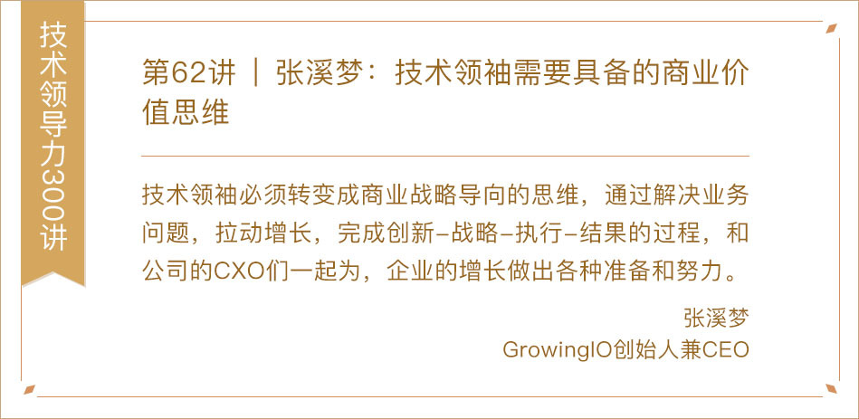](https://time.geekbang.org/column/article/12378)

[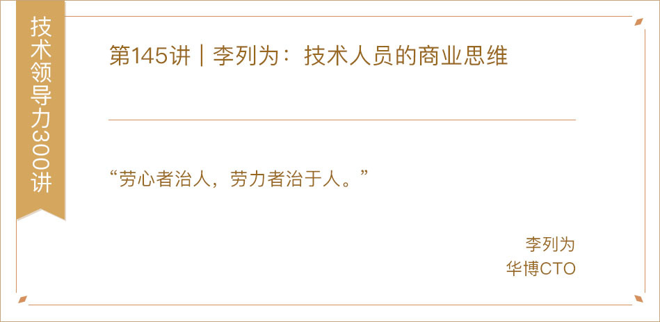](https://time.geekbang.org/column/article/74338)

[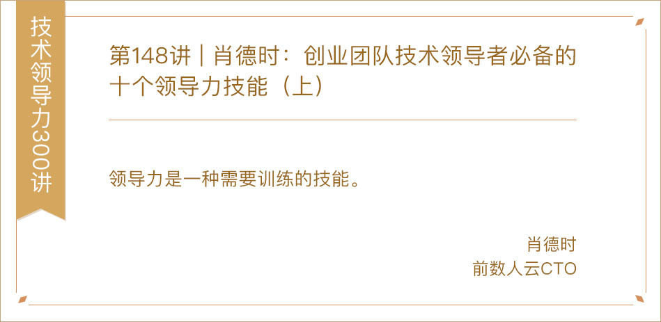](https://time.geekbang.org/column/article/75341)

[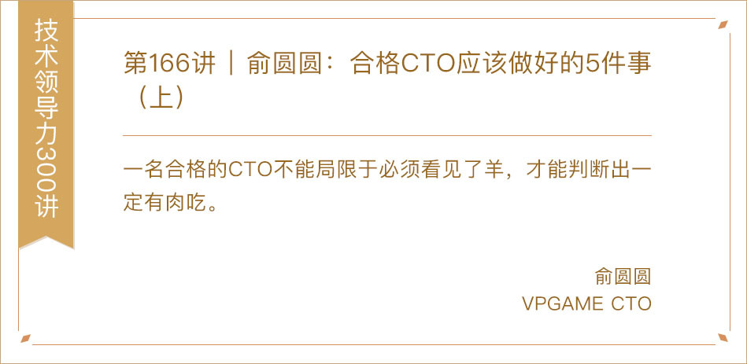](https://time.geekbang.org/column/article/79774)

[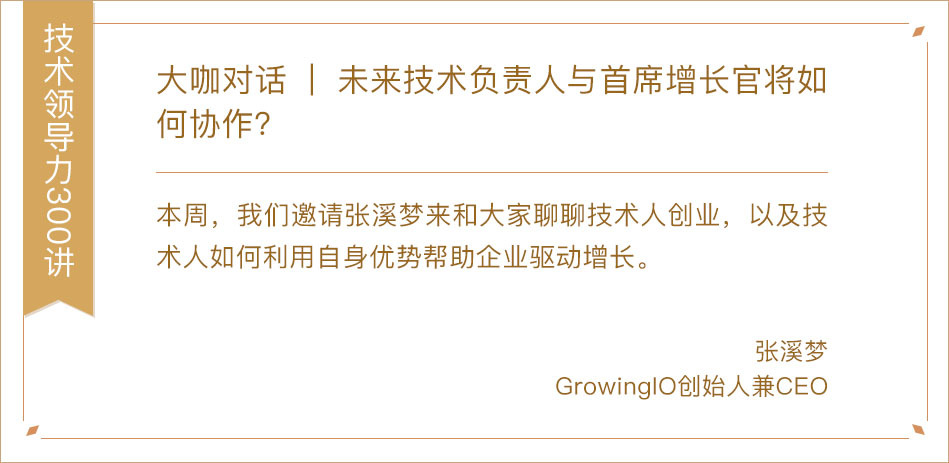](https://time.geekbang.org/column/article/6297)

[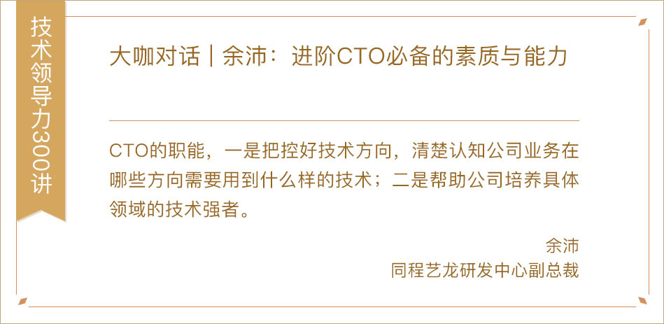](https://time.geekbang.org/column/article/42080)