# 新春特辑2 | 如何成长为优秀的技术管理者？
你好，我是《技术领导力实战笔记》专栏的主编成敏，今天是大年初一，祝你在新的一年里万象更新，事事顺心！

今天专辑的主题是“如何成长为优秀的技术管理者？”，希望你看完之后能有所收获，也欢迎留言选出你最喜欢的文章，或是分享你关于技术管理者成长的实践与经验。

[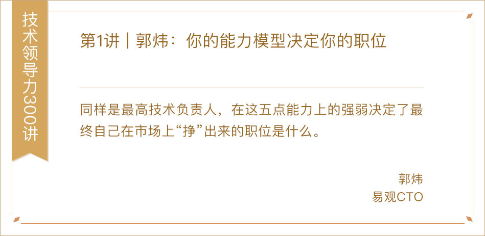](https://time.geekbang.org/column/article/5765)

[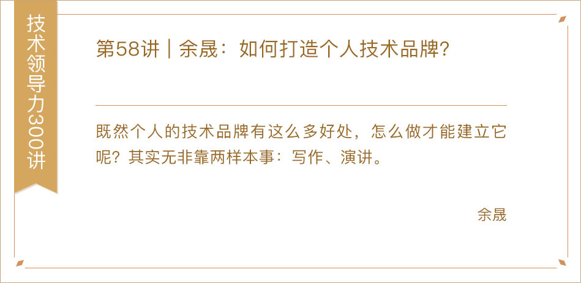](https://time.geekbang.org/column/article/11829)

[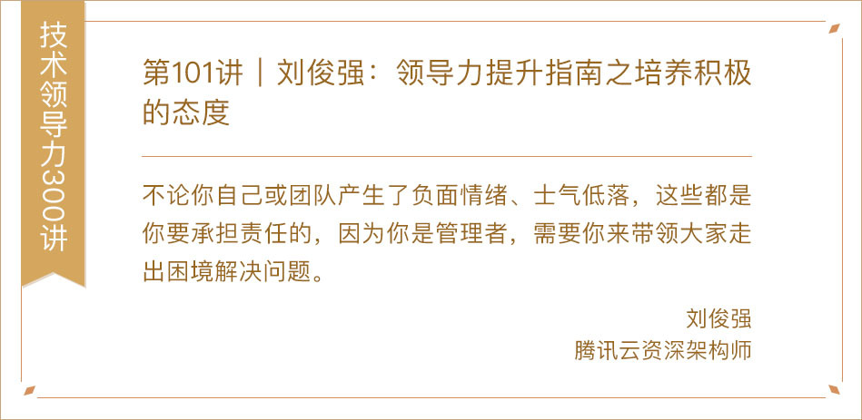](https://time.geekbang.org/column/article/41315)

[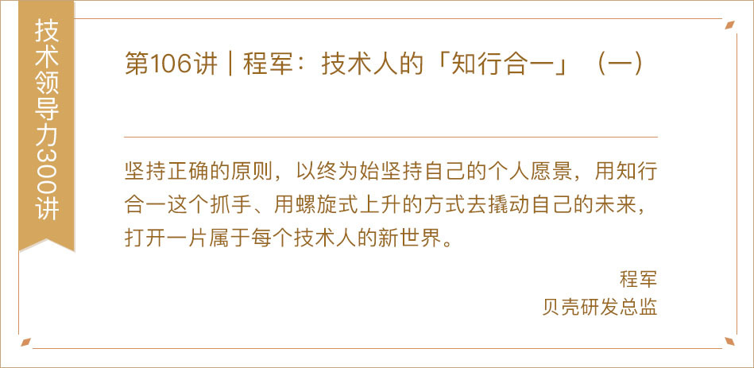](https://time.geekbang.org/column/article/41898)

[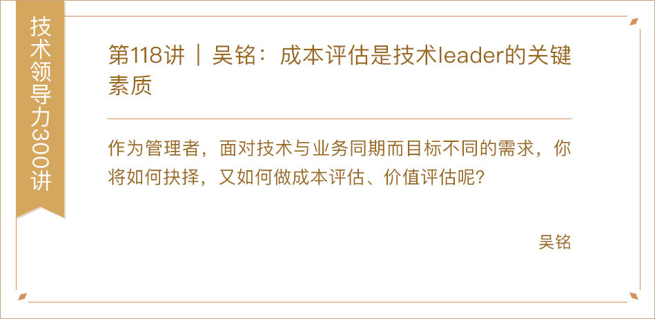](https://time.geekbang.org/column/article/65311)

[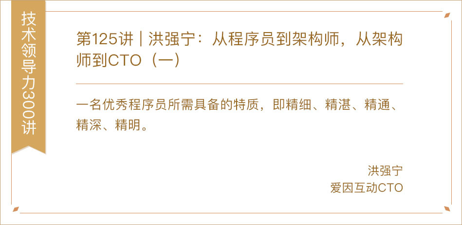](https://time.geekbang.org/column/article/69096)

[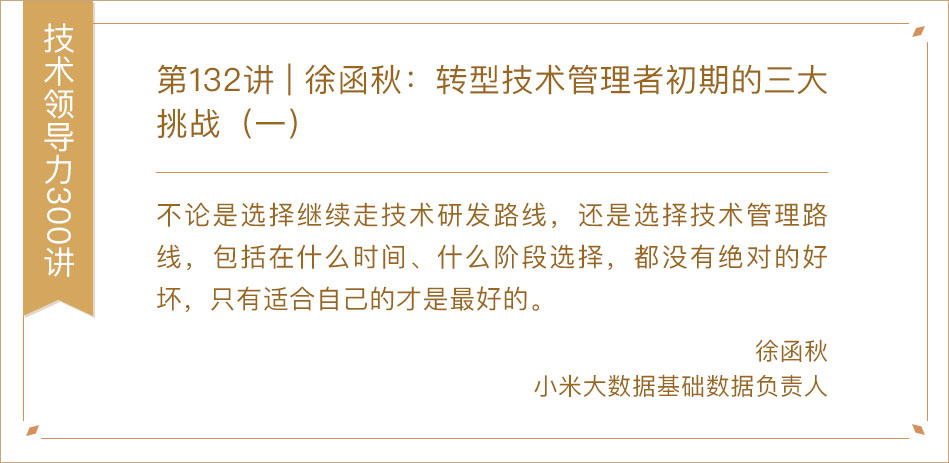](https://time.geekbang.org/column/article/70873)

[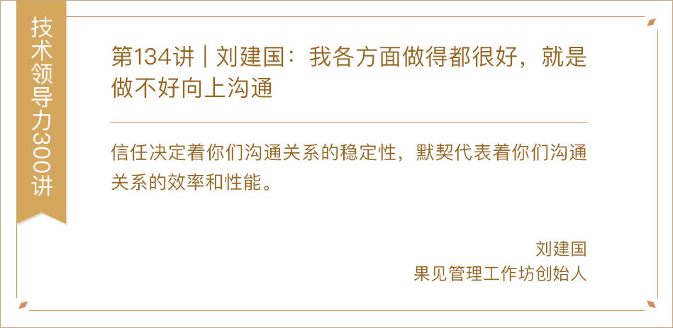](https://time.geekbang.org/column/article/71156)

[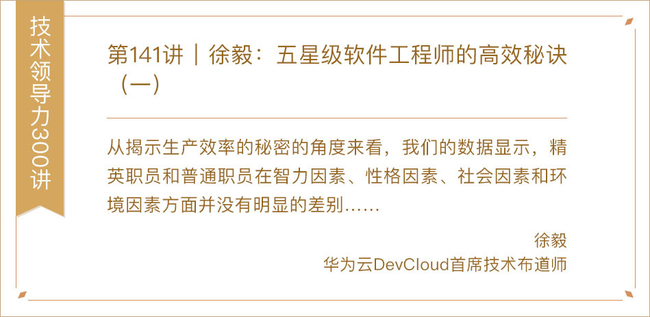](https://time.geekbang.org/column/article/73335)

[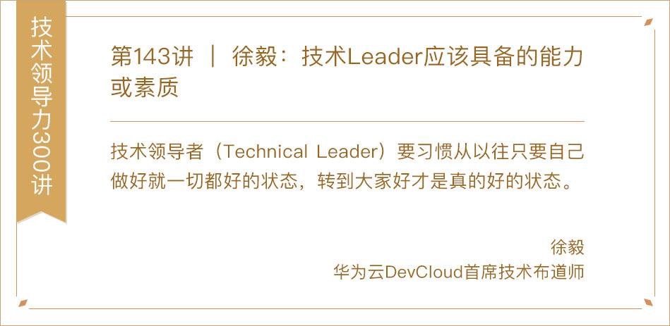](https://time.geekbang.org/column/article/73596)

[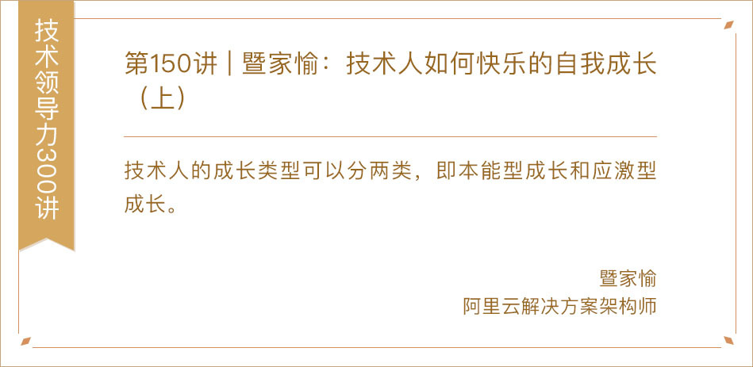](https://time.geekbang.org/column/article/75727)

[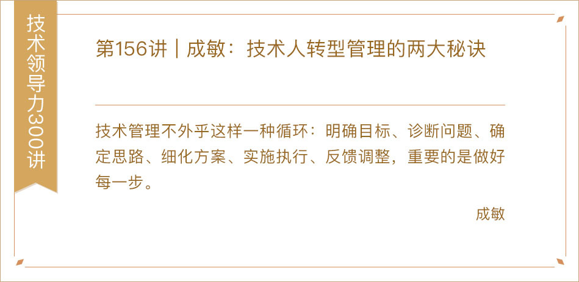](https://time.geekbang.org/column/article/77303)

[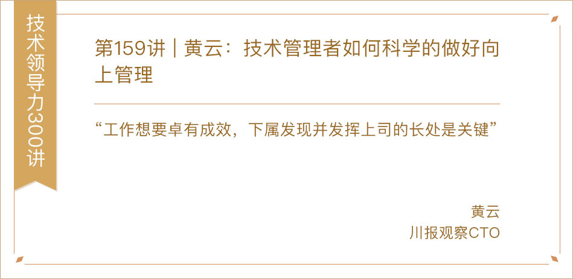](https://time.geekbang.org/column/article/77888)

[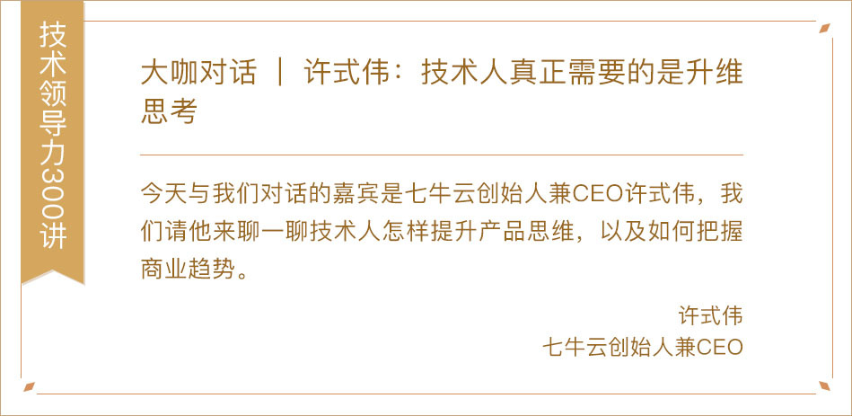](https://time.geekbang.org/column/article/7674)

[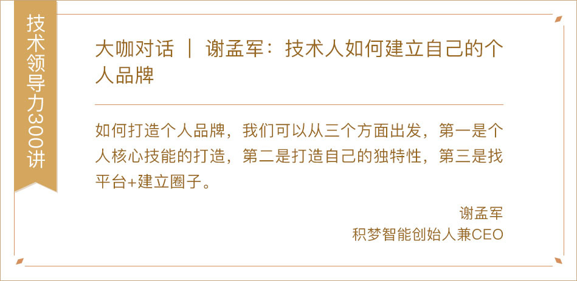](https://time.geekbang.org/column/article/41650)