# 新春特辑3 | 如何打造高质效的技术团队？
你好，我是《技术领导力实战笔记》专栏的主编成敏，高质效的技术团队是每个技术领导者的追求，今天专辑的主题就是“如何打造高质效的技术团队？”，希望你看完之后能有所收获，也欢迎留言选出你最喜欢的文章，或是分享你对于技术团队打造的实践与经验。

[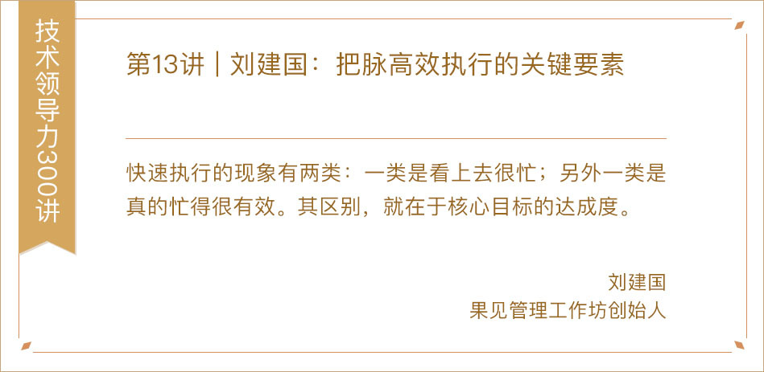](https://time.geekbang.org/column/article/6870)

[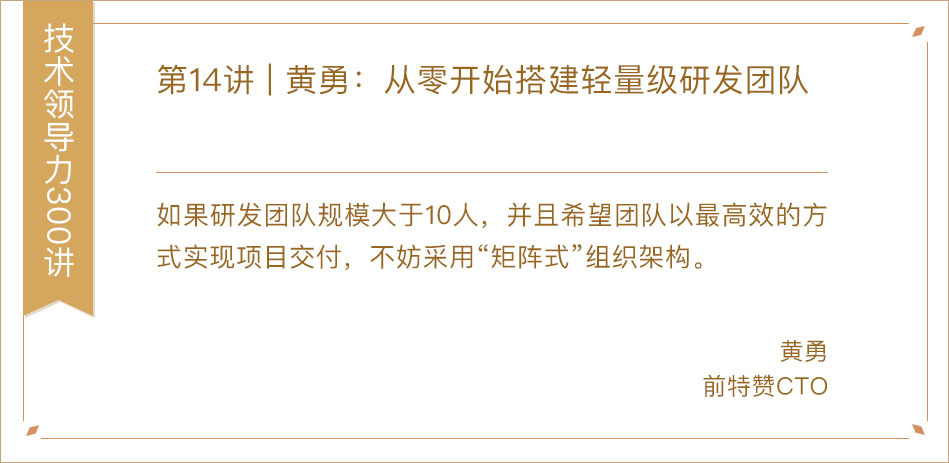](https://time.geekbang.org/column/article/6915)

[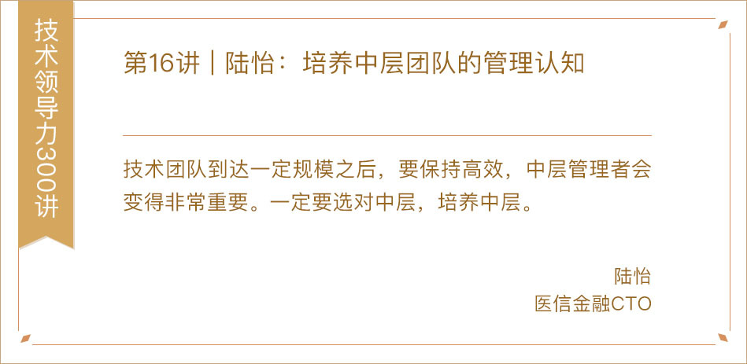](https://time.geekbang.org/column/article/7032)

[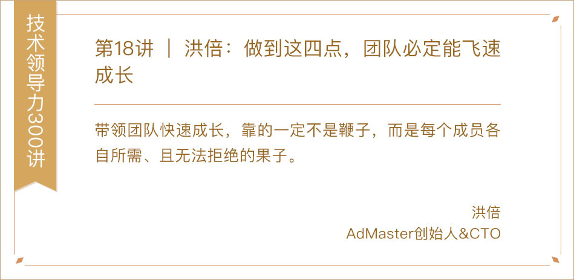](https://time.geekbang.org/column/article/7401)

[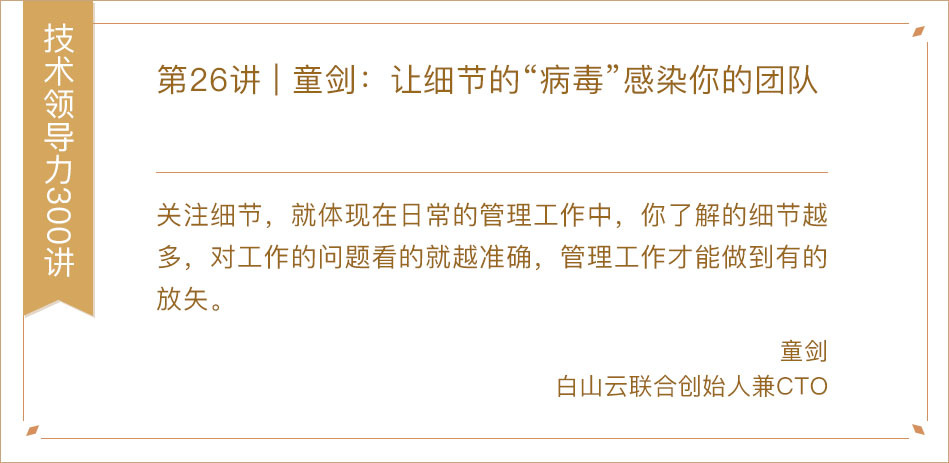](https://time.geekbang.org/column/article/8273)

[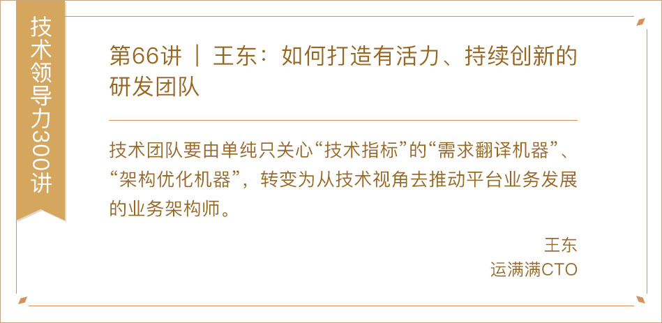](https://time.geekbang.org/column/article/12810)

[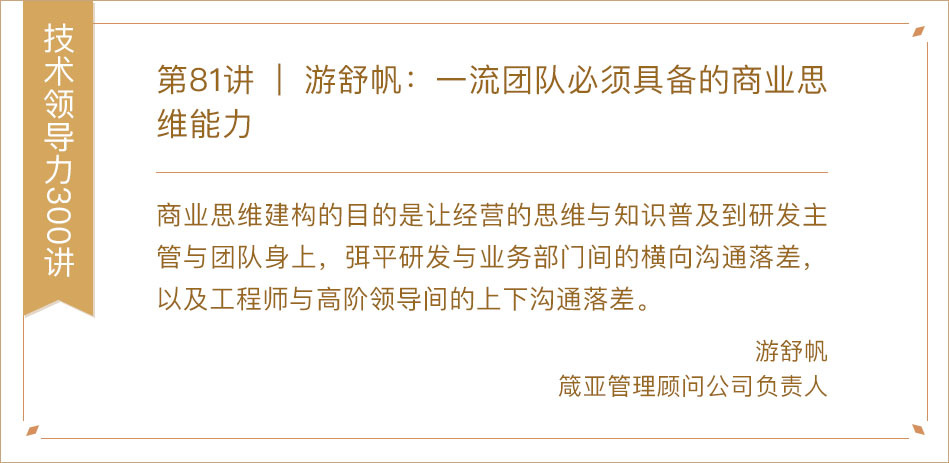](https://time.geekbang.org/column/article/15992)

[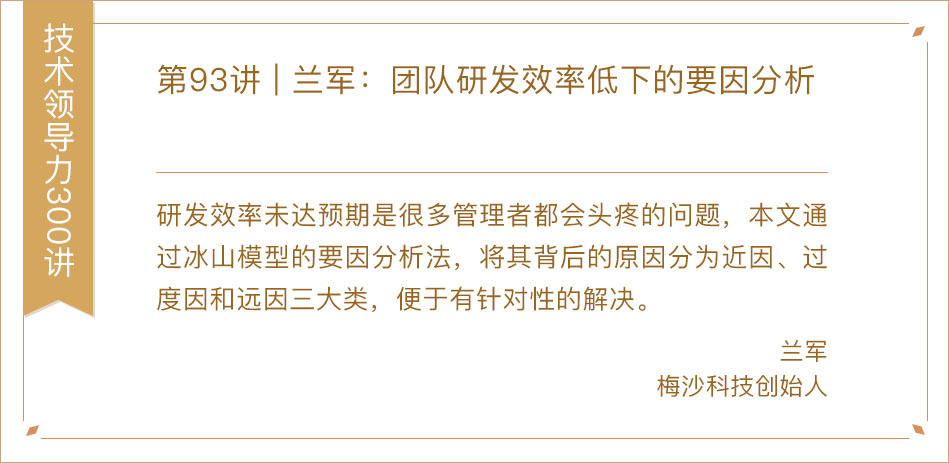](https://time.geekbang.org/column/article/40487)

[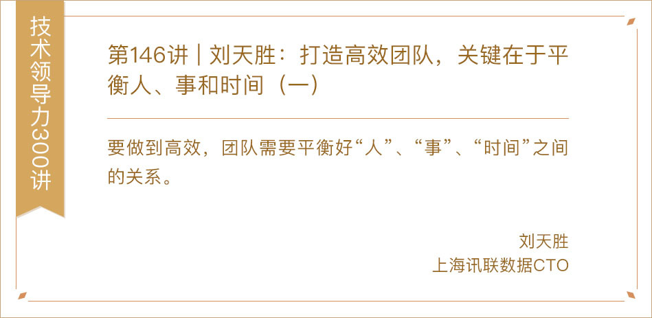](https://time.geekbang.org/column/article/74493)

[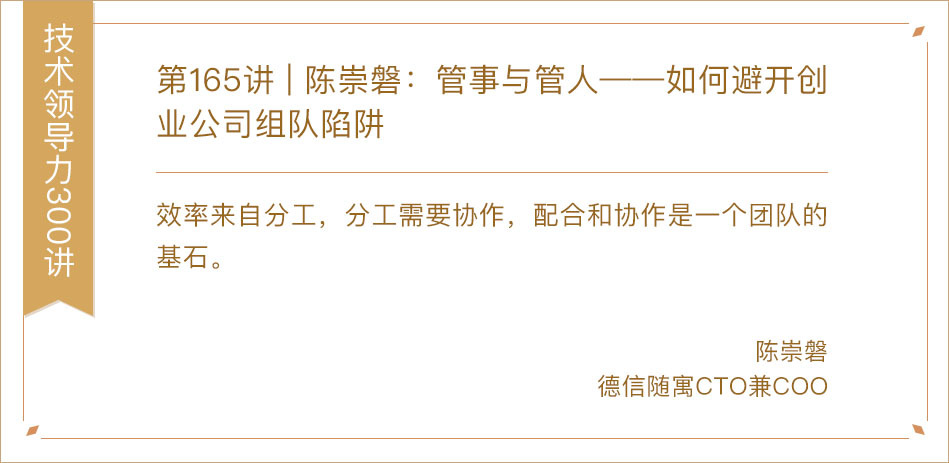](https://time.geekbang.org/column/article/79202)

[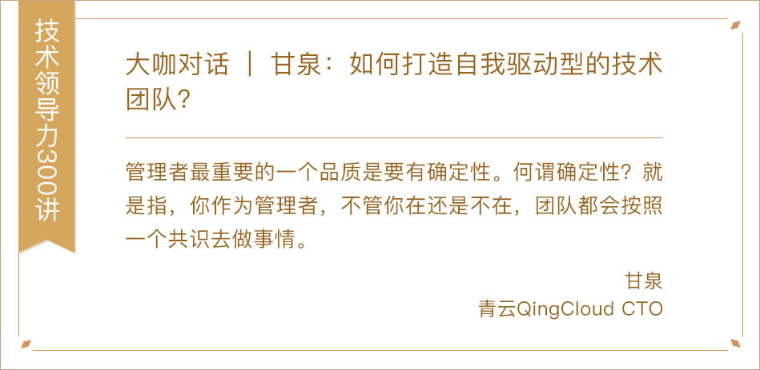](https://time.geekbang.org/column/article/10074)