# 新春特辑5 | 如何做好人才的选育用留？
你好，我是《技术领导力实战笔记》专栏的主编成敏，招到合适的人才并充分发挥他们的价值，是公司发展最重要的事情之一，也是技术领导者最重要的能力之一。今天专辑的主题就是“如何做好人才的选育用留？”，希望你看完之后能有所收获，也欢迎留言选出你最喜欢的文章，或是分享你对于技术团队打造的实践与经验。

[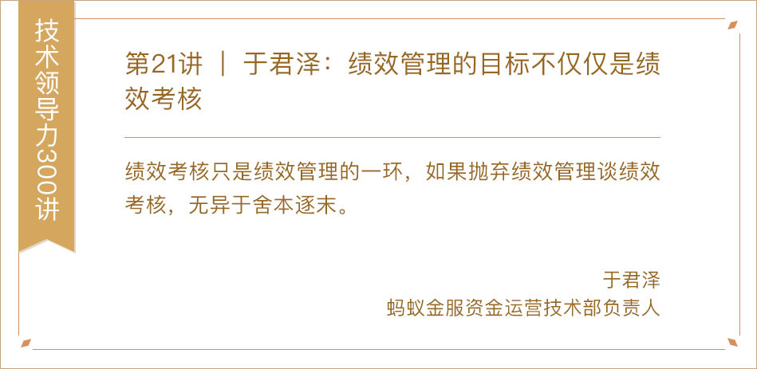](http://time.geekbang.org/column/article/7778)

[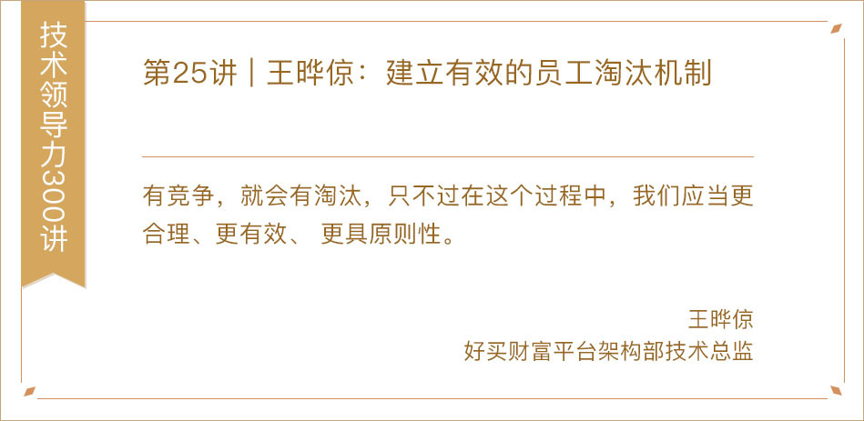](http://time.geekbang.org/column/article/8240)

[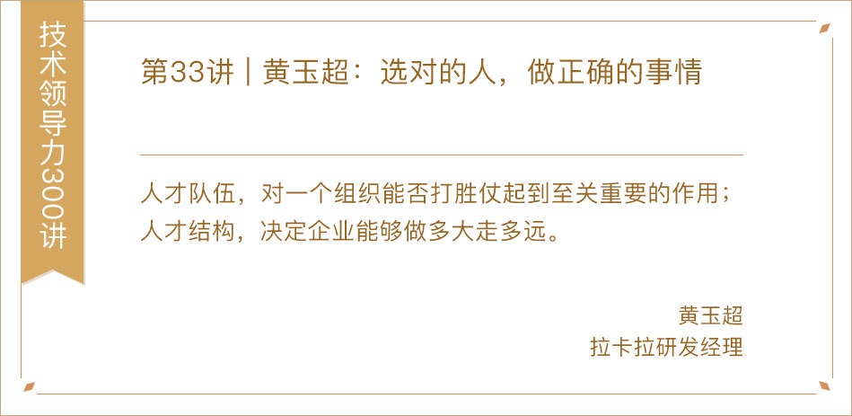](http://time.geekbang.org/column/article/9052)

[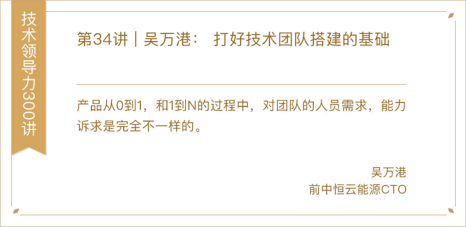](http://time.geekbang.org/column/article/9089)

[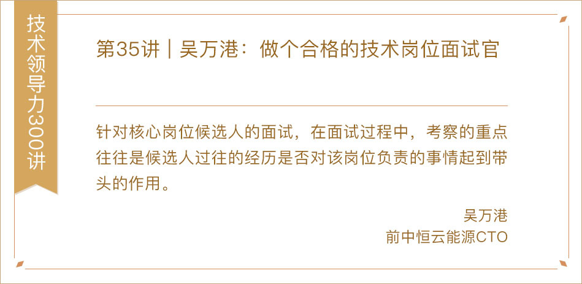](http://time.geekbang.org/column/article/9147)

[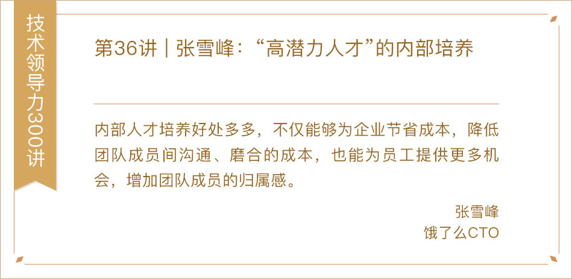](http://time.geekbang.org/column/article/9241)

[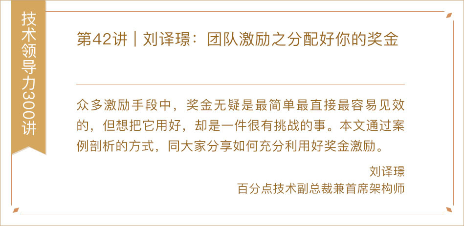](http://time.geekbang.org/column/article/9854)

[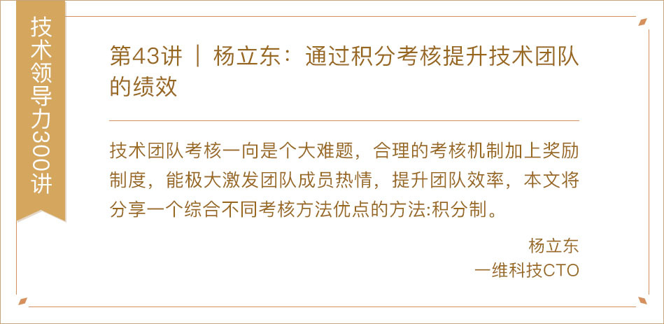](http://time.geekbang.org/column/article/9916)

[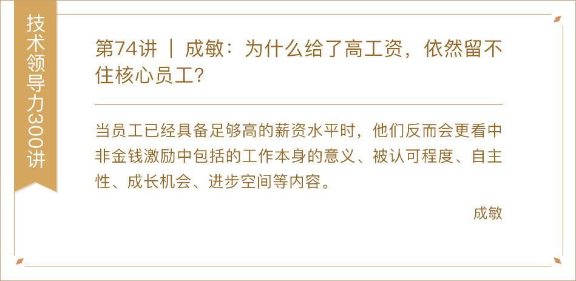](http://time.geekbang.org/column/article/13719)

[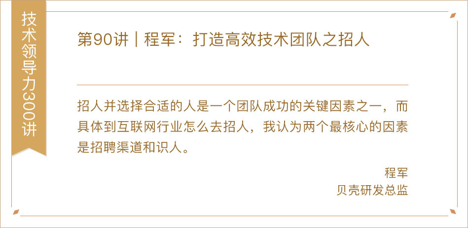](http://time.geekbang.org/column/article/40072)

[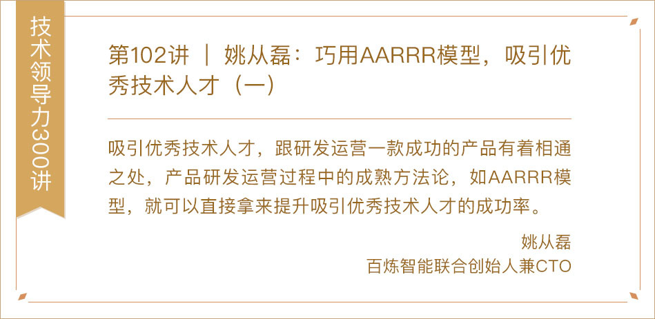](http://time.geekbang.org/column/article/41439)

[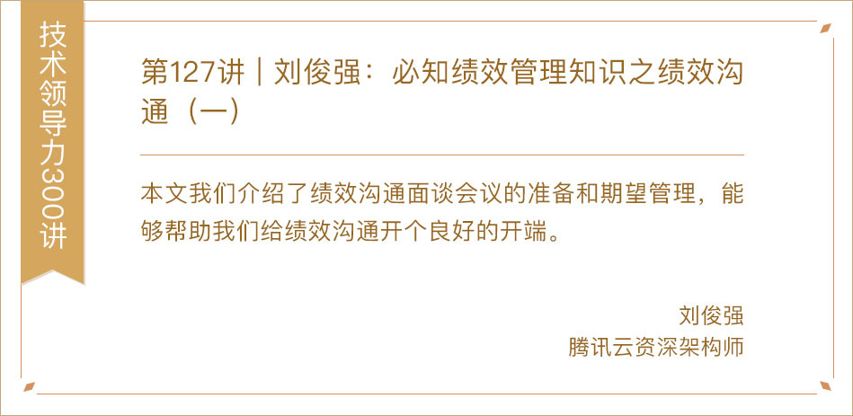](http://time.geekbang.org/column/article/69563)

[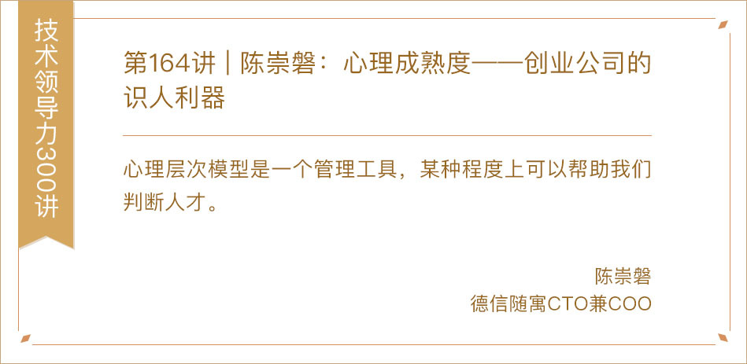](http://time.geekbang.org/column/article/79196)

[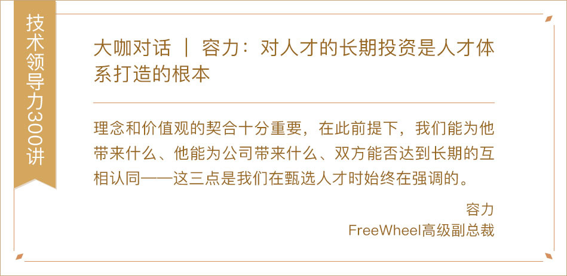](http://time.geekbang.org/column/article/10967)

