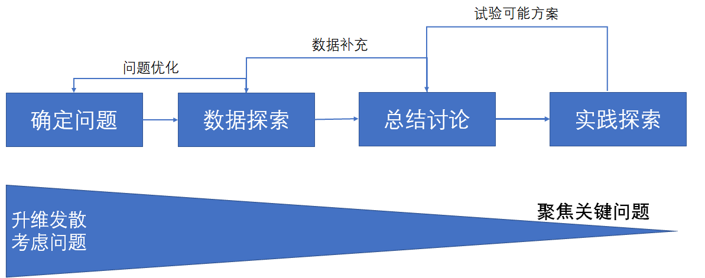
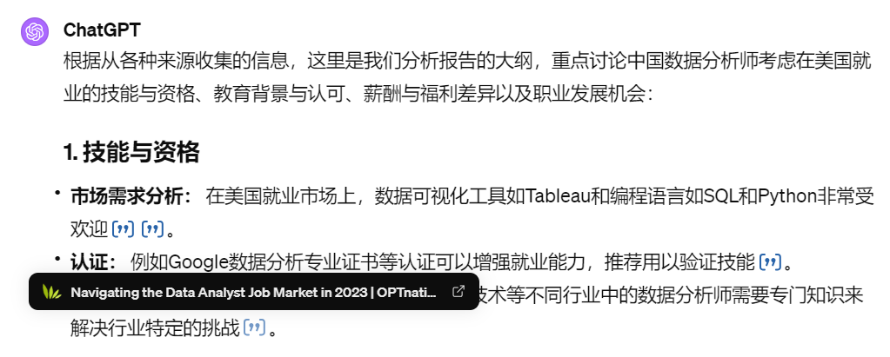
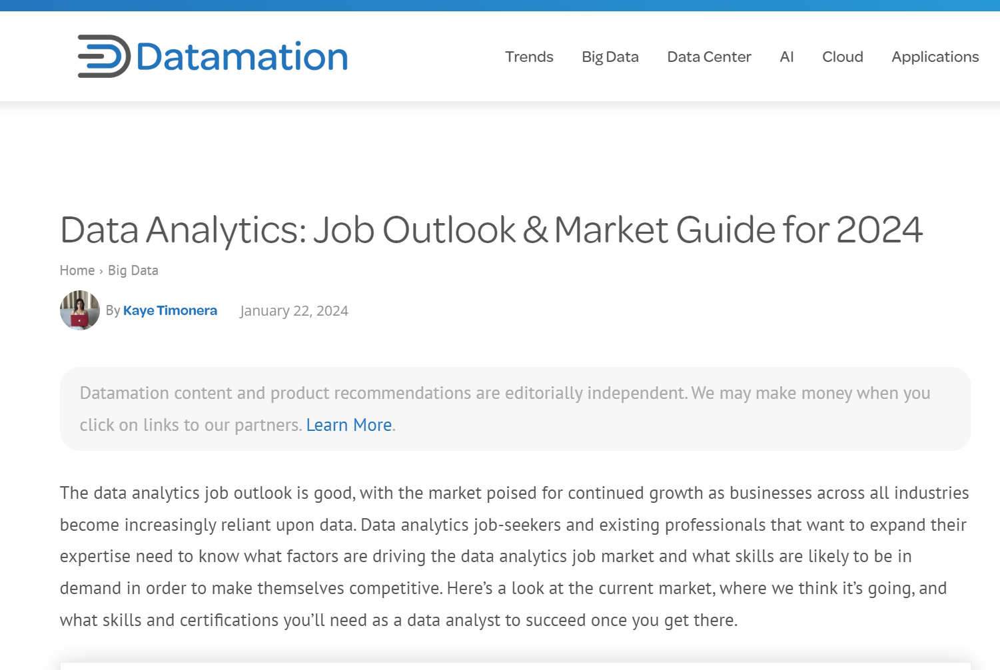
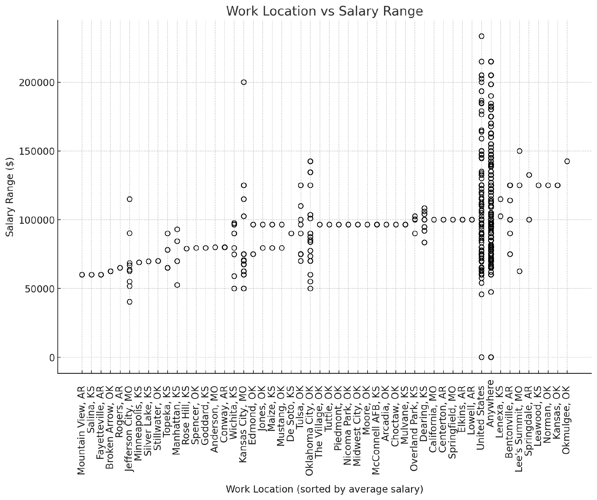

# 加餐 | 如何利用大模型生成专业数据分析报告？
你好，我是郭炜。

在前面两节课中我们学习了如何使用大模型来进行问答和做数据分析，接下来我们用专业的方法做一遍全流程的数据分析报告。

我们可以进行以下步骤来完成一份数据分析报告。

接下来我以数据分析师就业问题为例，来看下经过大模型的辅助，可以做出怎样的分析报告。

### 大模型帮助我们确定问题

首先在确定问题方面，我们完全可以使用ChatGPT帮我们罗列下经常使用的问题，注意使用上节课讲到的三段论方法。

> _**我：**_
>
> _你是一个资深的人力数据分析师，现在针对数据分析师的技能，薪资，人力就业情况准备一份详细的数据分析报告，我是一个资深数据分析师，我们一起协调完成这份数据分析报告，我们先讨论下这份数据分析报告所需要的问题，你列出来10个你综合过去数据分析报告和人力分析报告最重要的问题，我们来进行筛选。_
>
> _**ChatGPT**_
>
> _为了准备一份全面且深入的数据分析报告，尤其是针对数据分析师这一职位，我们需要考虑多个维度的问题。以下是基于过去的数据分析和人力资源分析报告，我认为对于我们的研究最重要的10个问题：_
>
> _技能要求：数据分析师需要哪些关键技能？这些技能的需求是否随时间变化？_
>
> _教育背景：数据分析师通常具备什么样的教育背景？特定的学历或专业领域是否对薪资和职业发展有显著影响？_
>
> _薪资趋势：近年来数据分析师的薪资趋势如何？不同地区、行业或公司规模对薪资有何影响？_
>
> _就业市场：目前数据分析师的就业市场情况如何？哪些行业或领域对数据分析师的需求最高？_
>
> _职业发展路径：数据分析师的职业发展路径通常是怎样的？有哪些晋升途径？_
>
> _工作满意度：数据分析师对自己的工作满意度如何？哪些因素最影响他们的工作满意度？_
>
> _技能提升与培训：数据分析师如何提升自己的技能？企业提供哪些培训和学习机会？_
>
> _远程工作和灵活性：数据分析师在远程工作和工作时间灵活性方面的现状和需求是什么？_
>
> _行业特定的数据分析需求：不同行业对数据分析师的特定技能和知识有哪些独特要求？_
>
> _技术和工具发展：随着技术的发展，数据分析师需要掌握哪些新工具和技术？_
>
> _我们可以根据这些问题的相关性、数据可获得性以及我们的研究目标来进行筛选和优先级排序。这样，我们就能确保报告不仅提供行业的当前快照，还能捕捉到趋势和深层次的见解。_

可以看到，它综合了过去网上数据分析报告的议题供我们挑选，但还不足以满足我们的需求，可以再加入一些其他的诉求。

> **我：**
>
> _如果加上一个背景，我们这份报告是面对中国的数据分析师去美国就业的人员编写的，结合中美工作的差异，以及华人在美国就业的特点和难点，重新书写下我们讨论的问题_
>
> **ChatGPT：**
>
> _针对面向中国数据分析师前往美国就业的背景，我们的报告需要更加细致地考虑中美工作文化差异、就业法律环境、语言和文化适应等方面的问题。结合这些考虑，以下是重新定义的问题列表，旨在为中国数据分析师提供全面的指导和分析：_
>
> _技能和资格认证：中国数据分析师在美国就业需要哪些关键技能和资格认证？美国雇主对于特定技能和认证的偏好有哪些不同？_
>
> _教育背景与认可：美国雇主如何看待中国的教育背景？中国数据分析师需要进行哪些学历评估或额外学习以获得更好的就业机会？_
>
> _薪资和福利差异：中美数据分析师的薪资水平和福利待遇有何差异？地域、行业和经验如何影响薪资？_
>
> _文化和语言适应：中国数据分析师在美国工作中面临哪些文化和语言挑战？有哪些有效的适应策略？_
>
> _签证和工作许可：前往美国工作的中国数据分析师需要哪些类型的签证和工作许可？申请过程中常见的问题和挑战是什么？_
>
> _职业发展和晋升机会：在美国，中国数据分析师的职业发展路径如何？与本土雇员相比，存在哪些差异或障碍？_
>
> _就业市场和行业需求：目前美国对于数据分析师的就业市场如何？哪些行业或领域对中国数据分析师的需求最高？_
>
> _远程工作的机会和挑战：对于中国数据分析师而言，美国的远程工作趋势和机会有何特点？如何克服远程工作中的时间差和沟通挑战？_
>
> _网络和社群资源：中国数据分析师在美国可以利用哪些网络和社群资源来寻找工作机会、解决适应问题或进行职业发展？_
>
> _法律和税务知识：前往美国工作的中国数据分析师需要了解哪些法律和税务知识？如何规划税务和合法就业？_
>
> _这些问题旨在为报告提供一个全面的框架，不仅涵盖技能和薪资等基本信息，还深入到文化适应、法律要求等更为细致的层面。通过回答这些问题，我们的报告将能够为中国数据分析师提供实用的指南和策略，帮助他们在美国的就业之旅中取得成功。_

这样补充根据和讨论后，可以和大模型继续对话，同时为下一步的数据准备做铺垫。

> _**我**_
>
> _这份分析报告，我们主要讨论技能和资格认证、教育背景与认可、薪资和福利差异、职业发展和晋升机会这几点内容，你可以扩展分析下这些话题，我们要分析哪些数据，针对这些数据，我们需要关注哪些要点。_
>
> _**ChatGPT**_
>
> _对中国数据分析师前往美国就业，聚焦于技能和资格认证、教育背景与认可、薪资和福利差异、以及职业发展和晋升机会这四个核心领域，我们将需要收集和分析一系列具体数据。下面是每个话题的扩展分析，包括我们需要关注的数据和要点。_
>
> _技能和资格认证_
>
> _数据需求：_
>
> _市场需求分析： 哪些特定技能和技术在美国市场上最受欢迎？比如Python、R、SQL、机器学习、数据可视化工具等。_
>
> _资格认证需求： 美国雇主对数据分析相关认证的偏好，如Google数据分析证书、SAS认证数据科学家等。_
>
> _技能与薪资关系： 不同技能和认证如何影响薪资水平。_
>
> _关注要点：_
>
> _技能需求的行业分布。_
>
> _认证对于求职成功率和薪资提升的实际影响。_
>
> _更新和提升技能的资源和途径。_
>
> _教育背景与认可_
>
> _数据需求：_
>
> _教育背景对薪资的影响： 不同教育背景（如本科、硕士、博士）在美国就业市场上的薪资差异。_
>
> _国外学历认可度： 美国雇主如何看待中国的教育背景，包括知名大学和专业。_
>
> _关注要点：_
>
> _教育背景与就业领域、职位级别的关系。_
>
> _学历评估和认证的途径和流程。_
>
> _针对中国学历的补充教育或认证建议。_
>
> _薪资和福利差异_
>
> _数据需求：_
>
> _薪资调查数据： 中美数据分析师的平均薪资对比，包括入门级、中级和高级职位。_
>
> _福利情况分析： 包括健康保险、退休金计划、带薪休假等在内的福利待遇差异。_
>
> _关注要点：_
>
> _地理位置（如硅谷、纽约等高成本地区）对薪资的影响。_
>
> _行业差异对薪资和福利的影响。_
>
> _经验和技能如何影响薪资增长。_
>
> _职业发展和晋升机会_
>
> _数据需求：_
>
> _职业路径案例研究： 成功的数据分析师职业发展路径案例，特别是中国背景的个案。_
>
> _晋升途径分析： 在美国，数据分析师的常见晋升途径和所需条件。_
>
> _关注要点：_
>
> _职业规划对于长期职业发展的影响。_
>
> _网络建设和持续教育对职业晋升的重要性。_
>
> _面对职业发展的挑战，如文化差异、语言障碍等，的应对策略。_
>
> _通过收集和分析这些数据，我们的报告将能够为中国数据分析师提供深入的见解和具体的建议，帮助他们在美国市场上获得成功。这包括如何提升技能、如何让自己的教育背景和资格得到认可，理解薪资和福利的现状以及如何规划自己的职业生涯。_
>
> _数据分析和报告撰写的方法论_
>
> _在进行上述数据收集和分析时，我们需要采用一系列方法论来确保数据的准确性和报告的实用性：_
>
> _二手数据分析： 利用已有的行业报告、薪资调查、教育机构发布的数据以及专业论坛和网络社区的讨论，收集关于技能需求、教育背景的认可度、薪资水平和职业发展路径的信息。_
>
> _案例研究： 深入分析成功的个案，尤其是那些具有中国背景的数据分析师在美国的职业发展历程，包括他们如何克服挑战、提升技能和获得晋升的。_
>
> _调查和访谈： 对在美国工作的中国数据分析师进行调查和访谈，收集一手数据。这些数据可以帮助我们理解实际遇到的挑战、对薪资和福利的期望以及职业发展的观点。_
>
> _比较分析： 对中美数据分析师的薪资、福利和职业发展机会进行比较分析，揭示主要的差异和趋势。_
>
> _趋势分析： 关注行业趋势和技术发展，预测它们对数据分析职位的影响，特别是对于技能需求和职业发展机会的长期趋势。_

#### 大模型辅助数据探索

现在大模型已经开始和我们进一步讨论后续的内容了，那我们就进行第二步的数据探索和分析，可以进一步让大模型提供一些数据来源和下载地址。

> _**我：**_
>
> _关于这些内容可以在网上哪些地方下载到明细数据的材料请给我下载地址_
>
> _**ChatGPT：**_
>
> _关于数据分析师的市场分析、薪资、技能需求等方面的详细数据和材料，通常可以在以下类型的网站和资源中找到：_
>
> _行业分析报告：提供深入的市场趋势、技能需求、薪资水平等信息。这些报告可能来自咨询公司或市场研究机构，如Gartner、Forrester、IDC等。_
>
> _职业统计网站：如美国劳工统计局（Bureau of Labor Statistics, BLS）的网站提供各种职业的就业统计、增长预测和薪资数据。_
>
> _在线课程和认证机构：如Coursera、edX等提供的数据分析相关课程和专业证书，通常会包括行业趋势和技能需求的概览。_
>
> _职业网络和求职网站：LinkedIn、Indeed、Glassdoor等网站不仅提供职位空缺信息，还有薪资范围、公司评价和行业分析报告。_
>
> _专业社群和论坛：如Kaggle、GitHub等，其中的讨论和项目可以提供关于数据分析技能和工具的实际应用信息。_
>
> _直接下载这些材料的地址因资源而异，并且很多深度分析报告可能需要通过购买才能获得。不过，公开资源如劳工统计局网站和一些在线课程平台提供的资料可以直接访问。对于更专业的报告，可能需要通过相关的行业报告提供商或学术机构获取。建议直接访问这些网站和平台，搜索相关的关键词（如“数据分析师市场分析报告”、“数据分析技能需求”等）来找到最新和最相关的资料。_

如果你有更进一步的需要，可以根据它的提示寻找相关数据，进行数据探查与探索。

#### 大模型辅助总结讨论

最后是总结讨论的部分，你可以像下面这样继续对话。

> _**我：**_
>
> _网络上有其它类似的数据分析报告么？搜索下类似的分析报告，然后再重新定一下我们的分析报告提纲_
>
> _**ChatGPT：**_
>
> _根据从各种来源收集的信息，这里是我们分析报告的大纲，重点讨论中国数据分析师考虑在美国就业的技能与资格、教育背景与认可、薪酬与福利差异以及职业发展机会：_
>
> _1\. 技能与资格_
>
> _市场需求分析：在美国就业市场上，数据可视化工具如Tableau和编程语言如SQL和Python非常受欢迎​​​​。_
>
> _认证：例如Google数据分析专业证书等认证可以增强就业能力，推荐用以验证技能​​。_
>
> _行业特定应用：在健康保健、电子商务、金融和技术等不同行业中的数据分析师需要专门知识来解决行业特定的挑战​​。_
>
> _2\. 教育背景与认可_
>
> _教育背景与经验：虽然在计算机科学、统计学或数学等领域的学位很有价值，但通过实习或志愿工作获得的实践经验也可以显著提升求职前景​​。非传统背景的重要性日益被认识到，为具有多样化教育历史的人提供了更广泛的机会​​。_
>
> _3\. 薪酬与福利差异_
>
> _薪酬差异：在美国，数据分析师的薪酬根据资历水平而有很大差异，从入门级职位开始，年薪约为54,127美元，到高级数据分析师角色平均为103,071美元​​。_
>
> _地理位置的影响：位置显著影响薪资水平，纽约、芝加哥和旧金山等城市因生活成本和科技产业集中而提供更高的工资​​。_
>
> _4\. 职业发展机会_
>
> _入门级机会：对入门级数据分析师的需求显著，许多公司愿意投资于培训和发展年轻人才。实习、黑客松和志愿工作是新人获得经验的绝佳方式​​。_
>
> _持续学习和网络建设：保持最新的工具和行业趋势至关重要。通过专业活动和在线社区的网络建设可以打开新的就业机会和职业发展途径​​。_
>
> _结论_
>
> _美国的数据分析领域为具备技能的专业人士提供了广阔的机会，包括来自中国的数据分析师。通过发展需求高的技能、获得实践经验以及利用网络建设和持续学习，中国数据分析师可以有效地导航竞争激烈的就业市场。随着数据分析领域的迅速增长和先进技术如机器学习和人工智能的整合，数据分析师需要适应和在他们的角色中表现出色​​。_
>
> _这个框架为我们的分析报告提供了一个全面的概述，旨在指导寻求在美国市场上机会的中国数据分析师。通过对这些领域的详细研究和分析，报告将提供有价值的见解和建议。_

你可以参考提纲来调整结构，但这段内容和过去对话不同，因为我们使用了提示词“ _**搜索下类似的分析报告**_”，所以，他给我们的内容都会附带着引用的网页，通过 **”** 符号来表示。

点击这个蓝色的符号就会进行链接跳转，这样你可以获取到更多的信息参考。

此外，你还可以把前面数据探查的结果来根据最终汇报的形式进行修改。例如如果你想把前面散点图的格式进行变更，你可以像下面这样进行对话。

> _**我：**_
>
> _请把工作地点和薪酬范围的散点图 中的点变为黑色边框，空心小圆圈而不是叉子_
>
> _**ChatGPT：**_
>
> 

#### 小结

到这里，大模型辅助做数据分析的内容告一段落了，我们一同见证了大模型的惊人进步与潜力。从收集庞大数据集到解析复杂模式，再到生成精确而深刻的报告，大模型在处理和分析数据方面展现出了前所未有的能力。然而，随着我们进入这个由数据驱动的新时代，也必须谨慎地考虑我们与这些技术共存的未来。

首先，我们需要认识到，虽然大模型的能力令人震惊，但它们并非万能。它们的输出质量依赖于输入数据的质量与多样性。因此数据的准确性、完整性以及代表性是至关重要的。这不仅要求我们在数据收集与处理过程中维持高标准，同时也要不断评估和优化模型的性能。

其次，大模型推演的内容并不是真实准确的。作为数据分析师，你一定要利用自己的专业知识和经验判断大模型给出的结果是不是符合实际预期，大模型给出的逻辑是否存在前面内容存在的“小数谬误”、“幸存者偏差”等隐藏错误，更要注意大模型引用的数据是否真是可靠，避免大模型的“幻觉”给我们最终数据结论带来偏差。

最后，随着大模型在不同场景的广泛应用，我们应该意识到大模型在多个领域都会超过一些初学者的认知，而我们需要用“魔法词”Prompt正确的引导大模型给出专业、正确、方便的内容。

大模型辅助分析的时代已经到来，欢迎你和我一起加入这个大模型驱动的世界！

#### 思考题

尝试下哪些数据分析图大模型可以给你画出来，哪些大模型不能画出来？为什么？