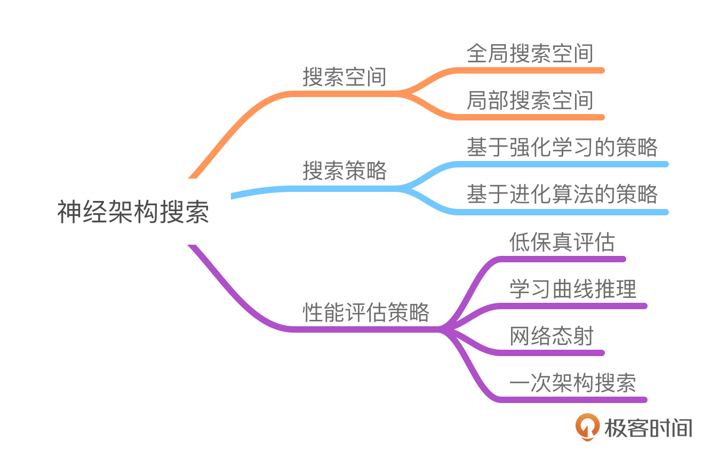

# AutoML与神经架构搜索：如何让机器学习“自主优化”？
你好，我是王天一。

利用机器学习模型的训练和部署可以实现信息的自动化和智能化处理，那么机器学习模型的训练本身能不能实现自动化和智能化呢？无免费午餐定理指出， **不存在某种适用于所有任务的万能机器学习模型**，要在特定的场景下构建出适合的模型，就必须具体问题具体分析，而这意味着研究人员需要深度参与到机器学习的每个阶段，进而导致对领域经验的高度依赖。

为改善这种情况，研究者提出了 **自动机器学习**（Automated Machine Learning）的解决思路。今天，我们就一起来聊一聊。

## 什么是自动机器学习？

自动机器学习旨在降低学习过程中的人工干预程度，减少或替代费时费力的人工研究过程，力图通过对有效的机器学习模型进行集成化处理、设计合理的多指标性能评估手段、建立模型选择与超参数调优的自动化流程等方法，实现无需机器学习理论专门知识的、“傻瓜式”的机器学习模型搭建流程。这无疑将大大降低机器学习的应用门槛，提升机器学习的易用性。

用机器学习解决任务的完整流程一般包括 **业务理解**、 **数据理解**、 **数据准备**、 **模型建立**、 **模型评价**、 **模型部署** 等几个步骤，其中数据准备、模型建立和模型评价涉及所选择模型的训练和优化，因而需要反复迭代以取得最佳性能，这也是自动机器学习大展身手的地方。

由于自动机器学习希望找到针对当前任务的最优特征和模型，因此在缺乏先验知识的前提下， **解决问题的首要策略就是地毯式搜索**。

> 由于业务理解和数据理解不涉及自动机器学习，所以这里就不深入了，我们直接从数据准备阶段讲起。

在数据准备步骤中，自动机器学习搜索的对象包括：

- **特征整合和构建的方式**：如何通过已有特征生成新的特征。

- **特征的选择策略**：确定能够有效解决问题的那些特征。

- **特征处理的超参数**：例如主成分分析中的主成分数量。

在模型建立步骤中，自动机器学习会选择一个或多个模型（通常包括树模型、线性模型、核函数模型和神经网络等）来进行训练和预测，通过验证和测试流程来确定模型配置并检验模型泛化性，以期获得最佳模型。在搜索中，待选择的模型及其超参数共同构成了层次化的搜索空间。在实际应用中，可以先针对一类模型确定其最优超参数，再对每类模型的最优解进行比较。

在模型评价步骤中，自动机器学习不再关注配置的搜索空间，而是直接对学习到的模型参数进行评估，以判断模型的性能好坏。

不难看出，自动机器学习的数据准备和模型建立本质上都是搜索任务，数据集中所包含的更多的特征数量、更复杂的特征预处理方式以及更多的模型超参数数量都会扩大搜索空间，消耗更多的计算资源与时间成本，因而如何提高搜索效率自然也是自动机器学习研究的题中之义。出于效率的考虑， **自动机器学习采用随机搜索方法和基于样本的贝叶斯优化方法**。随机搜索采用在搜索空间中随机采样的方式进行搜索，优点在于节约时间；基于样本优化的搜索方法是根据先前的评估样本自适应地生成新的配置，而贝叶斯优化是典型的无导数优化方法。

## **神经架构搜索**

随着深度学习不断取得超越传统机器学习模型的性能表现，将自动机器学习融入深度神经网络以实现神经网络的自动化设计，正吸引越来越多的关注。这方面的典型成果是 **神经架构搜索**（Neural Architecture Search），其目标是在特定空间内以自动搜索的方式找到在特定任务上表现最佳的网络结构。从原理上看，神经架构搜索包括三个不可或缺的要素，分别是 **搜索空间**、 **搜索策略** 和 **性能评估策略**。

### 搜索空间

搜索空间定义了构建神经网络的基本架构单元, 针对某个特定的任务，可以选择已经得到验证的、适合此类任务的典型网络架构作为先验知识，通过限制基本架构单元的类型来有效地降低搜索空间的大小。根据基本架构类型的不同，搜索空间可以分为两类： **一类是直接搜索整个神经网络架构的全局搜索空间，另一类是通过重复某些特定结构来构建神经网络架构的局部搜索空间**。

**链式搜索空间是最简单的全局搜索空间形式**，它以逐层递进的方式构造从输入到输出的神经网络。以卷积神经网络为例，链式架构搜索空间的参数包括神经网络的隐藏层数量、每一层所执行的操作、神经网络的超参数等。

神经网络的每一层可以选择卷积或池化，其中卷积又可以选择普通卷积、深度可分离卷积、空洞卷积、逐点卷积或其他卷积类型，池化也可以选择平均池化、最大池化、重叠池化等方式。神经网络的超参数则包括卷积核的大小及数量、卷积运算的步长、全连接层的数量等参数。将以上的所有搜索变量组合起来，考虑某些参数之间的关联关系并去掉一些明显错误的架构（例如输入数据不能直接进入池化层），就可以构造出完整的搜索空间。

链式搜索空间逐层递进的方式决定了它只有在前一层次完全确定的情况下，才会去处理下一层次，因而可以看作多分支搜索空间的一个子集。 **除了链式连接外，多分支搜索空间还定义了残差连接和密集连接这两种分支连接方式**（两者的典型应用分别是ResNet和DenseNet） ，更多样的连接方式丰富了网络结构的类型，有助于提升神经网络的学习能力和解决任务的性能。

全局搜索空间的好处是简单直观，但由于搜索空间和参数规模都比较大，因而会消耗大量的计算资源。在实际应用中，深度神经网络通常由多组结构类似的功能模块组成（如卷积神经网络通常包含多个“卷积-池化”结构），这也启发、催生了 **基于块的搜索空间这一局部搜索空间方法**。这里的“块”可以看作是特定的、可重用的功能单元，可能是一个或多个隐藏层的组合。

局部搜索空间方法会基于面向特定问题的先验知识设计具有不同特定架构的块，再针对具有不同结构或不同参数的块，而不是单个的隐藏层进行架构的搜索，不仅能够提升搜索效率，所创建的架构也更容易推广到其他任务或数据集上。

### **搜索策略**

搜索空间构建完成后，搜索策略将决定如何在搜索空间内搜索针对特定任务的基本架构单元，以及神经网络内部的连接方式。 **训练搜索策略不仅要确定神经网络架构的拓扑结构，还需要预测其他相关的信息，如优化器选择、正则约束和超参数等。** 目前， **主要的搜索策略包括强化学习和进化算法**。

**强化学习通过智能体与环境之间的交互来习得行动策略**，其目标是获得最大化的未来奖励，大名鼎鼎的AlphaGo就使用了深度强化学习。在神经架构搜索中， **智能体的动作** 可以被定义为选择不同类型的层添加到神经网络架构中，同时决定是否终止构建新的神经网络架构； **状态** 是已经构建的神经网络架构，不同时刻产生的结果被分别训练以评估其解决问题的性能； **环境** 则是性能评价策略，用于评估神经网络架构的性能并产生相应的奖励；智能体接收到奖励后，根据当前的评价结果来选择下一个搜索。反复迭代以上过程，就可以得到输出模型。

进化算法属于启发式算法的范畴，通过模拟自然界中的进化过程来实现优化问题的求解。在神经架构搜索的场景中，种群由一组基本的网络架构单元构成，在种群内选择一个基本架构单元作为父节点用于变异和重组，就能够产生新的网络架构。对新生成的架构评估其适应度并反复迭代变异和重组操作，可以筛选出适应性最强，即最优的网络架构。

### **性能评估策略**

通过学习到的搜索策略找到结果后，需要不断对其性能做出评估，这就需要设计高效准确的性能评估策略。评估的指标是搜索出的网络结构在测试集上的精度，但这需要先利用训练集对网络进行训练——这无疑会消耗大量的时间与计算资源。

为避免这种消耗，研究者提出了多种评估策略：

- **低保真评估** 通过减少训练次数、缩小训练集规模、降低模型参数量等方法来近似神经网络的真实性能，这种方法虽难免引入绝对的误差，但对不同网络之间性能的相对优劣可以做出比较准确的判断。

- **学习曲线推理** 则是根据训练过程中拟合出的学习曲线来推断神经网络架构的性能，训练一段时间后就能大概判断出网络架构性能的走势，从而可以提前终止性能差的搜索。

- **网络态射方法** 是在保持功能不变的基础上将网络进行变形，这样就能从已有的神经网络架构初始化新的神经网络架构，并通过重用已有的训练权重来减少训练时间。

- **一次架构搜索** 与网络态射类似，通过单次训练确定网络架构中与每个节点的所有可能的候选操作相对应的参数，再针对每个节点选择最优的操作。

## 总结

今天我们详细讲解了自动化机器学习和神经架构搜索。

自动机器学习通过自动化模型构建流程，如特征工程、超参数调优、模型选择与评估，降低学习过程中的人工干预程度，大大降低机器学习的应用门槛。

神经架构搜索是神经网络自动化设计的典型成果，基于全局和局部搜索空间定义网络结构，结合强化学习、进化算法等策略优化架构拓扑与超参数，并通过低保真评估、网络态射等技术降低性能评估成本。

需要说明的是，自动机器学习的目的不在于完全取代所有的人类专家工作，而是做出了更加优化的分工。通过为模型相关步骤生成自动化处理流程，自动机器学习能够使研究人员专注于业务理解和数据准备，从而提升整体效率。

如果你有新的想法，欢迎在留言区和我一起分享和交流，我们下一节见。