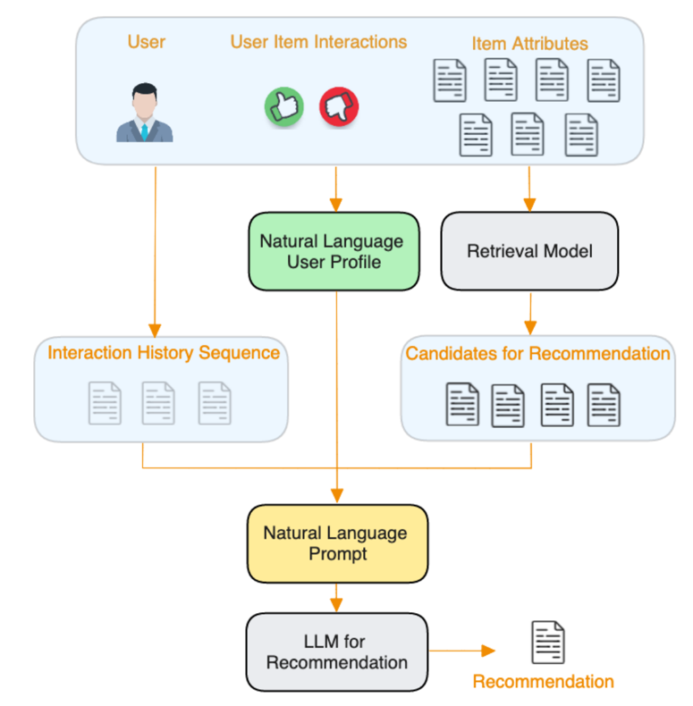
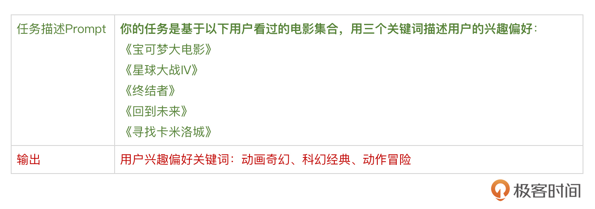
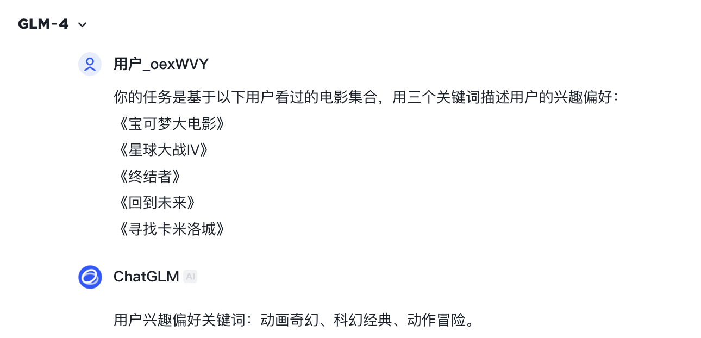
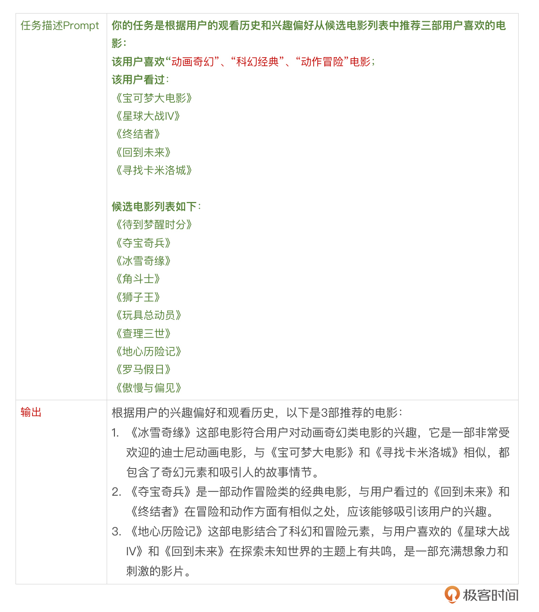
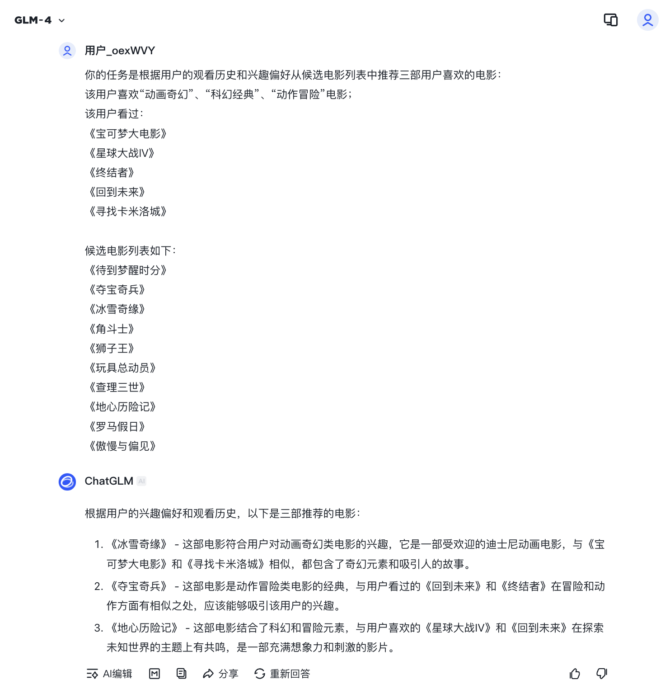
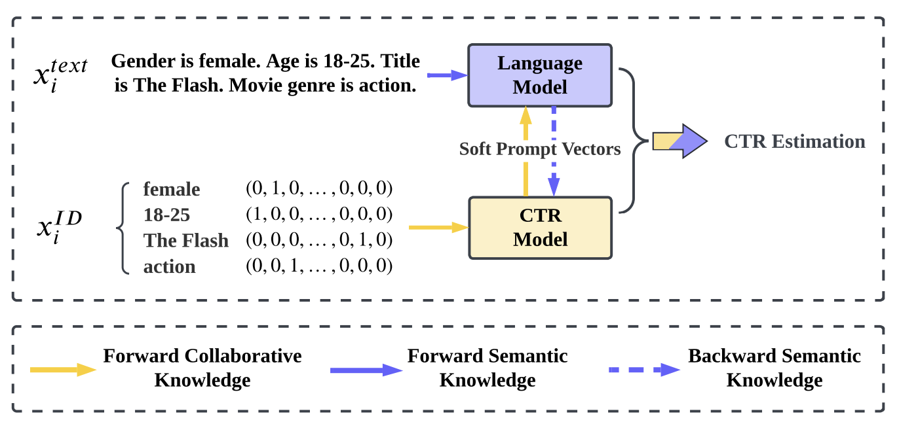
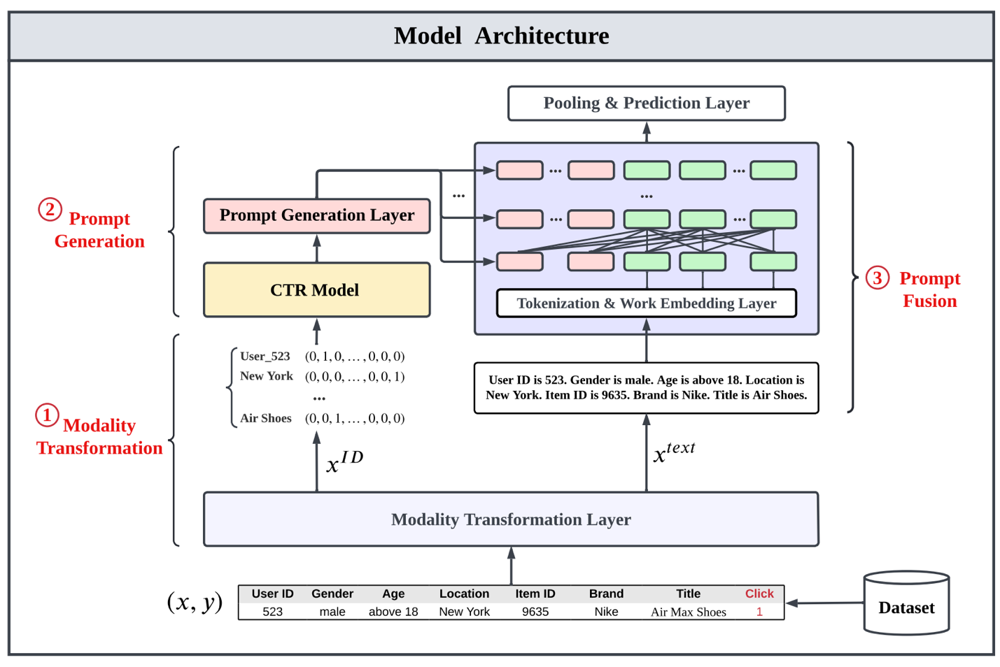

# 从PALR到ClickPrompt：大模型推荐系统的应用与挑战
你好，我是王喆。

上一节，我们讲了大模型基于对这个世界的理解能力，为推荐系统带来更多增量知识。事实上，大模型不仅拥有渊博的知识储备，其分析推理能力也同样强大。对于大模型来说，仅仅用于知识辅助似乎有点“屈才”，成为推荐模型本身，完成端到端的推荐才是大模型在推荐系统大展身手的“终极目标”。

这一节，我们就介绍几个大模型直接用作推荐模型的方案。

## 基于Prompt设计的大模型推荐系统

大模型用于推荐系统的优缺点是明显的，优点是它掌握海量开放世界知识，具备解决通用问题的能力，缺点是它不知道推荐系统内部的用户行为、用户属性和物品属性等私域信息。如果使用大模型作为推荐模型，如何弥补这个缺点呢？

Amazon的研究者给出的大模型推荐系统方案为PALR（Personalization Aware LLMs for Recommendation，个性化感知大语言推荐模型）， **它通过构造自然语言的Prompt，把所有用户的行为历史、用户画像、候选物品列表的信息都告诉大模型，让大模型根据这些输入信息进行候选物品的排序并得出最终的推荐列表**。

如下图所示，PALR模型的输入分为3大部分：

1. 用户行为序列：它通过自然语言的形式列出了用户曾经交互过的物品序列。

2. 用户画像：根据用户的历史行为、用户属性，由大模型生成用户画像描述。

3. 候选物品列表：待排序的候选物品列表。

可以说，这3大部分的输入基本包含了一个推荐任务所需的所有信息，只不过相比传统推荐系统以结构化数据为输入的形式，大模型推荐系统使用自然语言构造Prompt作为模型输入。值得注意的是，PALR的用户画像输入也要通过大模型预先生成，也就是整个推荐过程其实需要两次大模型的参与。

下面，我们就基于电影推荐的场景，使用智谱的ChatGLM作为大模型演示PALR的推荐过程。

如下是任务截图：

电影推荐过程：

如下是任务截图：

根据个人经验，我们可以初步判断大模型的推荐结果是比较合理的。因为三部影片分别是“动画奇幻”“科幻经典”“动作冒险”风格的，与用户观看历史中的影片相关性很强，大模型甚至还给出了推荐理由，也是非常合理。

为了将PALR工程化，我们还需要结合SparrowRecsys做几件事情。

1. 从MovieLens数据集中整理看过的电影，通过大模型API调用的方式生成每个用户的用户画像。

2. 利用SparrowRecsys的召回层准备电影的候选集，再结合用户画像、用户观影历史生成推荐任务，以大模型API调用的方式返回推荐结果。

3. 将大模型的推荐结果整合到SparrowRecsys中，显示推荐列表。

以上3个任务都可以基于SparrowRecsys的代码和上一节介绍的智谱API完成，感兴趣的同学可以尝试实现。

## 工业界的大模型推荐系统解决方案：ClickPrompt

细心的同学肯定有这样的感觉， **PALR这个推荐系统比较像一个“玩具”，看上去不那么适合实际工业界的推荐任务**，比如在用户的行为历史特别长、候选集特别多的时候，你很难想象可以把它们完全转换成自然语言的Prompt。即使能够转换，大模型的推荐效率和开销也是个问题。另外，它完全忽略了传统推荐系统中极端看重的用户间行为的共现关系，只是利用内容进行推荐，毫无疑问浪费了推荐系统中极为宝贵的信息。

如果要把大模型真正应用到工业级的推荐系统中，肯定要解决这两个至关重要的问题。

下面，我就介绍一个融合了传统CTR模型和大语言模型的推荐模型ClickPrompt。它是华为诺亚方舟实验室和上海交通大学2024年联合提出的推荐模型方案。 **它的基本思路是融合传统深度学习推荐模型和大语言模型的优势，让模型同时具有用户行为特征的学习能力和大语言模型的强大知识储备，并且更适用于工业级的推荐系统。**

下图展示了ClickPrompt的基本思路。对于一个训练样本来说，它可以有两种表示，$x\_i^{t e x t}$是适用于大模型的自然语言的文本表示方法，$x\_i^{I D}$是适用于CTR模型的One-hot表示方法。

我们通过这两种特征表示分别训练大模型和CTR模型，让它们互通有无，共同形成全面的CTR预估结构。而这个“互通有无”的方式，就通过双方同享中间层的Embedding来实现。从上图的黄色和蓝色箭头提示中，你可以发现这一方案的优势，就是CTR模型善于学习用户行为间的共现知识，语言模型善于学习语义知识，二者互通有无共同完成CTR预估，显然比二者的独立模型更具优势。

彻底理解这一方案的关键在于 **搞懂CTR模型和大语言模型在模型结构上是如何互通有无的**。下图给出了ClickPrompt的模型结构，我们看一看。

图中左侧是CTR模型，右侧是大语言模型，CTR模型的输出与大语言模型的输出通过一个MLP的Prompt融合层融合在一起，生成最终的CTR预估结果。

具体来说，模型的预估过程自下而上经历了关键3个步骤：

1. 多模态转换层：该层将原始的训练样本特征分别转换成One-hot特征和文本特征，分别输入CTR模型和大语言模型。

2. CTR模型Prompt生成层：理论上来说CTR模型的结构可以是任意的，在CTR模型的最后一层生成的logits，通过Prompt生成层链接到Prompt融合层中。事实上，Prompt生成层也是一个MLP，它根据Prompt融合层的层数和Embedding的维度将CTR模型的输出logits变换成Prompt融合层所需的各层Embedding。

3. Prompt融合层：Prompt融合层接收了CTR模型的输出Prompt，也接收了大语言模型对文本输入特征转换成的Embedding。这里预训练好的大语言模型就位于图中的“分词与词向量层”中。生成好的词向量在Prompt融合层的各层中与CTR输出Prompt Embedding进行融合，最终由“池化和预估层”生成CTR预估结果。

总的来说， **ClickPrompt模型的设计非常巧妙，它通过将CTR模型的输出转化为Prompt Embedding，与大模型融合起来，同时也将传统CTR模型学习ID特征的能力与大模型学习文本特征的能力融合起来，做到了取长补短**。但也可以想见，ClickPrompt模型的训练和线上预估过程比较复杂，需要将大模型预训练、CTR模型训练、大模型微调等多种训练方式融合起来，这是ClickPrompt面临的工程挑战。

## 大模型在推荐系统中应用的挑战

**当我们惊叹于大模型带给推荐系统的诸多创新之时，也要理性看待大模型带来的真正收益。**

客观上讲，时至今日（2025年3月），大模型直接带给推荐系统的收益增量并没有达到让人放弃传统推荐模型的地步。这一方面是由于传统推荐系统已经充分利用了最有价值的用户行为数据，另一方面，传统推荐模型也可以融合知识图谱、内容型特征等知识性的信息，部分抵消了大模型的收益增量。除此之外，大模型与推荐系统的结合仍处于早期阶段，收益还远没有挖掘完，所以种种原因使得目前传统深度学习推荐系统仍然是推荐系统的主流。

从工程的角度来说，大模型的融入大幅增加了推荐系统的复杂度和运行成本。大模型本身的训练和推理要耗费的GPU资源并不是一般的公司能够承受得起的，购买第三方大模型API的方式又往往丧失了模型训练的灵活性。这些工程挑战也成为了推荐系统应用大模型的阻碍。

从业务的角度来说，推荐系统要应付的场景是多样的，其优化目标也是各不相同的。 **大模型能够成为推荐模型的有效补充，但想完全替代传统模型是不现实的。** 举例来说，在广告推荐系统中，既有针对点击率优化的产品，也有针对转化率优化的产品，甚至有针对7天留存、21天复购等等非常具体的优化目标。这就需要公司训练多种不同的推荐“小模型”来满足不同的业务场景，显然，大模型不具备这样的灵活性。因此，灵活地结合大模型和传统推荐模型才是更加实用的选择。

## 总结

这一节，我们探讨了大模型在推荐系统中的应用。

一是基于自然语言Prompt的端到端推荐（如Amazon的PALR），通过整合用户行为、画像以及候选物品信息生成推荐，但它忽略了传统推荐系统中极端看重的用户间行为的共现关系，只是利用内容进行推荐，浪费了推荐系统中的本身极具价值的行为信息。

二是融合了传统CTR模型与大模型的混合架构ClickPrompt，它通过共享Embedding层让大模型和CTR模型“互通有无”，让模型能够兼具CTR模型和大模型的优势。但ClickPrompt模型的训练和线上预估过程比较复杂，需要团队具备较强的工程能力才能落地实现。

总之，大模型虽然凭借其强大的内容理解能力为推荐系统带来了诸多的突破，但在运行成本、灵活性等方面依然受限，需要根据应用场景，结合传统推荐模型才能充分发挥两者的优势，使其更好落地。