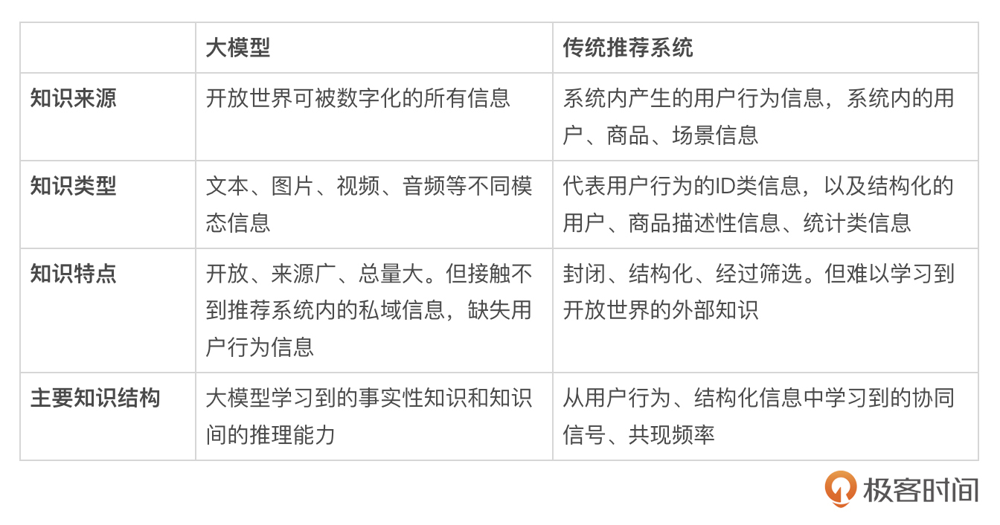
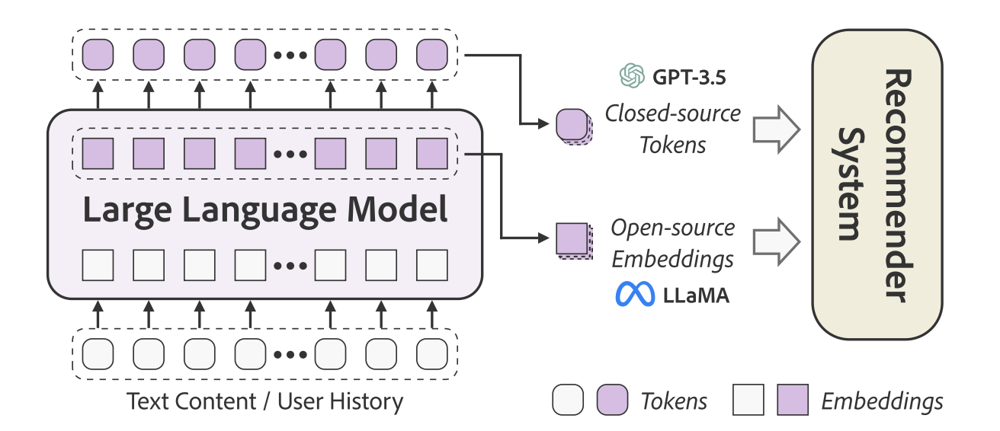
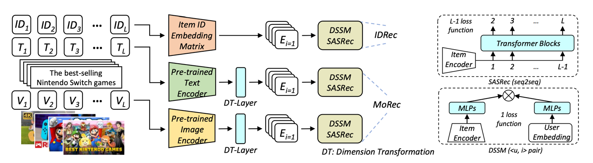
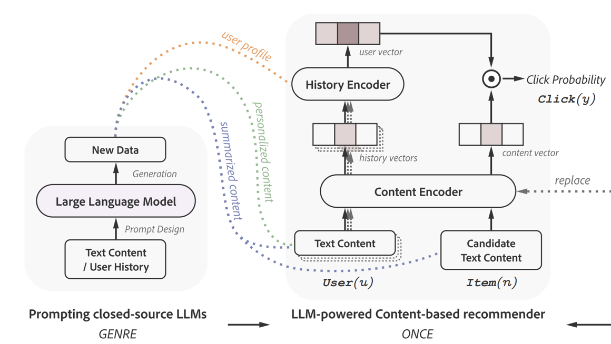
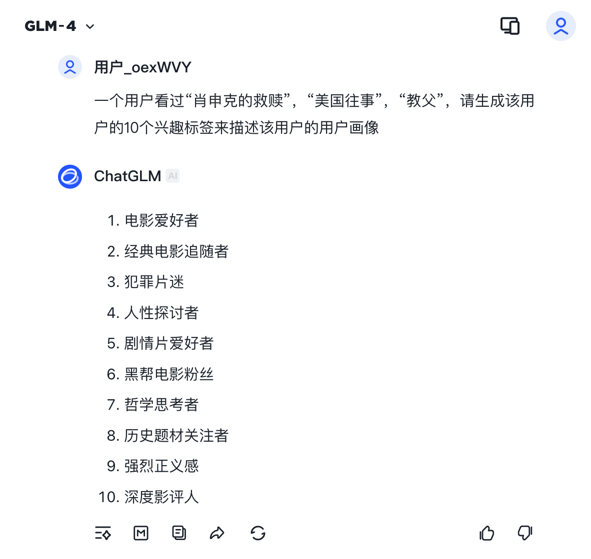
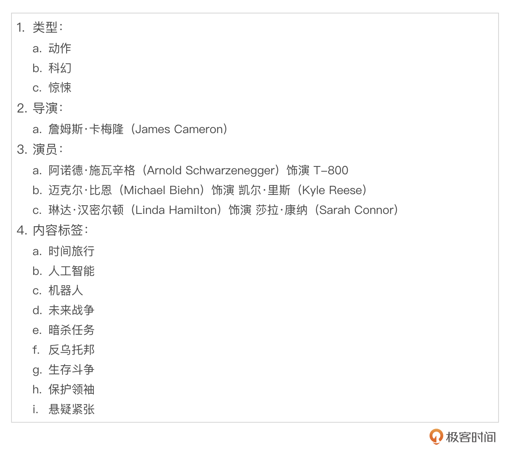
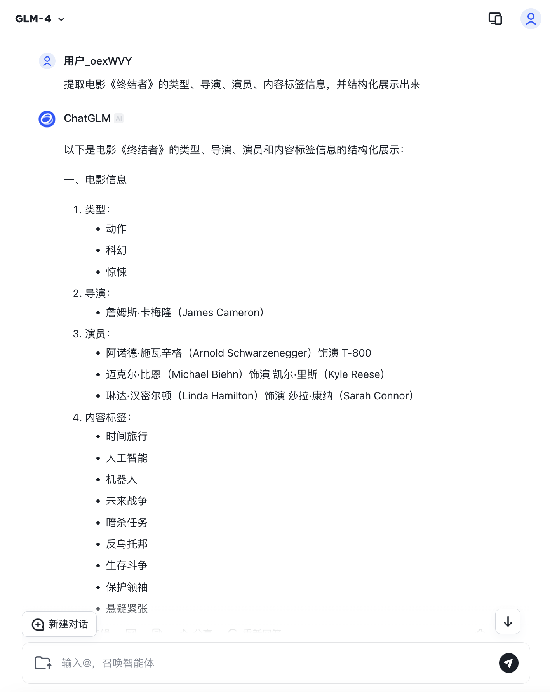

# 大模型如何为推荐系统注入“世界知识”？
你好，我是王喆。

宏观上讲，大模型的出现在三个层级上改变了这个世界。

一是知识整合的方式发生了根本的改变，因为一个大模型就可以融会贯通开放世界中能获取到的几乎所有知识，这是之前没有技术能够达到的；二是大模型可能会直接替代掉原来驱动这个世界运行的算法和软件，比如机器人控制的方式、客服的方式、编程的方式，当然也包括推荐的方式；三是大模型可能会创造出一个新世界，特别是在视频生成逐渐取得突破的今天，OpenAI甚至喊出了Sora是这个世界的模拟器的口号。显然，大模型也有可能通过生成视频来模拟任何可能发生的事情。

具体到推荐系统上来讲，我想大模型对推荐系统的影响也在于这三个层级：

1. **知识的输入**：大模型融合的开放世界知识将带给推荐系统丰富的增量信息，这对于推荐系统特征工程、冷启动过程、多模态信息的引入将是极大的推进。

2. **模型的替换**：大模型本身有整体替代传统推荐系统的潜力，特别是大模型在交互方式上有可能带给推荐系统新的革命。

3. **内容的创造**：推荐系统一直以来的使命是帮助人发掘感兴趣的信息和内容。但大模型极强的内容生成能力，让“个性化内容生成”成为可能。也就是说，大模型有可能越过“推荐”这个环节，直接为用户创造个性化内容，这才是大模型可能带给推荐系统最大的革命。


今天，我们先聚焦在第一个应用方向——知识的输入。

## 大模型和传统推荐模型的知识差异

我们曾经在特征工程篇中详细介绍过推荐系统特征工程的重要性和主要特征分类。事实上，推荐系统能够利用的数据和特征往往决定了推荐效果的上限。当我们为推荐系统构造新特征，引入新的训练数据的时候，一定要从顶层设计上考虑这些新的特征和数据有没有给推荐系统带来“增量”的信息。而大模型通过学习整个互联网开放世界的知识，毫无疑问将给推荐系统带来前所未有的增量知识。

下面的表1对比了大模型在知识层面上相比传统推荐系统的不同，通过对比可以发现，大模型的知识与推荐系统的知识是“完美互补”的关系。 **大模型的知识是开放的、多模态的**，它从开放世界学习到的外部知识将给推荐系统带来大量的“新鲜血液”；但与此同时， **大模型缺乏推荐系统内部的用户行为信息**，这也就意味着大模型无法完全替代推荐系统的知识体系。最合理的方式是结合二者的优势，将大模型的世界知识输入到推荐系统中去，提升推荐系统的效果上限。



## 利用大模型的知识辅助推荐

从模型架构的角度来说，利用大模型的知识辅助推荐主要有两种方式。

第一种是LLM生成Embedding后输入推荐系统。对于LLaMA这样的开源大模型来说，我们可以知道模型所有的参数，也可以对模型进行改造，所以在预训练完成之后，大模型可以被当作一个多模态特征的编码器，把多模态特征转换成同一隐空间内的Embedding，这样就可以与深度学习推荐系统无缝衔接。

第二种是LLM生成文字Token后输入推荐系统。对于ChatGPT这样的闭源大模型来说，我们无法让模型直接生成Embedding，而只能通过它的API生成Prompt对应的token序列。这时token序列就可以成为大模型向推荐系统传播知识的媒介。



下面我用两个例子MoRec和GENRE来具体说明这两种传递知识的方式。

### 通过Embedding传递多模态知识的MoRec

MoRec（Modality-based Recommendation Model，基于多模态的推荐模型）是西湖大学研究者在2023年提出的结合多模态大模型和推荐系统的方案。

接下来，我们以游戏推荐为例，介绍MoRec和传统的以物品ID为主要特征的推荐模型的区别。既然是游戏推荐，推荐模型的主要功能就是根据用户之前的游戏安装记录推荐新游戏。推荐模型的架构如下图所示，作为对比的基于物品ID的推荐模型被称为IDRec，IDRec利用传统的Embedding技术把用户行为序列中的物品ID序列转换成Embedding序列，然后基于Transformer序列模型生成用户兴趣Embedding，再与候选物品Embedding经过双塔得到最终的推荐得分，这是一个经典的深度学习推荐模型。



MoRec则是由两个双塔模型组成，一个双塔是处理游戏文本特征的，一个双塔是处理游戏图片特征的，两个双塔的最终推荐得分平均后得到最终的输出。这两个双塔结构与IDRec的不同之处，是把模型特征从“ID特征”替换成了“多模态内容特征”，模型结构把Embedding层替换成了预训练的文本和图片大模型。这两个大模型分别作为编码器将游戏的描述词和图片转换成Embedding，为了保证大模型生成的Embedding与后续推荐模型所需的Embedding维度匹配，还加入了一个DT层（Dimension Transformation，维度转换）负责Embedding维度的转换。

在最后的评估过程中，MoRec相比IDRec取得了5%到8%的性能提升。当然，这里的性能提升并不能说明基于多模态大模型的推荐系统一定比基于ID特征的推荐系统效果好，但多模态大模型对“万物”进行Embedding化后加入推荐模型的思路，是很有借鉴意义的。

### 通过Token传递多模态知识的GENRE

GENRE（Generative Recommendation Framework，生成式推荐框架）是香港理工大学的研究者于2023年提出的大模型推荐系统方案。它利用ChatGPT这类闭源大模型进行推荐，通过构造合适的Prompt生成token序列输入推荐模型，完成知识的传递。

下图展示了GENRE的模型，它分为左侧的 **大模型知识生成部分** 和右侧的 **推荐模型部分**。左侧的大模型基于用户的行为历史和物品的信息设计Prompt，输入大模型产生用户和物品的新知识文本，然后输入到右侧的推荐模型中。



这里要注意的是，大模型生成的知识都是由文本表示的。比如用户画像可由一系列用户的文本兴趣标签来表示，如“喜欢科幻片”“喜欢国产电影”“喜欢姜文导演”等，物品也是由大模型生成的文本表示的，比如“文艺片”“欧美电影”“汤姆汉克斯主演”等。这种知识传递的方式与MoRec通过Embedding传递的方式有所不同，因为Embedding本质上是一串不可解释的向量，而Token是人类可读的自然语言。但一般来说，Embedding能够承载的信息量会更大，Token则可能会带来一定的知识损耗。

右侧的推荐模型也是一个双塔结构，用户塔接收由用户的行为历史生成的大模型知识，物品塔则接收候选物品相关文本的大模型知识。然后通过推荐模型自己的文本编码器转换成用户和物品Embedding后，通过双塔交叉生成推荐得分，这一过程是经典的双塔模型的推荐过程。GENRE框架的主要创新点在于大模型的文本知识输入。

## 实战：利用大模型生成用户和物品特征Token

上面通过MoRec和GENRE的例子说明了大模型向推荐系统传递知识的主要方式。为了加深理解，我们还是希望通过实战例子来真正体会一把大模型的“威力”。这里，我们结合课程中的电影推荐场景和国产大模型“ [智谱清言](https://chatglm.cn/)”，来演示一下如何利用大模型生成用户和物品特征，这些特征就可以以Token的方式传递给推荐模型使用。

### 用户画像特征生成案例

**任务**：一个用户的电影观看历史包括“肖申克的救赎”“美国往事”“教父”，利用大模型生成该用户的用户画像。

**构造Prompt**：一个用户看过“肖申克的救赎”“美国往事”“教父”，请生成该用户的10个兴趣标签来描述该用户的用户画像。

**大模型输出**：

01. 电影爱好者

02. 经典电影追随者

03. 犯罪片迷

04. 人性探讨者

05. 剧情片爱好者

06. 黑帮电影粉丝

07. 哲学思考者

08. 历史题材关注者

09. 强烈正义感

10. 深度影评人


**截图如下**：



在大模型给出兴趣标签后，就可以把这些兴趣标签以用户特征的形式输入深度学习推荐模型。具体标签特征输入方法，你可以看专栏的推荐模型篇。

### 物品特征生成案例

**任务**：利用MovieLens数据集中有限的电影信息，补充更多的电影相关信息。

**构造Prompt**：提取电影《终结者》的关键信息，并结构化地展示出来。

**大模型输出**：



截图如下：



可以看到，大模型利用内部蕴含的世界知识，补充了终结者这部影片的所有重要属性信息。在得到丰富的电影特征后，就可以通过构造标签特征的方式输入推荐模型。这样在进行电影推荐时，模型不仅可以考虑到用户行为特征包含的用户偏好信息，更能够基于电影的内容特征进行推荐了。

### 利用API批量补充电影特征

对于MovieLens中海量的电影库，通过人工查询的方式积累电影特征效率还是太低了。很多大模型厂商提供了API接口供批量查询，我们用智谱的大模型 [http API](https://bigmodel.cn/dev/api/http-call/http-auth) 进行演示，把下面演示代码中的<your\_api\_key>替换成你自己申请的智谱api key就可以了。

```python
#!/bin/bash
curl --location 'https://open.bigmodel.cn/api/paas/v4/chat/completions' \
--header 'Authorization: Bearer <your_api_key>' \
--header 'Content-Type: application/json' \
--data '{
    "model": "glm-4",
    "messages": [
        {
            "role": "user",
            "content": "提取电影《哈利波特1》的关键信息，并结构化的展示出来"
        }
    ]
}'

```

以下是api返回的JSON数据，通过解析返回的content，就可以得到结构化的电影关键信息，也就可以批量补充MovieLens的电影特征了。

```python
{
   "choices":[
      {
         "finish_reason":"stop",
         "index":0,
         "message":{
            "content":"以下是电影《哈利波特1：神秘的魔法石》的关键信息，以结构化的形式展示：\n\n### 基础信息\n- **电影名称**：哈利波特1：神秘的魔法石\n- **原文名称**：Harry Potter and the Philosopher's Stone\n- **上映年份**：2001\n- **导演**：克里斯·哥伦布 (Chris Columbus)\n- **编剧**：斯蒂芬·科洛弗 (Steve Kloves)\n- **原著**：J.K. 罗琳《哈利波特》系列第一部\n\n### 主要演员\n- **哈利波特**：丹尼尔·雷德克里夫 (Daniel Radcliffe)\n- **赫敏·格兰杰**：艾玛·沃特森 (Emma Watson)\n- **罗恩·韦斯莱**：鲁伯特·格林特 (Rupert Grint)\n- **阿不思·邓布利多**：理查德·哈里斯 (Richard Harris)\n- **西弗勒斯·斯内普**：艾伦·瑞克曼 (Alan Rickman)\n- **鲁伯·海格**：罗比·考特兰 (Robbie Coltrane)\n\n### 故事概要\n- **背景**：讲述了孤儿哈利波特发现自己是一位巫师，并在霍格沃茨魔法学校的第一年的冒险。\n- **开篇**：哈利波特在姨妈家度过了一个悲惨的童年，直到魔法世界的信使来到他的生活。\n- **魔法学校的召唤**：哈利收到了霍格沃茨的入学通知书，开始了他的魔法之旅。\n- **友情**：在霍格沃茨，哈利结识了罗恩和赫敏，三人成为了好朋友。\n\n### 魔法学校\n- **学校名称**：霍格沃茨魔法学校\n- **四个学院**：格兰芬多、赫奇帕奇、拉文克劳、斯莱特林\n- **重要课程**：变形术、药水学、防御黑魔法、占卜学等\n\n### 关键情节\n- **对魔法石的寻找**：哈利等人发现魔法石的秘密，并阻止了它落入邪恶的魔法师伏地魔手中。\n- **飞行课程**：哈利展示了他的飞行天赋，并加入了格兰芬多魁地奇球队。\n- **巨魔事件**：哈利和朋友们在处理一名巨魔入侵学校的危机中展示了他们的勇气和智慧。\n- **最终对决**：哈利在魔法石的所在之地与反派奇洛教授进行了对决。\n\n### 电影成就\n- **票房**：全球票房超过9亿美元，成为当时史上票房最高的非续集电影。\n- **奖项**：获得多个奖项提名，并赢得包括奥斯卡最佳原创配乐在内的多个奖项。\n\n这些关键信息提供了《哈利波特1》的基础概览，涵盖了从电影制作到故事情节的多个方面。",
            "role":"assistant"
         }
      }
   ],
   "created":1736808924,
   "id":"202501140655064ca16f3dd94c4c6d",
   "model":"glm-4",
   "request_id":"202501140655064ca16f3dd94c4c6d",
   "usage":{
      "completion_tokens":585,
      "prompt_tokens":20,
      "total_tokens":605
   }
}

```

## 总结

今天，我们重点讲解了大模型是如何为推荐系统注入“世界知识”的。因为大模型的知识与推荐系统的知识是“完美互补”的关系，所以融合二者的优势，能够进一步提升推荐系统的效果上限。

实现知识融合的主要方式有两种：通过Embedding传递（如MoRec）和通过Token传递（如GENRE）。

最后我们通过实战案例实现了大模型生成用户和物品特征的功能。 整个实现过程是非常简单快捷的。毫不夸张地说，大模型可以轻易地把异构的多模态数据转换成一系列的标签特征，这些标签特征更加结构化，易于让推荐模型学习。

更加重要的是，大模型凭借其掌握的世界知识，自己添加了很多有价值的信息，比如仅凭电影的名字就添加了电影背后诸多的内容类型标签，仅凭一张海报就添加了电影背后的导演、类别、关键要素的信息。而在传统的推荐系统中，这些电影只能是一个个电影ID特征，而海报则根本无法使用。这就是大模型结合推荐系统的魅力。

更进一步讲，大模型为推荐系统输入的增量信息，可以在没有用户行为历史的情况下完成基于内容新的推荐，这十分有助于解决推荐系统冷启动的问题，这也是之前基于ID特征的推荐系统很难办到的。