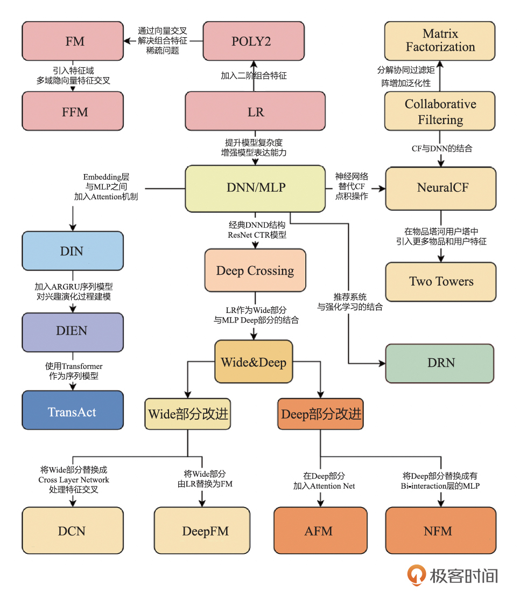
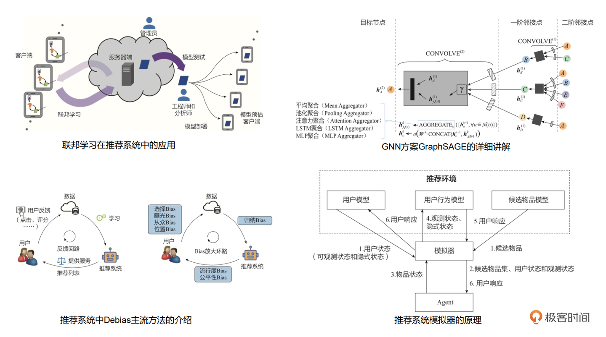
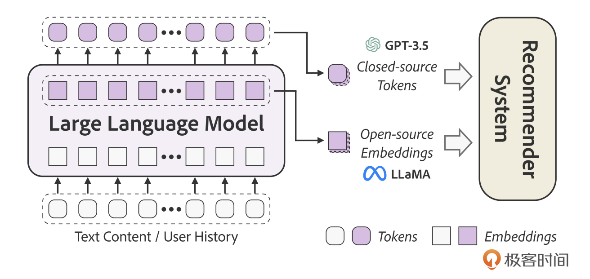
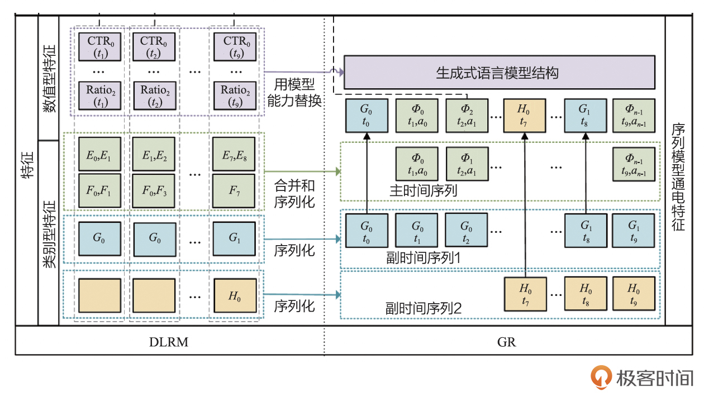
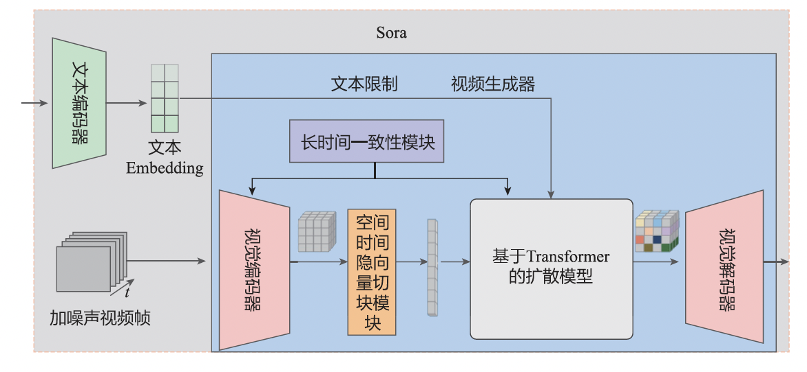
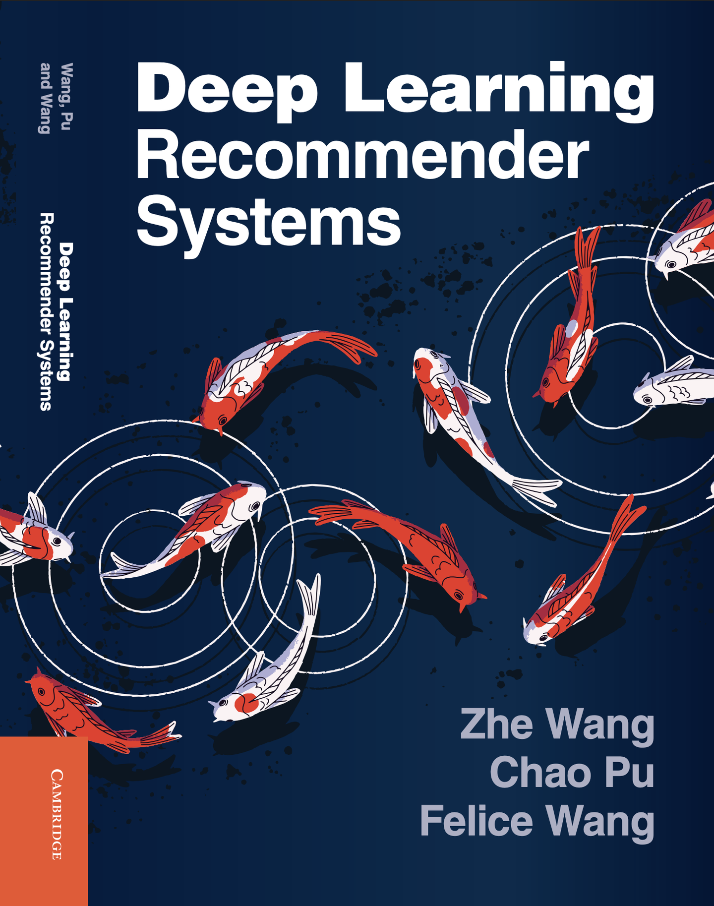

# 新书 | 深度学习推荐系统2.0
你好，我是王喆。

今天我想向你介绍我的新书《 [深度学习推荐系统2.0](https://item.jd.com/14407685.html)》，这本书也可以说是咱们这门课程的一次系统化的总结。同时，距离我写上一本技术书《深度学习推荐系统》已经有五年时间了。这五年间，深度学习推荐系统的技术架构经历了更为深刻的演化，大模型的革命滚滚而来，搜广推行业本身也经历了从增量式大发展到存量式精细优化的过程。搜广推的同行们都在关心一个问题， **推荐系统的破局点在哪**？我在新书中抛砖引玉，给出的线索是“算法、工程和大模型的协同创新”，希望能够用诸多业界案例给你启发。

在此期间，我的职业生涯也经历了很多变化，从Tech lead到技术经理，再到技术总监，从推荐系统到广告系统，在中国的互联网公司和美国的互联网公司之间切换。这让我对技术和行业的理解也有所不同。五年前，我在《深度学习推荐系统》的最后一页说，“这不是结束，而是另一个开始。在不远的将来，笔者会持续更新书中的内容，让本书的知识体系持续枝繁叶茂。”五年后，让我们一起继续更新自己的推荐系统知识树，以及对推荐系统的行业理解。基于此有了这本《深度学习推荐系统2.0》。

## 推荐系统知识体系的更新

大模型的革命如火如荼，其对推荐系统的影响也不可谓不深刻。于是很多人建议我们追一追热点，就叫这本书《大模型推荐系统》或者《大模型在推荐系统中的应用》吧。我说暂且不必，时至今日，业界主流的推荐系统仍然是深度学习推荐系统的框架，所以我把这本书命名为《深度学习推荐系统2.0》，就是希望坚定传递一个理念—— **踏踏实实做精做细每个推荐系统模块，更新自己的知识框架，而不是盲目追求好听的故事，这才是我们真正的技术护城河**。

于是，在这本新书中，我更新了推荐模型的演进框架，保留经典的，删去过时的，整合新的、有影响力的工作，形成了新的推荐模型演进框架图。

在上一版的基础上，我也继续查漏补缺，把之前未涉及的，或者近些年新出现的、重要的推荐系统技术加入进来，形成更为系统化的推荐系统知识体系。比如：

- 加入了对于iOS生态体系至关重要的联邦学习框架。
- 在Embedding部分更新了GNN的最新进展。
- 补充了对推荐系统Debias解决方案的介绍。
- 在模型评估部分新增了最近流行的推荐系统模拟器的介绍。
- 为强调工程和算法的协同创新，增加了边缘计算推荐系统方案。

我的目标就是一个，让读者能够跟随我一起查漏补缺，把自己的推荐系统知识框架构建得更完整，处在推荐系统业界的前沿位置。

## 大模型和AIGC对推荐系统的影响

在深度学习推荐系统的框架之上，大模型和AIGC对于推荐系统的影响是毋庸置疑的。在不盲目追求热点的同时，本书希望实事求是地讨论大模型和AIGC对推荐系统产生的实质性影响，以及推荐系统领域的落地方案。具体来说，本书把大模型和AIGC在推荐系统的应用分为了三个层次。

### 理解这个世界

大模型的知识与推荐系统的知识是“完美互补”的关系。大模型的知识是开放的、多模态的，它从开放世界学习到的外部知识将给推荐系统带来大量的“新鲜血液”。与此同时，传统推荐模型对推荐系统内部的用户行为信息利用得更充分、更深刻。把大模型学习到的“世界知识”传递给推荐系统，是二者结合的最好方式。

如下图所示，大模型分别通过Token和Embedding的方式传递知识，通过更好地理解这个世界来影响着推荐系统。

### 成为这个世界

以Meta GR为例，推荐系统的从业者们从生成式模型的角度重新思考推荐问题。 Transformer based的大模型架构正成为推荐模型的新范式，并从排序模型逐渐扩散到召回、粗排甚至一体化推荐模型等众多推荐系统模块。大模型正逐渐成为“推荐系统世界”的新架构。

### 创造一个新世界

OpenAI Sora的口号是“成为世界的模拟器”。相比用大模型的技术改造现有的推荐系统技术模块，我更主张跳出现有技术框架的束缚，从更广阔的角度想一想大模型和AIGC对推荐场景的更大影响在哪里。我的答案是个性化推荐内容的生成。从已经日趋成熟的广告创意生成、短视频生成，到未来有更大想象力的推荐内容完全基于用户反馈生成。本书对AIGC技术在推荐系统中的应用进行了全面的探讨。

## 业界行业专家的帮助和学术机构的认可

这本书的写作过程中，和第一版一样，我获得了诸多业界专家的帮助。曾经的阿里资深技术专家，现汇量科技首席人工智能官朱小强倾情作序，他所分享的行业经验宝贵且经典。我曾经的导师和辅导员，清华大学的唐杰教授和刘知远副教授的强力推荐，他们的鼓励也一直是我创作的动力。此外，还有新浪微博的首席科学家张俊林，华为的研究室主任唐瑞明，美团高级算法专家王哲，美团的技术专家薛涛锋等业界专家，以及在知乎和微信公众号对第一版书提出反馈的100多位读者，在此一并感谢。

值得一提的是，本书的英文版也同步出版了，由剑桥大学出版社负责编辑和审核。出版的过程经过了学术界多名教授的层层评审，如今已经走入世界各大知名大学的图书馆和课堂，成为了很多人工智能和推荐系统课程的参考书目。这也实现了我的一个小愿望，就是真正能有中国人撰写的技术书籍翻译成英文，影响海外的技术圈子，而不总是引进英文的技术书到国内。我相信，这本书在全世界范围内，也是一本质量过硬的技术书。

### 共勉和感悟

大模型时代对搜索、广告、推荐（下文简称“搜广推”）行业的工程师们提出了新的挑战，特别是在新的行业环境下，公司与公司之间、团队与团队之间、个人与个人之间都面临着更大的竞争压力。我想所有读者也特别关心如何处理好这些压力，化挑战为机遇，从竞争中脱颖而出。我在书中给出了三个建议： **技术上“拥抱变化”、视野上“高屋建瓴”和主观上增强自己的“软实力”。**

**技术上“拥抱变化”。** 我们要坚信的是，“搜广推”仍然是互联网的第一变现途径，这个行业的容量足够大，天花板足够高。我们应该做的是在已有的“搜广推”技术优势之上，深入思考如何把大模型的技术趋势融入已有的推荐系统框架中，而不是放弃已有的技术优势，完全切换到全新的赛道，0基础和刚毕业的同行们竞争。

**视野上“高屋建瓴”。** 推荐系统发展到今天，各模块的技术积累已经非常深厚，但模块的优化空间已经非常小了。在深度学习推荐系统2.0 时代，进一步的优化机会存在于模块之间，存在于系统整体之上，因此我们才有了COLD、EdgeRec 等一批工程和算法协同优化的优秀方案。我始终相信，一个优秀的推荐系统方案肯定是兼顾工程效率和算法效果的全局性优化方案。从工程师素质的角度来看，联合优化的思路对我们提出了更高的要求，在对推荐系统架构和新技术趋势了然于胸的基础上，我们必须在视野上高屋建瓴，打通思维的“任督二脉”，把各个模块串联起来思考。只有这样，才能找到新的技术增长点。

**主观上增强自己的“软实力”。** 随着职业经历越来越丰厚，笔者越来越意识到“软实力”才是保持职场优势的关键。面对高不确定性项目时的勇气，面对阶段性挫折时的韧性，面对技术转型时的决心，面对项目压力时的毅力，这些重要的品质才是一生最宝贵的财富。从另一个层面讲，工作的真正目的就是提升自己的软实力，让你成为一个更加优秀的人。当我们成为一个更优秀的人时，我们不仅能在技术问题上更加得心应手，即使转到其他领域，在其他职业方向上也能取得成功。

对我来说，我自己跟五年前一样，还是会坚定在搜广推方向发展，因为我对这个领域有着跟刚毕业时一样的热爱。有时候，在做长远决定的时候，一点点passion总比事无巨细的权衡利弊要重要一些。

这本书已经上架，你可以直接通过这个链接购买： [https://item.jd.com/14407685.html](https://item.jd.com/14407685.html)。

最后，我也祝你能够有所坚持，有所取舍，拥抱新变化。