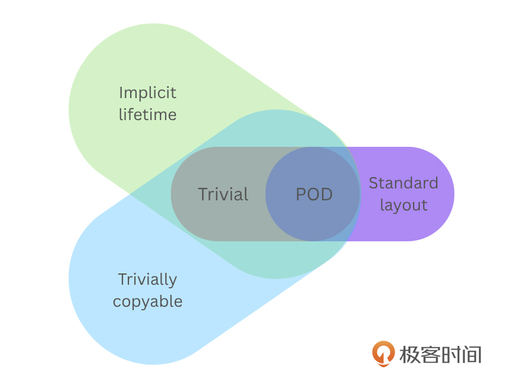

# 47 | 生存还是灭亡：浅论对象的生存期
你好，我是吴咏炜。

最近看到了一些实际的代码问题，让我觉得有必要来聊聊对象的生存期：一个对象是从什么时候开始被视作已经“存在”，到什么时候被视作已经“消亡”？

## 一个问题

我把我看到的问题简化和归纳一下。设有以下类：

```cpp
class Obj {
public:
  Obj();
  ~Obj();
  void init();
  void cleanup();

private:
  // 有一些 POD 数据
};

```

然后，使用它的地方大致是这样子：

```cpp
Obj* ptr = (Obj*)mmap(…);
ptr-&gt;init();
// 开始使用 *ptr

```

你看出问题在哪里了吗？

事实上，按照 C++ 标准的规定，以上代码具有未定义行为。原因是，代码里在 `Obj` 对象的生存期之外使用该对象了—— `Obj` 对象根本还没“创建”出来呢。

## 普通对象的生存期

C++ 里的对象并不在程序运行期间一直存在。它们只在某段特定时间里在某个内存位置存在，这就是对象的生存期。生存期有开始，也有结束。

上面的 `Obj` 是“普通”类，具有构造函数、析构函数和访问控制。对于这样的对象，C++ 里规定，它的生存期从构造函数被调用开始，到析构函数被调用结束。

如果声明一个对象类型的变量（如 `Obj obj;`），显然对象的生存期不需要我们手工管理。而对于具有动态生存期的对象（它们的存储期和生存期可以分离），我们就需要对生存期予以特别关注。在最通常的用法里， `new Obj()` 会分配内存并调用构造函数（开始对象的生存期）， `delete ptr` 则会调用析构函数（结束对象的生存期）并释放内存。但是，我们使用 `ptr->~Obj()` 提前结束对象的生存期、不释放内存也是可以的。事实上，在实现 `vector` 这样的容器时，我们就需要分离对象的生存期和存储期，以便重复利用对象所占用的内存。反过来，如果一个对象的析构函数是平凡的——析构动作不实际执行任何代码——那调用析构函数也并不必要。在这种情况下，当这个对象占用的内存被释放（或者内存被其他对象占用）时，这个对象的生存期也自然结束。

对一个对象的访问，包括任何对其非静态成员变量和成员函数的访问，都必须发生在其生存期内，否则即为未定义行为。编译器有可能对此生成错误的二进制代码。

这些规则本质上是为了给编译器充足的优化空间。虽然目前我没看到任何 C++ 编译器对开头给出的代码生成错误的输出，但具有未定义行为的代码，本质上就是非常危险的。至少理论上来说，你换一个编译器（含编译器升级），或者在代码变得更复杂时，结果就可能会不正确。一个合格的 C++ 程序员，有责任在自己的代码中避免未定义行为——除非你确知你的编译器对特定类型的代码提供了确定行为的 **保证**（后面我们会看到有些情况下编译器会提供特殊保证）。

这样的要求看起来有点严，但考虑到我们通常在构造函数里建立类不变量（我们在 [第 43 讲](https://time.geekbang.org/column/article/860363) 里略有所讨论），跳过构造函数不是个好主意。遵守规则能获得更健壮的代码。

从另一个角度看，即使抛开语言的规则不谈，前面的代码也很危险。构造函数是特殊的成员函数，负责初始化对象，包括所有的基类对象和数据成员。前面的用法，即便在最好的情况下，也会要求 **所有** 的基类对象和数据成员都属于下列两种情况之一：

- 不需要任何初始化动作
- 可以通过手工赋值或 `init` 这样的成员函数来进行初始化

在 C++ 里，在 `Obj` 里简单放一个 `string` 类型的数据成员就会让上述条件不满足，并会引发实际的紊乱或崩溃（具体行为视分配到的内存里的内容是否与正常初始化的结果相同而定）。

你可能会想，像 `string` 这样的复杂对象放到共享内存里去应该不安全吧？一般而言，确实如此，但一些经过特殊设计的对象是可以的，Boost.Interprocess 就提供了一些很好的例子 \[1\]。

## 正确开始对象生存期的方式

最简单的开始生存期的方式是使用正常的对象创建方式，确保构造函数正确得到调用（如果有的话）。这包括直接定义该类型的变量、 `new` 表达式等。对于需要分配特殊存储空间的对象，我们可以使用布置 `new`（placement `new`）\[2\]，在指定的地址上创建出对象（这个概念我们之前在 [第 31 讲](https://time.geekbang.org/column/article/489409) 里讨论过）。上面的代码如下改造就没问题了：

```cpp
void* temp = mmap(…);
auto ptr = new (temp) Obj;
ptr-&gt;init();
// 开始使用 *ptr

```

对于之前定义的 `Obj`，因为它声明了构造函数，这里写 `new (temp) Obj`、 `new (temp) Obj()` 还是 `new (temp) Obj{}` 没有区别，默认构造函数都会得到调用（没有公开、可用的默认构造函数则编译失败）。如果 `Obj` 是个聚合体（aggregate）\[3\]——这里可简单理解为所有（非静态）数据成员公开、没有构造函数的结构体——那三种写法就有了点微妙的区别，后两种会保证对所有数据成员初始化（清零）\[4\]，因此数据成员不会出现因未初始化而具有随机数值的情况。当然，如果基类有默认构造函数，数据成员有默认构造函数或成员初始化器，那它们在第一种写法下也会正确得到执行。

以下面的代码为例：

```cpp
struct Data {
  string msg;
  int v1{42};
  int v2;
};

```

`new (temp) Data` 会确保 `msg` 正确初始化为空字符串， `v1` 被初始化成 42，但 `v2` 的结果会不确定。而如果我们使用 `new (temp) Data()` 或 `new (temp) Data{}`，那么 `v2` 的值一定是零。

C++ 里有一些在指定地址上创建对象的函数，如 `uninitialized_copy`、 `uninitialized_move`、 `uninitialized_fill` 和 `construct_at`。这些函数通常就是利用布置 `new` 来实现的。

### 隐式生存期的对象

对于开头的代码，实际上还有一种可能的修复，就是去掉对构造函数和析构函数的声明。此时，这个类的对象就具有了 **隐式生存期**（implicit lifetime）。虽然严格来说，这一概念要到 C++20 才变得明确，但似乎也没有更早的编译器违反相关规则。注意你在 C++20 的标准文档里还找不到这个概念，因为它是作为错误修订引入的。所以你需要参考更新的标准（草案）或 CppReference \[5\]。跟我们前面说的“普通”对象相反，这些隐式生存期的类型没有一个建立类不变量的标准过程，因而标准允许它们的生存期隐式开始。

下面这些类型（及它们加上 `const` 或 `volatile` 修饰后的类型）具有隐式生存期：

1. 标量类型
2. 数组类型
3. 不具有用户提供析构函数的聚合体类型（注意：聚合体意味着没有构造函数）
4. 具有平凡默认构造函数和平凡析构函数（翻译：构造和析构不需要编译器生成任何代码）的类型

对于具有隐式生存期的对象，分配内存操作本身即可隐式创建该对象。虽然标准里的分配内存操作不包含 `mmap`，但我们可以认为合理的实现会把平台相关的内存分配和映射函数也包括进去。

我们来具体看一下这四种类型。

首先，标量类型包含算术类型、枚举类型、指针类型、成员指针类型和空指针类型。在 C++ 里，这些类型都不需要特殊的初始化或析构动作，让它们具有隐式生存期非常自然，也符合 C 的习惯用法。这个规定明确使得下面的代码合法：

```cpp
auto ptr = static_cast&lt;int*&gt;(
  malloc(sizeof(int)));
*ptr = 42;

```

其次，数组类型本身也不需要特殊的初始化或析构动作。但这里有个需要注意的地方是，非隐式生存期类型对象的数组仍具有隐式生存期。也就是说，作为外层对象的数组可以先于其中的元素存在。虽然平时我们直接声明数组不会发生这种情况，但在进行动态对象管理时，先创建一个数组，然后创建其中的对象也是合理的做法。如下所示：

```cpp
auto ap = static_cast&lt;Obj*&gt;(
  malloc(sizeof(Obj[2])));
auto ip = new (&ap[0]) Obj();
// 对 ap[0] 进一步操作
ip = new (&ap[1]) Obj();
// 对 ap[1] 进一步操作

```

第三，聚合体的情况跟数组也差不多，作为外层对象的结构体可以先于其中的数据成员存在。由于所有的数据成员都是公开的，我们可以在创建结构体对象之后再去初始化其中的数据成员。跟数组的情况一致，当前 C++ 标准里要求聚合体必须没有用户提供的析构函数才算具有隐式生存期。显然，一般的聚合体（结构体）满足这一要求。

最后，对于非聚合体的类类型，隐式生存期要求其具有平凡的构造函数和析构函数。这样的类可以有非公开的基类和非静态数据成员，但：

- 不能有虚函数或虚基类
- 基类和非静态数据成员也是隐式生存期类型，且可以平凡构造和析构（ `string` 这样的类型不行）
- 默认构造函数由编译器默认提供（可以由用户通过 `= default` 声明）
- 析构函数由编译器默认提供（通常意味着不需要程序员声明）

这些规则的综合要求，就是编译器不用为对象的构造和析构生成任何代码。

无论是这四种情况里的哪一种，C++ 规定，在为这样的对象分配了内存之后，对象的生存期即已开始。根据前面的描述你可以看到，对于 2、3 两种情况，有可能对象里还有子对象的生存期尚未开始，这需要你小心处理。

C++23 标准又引入了一种新方式， `start_lifetime_as` 和 `start_lifetime_as_array`。这两个“函数模板”有点特殊，它们会让编译器认为，参数指向的内存区域有指定类型的隐式生存期的对象或数组，并返回指向该对象或数组的指针。如果对象有对齐要求，那内存区域里的数据也同样需要对齐。因此，它们的有用性相对受限很多。非专家的使用场景通常不需要使用这两个函数模板。

不过，我们还是简单示意一下。下面的代码在 C++23 里能让我们从字节流里正确得到一个 `float`：

```cpp
alignas(float) unsigned char data
  [sizeof(float)]
  {0x00, 0x00, 0x40, 0x40};
auto& f =
  *start_lifetime_as&lt;float&gt;(data);

```

注意，这里要求源数据就是对齐的。非对齐的数据需要先进行一次 `memcpy`，那多半就反而不需要 `start_lifetime_as…` 了（我们下面会立即讨论 `memcpy` 的神奇作用）。也许因为它们确实有点鸡肋，到目前（2025 年 7 月）为止，还没有一家编译器实现了该功能。

### 可平凡复制的对象

除了内存分配函数， `memcpy` 和 `memmove` 也能在目标地址上创建对象。这里我们对对象类型的要求就成了可平凡复制（trivially copyable）。具体的规定我们可参考 CppReference \[6\]，但本质上可平凡复制就是要确保能够安全地使用 `memcpy` 或 `memmove` 来复制对象。C 里的数据类型，即所谓的“简旧数据”（plain old data，POD），都满足可平凡复制。但可平凡复制，并不要求一定是 POD——可平凡复制是一个比 POD 更弱的要求。可平凡复制跟具有隐式生存期则存在交叉——既存在可平凡复制的类型不具有隐式生存期，也存在具有隐式生存期的类型不可平凡复制。

下面这张图大致展示了这些对象类别之间的关系：



简单讨论一下 POD，它实际上在 C++ 里可以看作多个类型特征的组合：

- 平凡（trivial）\[7\]——这比“可平凡复制”要求更多，除可以使用 `memcpy` 或 `memmove` 来复制对象外，还要求对象具有平凡的默认构造函数。标准库的类型特征 `is_trivial` 可以用来判断该特征，但我们并不推荐使用该特征（且它已在 C++26 被废弃），而是使用更加细化的 `is_trivially_copyable`（可平凡复制）、 `is_trivially_default_constructible`（可平凡默认构造）等特征。
- 具有标准布局（standard layout）\[8\]——没有使用 C++ 特有的内存布局相关特性，如对数据成员使用多种不同的访问控制（全部使用公开，或全部使用私有，则都可以）、具有虚函数、具有非空基类等等。标准库的类型特征 `is_standard_layout` 可以用来判断该特征，检查某类的对象是否可以跟其他编程语言（以 C 语言为典型例子）兼容。

所以，一个非 POD 的对象也可能是可平凡复制的。下面就是一个例子：

```cpp
class Obj {
public:
  explicit Obj(int value)
    : valueY_(value)
  {
  }
  int getX() const
  {
    return valueX_;
  }
  int getY() const
  {
    return valueY_;
  }

protected:
  int valueX_{};

private:
  int valueY_;
};

```

这个类虽然既不平凡（构造函数有初始化动作），又不具有标准布局（有两种不同的访问控制），但它的拷贝构造、拷贝赋值、移动构造、移动赋值和析构都是平凡的，因而仍然是可平凡复制的。我们可以使用 `memcpy` 或 `memmove` 来复制这样的对象。

事实上，对于 `vector&lt;Obj>`，标准库里真可以把 `std::copy` 算法优化成 `memmove` 的，可以大块搬移内存，具有最高的执行效率。我在三大主流编译器下都验证出了这样的行为：

[https://godbolt.org/z/e7cq1M7ax](https://godbolt.org/z/e7cq1M7ax)

回到创建对象。下面代码里的 `memcpy` 被视为会 **创建** 一个新的 `float` 对象：

```cpp
unsigned char data[sizeof(float)]{
  0x00, 0x00, 0x40, 0x40};
alignas(float) unsigned char
  g[sizeof(float)];
memcpy(&g, data, sizeof(float));
auto& f =
  *reinterpret_cast&lt;float*&gt;(g);

```

不过，这里用 `memcpy` 来 **修改** 一个 `float` 对象可能更简单：

```cpp
unsigned char data[sizeof(float)]{
  0x00, 0x00, 0x40, 0x40};
float f;
memcpy(&f, data, sizeof(float));

```

这本质上就是 C++20 的 `bit_cast` 做的事情了。它能把对象解释成另一种类型、并返回新对象。使用 `bit_cast`，我们可以把上面的代码写成：

```cpp
unsigned char data[sizeof(float)]{
  0x00, 0x00, 0x40, 0x40};
auto f = bit_cast&lt;float&gt;(data);

```

在 C++20 之前，我们可以用下面的代码来模拟实现一下（改编自 \[9\]）：

```cpp
template &lt;class To, class From&gt;
enable_if_t&lt;
    sizeof(To) == sizeof(From) &&
    is_trivially_copyable_v&lt;From&gt; &&
    is_trivially_copyable_v&lt;To&gt;,
    To&gt;
bit_cast(const From& src) noexcept
{
  static_assert(
    is_trivially_constructible_v&lt;To&gt;,
    "This implementation additionally "
    "requires destination type to be "
    "trivially constructible");

  To dst;
  memcpy(&dst, &src, sizeof(To));
  return dst;
}

```

顺便说一句，虽然这个实现笨拙一点，不及一般在 C++20 实现里使用的编译器魔法，但你也不需要担心它的性能。 `memcpy` 并不是一个普通函数——至少在优化编译的情况下，你不会看到实际函数调用的发生。

因为 `bit_cast` 有点特殊，虽然技术上来讲它不是一个关键字，而是一个函数模板（在 `std` 名空间下），有时候人们把它看作 C++ 里的第五种转型（cast）。

当我们从网络或文件数据流里恢复对象时， `memcpy` 或 `bit_cast` 都挺合适。此外，对于像整数这样的简单类型，自行进行移位拼接也简单易行。我在 Mozi \[10\] 库的 net\_pack\_basic.hpp 里就是这么写的：

```cpp
std::make_unsigned_t&lt;T&gt;
  unsigned_value{};
for (std::size_t i = 0;
     i &lt; sizeof(T); ++i) {
  unsigned_value &lt;&lt;= CHAR_BIT;
  unsigned_value |=
    static_cast&lt;unsigned char&gt;(
      src[i]);
}
value =
  static_cast&lt;T&gt;(unsigned_value);

```

## 不能正确开始生存期的方式

说完能正确开始生存期的方式，我们再来说说一些有问题、但也相当常见的方式。

首先，一般而言，使用 `reinterpret_cast` 或 C 风格转型来对指针来进行转换是不太安全的。根据 C 和 C++ 的严格别名规则，我们不能用指针访问不兼容类型的对象 \[11\]。注意，目标指针指向 `char`、 `unsigned char` 或 `byte` 是明确被允许的，不会有任何问题——这是我们检视对象表示的通常方式。

这意味着下面这样的代码存在风险：

```cpp
alignas(float) unsigned char data
  [sizeof(float)]
  {0x00, 0x00, 0x40, 0x40};
auto f =
  *reinterpret_cast&lt;float*&gt;(data);

```

这样的代码违反了严格别名规则，具有未定义行为。

当然，这样简单的读取一般还是能工作的。但在更复杂的有读有写的情况下，代码就可能会出问题了。下面是一个可以复现奇怪结果的例子：

```cpp
#include &lt;stdio.h&gt;

int foo(int* p1, float* p2)
{
  *p1 = 1;
  *p2 = 3.0;
  return *p1;
}

int main()
{
  int n = 0;
  printf("%x\n",
         foo(&n, (float*)&n));
}

```

GCC 和 Clang 都在关闭优化时输出 40400000，而在 `-O2` 优化时输出了 1——编译器认为 `p1` 和 `p2` 类型不同，不会指向同一个对象，因此不会费力重新从内存读取整数。从下面这个链接你可以在线观察结果：

[https://godbolt.org/z/ejqcW6Y1b](https://godbolt.org/z/ejqcW6Y1b)

这个问题不少人遇到过（如 \[12\]）。如果你不了解这个问题，那遇到时一定会让你头痛一阵子的。有些项目采取反向的做法，关闭 GCC 的严格别名（使用 `-fno-strict-aliasing`），也是一种方法。但从代码的 **通用性** 和 **性能** 的角度，也许尽量避免使用 `reinterpret_cast` 来对不同类型的指针进行转型是更好的做法。

在 C 的世界里，使用联合体来进行类型双关（type punning）是安全的。很多用 C 写的网络字节序转换的代码就会这样做，比如：

```cpp
#ifdef _WIN32
#include &lt;winsock2.h&gt;  // htonl/...
#else
#include &lt;arpa/inet.h&gt; // htonl/...
#endif

struct Date {
  union {
    struct {
#if __BYTE_ORDER__ == \
    __ORDER_LITTLE_ENDIAN__
      unsigned   day : 5;
      unsigned month : 4;
      int       year : 23;
#else
      int       year : 23;
      unsigned month : 4;
      unsigned   day : 5;
#endif
    };
    unsigned year_month_day;
  };
};

// …
Date date;
Date date{.day = 5,
          .month = 7,
          .year = 2025};
date.year_month_day =
  htonl(date.year_month_day);
// 现在 date 可以安全发送了

```

这样的代码理论上是不安全的，因为在 C++ 看来， `day`、 `month`、 `year` 这三个字段的生存期跟 `year_month_day` 毫无关系。联合体里一次只有一个成员被“激活”，在一个成员被激活而存在的时候，其他不活跃的成员从概念上说根本就不存在！只有在对 `year_month_day` 进行写操作之后， `year_month_day` 的生存期才开始——C++ 标准没提供任何保证可以从 `year_month_day` 读到对 `day`、 `month`、 `year` 的写入。C 没有生存期的概念，认为这不是个问题；而 C++ 则认为两个无关的对象不会同时占据重叠的内存区域，因而从概念上禁止这样的操作。

不过，话说回来，主流编译器里这样的代码似乎都能正常工作。GCC 更是在文档里明确声明，即使启用了严格别名（ `-O2` 会自动开启），通过联合体来进行类型双关仍然是允许的 \[13\]——编译器给出了明确的保证。毕竟，在 C++20 之前，根本没有对包含 `Date` 的数据结构进行字节序转换的方便做法。即使在 C++20 里，有了 `bit_cast`，代码写起来也会更麻烦：

```cpp
struct Date {
  union {
    struct {
#if __BYTE_ORDER__ == \
  __ORDER_LITTLE_ENDIAN__
      unsigned   day : 5;
      unsigned month : 4;
      int       year : 23;
#else
      int       year : 23;
      unsigned month : 4;
      unsigned   day : 5;
#endif
    } fields;
    unsigned year_month_day;
  };
};

// …
Date date{.fields{.day = 5,
                  .month = 7,
                  .year = 2025}};
date.year_month_day = htonl(
  bit_cast&lt;unsigned&gt;(date.fields));
// 现在 date 可以安全发送了

```

比利用匿名联合体和编译器保证更方便的，则是直接使用某种序列化/反序列化库，这样也不需要自己去关心是不是少做或者多做字节序转换了。比如，利用 Mozi 库，我们可以写出下面这样的代码（改编自 \[14\]）：

```cpp
#include &lt;array&gt;
#include &lt;stdint.h&gt;
#include &lt;mozi/bit_fields.hpp&gt;
#include &lt;mozi/net_pack.hpp&gt;
#include &lt;mozi/print.hpp&gt;
#include &lt;mozi/serialization.hpp&gt;
#include &lt;mozi/struct_reflection.hpp&gt;

using mozi::bit_field;
using mozi::bit_field_signed;

DEFINE_BIT_FIELDS_CONTAINER(
  Date,
  (bit_field&lt;23, bit_field_signed&gt;)
    year,
  (bit_field&lt;4&gt;)month,
  (bit_field&lt;5&gt;)day
);

DEFINE_STRUCT(
  Data,
  (std::array&lt;char, 8&gt;)name,
  (uint16_t)age,
  (Date)last_update
);

int main()
{
  Data data{
    {"John"}, 17, {2024, 8, 19}};
  mozi::println(data);

  mozi::serialize_t result;
  mozi::net_pack::serialize(data,
                            result);
  mozi::println(result);
}

```

输出是：

> `{`
>
> `    name: &#123; 'J', 'o', 'h', 'n', '\x00', '\x00', '\x00', '\x00' &#125;,`
>
> `    age: 17,`
>
> `    last_update: {`
>
> `        year: 2024,`
>
> `        month: 8,`
>
> `        day: 19`
>
> `    }`
>
> `}`
>
> `&#123; 74, 111, 104, 110, 0, 0, 0, 0, 0, 17, 0, 15, 209, 19 &#125;`

这跟生存期本身没啥关系，我今天就不展开了。

## 内容小结

本讲讨论了 C++ 里对象的生存期。对象的生存期一般从构造函数被调用开始，到析构函数被调用或其占用的内存被释放或重用时结束；对于具有隐式生存期的对象，内存分配函数和 `start_lifetime_as`/ `start_lifetime_as_array` 可以开始对象的生存期；而对于可平凡复制的对象， `memcpy`/ `memmove` 和 `bit_cast` 也可以开始对象的生存期。如果不遵守语言的规则，在对象的生存期外访问对象，程序就会具有未定义行为，可能导致难以预测的结果。

## 课后思考

你可以尝试一下，不使用 `bit_cast` 改造本讲中类型双关的例子，避免其中的未定义行为。你也应该检查一下自己的代码，里面是不是有我描述的这些未定义行为？

欢迎留言和我分享你的想法和疑问。如果读完这篇文章有所收获，也欢迎分享给你的朋友。

## 参考资料

\[1\] Ion Gaztanaga, Boost.Interprocess. [https://www.boost.org/doc/libs/latest/doc/html/interprocess.html](https://www.boost.org/doc/libs/latest/doc/html/interprocess.html)

\[2\] cppreference.com, “Placement `new`”. [https://en.cppreference.com/w/cpp/language/new.html#Placement\_new](https://en.cppreference.com/w/cpp/language/new.html#Placement_new)

\[3\] cppreference.com, “Aggregate”. [https://en.cppreference.com/w/cpp/language/aggregate\_initialization.html#Aggregate](https://en.cppreference.com/w/cpp/language/aggregate_initialization.html#Aggregate)

\[4\] cppreference.com, “Zero-initialization”. [https://en.cppreference.com/w/cpp/language/zero\_initialization.html](https://en.cppreference.com/w/cpp/language/zero_initialization.html)

\[5\] cppreference.com, “Implicit-lifetime types”. [https://en.cppreference.com/w/cpp/language/type-id.html#Implicit-lifetime\_type](https://en.cppreference.com/w/cpp/language/type-id.html#Implicit-lifetime_type)

\[6\] cppreference.com, “C++ named requirements: _TriviallyCopyable_”. [https://en.cppreference.com/w/cpp/named\_req/TriviallyCopyable.html](https://en.cppreference.com/w/cpp/named_req/TriviallyCopyable.html)

\[7\] cppreference.com, “C++ named requirements: _TrivialType_”. [https://en.cppreference.com/w/cpp/named\_req/TrivialType.html](https://en.cppreference.com/w/cpp/named_req/TrivialType.html)

\[8\] cppreference.com, “C++ named requirements: _StandardLayoutType_”. [https://en.cppreference.com/w/cpp/named\_req/StandardLayoutType.html](https://en.cppreference.com/w/cpp/named_req/StandardLayoutType.html)

\[9\] cppreference.com, “std::bit\_cast”. [https://en.cppreference.com/w/cpp/numeric/bit\_cast.html](https://en.cppreference.com/w/cpp/numeric/bit_cast.html)

\[10\] 吴咏炜, mozi. [https://github.com/adah1972/mozi](https://github.com/adah1972/mozi)

\[11\] cppreference.com, “Type aliasing”. [https://en.cppreference.com/w/cpp/language/reinterpret\_cast.html#Type\_aliasing](https://en.cppreference.com/w/cpp/language/reinterpret_cast.html#Type_aliasing)

\[12\] 腾讯数据库技术, “一个编译参数引发的血案”. [https://cloud.tencent.com/developer/article/1375299?policyId=1003](https://cloud.tencent.com/developer/article/1375299?policyId=1003)

\[13\] GCC, “Type punning”. [https://gcc.gnu.org/onlinedocs/gcc/Optimize-Options.html#Type-punning](https://gcc.gnu.org/onlinedocs/gcc/Optimize-Options.html#Type-punning)

\[14\] 吴咏炜, “Bit fields, byte order, and serialization”. [https://yongweiwu.wordpress.com/2025/02/21/bit-fields-byte-order-and-serialization/](https://yongweiwu.wordpress.com/2025/02/21/bit-fields-byte-order-and-serialization/)