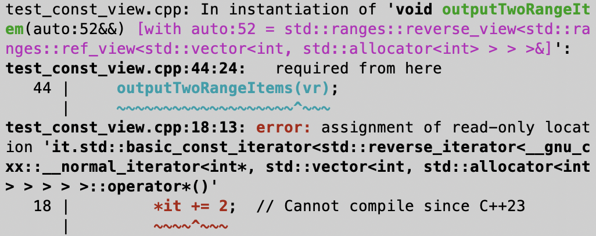

# 48 | 显式对象参数、const视图、expected和mdspan：C++23 的一些重要改进
你好，我是吴咏炜。

在 [第 46 讲](https://time.geekbang.org/column/article/877663) 里我讨论了 C++20 的一些重要改进。类似地，本讲我来讨论一下 C++23 里可以快速上手的重要特性。

## 显式对象参数

传统上，类的非静态成员函数都有一个隐式传递的 `this` 参数。正因为有这个隐式的参数，我们才能访问非静态数据成员。比如， `optional` 的实现里多半有类似下面的代码：

```cpp
template &lt;typename T&gt;
class optional {
public:
  // …
  constexpr T&
  operator*() & noexcept
  {
    return value_;
  }
  // …

private:
  union {
    char dummy_;
    T    value_;
  };
  bool engaged_{};
};

```

在这里， `operator*` 的实现可以理解为：

```cpp
  constexpr T&
  operator*(optional* this) & noexcept
  {
    return this-&gt;value_;
  }

```

也就是说，通过 `this` 指针去访问 `value_` 这样的数据成员。

不好玩的是，由于 `optional` 可以是 const，也可以是右值，我们需要把这个 `operator*` 的实现重复四遍。这就有点无聊了：

```cpp
  constexpr T&
  operator*() & noexcept
  {
    return value_;
  }
  constexpr const T&
  operator*() const& noexcept
  {
    return value_;
  }
  constexpr T&&
  operator*() && noexcept
  {
    return std::move(value_);
  }
  constexpr const T&&
  operator*() const&& noexcept
  {
    return std::move(value_);
  }

```

其他一些成员函数也需要这样去重复，这对库代码的开发者算是一个痛点了。C++23 对该问题提供了一个解决方案，让我们把指向对象的引用（注意，不是指针）前面加上 `this` 明确作为参数写出来。利用这种显式对象参数，上面的四个 `operator*` 成员函数可以统一写成：

```cpp
  template &lt;typename Self&gt;
  constexpr auto&& operator*(
    this Self&& self) noexcept
  {
    return std::forward&lt;Self&gt;(self)
      .value_;
  }

```

这里， `Self&&` 是个转发引用，根据“当前”对象的值类别可以自动推导出 `Self` 的类型（因此这个特性在标准化之前被称作 deducing this）： `optional&`、 `const optional&`、 `optional` 和 `const optional` 之一。这样，我们就用一个成员函数模板取代了原先的四个成员函数，从而简化了代码。这显然是一种绝佳的抽象。

### const 传递问题

你可能会想，棒极了，重复的 `begin`、 `end`、 `front`、 `end`、 `data` 等成员函数都可以这样简化吧。确实可以，但可能没有你想象的那么简单。比如，对于下面的重复接口：

```cpp
template &lt;typename T&gt;
class Container {
public:
  // …
  T* data() noexcept
  {
    return data_;
  }
  const T* data() const noexcept
  {
    return data_;
  }

private:
  T* data_;
};

```

把 `data()` 改写成下列形式是错误的：

```cpp
  template &lt;typename Self&gt;
  auto data(this Self&& self) noexcept
  {
    return std::forward&lt;Self&gt;(self)
      .data_;
  }

```

这里跟之前的重大区别是，一个 `const optional` 的 `value_` 字段会自动有 const 修饰；而一个 `const Container` 的 `data_` 字段虽然也会有 const 修饰，但这个 const 修饰是在 `data_` 上，而不是 `data_` 指向的对象上——对于 `const Container&lt;int>`，这个修改后的 `data()` 成员函数最后会返回一个 `int*`，而不是原先得到的 `const int*`！

要在这类成员函数里使用显式对象参数，你需要使用一些技巧把“const 性”传递到成员变量上。有一个提案中的工具是 `propagate_const`\[1\]，如果它可用的话（如使用 \[2\]），你可以把代码写成：

```cpp
template &lt;typename T&gt;
class Container {
public:
  // …
  template &lt;typename Self&gt;
  auto data(this Self&& self) noexcept
  {
    return std::forward&lt;Self&gt;(self)
      .data_.get();
  }

private:
  propagate_const&lt;T*&gt; data_;
};

```

但鉴于这一功能不是标准的一部分，写一个辅助函数也许更直截了当一些：

```cpp
template &lt;typename T, typename U&gt;
constexpr forward_pointer_like(U* ptr)
{
  constexpr bool is_adding_const =
    is_const_v&lt;remove_reference_t&lt;T&gt;&gt;;
  if constexpr (is_adding_const !=
                is_const_v&lt;U&gt;) {
    if constexpr (is_adding_const) {
      return const_cast&lt;const U*&gt;(ptr);
    } else {
      return const_cast&lt;
        remove_const_t&lt;U&gt;*&gt;(ptr);
    }
  } else {
    return ptr;
  }
}

```

随后如下改动 `data` 即可：

```cpp
  template &lt;typename Self&gt;
  auto data(this Self&& self) noexcept
  {
    return forward_pointer_like&lt;Self&gt;(
      self.data_);
  }

```

### 可递归的 lambda 表达式

在 C++23 之前，lambda 表达式里要表示递归很麻烦，经常需要用到像 Y 组合子这样的技巧 \[3\]。假设已有一个 `y_combinator` 的实现，那我们可以这样递归实现一个算阶乘的 lambda：

```cpp
auto fac = y_combinator(
  [](auto self, int n) -&gt; int {
    if (n &lt;= 1) {
      return 1;
    } else {
      return n * self(n - 1);
    }
  });

```

需要注意，这里 `-> int` 是必要的，因为在这里编译器不能自动推导出 lambda 的返回类型。

到了 C++23，我们就可以这样实现算阶乘的 lambda：

```cpp
auto fac = [](this auto self,
              int n) {
  if (n &lt;= 1) {
    return 1;
  } else {
    return n * self(n - 1);
  }
};

```

抛开 `y_combinator` 的实现和优化，第二段代码也更加简单和直截了当吧？

### 标准提案里的例子

标准提案 P0847 \[4\] 里提供了很多的例子，来说明这个显式对象参数的很多用法。比如，我们常常用 CRTP \[5\] 来向类添加功能，这样的代码常常可以用显式对象参数来进行简化，可以只继承一个类，而不是奇异模板。又如，我的上一个例子里实际是在一个新的对象上调用成员函数，而不是在“当前”对象上。这里对这些细节就不展开了；如果你有兴趣的话，可以自己去阅读一下标准提案里的例子。

## const 视图问题

如前面讨论到的，对所有涉及元素、子对象或指向对象（以下简称为“子对象”）的对象来说，有一个很重要的问题是，外层对象的属性能否自动适用于其子对象上。我们一般重点关注 const 修饰，下面是一些外层 const 属性通常可以自动适用于其子对象上的类型：

- 容器的 const 属性通常可适用于其元素上：对于一个 const 容器， `begin()` 将得到一个 `const_iterator`， `front()` 将得到一个 const 引用， `data()` 将得到一个 const 指针，等等。
- `optional` 的 const 属性可适用于其子对象上：对于一个 const 的 `optional`， `value()` 或 `operator*()` 将得到一个 const 引用。

也有一些外层对象的 const 属性跟其子对象没什么关系：

- 指针（如 `Obj*`）的 const 属性跟其指向的对象的 const 属性没啥关系（这就是前面的问题）。
- 智能指针（如 `unique_ptr&lt;Obj>`）的 const 属性跟其指向的对象的 const 属性没啥关系。
- 代理对象（如 `std::vector&lt;bool>::reference`）的 const 属性跟其指向的对象的 const 属性没啥关系。
- 迭代器的 const 属性跟其指向的对象的 const 属性没啥关系。

因为容器的 const 属性可适用于其元素上，我一般只用 `begin` 和 `end`——不管是使用成员函数，还是 `std` 里的独立函数。用来获得 const 迭代器的 `cbegin` 和 `cend`，我并不觉得有什么使用的必要。事实上， `std::cbegin` 和 `std::cend` 的行为，也就是在一个 const 引用上调用 `std::begin` 和 `std::end` 而已。

到了 C++20 的范围库（参见 [第 29 讲](https://time.geekbang.org/column/article/195553) 和 [第 42 讲](https://time.geekbang.org/column/article/852516)），事情变得更加复杂了：

- 范围虽然行为像容器，但范围对象的 const 属性和其中元素的 const 属性并不一定关联。尤其是视图对象，它们往往不可以是 const 的，因为遍历过程中可能需要修改视图，典型例子是 `filter_view`。对于预期接受一个范围的函数，我们往往用转发引用传参（ `range auto&&`），这样可以同时接受左值和右值；但后续不需要继续转发（ `std::forward`），因为范围的左右值属性跟其中元素的左右值属性无关。
- 范围只要求支持 `begin` 和 `end` 操作，而不要求 `cbegin` 和 `cend`。视图对象在 C++20 里也多半没有 `cbegin` 和 `cend` 成员函数；主要的例外是 `string_view`，它是只读视图， `begin` 和 `cbegin` 实际上没有区别。

`std::ranges` 名空间下提供了 `begin` 和 `end`，也提供了 `cbegin` 和 `cend`，后者的定义沿袭了跟 `std` 名空间下相似的做法，因此也同样没有用……不对，应该说更没有用——因为大部分非容器的范围对象，特别是视图，并不会把 const 属性传递到范围内的元素上。

以下面的代码为例：

```cpp
using namespace std;
namespace rg = ranges;

void outputTwoRangeItems(
  rg::range auto&& r)
{
  int count = 2;
  for (auto it = rg::begin(r);
       it != rg::end(r); ++it) {
    if (count == 0) {
      break;
    }
    cout &lt;&lt; *it &lt;&lt; ' ';
    //*it += 2;
    --count;
  }
  cout &lt;&lt; '\n';
}

```

如果你希望传递像 `filter_view` 这样的对象进去，那上面你不能使用 `rg::range const auto&` 传参。同时，在循环里使用 `rg::cbegin` 也毫无效果：如果你把 `begin` 和 `end` 改成 `cbegin` 和 `cend`，去掉修改 `*it` 那行的注释，那下面的调用代码在 C++20 下是可以通过编译的：

```cpp
vector v{1, 2, 3, 4, 5};
auto vr = v | views::reverse;
outputTwoRangeItems(vr);

```

这就跟我们的直觉预期相反了：使用 `cbegin`/ `cend` 在 C++20 里并不能限制使用者，只能对视图里的元素进行只读访问。

C++23 对这个问题提供了改进：

- `std` 名空间下新添了通用类模板 `basic_const_iterator` 和辅助别名模板 `const_iterator`/ `const_sentinel`，方便把迭代器/哨兵转换成指向 const 迭代器/哨兵，禁止解引用后的写操作。
- `std::ranges` 名空间下加入了 `cbegin` 和 `cend` 独立函数模板，基本上是把 `begin` 和 `end` 函数调用的结果转换成 `const_iterator` 和 `const_sentinel`，确保解引用之后只能读取指向的元素。
- 视图对象——包括 `span` 和 `std::ranges` 名空间下的视图——全都有了 `cbegin` 和 `cend` 成员函数，都有了返回 const 迭代器/哨兵的一致语义。

这虽然是一个比较小的改进，但还是很大地增强了语言里的一致性。对于不确定的范围类型，现在如果要只读遍历其中的元素的话，你就可以一致地使用 `cbegin` 和 `cend` 了。同样的上一段代码（把 `begin` 和 `end` 改成 `cbegin` 和 `cend`，去掉修改 `*it` 那行的注释），现在在 C++23 下也不再能编译通过，而是会得到类似下面这样的错误信息。



当然，使用范围库我们通常就不想显式写出 `begin`/ `end` 或者 `cbegin`/ `cend` 了。为了方便使用，范围库也提供了名为 `as_const_view` 的视图适配器，可以让视图变成只读。下面这种写法多半更好：

```cpp
void outputTwoRangeItems(
  rg::range auto&& r)
{
  for (auto& item :
       r | views::as_const
         | views::take(2)) {
    cout &lt;&lt; item &lt;&lt; ' ';
    //item += 2;  // Cannot compile
  }
  cout &lt;&lt; '\n';
}

```

在这样的代码里， `r | views::as_const` 确保了范围里的元素在后面处于只读状态（除非你使用 `const_cast`）。你可以放心，后续代码不会一不小心更改了范围里的元素。

## 标准化的 expected

在 [第 22 讲](https://time.geekbang.org/column/article/189022) 里我讨论过 `expected`，而到了 C++23，它也终于成为了标准里的一部分。事实上，把那讲里 `expected` 的例子拿过来，把包含的 &lt;tl/expected.hpp> 改成 &lt;expected>，把 `tl::` 改成 `std::`，其他地方完全不用动，代码就可以工作了。

不过，我还是有两点想要额外讨论一下：

1. 第 22 讲给出的例子不够好。使用 `expected` 时，我们一般会搭配 `std::error_code`，而不是像那个例子一样使用 `string`。
2. 在标准化的过程中， `expected` 引入了“单子”（monadic）成员函数来简化一些惯用法的表达。

`std::error_code` 早在 C++11 即已引入，但在 C++17 之前在标准库里并没有得到应用。C++17 则在文件库里广泛使用了 `error_code`：很多接口会提供两个不同的重载，其中一个增加一个 `error_code&` 类型的参数，用于接收错误码；而没有这个额外参数的接口则使用抛异常表示发生了错误。下面这个例子使用了 `error_code`：

```cpp
namespace fs = std::filesystem;
fs::path path{…};
error_code ec;
if (fs::remove(path, ec)) {
  cout &lt;&lt; "remove succeeded!\n";
} else {
  cout &lt;&lt; "remove failed";
  if (ec) {
    cout &lt;&lt; " with error!\n";
    if (ec ==
        errc::permission_denied) {
      cout &lt;&lt; "Please check "
              "permission!\n";
    }
  } else {
    cout &lt;&lt; "!\n";
  }
}

```

`error_code` 跟很多项目使用的整型错误码不同，它是一种强类型，内部有一个 `error_category` 的指针，可以指示这是什么类型的错误，并允许特殊错误跟通用错误进行转换。抛开错误定义的细节，我可以把第 22 讲的 `safe_divide` 函数改造如下：

```cpp
expected&lt;int, error_code&gt;
safe_divide(int i, int j)
{
  if (j == 0) {
    return unexpected(
      div_errc::divide_by_zero);
  }
  if (i == INT_MIN && j == -1) {
    return unexpected(
      div_errc::integer_divide_overflows);
  }
  if (i % j != 0) {
    return unexpected(
      div_errc::not_integer_division);
  }
  return i / j;
}

```

这些跟 `expected` 没有直接关系，我就不细讲了，请你自己看代码示例。

更有趣的是错误检查部分。我原先写成这样子：

```cpp
expected&lt;int, string&gt;
caller(int i, int j, int k)
{
  auto q = safe_divide(j, k);
  if (q)
    return i + *q;
  else
    return q;
}

```

现在有一种更优雅的写法：

```cpp
expected&lt;int, error_code&gt;
caller(int i, int j, int k)
{
  return safe_divide(j, k)
    .transform([i](int q) {
      return i + q;
    });
}

```

这种写法允许我们在成功时继续链式处理，而在失败时则使用 `error_code` 来构造结果。注意这里最后的结果类型是由 `transform` 的结果来决定的。下面是一个例子（这里的函数返回类型写成 `auto` 也可以）：

```cpp
expected&lt;string, error_code&gt;
caller(int j, int k)
{
  return safe_divide(j, k)
    .transform([](int q) {
      return to_string(q);
    });
}

```

`transform` 是单子成员函数，它对一个非错误类型的对象进行一次映射操作，并假设操作中不会产生新的错误（使用 `expected` 时一般不使用异常）。更复杂的处理可能需要用到其他一些单子成员函数。比如，如果要求对加法的溢出也进行判断，那我们就需要用到 `and_then` 成员函数：

```cpp
expected&lt;int, error_code&gt;
caller(int i, int j, int k)
{
  return safe_divide(j, k).and_then(
    [i](int q) -&gt; expected&lt;int, error_code&gt; {
      if ((i &gt; 0 && q &gt; INT_MAX - i) ||
          (i &lt; 0 && q &lt; INT_MIN - i)) {
        return unexpected(
          make_error_code(
            errc::value_too_large));
      }
      return i + q;
    });
}

```

在这里，我考虑了加法溢出的可能性，并在溢出时使用 `errc::value_too_large` 生成的错误码表示溢出。一个需要注意的地方是：对于有符号整数的操作，不能在操作后检查溢出，而必须在操作前。这是因为 C++ 标准规定有符号整数运算溢出属于未定义行为，编译器认为这件事根本不会发生。

好，关于 `expected` 我就讲到这里。更多的细节你可以自行查看文档，并在实践中多加体会。

## 多维下标和 mdspan

我要讲的最后一个 C++23 的改进是多维下标——现在我们可以方便地表示多维数据的下标了。

当然，之前我们也能表示多维数组，但实际是通过一种比较绕的方式：我们定义数组的数组（的数组），然后多次使用下标运算符来找到合适的元素。以下面的三维数组为例：

```cpp
float a[2][4][8];

```

如果没有发生类型退化的话， `a` 这个表达式的类型是 `float (&)[2][4][8]`，是对三维数组的引用； `a[i]` 这样的表达式的类型是 `float (&)[4][8]`，是对一个二维数组的引用； `a[i][j]` 这样的表达式的类型是 `float (&)[8]`，是对一个一维数组的引用；最后， `a[i][j][k]` 这样的表达式的类型是 `float&`，是对一个数组元素的引用。

这种表达方式对于定长数组还基本可行，对于长度不能静态确定的情况就麻烦了。如果使用 `vector` 来存放数据的话，用 `[i][j]` 这样的表达方式意味我们需要使用嵌套的 `vector`，像 `vector&lt;vector&lt;float>>`，低效且不能保证每维长度的确定性。因此，对于大小为 $h \\times w$（$h$ 行 $w$ 列，行主序）的动态矩阵，我们一般会先分配大小为 `h * w` 的空间，如使用 `vector&lt;float> m(h * w)`，然后把访问写成 `m[i * w + j]` 这样的形式。虽然看起来有点丑陋，这么做能保证内存的连续性和访问的高效。

有一点需要额外强调一下。在 C++23 之前， `m[i, j]` 是合法但错误的代码：编译器会把 `i, j` 当成逗号表达式来求值，即依次对 `i` 和 `j` 求值，然后把最后一项的求值结果当作整个表达式的最后求值结果。换句话说， `m[i, j]` 和 `m[j]` 基本等效。

对于自定义类型，让下标运算符（ `operator[]`）跟 C 数组有同样的限制并不必要。因此，终于有人提议让下标运算符支持多个参数，然后，标准库利用这一语言特性的功能就是 `mdspan`（multi-dimensional span）了。 `mdspan` 本身并不依赖多维下标的支持，但多维下标使得使用 `mdspan` 更加自然——不再需要使用圆括号（形如 `ms(i, j)`）或成员函数（形如 `ms.at(i, j)`），而可以自然地使用 `ms[i, j]`—— `mdspan` 会自动计算出 `i * w + j` 这样的偏移量。

`mdspan` 是 `span`（可参考 [第 36 讲](https://time.geekbang.org/column/article/513719)）的扩展。 `span` 的声明如下所示：

```cpp
template &lt;
  typename T,
  size_t Extent = dynamic_extent
&gt; class span;

```

也就是说，模板参数是类型加长度——长度默认是动态（可变）的。通过静态推导或手工指定，我们也可以使用编译期确定的长度，这样， `span` 就只需要存储指针，而不需要存储长度了。

`mdspan` 的声明形式上类似，但要更复杂一些：

```cpp
template &lt;
  typename T,
  typename Extents,
  typename LayoutPolicy = layout_right,
  typename AccessorPolicy = default_accessor&lt;T&gt;
&gt; class mdspan;

```

`T` 是元素类型，不需要多说。其余几个模板参数需要一点解释。

首先是 `Extents`。跟 `span` 不同，这里的长度通常是多维的，因此， `Extents` 也成了一个特殊的类型，而不是一个整数值模板参数。我们需要使用 `std::extents` 模板的某种特化，该模板声明如下：

```cpp
template &lt;
  typename IndexType,
  size_t... Extents
&gt; class extents;

```

如果打算使用无符号 32 位整数作为索引类型，长度是静态值 4 和 8，那我们可以这样声明一个 `mdspan`：

```cpp
mdspan&lt;float,
       extents&lt;uint32_t, 4, 8&gt;
&gt; ms{m.data()};

```

静态长度虽然具有一定的性能优势，但毕竟实际使用场景里常常不得不使用动态的长度。此时，表达形式是下面这样：

```cpp
using Exts2d = extents&lt;
  uint32_t,
  dynamic_extent,
  dynamic_extent&gt;;
Exts2d exts{h, w};
mdspan&lt;float, Exts2d&gt; ms{m.data(), exts};

```

这里我用矩阵的高度 `h` 和宽度 `w` 来初始化一个长度运行期可变的 `exts`（你也可以固定其中某个长度），然后生成 `mdspan` 对象。这么表示仍有些啰嗦，因此标准库允许下面这样更简洁的表达方式：

```cpp
using Exts2d = dextents&lt;uint32_t, 2&gt;;
mdspan&lt;float, Exts2d&gt; ms{m.data(), h, w};

```

如果所有维的长度都不需要静态固定，我们可以使用 `dextents`，它的第二个模板参数是维数。我们也不需要分别初始化 `mdspan` 和 `extents`，而是可以在构造 `mdspan` 对象时一次性完成初始化动作。

更进一步，如果全部使用动态长度，索引类型是 `size_t`，那利用类模板参数推导，我们可以直接写成：

```cpp
mdspan ms{m.data(), h, w};

```

不管使用哪种方式，现在可以写 `ms[i, j]` 这样的代码来访问元素了。

那 `LayoutPolicy` 策略又有什么用处呢？

假想有下面的矩阵：

$$
\\begin{bmatrix}
1 & 2 & 3 & 4 & 5\\\
6 & 7 & 8 & 9 & 10\\\
11 & 12 & 13 & 14 & 15\\\
16 & 17 & 18 & 19 & 20
\\end{bmatrix}
$$

显然，使用 `Exts2d&#123;4, 5&#125;` 可以方便地访问其中的元素： `mdspan` 会自动从 `ms[i, j]` 里的下标计算出偏移量 `i * 5 + j`。但如果你想通过 `mdspan` 访问其中一个小块：

$$
\\begin{bmatrix}
8 & 9\\\
13 & 14
\\end{bmatrix}
$$

那就有点麻烦了。你不能简单地使用 `Exts2d&#123;2, 2&#125;`，因为 `i * 2 + j` 不能算出原始数据中的合适偏移量！使用 `Exts2d&#123;2, 5&#125;` 似乎对计算偏移量是合适的，但对获取 `mdspan` 的大小就非常不合适了——大小应该是 $2 \\times 2$ 而不是 $2 \\times 5$。

这就是一个可以用上 `LayoutPolicy` 的场景。具体来说，你需要用到 `layout_stride`，步长布局。

默认的布局是 `layout_right`，右布局，即我们一般使用的行主序（row-major）布局。这种情况下，如果二维数组的高宽分别是 `h` 和 `w`，那根据 `[i, j]` 计算偏移量的公式是 `i * w + j`。这应当是 C++ 程序员非常熟悉的方式。

与之相对应的布局是 `layout_left`，左布局，即在 Fortran、MATLAB 等语言中使用的列主序（column-major）布局。这种情况下，如果二维数组的高宽分别是 `h` 和 `w`，那根据 `[i, j]` 计算偏移量的公式是 `i + j * h`。这主要用在代码需要跟使用列主序的程序交互的场景。

最灵活的布局是 `layout_stride`，步长布局，可灵活适配各种访问方式。对于步长布局，每一维的索引都跟存放在数组里的一个步长相对应。以二维为例，根据 `[i, j]` 计算偏移量的公式是 `i * strides[0] + j * strides[1]`。显而易见，使用它可以模拟各种不同的访问方式，包括右布局和左布局。但是，从实现的角度，使用步长布局有更大的开销，应仅在需要时使用。

具体到上面的例子，要得到合适的子视图的代码是：

```cpp
Exts2d extents_subview{2, 2};
array&lt;size_t, 2&gt; strides{5, 1};
layout_stride::mapping&lt;Exts2d&gt; map{
  extents_subview, strides};

mdspan subview{&ms[1, 2], map};

```

这里，我定义了视图大小和步长，将这两者合成一个步长布局映射（ `layout_stride::mapping`）对象，而后使用元素的起始地址和步长布局映射对象来生成 `mdspan`（类模板参数推导能自动得到类型 `mdspan&lt;float, Exts2d, layout_stride>`）。这样，我们就会得到预期的结果了。

最后，我简单讨论一下 `AccessorPolicy` 策略。对于常规的内存访问，你不需要定义这个策略，默认的策略能根据构造 `mdspan` 传入的指针和其他信息产生合适的访问，本质上是让 `operator[]` 返回 `ptr_[offset]` 这样的引用。如果你希望的行为不是直接访问内存，而是某种更复杂的行为，那你就可能需要使用这个策略来自定义要求的行为。比如：

- 让内存读写具有原子性
- 使用特殊的接口访问非本地内存
- 根据参数使用公式直接计算结果

这个策略使用相对较少，我就不详加探讨了。

## 内容小结

本讲我们讨论了四个 C++23 引入的重要特性：

- 显式对象参数——提供“当前对象”的引用，简化通用代码
- const 视图改进——让获得只读视图变得更简单和一致
- `expected`——组合期望结果和错误的方法
- `mdspan`——提供数据的多维视图

跟 C++20 的大特性比，这些特性显得没那么重要，但它们让特定场景下的 C++ 使用变得更加便捷。这也向我们展示了，C++ 语言一直在持续演进中，一直在修正发现的问题，并给开发者提供更多友好的工具。

## 课后思考

留两个问题，供你思考一下：

1. 你有没有犯过 const 传递的错误？你认为什么是 const 传递的最佳实践？
2. 想一想， `optional::and_then` 对其调用的函数对象的返回类型有什么要求？为什么？

欢迎留言和我分享你的想法和疑问。如果读完这篇文章有所收获，也欢迎分享给你的朋友。

## 参考资料

\[1\] cppreference.com, “std::experimental::propagate\_const”. [https://en.cppreference.com/w/cpp/experimental/propagate\_const.html](https://en.cppreference.com/w/cpp/experimental/propagate_const.html)

\[2\] Jonathan Coe, propagate\_const. [https://github.com/jbcoe/propagate\_const](https://github.com/jbcoe/propagate_const)

\[3\] Yegor Derevenets, “P0200: A Proposal to Add Y Combinator to the Standard Library”. [http://wg21.link/p0200r0](http://wg21.link/p0200r0)

\[4\] Gašper Ažman et al., “P0847: Deducing this”. [http://wg21.link/p0847r7](http://wg21.link/p0847r7)

\[5\] Wikipedia, “Curiously recurring template pattern”. [https://en.wikipedia.org/wiki/Curiously\_recurring\_template\_pattern](https://en.wikipedia.org/wiki/Curiously_recurring_template_pattern)