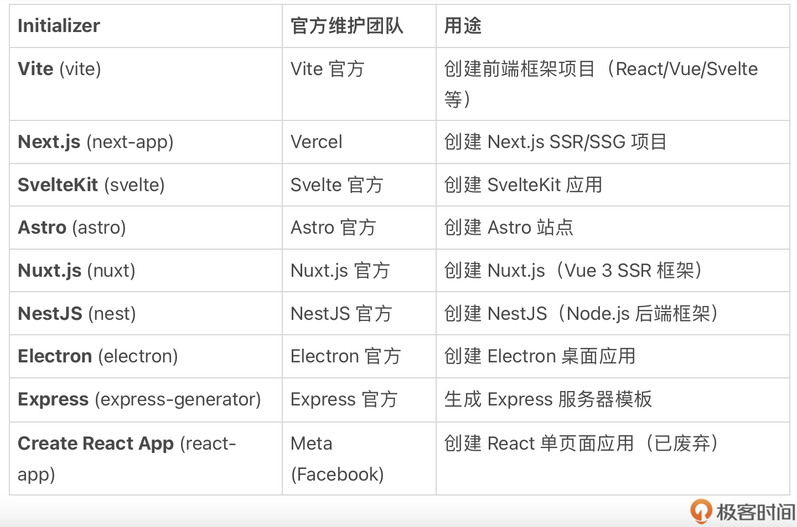

# npm：不只是包管理
你好，我是winter。

npm 是 Node.js 自带的包管理工具，多数前端同学对它并不陌生， **但是它的功能十分丰富，要想用好 npm，需要从中找到一条线索。**

在本节课中，我们以时间为线索，从创建、安装依赖、运行脚本到最终发布，来讲解 npm 关键的指令用法。

## 创建项目

我们可以使用 `npm init` 来创建新的 Node.js 包。运行后，会引导你填写包的基本信息，创建一个新的 `package.json` 文件。

现在还可以使用第三方的初始化程序来初始化新的包，使用时加上名称即可 `npm init &lt;name>` 。npm 会自动下载和安装名为 `create-&lt;name>` 的包，并执行。

一些比较重要的初始化程序可以参考下表：



## 安装和管理依赖

#### 区分依赖和开发依赖

如今的 Node.js 生态中，用到三方模块几乎是不可避免的。新人最常犯的错误就是不区分依赖和开发依赖，把所有依赖包都存储到依赖中。这里我们就来讲讲如何判断一个包应当属于依赖项，还是开发依赖项。

**区分的基本原则是用户在不需要修改本包代码的情况下，是否仍然要用到所依赖的包。**

通常 `dependencies` 的特点是源代码中有直接引用，而 `dependencies` 则多是开发时用到的开发、测试或构建工具。以下是一些例子：

典型的 dependencies 例如：

- Web 框架（express、koa）—— 处理 HTTP 请求。
- 数据库驱动（mongoose、mysql2、pg）—— 连接数据库。
- 认证库（jsonwebtoken、bcrypt）—— 处理用户认证。
- API 请求库（axios、node-fetch）—— 发送网络请求。

典型的 devDependencies 例如：

- 测试框架（jest、mocha）—— 用于编写和运行测试。
- 代码检查工具（eslint、prettier）—— 规范代码格式。
- 构建工具（webpack、babel、vite）—— 转译代码。
- 代码监视工具（nodemon）—— 监听代码变化并自动重启服务。
- 类型检查工具（typescript）—— 添加静态类型检查。

当我们使用 `npm install &lt;packagename>` 安装特定包时，npm 会自动更新 `package.json` 文件，添加依赖。

**如果你希望添加的是开发依赖，则应该使用 `-D` 或者 `--save-dev` 参数。**

#### 系统工具和开发工具

我们使用 Node.js 开发的工具可以分为两类：

- 系统工具：工具本身就是给用户使用的产品，例如 http-server、figlet。
- 开发工具：开发中使用的工具，特定项目使用，例如 vite、webpack、nyc。

早年的 Node.js 生态中，二者并不加以区分，所以多数工具都设计为全局安装。即使用 `-g` 参数：

```
npm install -g &lt;name&gt;

```

但是对于开发工具而言，这并非好的实践，因为同一开发机上可能存在多个项目目录，而每个项目依赖的工具版本要求可能不一致。所以应该使用 devDependency 来指定工具的版本。

```
npm install --save-dev &lt;package-name&gt;
npm install -D &lt;package-name&gt;

```

当我们使用工具时，推荐优先使用 `npx`：

```
npx &lt;package-name&gt;

```

`npx` 不但会自动处理全局/当前包依赖，还会自动安装所需的库，并且能够避免全局安装时的权限问题。

#### 依赖本地开发中的包

如果我们需要在本地同时开发多个包，往往需要在本地协同调试好后再发布，要依赖本地的包，则要使用 `npm link` 。

`npm link` 允许你在本地开发包和其他本地项目之间创建一种“链接”关系，使得你能够像使用正式发布的包一样使用本地开发包。

在你正在开发的包（例如库）目录下运行 `npm link` ，这个命令会把当前包链接到全局的 node\_modules 目录。也就是说，开发包会成为一个本地全局安装的包。

你可以在需要使用该包的其他项目中运行 `npm link &lt;package-name>`。这样，项目就会在本地的 node\_modules 中创建一个符号链接，指向你刚刚全局安装的本地开发包。

这样操作之后，修改的代码可以实时生效，在本地调试。调试完毕后，则可以使用 `npm unlink` 来解除链接。

要注意，因为 `npm link` 会产生本地全局安装的包，所以多个项目同时进行时，必须特别注意避免冲突。

直接把本地路径作为依赖安装也可以做到类似的事情，但因为修改了 `package.json`，所以只推荐在无需发布的示例代码中使用。

#### 开发场景中安装依赖

在开发场景中，推荐尽量使用 `npm install` 来安装依赖，根据 `package.json` 中的语义化版本号来升级到指定的包。

语义化版本是一种约定的版本号规范，每个版本号由三个数字组成：

- MAJOR（主版本号）：发生重大变更时递增，可能会引入不兼容的 API 变更。例如，从 1.0.0 更新到 2.0.0，表示可能有破坏性改动，老版本的代码可能无法正常运行。
- MINOR（次版本号）：新增功能时递增，但不会破坏已有功能的兼容性。例如，从 1.2.0 更新到 1.3.0，表示增加了新特性，但不会影响旧代码的运行。
- PATCH（补丁版本号）：修复 Bug 或进行小的改进时递增，且不会影响 API 兼容性。例如，从 1.2.3 更新到 1.2.4，表示仅修复了问题，功能保持不变。

在 package.json 的依赖管理中，经常会使用 ^、~、>、&lt; 等符号来管理版本范围：

- `^`（Caret 运算符）：允许次版本和补丁版本的更新，但不升级主版本。例如，^1.2.3 允许更新到 1.9.9，但不会更新到 2.0.0。
- `~`（Tilde 运算符）：允许补丁版本的更新，但不升级次版本。例如，~1.2.3 允许更新到 1.2.9，但不会更新到 1.3.0。
- `>` 和 `&lt;`：分别表示大于或小于某个版本。例如，>1.2.3 允许安装 1.2.4 或 2.0.0 以上的版本，而 &lt;1.2.3 允许安装 1.2.2 或更旧的版本。
- `>=` 和 `&lt;=`：分别表示大于等于或小于等于某个版本。例如，>=1.2.3 允许安装 1.2.3 及以上版本。
- `*`（星号）：表示任何版本都可以安装，例如 \\* 允许 0.x.x、1.x.x、2.x.x 版本。
- `latest`：表示安装最新的稳定版本，适用于希望始终获取最新版本的情况。

一般情况下，建议在 `package.json` 中总是使用 `^`（Caret 运算符）。针对一些不遵循语义化版本的依赖，则使用精确版本号。

`npm install` 会创建或更新 `package-lock.json` 文件。这个文件记录了安装的所有依赖包（包括间接依赖）的精确版本号。

虽然这个文件是自动生成的，但根据一般的开发习惯，这个文件应该被加入源代码中，并提交到源代码仓库。这样可以精确地知道在代码开发时使用的所有第三方依赖的版本号，有利于修复和追踪因为第三方包根据语义化版本自动更新而导致的 Bug。

## 自动化构建的场景中安装依赖

除了日常开发，我们有时需要自动化构建源代码到目标代码，典型的场景如发布、持续继承，这样的场景与开发场景有很大区别。有以下特点：

- 对性能更敏感，希望尽量缩短安装依赖和构建的时间。
- 因为没有开发者参与，没有机会修正问题，所以需要精确控制版本号

针对这个场景，npm 有对应的命令 `npm ci`（Clear Install）来安装依赖。它跟 `npm install` 的区别是：

- 它总是清空node\_modules目录，全新安装依赖。
- 它总是使用 `package-lock.json` 中的精确版本号来安装依赖。

但考虑到， **在自动化场景下安装依赖的性能比开发场景下更为重要（如发布时，安装依赖的性能决定了发布的延迟时间），我们必须更加关注缓存问题。**

我们可以给 `npm ci` 加上参数 `--prefer-offline` 来确保它优先使用本地缓存，这会大大提升安装的性能。

在此基础上我们必须要设计好缓存方案，尽可能让本地缓存中有每次安装时需要的包。自动化场景本身较为复杂多样，缓存方案也有多个选项，这里介绍三个典型的方案。

方案一，直接在构建服务器或者其使用的 Docker 镜像中预先缓存。

在初始化构建服务器或者其 Docker 镜像时，可以使用 `npm cache add &lt;package-name>@&lt;version>` 缓存到 npm 默认缓存目录。也可使用参数 `--cache &lt;path>` 来手工指定缓存目录，如果有手工指定，那么每次安装依赖时也应该使用相同的参数指定缓存目录。

这种方法优点是性能高且容易操作，缺点是更新困难，且在项目依赖变化较大时，未更新的缓存难以命中。

方案二，使用持续集成框架自带的文件缓存，多数持续集成框架都允许把构建时产生的临时文件缓存到云存储服务，我们可以把 npm 的默认或者手工缓存目录也利用此机制。

例如，在 gitlab-ci 的 yml 配置文件中添加以下代码：

```
cache:
  paths:
    - .npm/

```

此方法优点是可以随着每次安装自动更新缓存的包，缺点是缓存如不定期清理会越来越大，且仍然需要网络请求，依赖持续集成框架本身的机制的效率，如果持续集成框架本身的网络传输效率不高，或者与云存储配合不好，则会进一步放大网络消耗的时间。

方案三，自建 npm 源，把公网的 npm 包尽量缓存到本地网络的 npm 源。

npm 本身有开源 Registry 代码，Nexus 等包管理仓库也提供 npm 源，在本地搭建 npm 源服务器后，通过 `--registry` 参数或者 `.npm` 配置文件，可以指定 npm 源到本地源服务。

此方法优点是按需缓存，管理缓存比较先进，还可以发布私有包，缺点是搭建和维护有一定的挑战，且仍有少量网络开销。

上述三种方案各有优缺点，在实际的工程环境中，需要结合团队和基建的实际情况，经过多方权衡来考虑如何选择。

## npm script

为了方便运行工具，npm 提供了一套 npm script 机制。

我们可以在 `package.json` 的 scripts 中，配置自己的命令，并通过 `npm run &lt;cmd>` 来执行。

这一机制有效引导了 Node 社区的开发习惯，遵循 npm script 使用习惯，可以更容易让新接手项目的开发者找到开发所需的工具。

`package.json` 的示例：

```
{
  "scripts": {
    "dev": "vite",
    "build": "vite build",
    "preview": "vite preview"
  }
}

```

scripts 以键值对的形式定义了扩展的 npm 命令，其中，key 的部分是命令名称，值的部分是对应的 shell 命令。

值得注意的是，npm script 中，默认在可执行路径添加了本包依赖的 `node_modules/.bin`，这意味着我们在 `devDependencies` 中添加的工具都可以无需指定路径直接执行，这与 `npx` 的逻辑较为类似。

npm script 中有两个特殊的命令，可以无需 `run` 执行。

- `npm start` 可以直接执行 `scripts.start`，如果没有 `start`，则会查找本包根目录的 `server.js` 文件，如果有，则会在 Node 中执行。此命令一般用于启动服务器。
- `npm test` 可以直接执行 `scripts.test`，此命令一般用于运行单元测试脚本。

## 发布 npm 包

`npm publish` 命令把 Node 包发布到有效的 Node.js 源，默认的是官方源 npmjs.org。

`package.json` 中的 `main`、 `files` 字段可以帮助你控制发布到 npm 上的包的内容，确保发布的包仅包含必要的文件，并且符合预期的使用方式。

`main` 字段用于指定包的入口文件。这个文件通常是别人通过 `require` 或 `import` 导入你的包时会首先加载的文件。通常，它指向的是包的核心模块（例如 index.js）。它不影响发布包的内容，只是告诉 npm 当别人引入这个包时应该加载哪个文件。

`files` 字段允许你明确指定哪些文件和目录应该被包含在发布的包中。这能帮助你排除不必要的文件，如文档、测试代码、构建文件等。比如你可以指定只包含 `dist/` 目录和 `LICENSE` 文件，这样其他文件比如 `test/` 目录就不会被发布。files 的作用是对包的发布内容进行精细控制，只有在这个字段列出的文件才会被包含在最终发布的包中。

如果没有 `files` 字段，则默认发布整个源码仓库，可以用 `.npmignore` 排除一些文件。

在现在的 Node.js 社区，最佳实践是发布构建后的代码。这样做有明显的优点，包括：

- 减少包的体积
- 兼容低版本语法
- 同时支持 TS 和 JS（如果你的源代码是TS）

我们可以使用 `prepublishOnly` 脚本来确保每次发布前都进行了构建。此脚本会在每次运行 `npm publish` 前自动执行。

`package.json` 中的 `bin` 字段可以让我们安装时把脚本文件加入可执行目录，这与 `npm script` 的机制相对应。

可以通过操作系统的 Shebang 机制把 Node.js 文件变成可执行的脚本，例如：

```
#!/usr/bin/env node

//javascript code

```

再把可执行脚本的路径加入 `bin` 字段。如果有多个命令入口， `bin` 字段还支持以键值对的方式加入多个命令。

一个典型的发布构建后文件的 `package.json` 文件（片段）如下：

```
{
  "main": "dist/index.js",
  "files": ["dist/", "LICENSE"],
  "script": {
    "cmd1": "/scripts/cmd1",
    "cmd2": "/scripts/cmd2"
  },
  "scripts": {
    "build": "......",
    "prepublishOnly": "npm run build"
  }
}

```

## 总结

本节课，我们从初始化包、安装依赖、执行脚本、发布几个方面讲解了 npm 的使用原则和技巧，这涵盖了一个包的完整的开发流程。