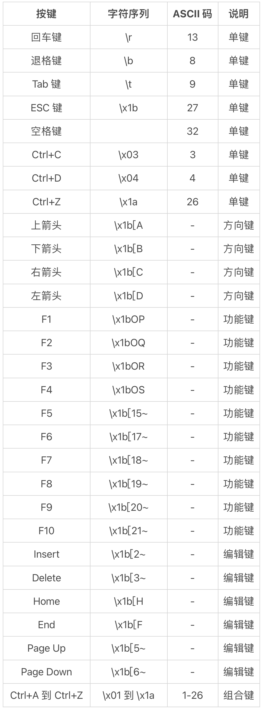
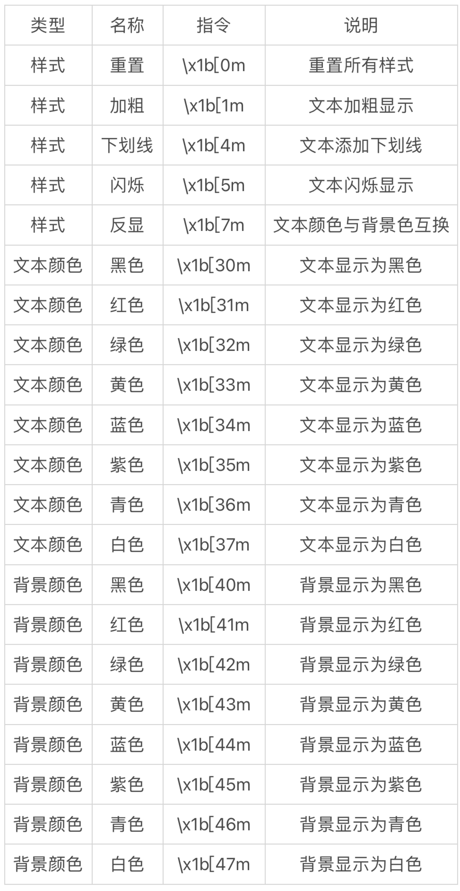
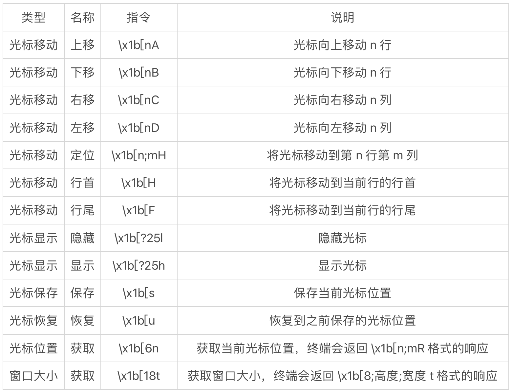
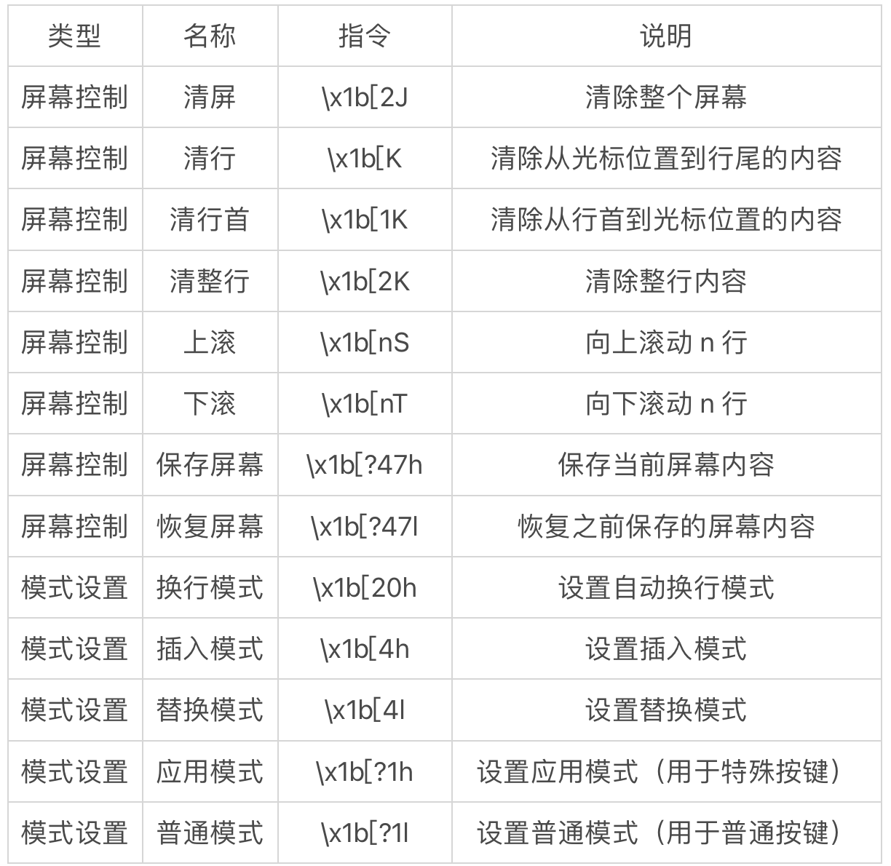
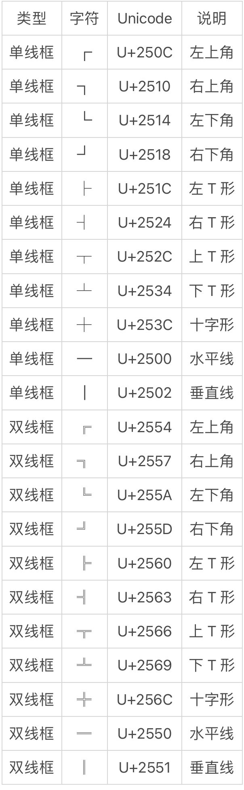
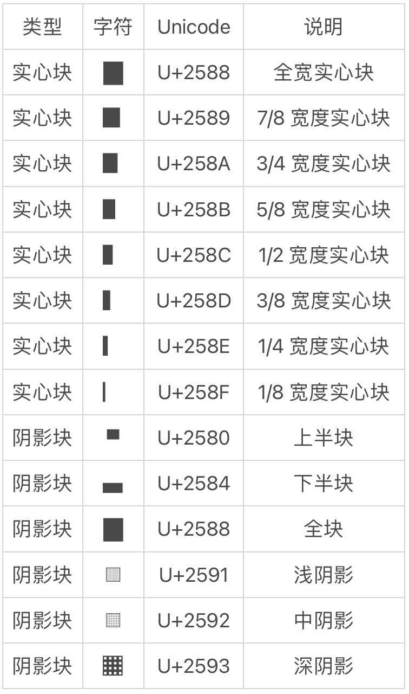
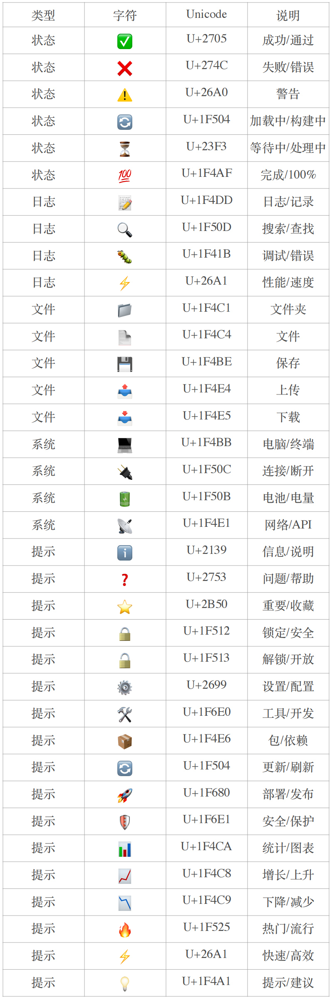

# 控制台特性｜实现丰富的命令行交互体验
你好，我是 winter。

在 Node.js 工具开发中，控制台（Console）是一个至关重要的组件。它不仅是我们与用户交互的主要界面，更是调试和监控应用程序状态的关键工具。

通过合理使用控制台，我们可以提供清晰的命令行界面（CLI），实现优雅的错误处理和提示，展示进度和状态信息，支持调试和日志记录，以及实现交互式的用户输入。

掌握控制台的使用，对于开发高质量的 Node.js 工具来说是不可或缺的技能。

在本节课中，我们将会以逐步深入的方式学习命令行界面的技术。

首先从最基础的问答式 IO 模式命令行交互开始，接下来学习切换到实时响应模式，然后学习通过命令行指令来丰富表现能力，最后，我们会通过学习一些 Unicode 字符，实现在命令行中添加简单的图形能力。

## 基础：问答式IO

在 Node.js 中，标准输入输出（stdin/stdout）是最基础的 IO 接口。通过 `process.stdin` 和 `process.stdout`，我们可以实现最基本的命令行交互。标准输入用于接收用户输入，标准输出用于向用户展示信息。 **这种基础的 IO 模式虽然简单，但却是所有高级交互模式的基础。**

前面课程中已经介绍过， `process.stdin` 是一个流（Stream），在命令行作为标准输入时，它只有在用户按下回车键后才会触发 `data` 事件，此时程序才能读取到用户输入的内容。这意味着：

1. 程序无法实时获取用户正在输入的内容。
2. 每次读取都会包含用户输入的所有内容，包括回车符。
3. 如果用户没有输入任何内容就按回车，会得到一个空字符串。

这种特性使得标准输入更适合处理完整的命令或回答，而不是实时的交互场景。

## 实时响应IO

我们可以通过调用 `process.stdin.setRawMode(true)` 将标准输入切换到 raw 模式。在 raw 模式下：

1. 程序可以立即接收到每个按键的输入，不需要等待回车。
2. 输入内容不会经过终端的预处理，直接以原始形式传递给程序。
3. 特殊按键（如方向键、Ctrl+C 等）会以特殊的字符序列形式传递。

这种模式特别适合开发需要实时响应用户按键的工具，比如命令行游戏、终端编辑器等。 **但需要注意的是，在 raw 模式下，我们需要自己处理特殊按键（如 Ctrl+C），否则程序可能无法正常退出。**

下面是一个简单的示例，展示了如何使用 raw 模式来实时响应按键：

```
process.stdin.setRawMode(true);
process.stdin.resume();

// 监听按键输入
process.stdin.on('data', (key) =&gt; {
    // Ctrl+C 的 ASCII 码是 3
    if (key[0] === 3) {
        process.exit();
    }

    // 方向键的字符序列
    if (key[0] === 27 && key[1] === 91) {
        switch (key[2]) {
            case 65: // 上箭头
                console.log('向上移动');
                break;
            case 66: // 下箭头
                console.log('向下移动');
                break;
            case 67: // 右箭头
                console.log('向右移动');
                break;
            case 68: // 左箭头
                console.log('向左移动');
                break;
        }
    } else {
        // 普通按键
        console.log(`按下按键: ${key}`);
    }
});

```

在 raw 模式下，不同的按键会产生不同的字符序列。以下是常用按键的键值对应表：



## 命令行指令

在 Node.js 中，我们可以通过 ANSI 转义序列（ANSI Escape Sequences）来改变命令行环境。ANSI 转义序列是一种标准化的控制字符序列，用于控制终端显示效果，包括文本样式、颜色、光标位置等。这些序列以 `\x1b[`（ESC \[）开头，后面跟着不同的参数。

ANSI 转义序列最初由美国国家标准协会（ANSI）制定，现在已经成为终端显示控制的事实标准。在 ECMA-48（ISO/IEC 6429）标准中，这些序列被正式定义为“控制序列引入符”（Control Sequence Introducer，CSI），并详细规定了各种控制序列的格式和功能。

大多数现代终端都支持这些序列，包括：

- 文本样式控制（加粗、下划线、闪烁等）
- 文本颜色和背景颜色
- 光标移动和定位
- 屏幕清除和滚动
- 其他终端控制功能

在 ECMA 标准中，CSI 序列的基本格式为：

```
CSI [参数...] [中间字符...] 最终字符

```

其中：

- CSI 是控制序列引入符（ `\x1b[`）
- 参数是可选的分号分隔的数字
- 中间字符是可选的 ASCII 字符
- 最终字符是必需的 ASCII 字符

#### 文本样式和颜色

以下是常用的文本样式、颜色和光标控制指令：



文本样式和颜色指令的使用示例：

```
// 将文本设置为红色加粗
console.log('\x1b[31m\x1b[1m红色加粗文本\x1b[0m');

// 设置红色背景上的白色文本
console.log('\x1b[41m\x1b[37m红底白字\x1b[0m');

// 设置闪烁的黄色文本
console.log('\x1b[33m\x1b[5m闪烁的黄色文本\x1b[0m');

```

#### 光标控制

除了控制输出文本，我们还可以控制光标位置，这些指令使用起来需要更多技巧性，但也赋予了我们更灵活地操作总控制台界面的能力。



光标位置保存和恢复机制允许我们在终端中临时移动光标到其他位置，输出一些内容，然后返回到原来的位置继续输出。这种机制在以下场景特别有用：

1. 状态栏显示：在屏幕底部显示状态信息，同时保持主输出区域的光标位置。
2. 进度显示：在固定位置更新进度，而不影响主输出流。
3. 菜单系统：在特定位置显示菜单选项，同时保持其他内容不变。

需要注意的是，终端只维护一个保存位置：

- 每次保存操作会覆盖之前保存的位置。
- 恢复操作总是恢复到最近一次保存的位置。

例如，我们可以实现一个简单的状态栏：

```
// 保存当前光标位置
process.stdout.write('\x1b[s');

// 移动到屏幕底部
process.stdout.write('\x1b[20;1H');
// 输出状态栏
process.stdout.write('\x1b[44m\x1b[37m状态栏：正在处理...\x1b[0m');

// 恢复到之前保存的位置
process.stdout.write('\x1b[u');
// 继续在主输出区域输出
console.log('继续输出主内容');

```

需要注意的是：

1. 保存和恢复操作是成对的，每次保存后应该对应一次恢复。
2. 保存的位置会被新的保存操作覆盖。
3. 某些终端可能对保存位置的数量有限制。

光标控制指令的使用示例：

```
// 获取光标位置
process.stdout.write('\x1b[6n');

// 监听标准输入以接收光标位置响应
process.stdin.once('data', (data) =&gt; {
    // 解析返回的光标位置
    const match = data.toString().match(/\[(\d+);(\d+)R/);
    if (match) {
        const [_, row, col] = match;
        console.log(`当前光标位置：第 ${row} 行，第 ${col} 列`);
    }
});

```

获取窗口大小的示例：

```
// 获取窗口大小
process.stdout.write('\x1b[18t');

// 监听标准输入以接收窗口大小响应
process.stdin.once('data', (data) =&gt; {
    // 解析返回的窗口大小
    const match = data.toString().match(/\[8;(\d+);(\d+)t/);
    if (match) {
        const [_, height, width] = match;
        console.log(`当前窗口大小：${width} 列 × ${height} 行`);
    }
});

```

#### 其他终端控制指令

除了上面两组指令，还有一些其它指令，重要性没那么高，此处仅列出，需要用到时查询即可。



#### 表格边框字符

有了在控制台中控制光标和文本能力，有时我们还希望有些线框来丰富视觉表现，这就要用到另一中机制：Unicode 表格字符。以下是常用的表格边框字符：



我们需要理解这些字符设计的内在逻辑，即以半角字符中心点，水平竖直四个方向都可以有不同形状的线，粗细、单双均可自由组合，但是粗线和双线不能自由组合。

因此我们利用这些字符绘制线条时，起点和终点总是字符中心点或者字符边缘，而交汇点总是字符中心点。

需要注意的是， **不同终端对 Unicode 字符的支持可能不同，请一定要在目标终端上测试这些字符的可用性。**

#### 填充字符

在终端中，我们可以使用不同密度的 Unicode 字符来创建填充效果。以下是常用的填充字符：



#### Emoji 字符

在终端中，我们可以使用 emoji 来增加界面的趣味性和可读性。Emoji 是一种特殊的 Unicode 字符，它们具有以下特点：

- 组合机制：基础 emoji 由单个 Unicode 码点组成。
- 复杂 emoji 由多个 Unicode 码点组合而成。
- 可以使用变体选择符（VS）来改变 emoji 的样式。
- 可以使用零宽连接符（ZWJ）来组合多个 emoji。

示例 1：

- 基础 emoji：😊（笑脸）
- 复杂 emoji：👨‍👩‍👧‍👦（家庭）
- 变体选择符：☺️（笑脸）
- 零宽连接符组合：👨‍💻（程序员）
- 修饰符肤色修饰符：用于改变人物 emoji 的肤色
- 性别修饰符：用于改变人物 emoji 的性别
- 发型修饰符：用于改变人物 emoji 的发型
- 职业修饰符：用于改变人物 emoji 的职业

示例 2：

- 肤色修饰符： 👨🏻（浅肤色男性） 👨🏼（中浅肤色男性） 👨🏽（中肤色男性） 👨🏾（中深肤色男性） 👨🏿（深肤色男性）
- 性别修饰符： 👨（男性） 👩（女性）
- 职业修饰符： 👨‍💻（程序员） 👨‍🔬（科学家） 👨‍🏫（教师）
- 渲染机制不同平台可能使用不同的 emoji 字体
- 同一个 emoji 在不同平台上可能有不同的显示效果
- 某些平台可能不支持某些 emoji 的修饰符
- emoji 的显示效果可能受到系统字体设置的影响

示例 3：

- 同一 emoji 在不同平台上的显示差异： 👨‍💻（程序员） 👨‍💻（程序员，可能显示为 👨 💻）
- 修饰符支持差异： 👨‍👩‍👧‍👦（家庭，可能显示为 👨 👩 👧 👦）
- 编码特点大多数 emoji 使用 Unicode 扩展 B 及以后的编码空间
- 某些 emoji 可能需要多个 Unicode 码点来表示
- emoji 的编码可能包含不可见的控制字符
- 某些 emoji 的编码可能因平台而异

示例 4：

- 单码点 emoji：😊（U+1F60A）
- 多码点 emoji：👨‍💻（U+1F468 U+200D U+1F4BB）
- 带修饰符 emoji：👨🏻（U+1F468 U+1F3FB）
- 复杂组合 emoji：👨‍👩‍👧‍👦（U+1F468 U+200D U+1F469 U+200D U+1F467 U+200D U+1F466）

以下是开发者工具中常用的 emoji 分类：



## 总结

在 Node.js 工具开发中，控制台是一个功能强大的界面工具。通过合理使用各种控制台特性，我们可以实现丰富的命令行交互体验。

从基础的问答式 IO 到实时按键响应，从文本样式控制到光标位置管理，从表格边框绘制到进度条显示，从 emoji 表情到状态图标，控制台提供了全方位的界面控制能力。

这些特性不仅能够提升命令行工具的专业性和美观度，还能增强用户体验和可用性。通过合理组合这些特性，我们可以开发出功能强大、界面友好的命令行工具。